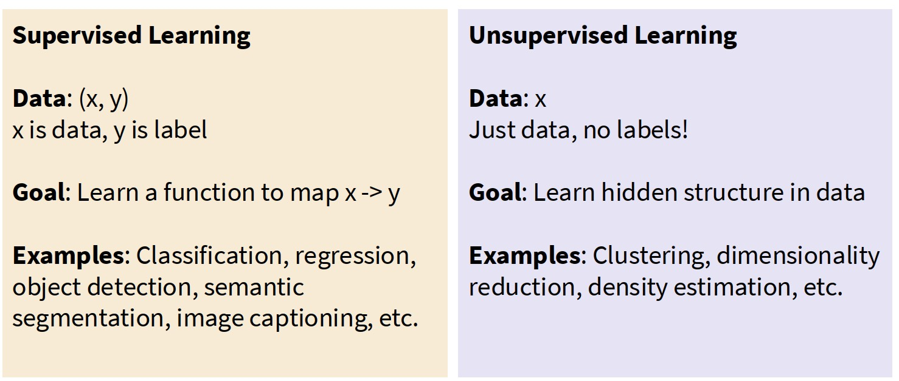
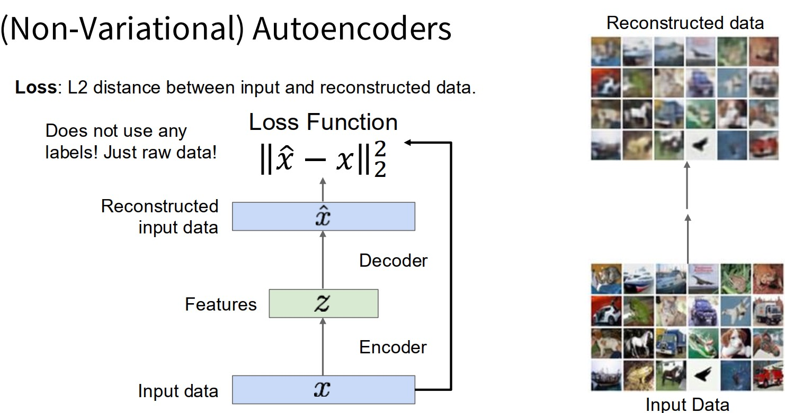
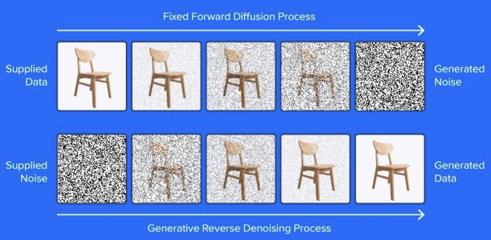
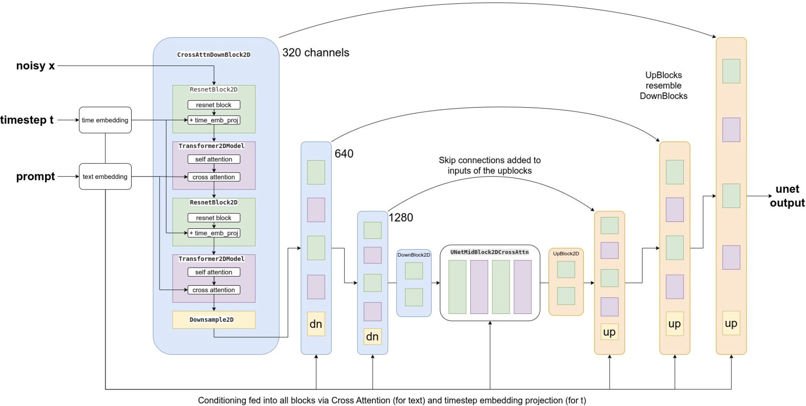

# AutoEncoders, Variational AutoEncoders, and Diffusion Models


Online Visualization:
- https://introduction-to-autoencoders.vercel.app/
- https://anomagram.fastforwardlabs.com/


---

# 1. Unsupervised Learning



In many machine learning tasks, the goal is not only prediction but also **learning useful representations of data**.

Why do we want this?

* dimensionality reduction
* noise removal
* feature extraction
* generative modeling

Traditional method:

* PCA

Neural network alternative:

- **AutoEncoders**

---

# 2. AutoEncoder

## Basic Architecture


An **AutoEncoder** is a neural network trained to reconstruct its input.

Encoder

$$
z = f(x)
$$

Decoder

$$
\hat{x} = g(z)
$$


---

## Training Objective



The model learns by minimizing the reconstruction error.

$$\mathcal{L} = \|x - \hat{x}\|^2$$

Where:

* \(x\) = original input
* \(\hat{x}\) = reconstructed input

---

## Example Architecture

```
784 → 128 → 32 → 128 → 784
```

The **32-dimensional vector** is the latent representation.

This bottleneck forces the model to **learn meaningful compressed features**.

---

# 3. Simple PyTorch AutoEncoder (Idea Level)

Example architecture:

```python
import torch
import torch.nn as nn

class AutoEncoder(nn.Module):

    def __init__(self):
        super().__init__()

        self.encoder = nn.Sequential(
            nn.Linear(784, 128),
            nn.ReLU(),
            nn.Linear(128, 32)
        )

        self.decoder = nn.Sequential(
            nn.Linear(32, 128),
            nn.ReLU(),
            nn.Linear(128, 784)
        )

    def forward(self, x):

        z = self.encoder(x)
        x_hat = self.decoder(z)

        return x_hat
```

Training loop (conceptual):

```python
model = AutoEncoder()
criterion = nn.MSELoss()

for x in data_loader:

    reconstruction = model(x)

    loss = criterion(reconstruction, x)

    loss.backward()
    optimizer.step()
```

---

# 4. Applications of AutoEncoders

AutoEncoders are widely used in many real-world problems.

---

# 4.1 Dimensionality Reduction

AutoEncoders can learn **nonlinear dimensionality reduction**, unlike PCA.

Idea:

```
784 → 32
```

The latent vector can be used as features for other models.

Example pipeline:

```
Image → Encoder → 32 features → classifier
```

Python idea:

```python
with torch.no_grad():
    features = encoder(images)

classifier.fit(features, labels)
```

Applications:

* image compression
* feature extraction
* visualization

---

# 4.2 Denoising AutoEncoder


Idea:

Train the model to **remove noise from corrupted inputs**.

Training data:

```
noisy image → clean image
```

Example:

```
Input: noisy digit
Output: clean digit
```

Loss:

$$
\mathcal{L} = \|x_{clean} - \hat{x}\|^2
$$


Python idea:

```python
noise = torch.randn_like(x) * 0.2
x_noisy = x + noise

reconstruction = model(x_noisy)

loss = mse_loss(reconstruction, x)
```

Applications:

* image restoration
* medical imaging
* speech enhancement

---

# 4.3 Anomaly Detection with AutoEncoders

- https://anomagram.fastforwardlabs.com/

AutoEncoders are very effective for **detecting outliers**.

Idea:

Train the model **only on normal data**.

At inference time:

```
normal data → small reconstruction error
abnormal data → large reconstruction error
```

Reconstruction error:

$$
E(x) = \|x - \hat{x}\|^2
$$

If

$$
E(x) > threshold
$$

then

```
anomaly detected
```

---

## Example: Credit Card Fraud Detection

Train on **normal transactions**.

Fraudulent transactions will reconstruct poorly.

Python idea:

```python
reconstruction = model(x)

error = torch.mean((x - reconstruction) ** 2, dim=1)

anomaly = error > threshold
```

Applications:

* credit card fraud detection
* network intrusion detection
* manufacturing defect detection
* medical anomaly detection

---

# 4.4 Representation Learning

The latent vector can capture **semantic features**.

Example:

```
image → latent vector
```

This vector may represent:

* shape
* texture
* style

Applications:

* clustering
* downstream ML tasks

Example pipeline:

```python
z = encoder(x)

kmeans.fit(z)
```

---

# 4.5. Linear Autoencoders and the PCA Connection

When we remove nonlinear activations, something remarkable happens.

### Setup

- Encoder: $z = x W_e$ (linear projection)
- Decoder: $\hat{x} = z W_d$ (linear reconstruction)
- Loss: $\|x - \hat{x}\|^2$

### The Optimal Solution

The solution satisfies:

$$
W_d = W_e^T
$$

and the rows of $W_e$ span the **top-$d$ principal components** of the data.

**In other words: linear autoencoders learn PCA.**

### Significance

This provides an anchor point:
- PCA finds directions of maximum variance
- Linear autoencoders find the same directions through gradient descent
- Nonlinear autoencoders generalize this to curved manifolds

The autoencoder is gradient descent's answer to dimensionality reduction.

```python
# PCA as a baseline: compare with linear autoencoder
from sklearn.decomposition import PCA

# 1. Standard PCA approach
pca = PCA(n_components=32)
X_reduced = pca.fit_transform(images.flatten(start_dim=1))
X_reconstructed_pca = pca.inverse_transform(X_reduced)

# 2. Linear Autoencoder reconstruction
# The MSE of a fully trained Linear AE should converge 
# to the same value as the PCA reconstruction error.
```

---


# 5. Overcomplete AutoEncoders


---

# 6. Variational AutoEncoder (VAE)


Standard AutoEncoders map inputs to a **point in latent space**.

Problem:

The latent space is not structured.

Solution:

**Variational AutoEncoder**

Key idea:

Encode inputs into a **distribution**.

Encoder outputs:

$$
\mu(x), \sigma(x)
$$

Latent variable:

$$
z \sim \mathcal{N}(\mu, \sigma^2)
$$


---

## VAE Loss

Two components:

* reconstruction loss
* KL divergence regularization

$$
\mathcal{L} = \underbrace{\mathbb{E}_{q(z|x)}[\|x - \hat{x}\|^2]}_{\text{Reconstruction}} + \underbrace{D_{\text{KL}}(q(z|x) \,\|\, p(z))}_{\text{KL Divergence}}
$$


The KL term encourages latent vectors to follow a **normal distribution**.

---

## Why This Matters

Because now we can sample:

```
z ~ N(0,1)
decode(z)
```

This enables **data generation**.

[For more AE vs VAE, checkout lecture-autoencoder-2.md.](./lecture-autoencoder-2.md)

---

# 7. Diffusion Models


Used by systems like

* Stable Diffusion
* DALL·E
* Midjourney

---

## Core Idea




Generate data by **gradually removing noise**.

Two stages:

### Forward diffusion

Add noise step by step.

$$
x_t = \sqrt{\alpha_t} x_{t-1} + \sqrt{1-\alpha_t} \epsilon
$$

Eventually the data becomes **pure noise**.

```
image → noise
```

---

### Reverse diffusion

A neural network learns to **remove noise** step by step.

```
noise → image
```

The model predicts the noise at each step.


