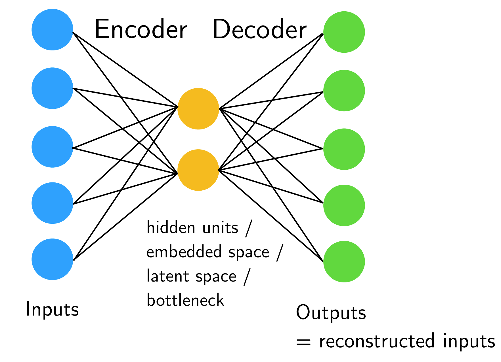
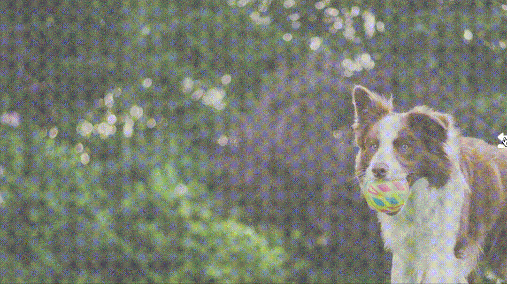
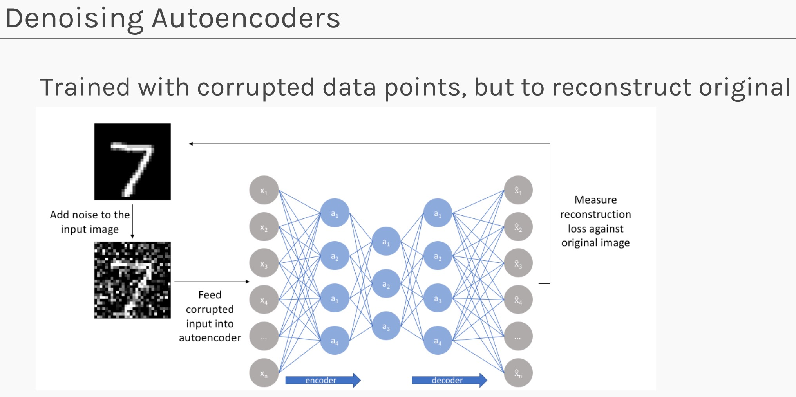
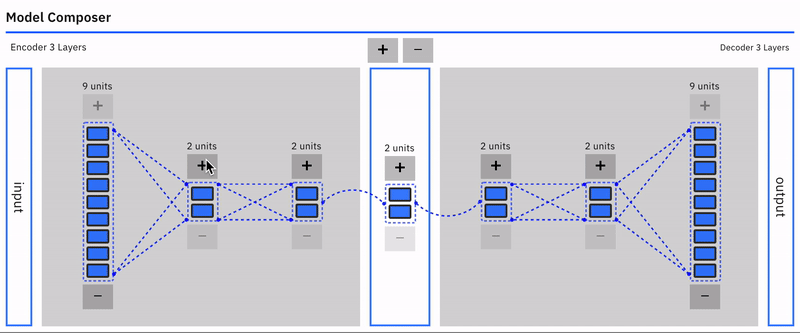
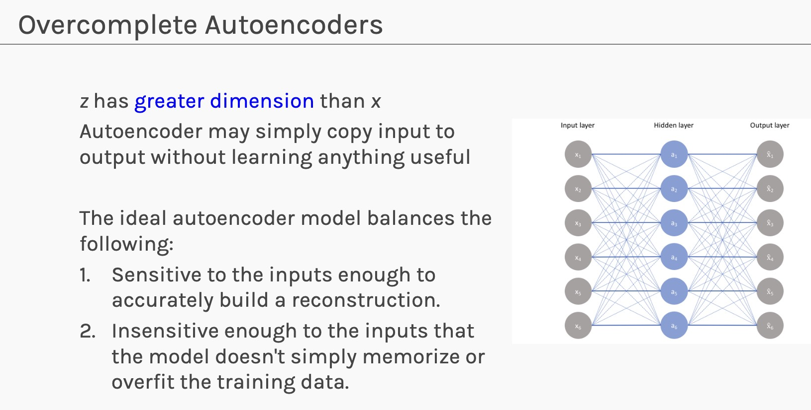

# Autoencoders

Autoencoders learn useful representations by compressing an input into a latent code and reconstructing the original input from that code.

Online visualizations:

- https://introduction-to-autoencoders.vercel.app/
- https://anomagram.fastforwardlabs.com/


---

## 1. Why Autoencoders

Many machine-learning tasks need representations, not only predictions.

We may want to:

- compress data;
- remove noise;
- detect anomalies;
- learn features for downstream models;
- visualize latent structure;
- prepare for generative modeling.

Autoencoders provide a neural-network version of dimensionality reduction.

The central idea is:

$$
\boxed{
\text{learn a representation by reconstructing the input}
}
$$

---

## 2. Notation

We use a row-vector convention:

- $n$: number of examples.
- $d$: input dimension.
- $k$: latent dimension.
- $X \in \mathbb{R}^{n \times d}$: input data matrix.
- $x^{(i)} \in \mathbb{R}^{1 \times d}$: one input example.
- $z^{(i)} \in \mathbb{R}^{1 \times k}$: latent code.
- $\hat{x}^{(i)} \in \mathbb{R}^{1 \times d}$: reconstruction.

For images such as MNIST, a $28 \times 28$ image is often flattened into:

$$
x^{(i)} \in \mathbb{R}^{1 \times 784}
$$

---

## 3. Encoder and Decoder

An autoencoder has two parts.

The encoder maps input to latent code:

$$
z = f_{\theta}(x)
$$

The decoder maps latent code back to input space:

$$
\hat{x} = g_{\phi}(z)
$$

The full model is:

$$
\boxed{
\hat{x}
=
g_{\phi}
\left(
f_{\theta}(x)
\right)
}
$$

The parameters $\theta$ and $\phi$ are learned by minimizing reconstruction error.

---

## 4. Bottleneck Architecture



A simple fully connected autoencoder for MNIST might have shape:

```text
784 -> 128 -> 32 -> 128 -> 784
```

The layer of size $32$ is the bottleneck.

If $k < d$, the model cannot simply copy every coordinate through a wide hidden representation. It must learn a compressed representation that preserves information useful for reconstruction.

> [!INFO]
> A bottleneck is not only a smaller layer. It is a design pressure that forces the network to decide which information is worth preserving.

---

## 5. Reconstruction Loss

For continuous inputs, a common loss is mean squared reconstruction error:

$$
\boxed{
\mathcal{L}_{\mathrm{recon}}
=
\frac{1}{n}
\sum_{i=1}^{n}
\left\|
x^{(i)}-\hat{x}^{(i)}
\right\|_2^2
}
$$

For binary or normalized pixel data, binary cross entropy can also be used:

$$
\mathcal{L}_{\mathrm{BCE}}
=
-
\frac{1}{n}
\sum_{i=1}^{n}
\sum_{j=1}^{d}
\left[
x_j^{(i)}\log \hat{x}_j^{(i)}
+
\left(1-x_j^{(i)}\right)
\log
\left(1-\hat{x}_j^{(i)}\right)
\right]
$$

The loss should match the data type and decoder output activation.

---

## 6. Training Loop

The training pipeline is:

```text
input x
encoder produces z
decoder produces x_hat
compare x_hat with x
backpropagate reconstruction loss
update encoder and decoder
```

Minimal PyTorch shape:

```python
class AutoEncoder(nn.Module):
    def __init__(self, latent_dim=32):
        super().__init__()
        self.encoder = nn.Sequential(
            nn.Linear(784, 128),
            nn.ReLU(),
            nn.Linear(128, latent_dim),
        )
        self.decoder = nn.Sequential(
            nn.Linear(latent_dim, 128),
            nn.ReLU(),
            nn.Linear(128, 784)
        )

    def forward(self, x):
        z = self.encoder(x)
        x_hat = self.decoder(z)
        return x_hat
```

Conceptual training loop:

```python
for x in data_loader:
    x_hat = model(x)
    loss = criterion(x_hat, x)

    optimizer.zero_grad()
    loss.backward()
    optimizer.step()
```

> [!WARNING]
> Do not forget `optimizer.zero_grad()`. Accumulated gradients can make training behavior confusing and unstable.

---

## 7. Denoising Autoencoders



A denoising autoencoder receives corrupted input but reconstructs the clean input.

Training pair:

$$
x_{\mathrm{noisy}} = x + \epsilon
$$

The model predicts:

$$
\hat{x}
=
g_{\phi}
\left(
f_{\theta}(x_{\mathrm{noisy}})
\right)
$$

The loss compares against the clean target:

$$
\mathcal{L}
=
\left\|
x-\hat{x}
\right\|_2^2
$$



This teaches the latent representation to preserve stable structure and ignore noise.

---

## 8. Anomaly Detection



Anomaly detection uses reconstruction error as a score.

Train the autoencoder mostly or only on normal data. At inference:

$$
E(x)
=
\left\|
x-\hat{x}
\right\|_2^2
$$

Then classify as anomalous if:

$$
E(x) > \tau
$$

where $\tau$ is a chosen threshold.

Normal examples reconstruct well because the model has learned their structure. Abnormal examples may reconstruct poorly.

> [!WARNING]
> Reconstruction error is not a perfect anomaly detector. A powerful autoencoder may reconstruct some anomalies well, especially if the bottleneck is too large.

---

## 9. Latent Representations

The latent vector $z$ can be used as a learned feature representation.

Example pipeline:

```text
image -> encoder -> latent vector -> classifier or clustering method
```

Latent dimensions may capture:

- shape;
- stroke thickness;
- orientation;
- style;
- other factors useful for reconstruction.

The latent representation is learned without labels, but it may still be useful for supervised or unsupervised downstream tasks.

---

## 10. Linear Autoencoders and PCA

If the encoder and decoder are linear and the loss is squared reconstruction error, an undercomplete autoencoder learns a subspace closely connected to PCA.

Linear encoder:

$$
z = xW_e
$$

Linear decoder:

$$
\hat{x}=zW_d
$$

Training minimizes:

$$
\left\|
x-\hat{x}
\right\|_2^2
$$

The optimal reconstruction subspace matches the top principal-component subspace.

This gives an important anchor:

- PCA is linear dimensionality reduction.
- Linear autoencoders recover the PCA subspace.
- Nonlinear autoencoders generalize the idea to nonlinear representations.

---

## 11. Overcomplete Autoencoders



An overcomplete autoencoder has latent dimension $k \ge d$.

This can be dangerous because the model may learn an identity map:

$$
\hat{x} \approx x
$$

without learning useful structure.

To make overcomplete autoencoders meaningful, we usually add constraints:

- sparsity;
- denoising;
- dropout;
- weight decay;
- contractive penalties;
- architectural bottlenecks elsewhere.

---

## 12. Summary

Autoencoders learn representations through reconstruction.

The core computation is:

$$
\boxed{
x
\rightarrow
z=f_{\theta}(x)
\rightarrow
\hat{x}=g_{\phi}(z)
}
$$

The next lecture moves from deterministic latent codes to probabilistic latent variables in variational autoencoders.
