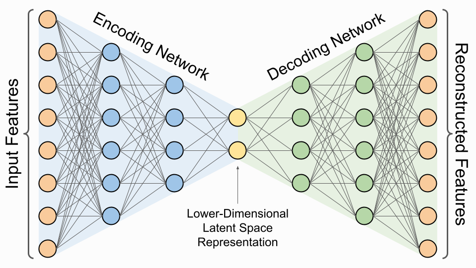
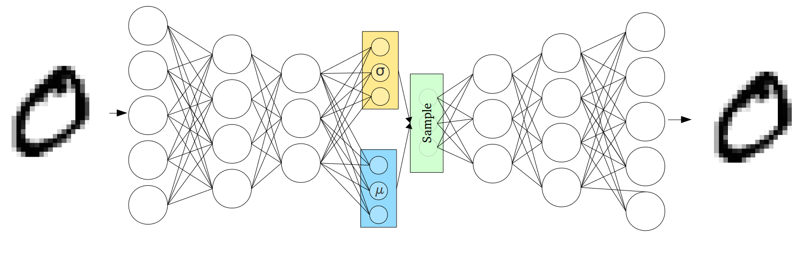
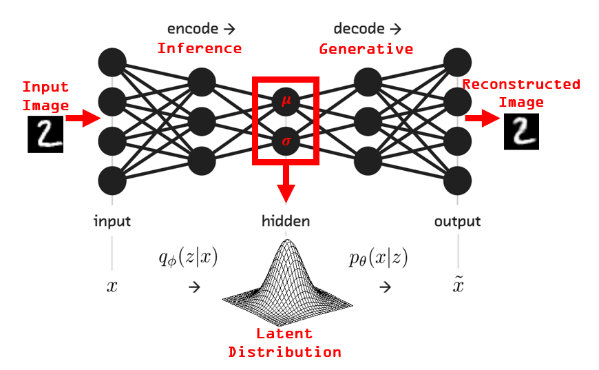
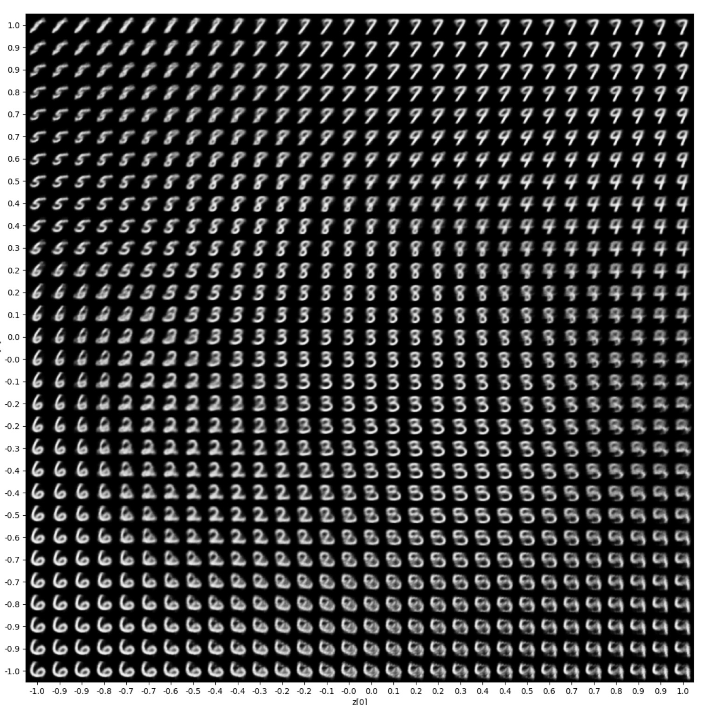
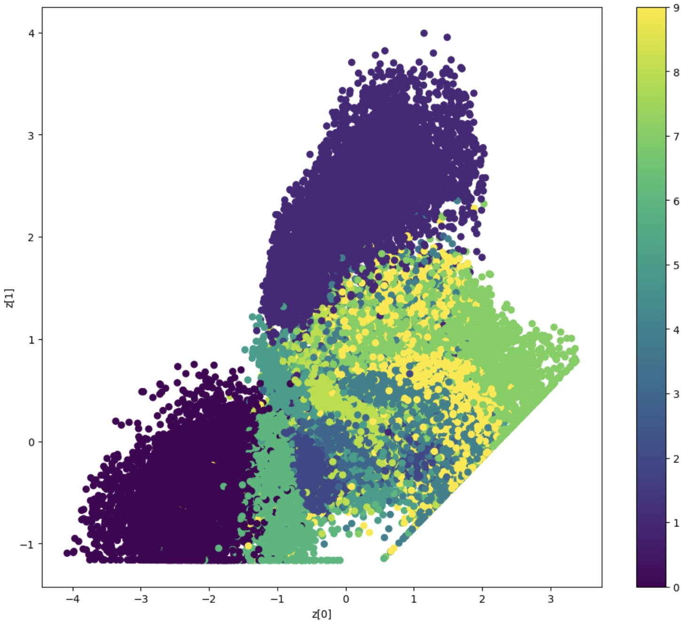

# Variational Autoencoder: From Deterministic to Probabilistic Encoding

---

## 1. Architectural Overview

### Standard Autoencoder

$$
\text{Input } x \xrightarrow{\text{Encoder}} z \xrightarrow{\text{Decoder}} \hat{x}
$$

The encoder maps each input to a single point $z \in \mathbb{R}^d$ in latent space.

### Variational Autoencoder

$$
\text{Input } x \xrightarrow{\text{Encoder}} q(z|x) = \mathcal{N}(\mu(x), \text{diag}(\sigma^2(x))) \xrightarrow{\text{Sample}} z \xrightarrow{\text{Decoder}} \hat{x}
$$

The encoder outputs distribution parameters $(\mu, \sigma^2)$ instead of a single point in latent space.

---

## 2. From Point to Distribution

### Autoencoder: Deterministic Mapping

Each input $x$ maps to exactly one latent point:

$$
z = f_{\text{enc}}(x)
$$

**Limitations:**
- No structure guarantees in latent space
- Random sampling of $z$ produces garbage outputs
- Cannot generate new data

### VAE: Probabilistic Encoding

Each input $x$ defines a probability distribution over latent space:

$$
q(z|x) = \prod_{i=1}^d \mathcal{N}(z_i; \mu_i(x), \sigma_i^2(x))
$$

**Advantages:**
- Latent space is regularized toward prior $p(z) = \mathcal{N}(0, I)$
- Can generate new samples by $z \sim \mathcal{N}(0, I)$
- Smooth interpolation between data points

---

## 3. Neuron-to-Parameter Mapping

For latent dimension $d$, the encoder outputs $2d$ neurons.

### Example: $d = 2$

The encoder output layer has 4 neurons:

| Neuron | Output | Meaning |
|--------|--------|---------|
| 1 | $\mu_1$ | Mean of dimension 1 |
| 2 | $\mu_2$ | Mean of dimension 2 |
| 3 | $\log \sigma_1^2$ | Log-variance of dimension 1 |
| 4 | $\log \sigma_2^2$ | Log-variance of dimension 2 |

---

## 4. Encoding Flow

Complete process for encoding input $x$ to latent $z$:

$$
\begin{aligned}
&\textbf{Step 1: Encoder forward pass} \\
&\quad [\mu_1, \ldots, \mu_d, \log \sigma_1^2, \ldots, \log \sigma_d^2] = f_{\text{enc}}(x; \theta) \\
&\textbf{Step 2: Compute standard deviations} \\
&\quad \sigma_i = \exp\left(\frac{1}{2} \log \sigma_i^2\right) \\
&\textbf{Step 3: Sample noise} \\
&\quad \varepsilon \sim \mathcal{N}(0, I) \\
&\textbf{Step 4: Reparameterize} \\
&\quad z_i = \mu_i + \sigma_i \odot \varepsilon_i \\
&\textbf{Result: Latent code } z = [z_1, \ldots, z_d]
\end{aligned}
$$

---

## 5. Decoding Flow

The decoder maps latent code back to data space:

$$
\begin{aligned}
&\textbf{Input: Latent code } z \in \mathbb{R}^d \\
&\textbf{Step 1: Decoder forward pass} \\
&\quad h = g_{\text{dec}}(z; \phi) \\
&\textbf{Step 2: Output activation (depending on data type)} \\
&\quad \hat{x} = \text{sigmoid}(h) \quad \text{(binary data)} \\
&\quad \hat{x} = h \quad \text{(continuous data)} \\
&\textbf{Result: Reconstruction } \hat{x}
\end{aligned}
$$

The decoder is deterministic: given $z$, it produces exactly one output $\hat{x}$.

---

## 6. Loss Function

The VAE loss combines reconstruction accuracy with distribution regularization:

$$
\mathcal{L} = \underbrace{\mathbb{E}_{q(z|x)}[\|x - \hat{x}\|^2]}_{\text{Reconstruction}} + \underbrace{D_{\text{KL}}(q(z|x) \,\|\, p(z))}_{\text{KL Divergence}}
$$

### Reconstruction Term

$$
\mathcal{L}_{\text{recon}} = \frac{1}{N} \sum_{i=1}^N \|x_i - \hat{x}_i\|^2
$$

Minimizes the squared error between input and reconstruction.

### KL Divergence Term

For $p(z) = \mathcal{N}(0, I)$ and $q(z|x) = \mathcal{N}(\mu, \text{diag}(\sigma^2))$:

$$
D_{\text{KL}}(q \,\|\, p) = \frac{1}{2} \sum_{j=1}^d \left( \mu_j^2 + \sigma_j^2 - \log \sigma_j^2 - 1 \right)
$$

Pushes the learned distribution toward standard Gaussian.

---
## 8. Code:

https://keras.io/examples/generative/vae/
(5 minutes reading of the code to understand what's happening here):

---

## 9. Comparison: Autoencoder vs. VAE

| Aspect | Autoencoder | VAE |
|--------|-------------|-----|
| Encoder output | Single point $z \in \mathbb{R}^d$ | Distribution parameters $(\mu, \log \sigma^2) \in \mathbb{R}^{2d}$ |
| Latent representation | Deterministic | Probabilistic |
| Sampling during training | No | Yes |
| Latent space structure | Unregularized | Regularized to $\mathcal{N}(0, I)$ |
| Generation capability | None | Strong |
| Interpolation | Unreliable | Smooth and meaningful |
| Loss function | Reconstruction only | Reconstruction + KL divergence |
