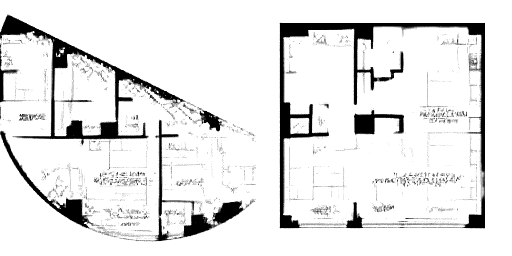

# Variational Autoencoders

Variational autoencoders turn autoencoders into probabilistic generative models by encoding each input as a distribution over latent variables.


---

## 1. From Autoencoder to VAE

A standard autoencoder maps each input to one latent point:

$$
z = f_{\theta}(x)
$$

Then it reconstructs:

$$
\hat{x}=g_{\phi}(z)
$$

This is useful for compression, but it does not guarantee a smooth or sampleable latent space.

A variational autoencoder, or VAE, maps each input to a latent distribution:

$$
q_{\phi}(z \mid x)
$$

The decoder then learns to reconstruct or generate data from sampled latent variables.

---

## 2. Why Point Codes Are Not Enough

In an ordinary autoencoder, nearby latent points are not guaranteed to decode into meaningful outputs.

Problems:

- gaps can appear in latent space;
- random latent samples may decode to nonsense;
- interpolation can pass through invalid regions;
- there is no explicit prior distribution for generation.

The VAE fixes this by regularizing latent codes toward a known prior.

---

## 3. Encoder as Distribution

For each input $x$, the VAE encoder predicts parameters of a Gaussian:

$$
q_{\phi}(z \mid x)
=
\mathcal{N}
\left(
\mu_{\phi}(x),
\operatorname{diag}
\left(
\sigma_{\phi}^2(x)
\right)
\right)
$$

For latent dimension $k$, the encoder outputs:

$$
\mu_{\phi}(x) \in \mathbb{R}^{1 \times k}
$$

and:

$$
\log \sigma_{\phi}^2(x) \in \mathbb{R}^{1 \times k}
$$

So the final encoder head has $2k$ outputs.

> [!INFO]
> Implementations usually predict log variance instead of variance. This is numerically more stable and avoids forcing the network to output only positive raw variance values.

---

## 4. Sampling Latent Variables

The VAE samples:

$$
z \sim q_{\phi}(z \mid x)
$$

The decoder maps the sample to a reconstruction:

$$
\hat{x} = g_{\theta}(z)
$$

The prior is usually:

$$
p(z)=\mathcal{N}(0,I)
$$

After training, we can generate new samples by:

```text
sample z from N(0, I)
decode z into x_hat
```

This is the main generative advantage over a plain autoencoder.

---

## 5. The VAE Objective

The VAE objective has two forces:

1. Reconstruct the input well.
2. Keep the encoder distribution close to the prior.

The loss for one sample is often written:

$$
\boxed{
\mathcal{L}_{\mathrm{VAE}}
=
\mathcal{L}_{\mathrm{recon}}
+
D_{\mathrm{KL}}
\left(
q_{\phi}(z \mid x)
\|
p(z)
\right)
}
$$

In optimization, this is the negative evidence lower bound up to convention.

---

## 6. Reconstruction Term

The reconstruction term depends on the data type.

For continuous data:

$$
\mathcal{L}_{\mathrm{recon}}
=
\left\|
x-\hat{x}
\right\|_2^2
$$

For Bernoulli-style binary pixels, binary cross entropy is common.

This term asks the decoder to preserve information about $x$ through $z$.

---

## 7. KL Divergence Term

For:

$$
q_{\phi}(z \mid x)
=
\mathcal{N}
\left(
\mu,
\operatorname{diag}
\left(
\sigma^2
\right)
\right)
$$

and:

$$
p(z)=\mathcal{N}(0,I)
$$

the KL divergence has a closed form:

$$
\boxed{
D_{\mathrm{KL}}(q\|p)
=
\frac{1}{2}
\sum_{j=1}^{k}
\left(
\mu_j^2
+
\sigma_j^2
-
\log \sigma_j^2
-
1
\right)
}
$$

This term discourages the encoder from placing latent codes arbitrarily far from the standard normal prior.

---

## 8. The Trade-Off

The reconstruction term wants $z$ to preserve information.

The KL term wants $q_{\phi}(z \mid x)$ to stay close to $\mathcal{N}(0,I)$.

If KL is too weak:

- reconstructions may improve;
- latent space may become irregular;
- random sampling may produce poor generations.

If KL is too strong:

- latent codes may ignore the input;
- reconstructions may become blurry or generic;
- posterior collapse can occur.

> [!WARNING]
> A VAE is not just an autoencoder with noise. The KL term fundamentally changes what the latent space is allowed to look like.

---

## 9. Latent Space Visualization


For a two-dimensional latent space, each input can be represented by $\mu_{\phi}(x)$.

Useful inspections:

- plot latent means by class label;
- sample a grid of $z$ values and decode them;
- interpolate between two latent points;
- inspect whether nearby points decode to nearby-looking outputs.


Smooth latent structure is one of the main reasons VAEs are useful.

---

## 10. Autoencoder Versus VAE

| Aspect | Autoencoder | Variational Autoencoder |
| --- | --- | --- |
| Encoder output | Point $z$ | Distribution parameters $\mu$ and $\log\sigma^2$ |
| Latent code | Deterministic | Stochastic during training |
| Latent prior | Not explicit | Usually $\mathcal{N}(0,I)$ |
| Loss | Reconstruction only | Reconstruction plus KL |
| Generation | Not reliable by default | Sample from prior and decode |
| Latent structure | Unconstrained | Regularized |

---

## 11. Relationship to Other Generative Models



VAEs are one family of generative models.

Compared with GANs, VAEs usually have:

- more explicit probabilistic structure;
- easier training;
- blurrier samples for image tasks;
- a useful latent space.

Compared with diffusion models, VAEs are usually:

- faster to sample;
- less powerful for high-fidelity image generation;
- useful as compression modules inside larger systems.

Diffusion models generate by gradually denoising:

$$
\text{noise}
\rightarrow
\text{less noisy sample}
\rightarrow
\text{data}
$$

This is a different generative mechanism from the VAE prior-and-decoder structure.

---

## 12. Summary

VAEs make latent space probabilistic.

The core idea is:

$$
\boxed{
x
\rightarrow
q_{\phi}(z \mid x)
\rightarrow
z
\rightarrow
\hat{x}
}
$$

The next lecture focuses on the key technical device that makes VAE training possible: the reparameterization trick.
