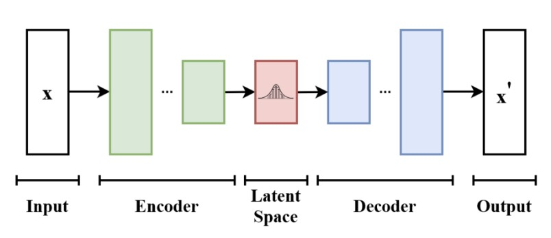
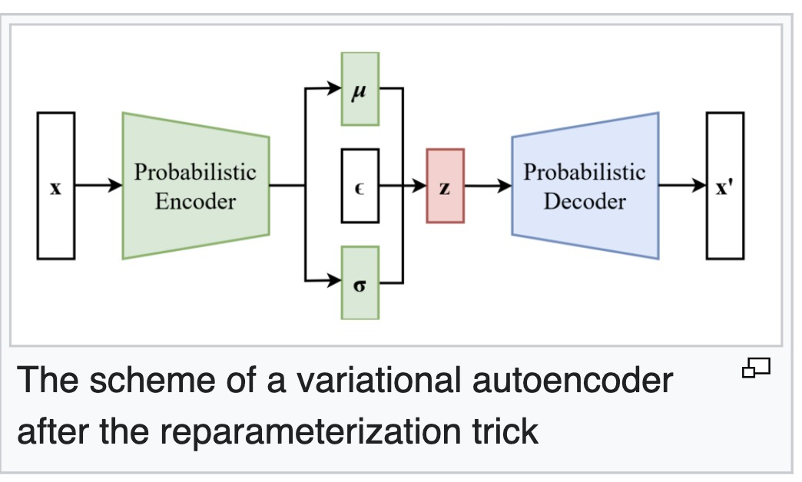
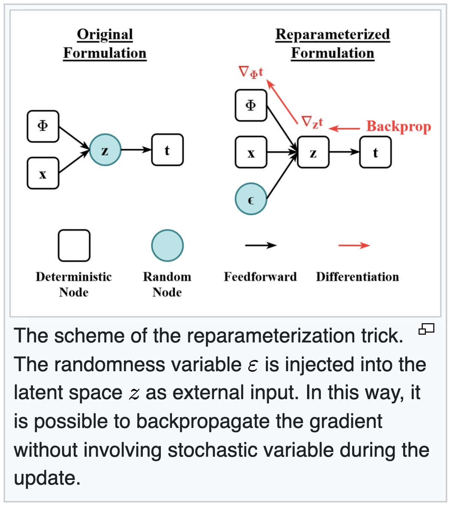

# The Reparameterization Trick in Variational Autoencoders

---

## 1. Motivation

In a **Variational Autoencoder (VAE)**, the encoder  produces a *distribution*:

$$
q_\phi(z \mid x) = \mathcal{N}(\mu(x), \sigma^2(x))
$$

However, this also introduces a fundamental challenge during training.

---

## 2. The Core Problem: Sampling Breaks Backpropagation

To generate a latent code, we sample:

$$
z \sim \mathcal{N}(\mu, \sigma^2)
$$

This step is **stochastic**, not deterministic.

Backpropagation requires computing gradients:

$$
\frac{\partial L}{\partial \mu}, \quad \frac{\partial L}{\partial \sigma}
$$

But the sampling operation does not define a smooth function from $(\mu, \sigma)$ to $z$.

### Issue

* **Sampling behaves like a random draw from a distribution**
* **There is no explicit formula mapping inputs to outputs**
* Therefore, gradients cannot pass through this operation

This leads to:

> **A broken computational graph — the encoder cannot learn.**

---

## 3. Intuition: Why This Is a Problem

Consider the forward process:

$$
x \rightarrow (\mu, \sigma) \rightarrow z \rightarrow \hat{x} \rightarrow L
$$

During backpropagation:

* Gradients flow from $L$ to $\hat{x}$
* From $\hat{x}$ to $z$
* But they **stop at the *sampling* step**

This means:

* $\mu$ and $\sigma$ are not updated properly
* The model cannot learn a meaningful latent distribution

---

## 4. Idea: Separate Randomness from Parameters

The breakthrough is simple but powerful:

> Move the source of randomness *outside* the network.

Instead of sampling directly from $\mathcal{N}(\mu, \sigma^2)$, we rewrite the process.

---

## 5. The Reparameterization Trick

We introduce an auxiliary random variable:

$$
\varepsilon \sim \mathcal{N}(0, I)
$$

and define:

$$
z = \mu + \sigma \odot \varepsilon
$$

---

### Why This Works

Now the process is decomposed into:

1. **Randomness**:
   $$
   \varepsilon \sim \mathcal{N}(0, I)
   $$

2. **Deterministic transformation**:
   $$
   z = \mu + \sigma \odot \varepsilon
   $$

This transformation is fully differentiable.

---

## 6. Gradient Flow Restored

Now we can compute:

$$
\frac{\partial z}{\partial \mu} = 1, \quad
\frac{\partial z}{\partial \sigma} = \varepsilon
$$

This means:

* Gradients can flow through $z$
* $\mu$ and $\sigma$ receive learning signals
* The encoder becomes trainable

---

## 7. Geometric Interpretation

Think of the transformation as:

* $\varepsilon$ defines a **standard Gaussian space**
* $\mu$ shifts the distribution (translation)
* $\sigma$ scales the distribution (stretching)

So we are no longer sampling “inside” the network. Instead, we:

> Sample noise, then *shape it* using learnable parameters.

---

## 8. Computational Graph Perspective

Recall the VAE loss:

$$
\mathcal{L} = \underbrace{\mathbb{E}_{q(z|x)}[\|x - \hat{x}\|^2]}_{\text{Reconstruction}} + \underbrace{D_{\text{KL}}(q(z|x) \,\|\, p(z))}_{\text{KL Divergence}}
$$

The expectation term requires sampling $z$.

### Before (Problematic)

$$
z = \text{Sample}(\mu, \sigma)
$$

* Non-differentiable node
* Gradient flow blocked

### After (Reparameterized)

$$
z = \mu + \sigma \odot \varepsilon
$$

* Fully differentiable path
* Compatible with backpropagation

---

## 9. Practical Notes

* In implementation, we often predict $\log \sigma^2$ instead of $\sigma$ for numerical stability
* Then compute:
  $$
  \sigma = \exp(0.5 \cdot \log \sigma^2)
  $$
* Sampling becomes:
  $$
  z = \mu + \exp(0.5 \cdot \log \sigma^2) \odot \varepsilon
  $$
