# From ResNet to Skip Connections

This lecture introduces skip connections as a general design pattern. We begin with the training problem that motivated ResNet, then connect the same idea to U-Net, object detection necks, diffusion models, and Transformers.

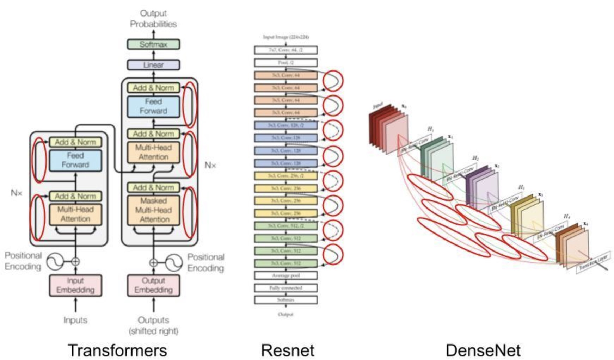

---

## 1. The Problem: Deep Networks Are Hard to Train

Early convolutional networks became better as they became deeper, but only up to a point. After enough layers, adding more layers often made optimization worse, even when the deeper model should theoretically be able to represent everything the shallower model can represent.

This is not only an overfitting problem. A deeper model can perform worse on the training set because the optimization problem becomes harder.

Two failures appear repeatedly:

* Gradients become weak before they reach early layers.
* Useful low-level information is repeatedly transformed and may be lost.

For vision, this creates a second problem:

* Deep layers understand what is in the image.
* Shallow layers preserve where things are.

Object detection, segmentation, and image generation need both semantic meaning and spatial precision.

> [!INFO]
> This mini-series uses skip connection as the broad term. A residual connection is one special case where the skipped signal is added back at the same resolution.

---

## 2. The Core Idea

A skip connection sends information from an earlier layer directly to a later layer.

Without a skip connection, a block must transform its input completely:

$$
y = F(x)
$$

With a residual skip connection, the block only learns a correction:

$$
\boxed{y = x + F(x)}
$$

Here:

* $x$ is the input feature.
* $F(x)$ is the transformation learned by the block.
* $y$ is the output feature.

This changes the learning problem. Instead of asking a block to learn the entire desired mapping, we ask it to learn the difference between the input and the desired output.

If the best transformation is close to the identity function, the network can set $F(x)$ close to zero. That is easier than forcing many stacked layers to learn an identity mapping from scratch.

---

## 3. Two Families of Skip Connections

Most skip connections in modern vision and language models fall into two families.

### 3.1 Same-Scale Residual Connections

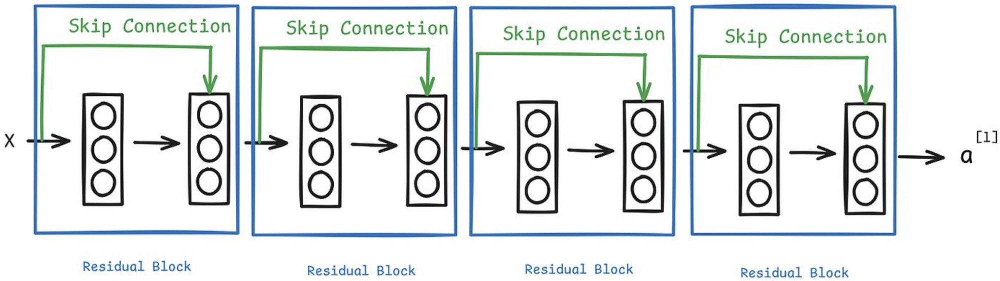

Same-scale residual connections combine features with the same shape.

$$
Y = X + F(X)
$$

They are used when the goal is stable deep computation.

Examples:

* ResNet blocks in CNNs.
* Attention and MLP residuals in Transformers.
* ResNet blocks inside diffusion U-Nets.

Purpose:

* Improve gradient flow.
* Make very deep networks easier to optimize.
* Preserve information when a block does not need to change it much.

### 3.2 Cross-Scale Skip Connections

Cross-scale skip connections combine features from different depths or resolutions.

They are used when the goal is to fuse semantic meaning with spatial detail.

Examples:

* U-Net encoder-to-decoder connections.
* Feature Pyramid Network connections in object detection.
* Multi-scale skip paths in diffusion models.

Purpose:

* Bring high-resolution detail back after downsampling.
* Combine shallow spatial precision with deep semantic meaning.
* Support dense prediction tasks such as detection and segmentation.

> [!WARNING]
> Same-scale residual connections usually use addition. Cross-scale skip connections often use concatenation or projection because the feature shapes may not match.

---

## 4. ResNet: The Residual Learning View

ResNet was designed to answer a practical question:

> How can we train much deeper convolutional networks without making optimization collapse?

The key idea is residual learning.

Suppose the desired mapping is $H(x)$. A plain block tries to learn:

$$
H(x)
$$

A residual block learns:

$$
F(x) = H(x) - x
$$

Then the output is:

$$
\boxed{H(x) = x + F(x)}
$$

This matters because many useful transformations in deep networks are small refinements, not complete rewrites.

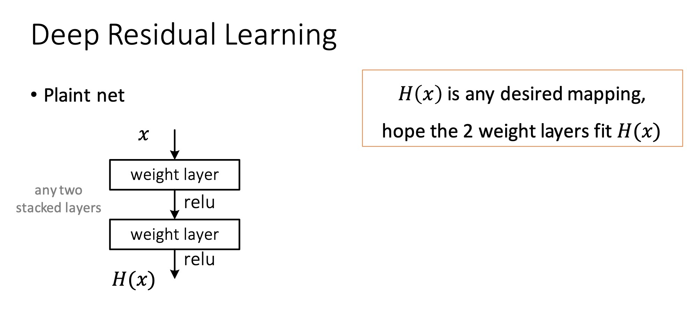
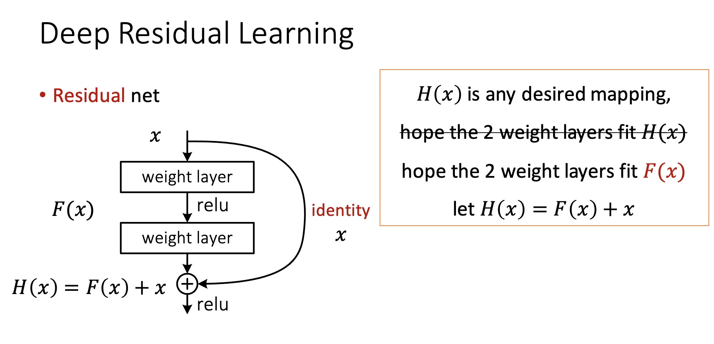
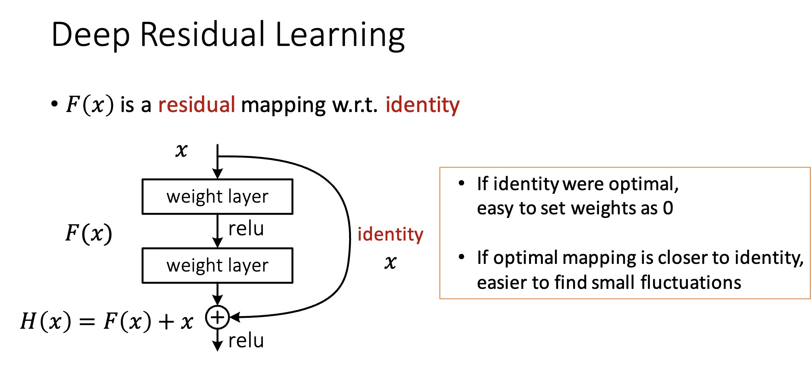

---

## 5. A Small Numerical Example

Consider an input feature vector:

$$
h = \begin{bmatrix} 1 & 0.5 & 0.2 & 0.1 \end{bmatrix}
$$

Suppose the desired output is:

$$
y = \begin{bmatrix} 1.05 & 0.52 & 0.22 & 0.12 \end{bmatrix}
$$

A plain block must learn the full mapping from $h$ to $y$.

A residual block can learn only the correction:

$$
F(h) = y - h
$$

So:

$$
F(h) =
\begin{bmatrix}
0.05 & 0.02 & 0.02 & 0.02
\end{bmatrix}
$$

Then:

$$
h + F(h) =
\begin{bmatrix}
1 & 0.5 & 0.2 & 0.1
\end{bmatrix}
+
\begin{bmatrix}
0.05 & 0.02 & 0.02 & 0.02
\end{bmatrix}
=
\begin{bmatrix}
1.05 & 0.52 & 0.22 & 0.12
\end{bmatrix}
$$

The output is the same, but the residual block has a simpler target: learn a small delta.

> [!INFO]
> Residual learning is powerful because "do almost nothing" is easy to represent. The network can preserve useful information by making $F(x)$ small.

---

## 6. The Gradient Highway

The forward equation is:

$$
y = x + F(x)
$$

During backpropagation:

$$
\frac{\partial y}{\partial x}
=
I + \frac{\partial F(x)}{\partial x}
$$

The identity term $I$ gives the gradient a direct path through the block.

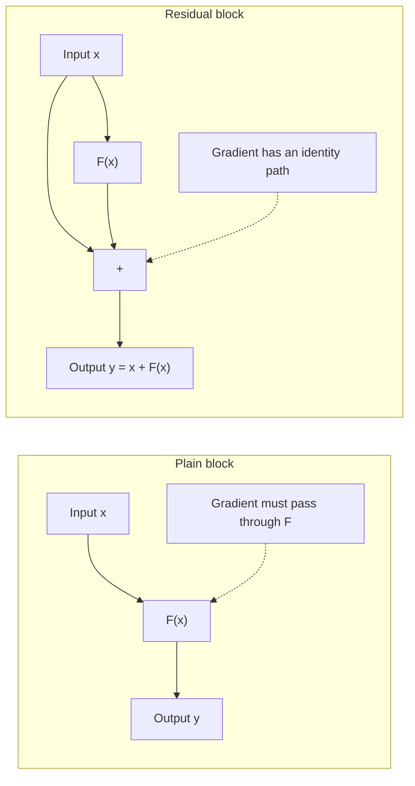

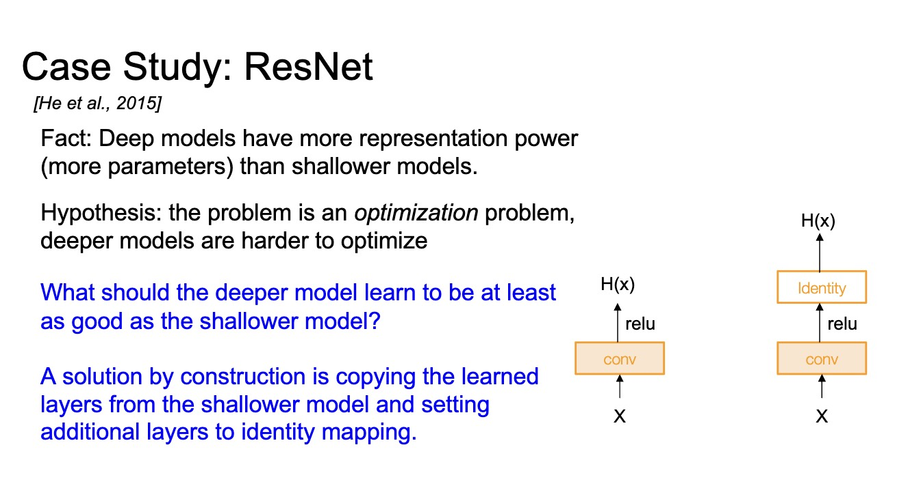
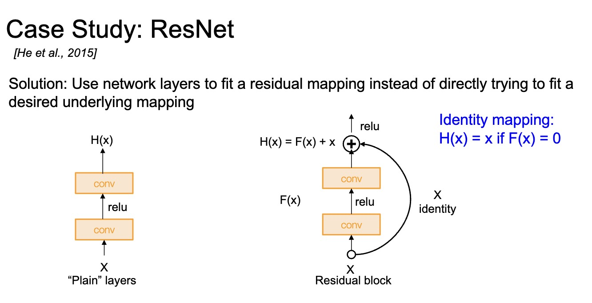
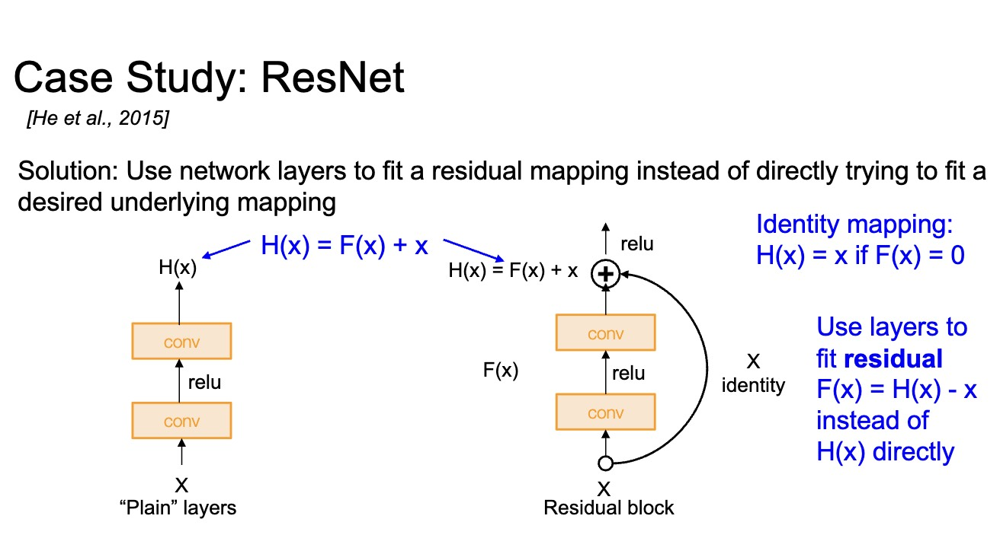
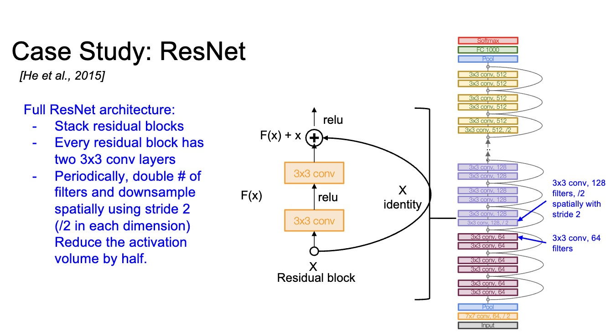

---

## 7. Shape Matching

Addition requires matching shapes.

If:

$$
X \in \mathbb{R}^{N \times C \times H \times W}
$$

then $F(X)$ must also have shape:

$$
F(X) \in \mathbb{R}^{N \times C \times H \times W}
$$

When the number of channels or the spatial resolution changes, ResNet uses a projection shortcut:

$$
Y = P(X) + F(X)
$$

where $P$ is often a $1 \times 1$ convolution.

> [!WARNING]
> A residual addition is not valid just because two tensors both represent images or features. Their batch size, channel count, height, and width must be compatible.

---

## 8. PyTorch Implementation

A minimal fully connected residual block looks like this:

```python
import torch.nn as nn


class ResidualBlock(nn.Module):
    def __init__(self, d_model):
        super().__init__()
        self.fc1 = nn.Linear(d_model, d_model)
        self.activation = nn.ReLU()
        self.fc2 = nn.Linear(d_model, d_model)

    def forward(self, x):
        identity = x

        fx = self.fc1(x)
        fx = self.activation(fx)
        fx = self.fc2(fx)

        return identity + fx
```

The key line is:

```python
return identity + fx
```

For CNNs, the same idea appears with convolutional layers:

```python
class ConvResidualBlock(nn.Module):
    def __init__(self, channels):
        super().__init__()
        self.net = nn.Sequential(
            nn.Conv2d(channels, channels, kernel_size=3, padding=1),
            nn.BatchNorm2d(channels),
            nn.ReLU(),
            nn.Conv2d(channels, channels, kernel_size=3, padding=1),
            nn.BatchNorm2d(channels),
        )
        self.activation = nn.ReLU()

    def forward(self, x):
        return self.activation(x + self.net(x))
```

---

## 9. Residual Connections in Transformers

Transformers also depend on residual connections.

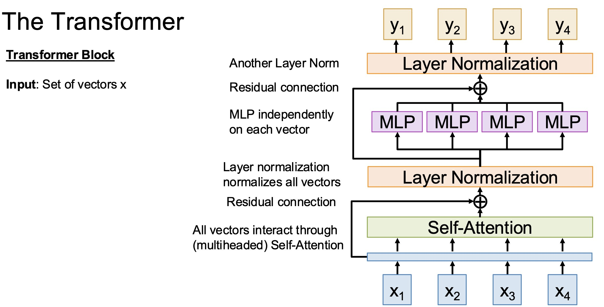
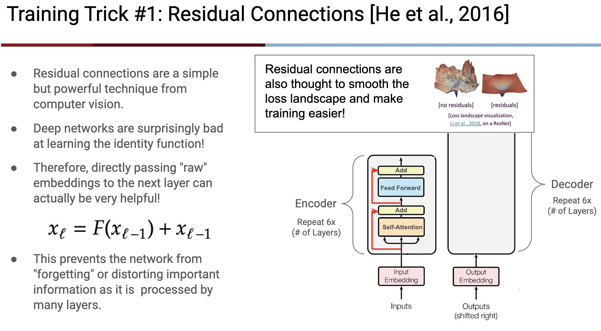

A simplified pre-norm Transformer block is:

```python
class TransformerBlock(nn.Module):
    def __init__(self, d_model, n_heads, d_ff):
        super().__init__()
        self.attention = MultiHeadAttention(d_model, n_heads)
        self.ffn = FeedForward(d_model, d_ff)
        self.norm1 = nn.LayerNorm(d_model)
        self.norm2 = nn.LayerNorm(d_model)

    def forward(self, x):
        x = x + self.attention(self.norm1(x))
        x = x + self.ffn(self.norm2(x))
        return x
```

There are two residual connections:

* The attention residual preserves the token representation if attention adds little value.
* The feed-forward residual preserves the token representation if the MLP only needs to refine it.

In a deep Transformer, the representation is repeatedly refined:

$$
X^{(l+1)} = X^{(l)} + F^{(l)}\left(X^{(l)}\right)
$$

This is the same residual principle as ResNet.

---

## 10. Connection to nanochat

nanochat uses pre-normalization with residual updates:

```python
class Block(nn.Module):
    def __init__(self, config, layer_idx):
        super().__init__()
        self.attn = CausalSelfAttention(config, layer_idx)
        self.mlp = MLP(config)

    def forward(self, x, ve, cos_sin, window_size, kv_cache):
        x = x + self.attn(norm(x), ve, cos_sin, window_size, kv_cache)
        x = x + self.mlp(norm(x))
        return x
```

The important pattern is:

$$
\text{new state} = \text{old state} + \text{learned update}
$$

This lets each block refine the representation instead of rebuilding it.

---

## 11. U-Net: Skip Connections for Spatial Precision


U-Net was designed for segmentation, where the output must be spatially precise.

The encoder compresses the image:

$$
H \times W \rightarrow \frac{H}{2} \times \frac{W}{2}
\rightarrow
\frac{H}{4} \times \frac{W}{4}
\rightarrow
\cdots
$$

Compression gives stronger semantics but loses detail.

The decoder upsamples the representation back to the original resolution. Skip connections copy encoder features into matching decoder levels:

$$
D_l = \operatorname{Concat}\left(U_{l+1}, E_l\right)
$$

where:

* $E_l$ is an encoder feature at level $l$.
* $U_{l+1}$ is an upsampled decoder feature.
* $D_l$ is the fused decoder feature.

The result:

* Deep features provide "what".
* Shallow features provide "where".

---

## 12. Object Detection Necks: Skip Connections Across Scales

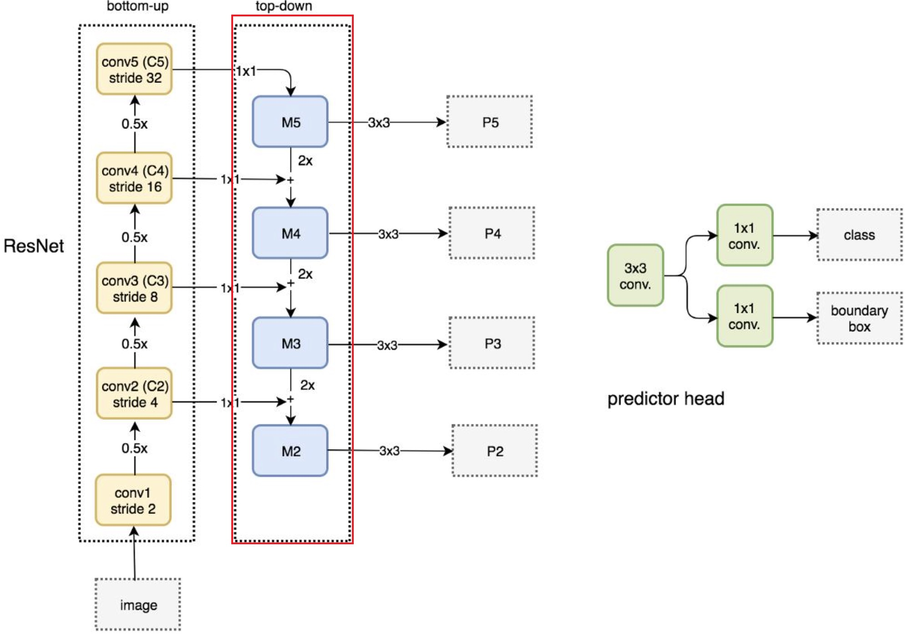
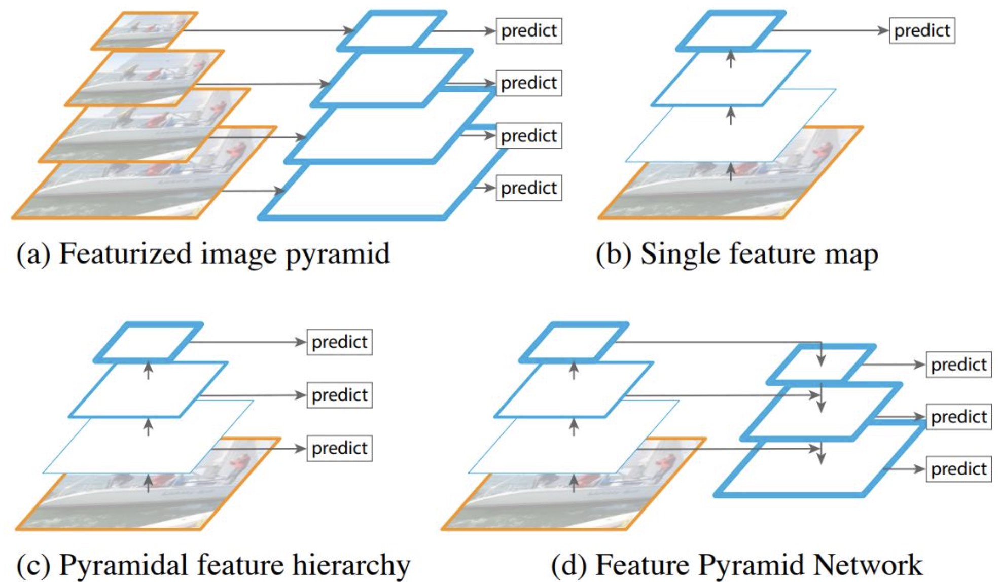

Object detection must handle objects of different sizes.

* Small objects need high-resolution features.
* Large objects need strong semantic features.

Feature Pyramid Networks use skip connections to fuse features across scales.

At a high level:

$$
P_l = \operatorname{Conv}\left(C_l\right) + \operatorname{Upsample}\left(P_{l+1}\right)
$$

where:

* $C_l$ is a backbone feature at level $l$.
* $P_{l+1}$ is a deeper pyramid feature.
* $P_l$ is the fused feature for detection at level $l$.

This gives each detection scale both spatial detail and semantic strength.

---

## 13. Diffusion U-Nets: Combining Both Ideas


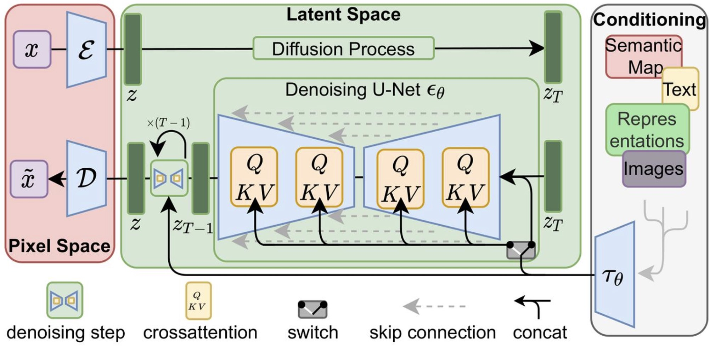

Diffusion models often use U-Net backbones.

They combine:

* ResNet-style residual blocks for stable deep computation.
* U-Net-style cross-scale skips for preserving spatial structure.

This is necessary because diffusion models repeatedly denoise a latent or image representation. The model must understand global structure while reconstructing local detail.

---

## 14. Common Failure Modes

### 14.1 Shape Mismatch

Residual addition fails if feature shapes differ.

Check:

```python
assert x.shape == fx.shape
```

If the shapes differ, use projection, upsampling, downsampling, or concatenation instead of raw addition.

### 14.2 Too Much Trust in the Shortcut

If the residual branch is poorly initialized or too weak, the block may behave almost like an identity function.

This is not always bad, but it means the model may learn slowly. Inspect activation magnitudes and gradients through the residual branch.

### 14.3 Confusing Addition and Concatenation

Addition merges two tensors into the same channel space:

$$
Y = A + B
$$

Concatenation preserves both tensors by increasing channels:

$$
Y = \operatorname{Concat}(A, B)
$$

Addition assumes the two features are already aligned. Concatenation lets later convolutions learn how to mix them.

---

## 15. Synthesis

Skip connections are a general answer to information loss.

| Model | Skip Connection Role |
| --- | --- |
| ResNet | Make deep CNNs trainable |
| Transformer | Preserve and refine token representations |
| U-Net | Recover spatial detail during decoding |
| FPN | Fuse multi-scale detection features |
| Diffusion U-Net | Preserve structure while denoising |

The unifying principle is:

$$
\boxed{\text{Do not force all information through every transformation.}}
$$

Skip connections give models a direct path for information, gradients, or spatial detail.
