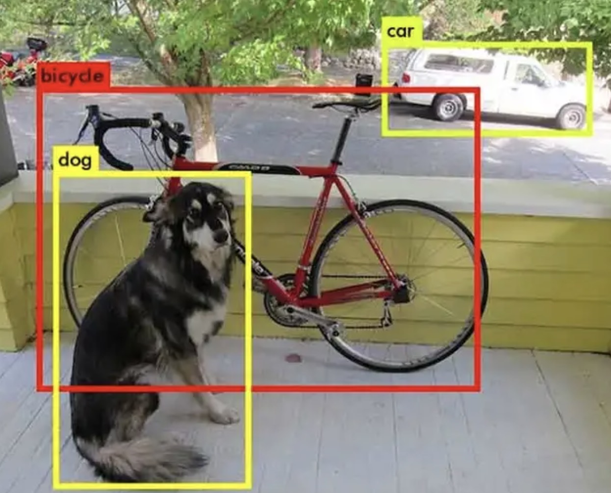

# Object Detection 1: From Classification to Boxes

This lecture introduces object detection as structured prediction. We move from image-level classification to bounding boxes, coordinate systems, multi-object outputs, and the basic tensors a detector must produce.



---

## 1. Motivation

Image classification answers one question:

> What is the main object in this image?

Formally, a classifier estimates:

$$
P(y \mid X)
$$

where:

* $X$ is the input image.
* $y$ is the class label.

Object detection answers two questions:

* What objects are present?
* Where is each object located?

So detection combines classification and localization.

$$
\boxed{\text{Object detection} = \text{classification} + \text{localization}}
$$

---

## 2. Why Classification Is Not Enough

A classifier may correctly say "dog", but it does not tell us:

* how many dogs are present;
* where the dog is;
* whether there is also a person, car, or bicycle;
* how large each object is.

This matters in real applications:

| Application | Why Location Matters |
| --- | --- |
| Autonomous driving | The car must know where pedestrians and vehicles are. |
| Medical imaging | A doctor needs the location of a lesion, not only its existence. |
| Retail inventory | The system must count and locate products. |
| Robotics | A robot needs coordinates before it can grasp an object. |

Detection is therefore not only a recognition task. It is a spatial reasoning task.

---

## 3. Neural Networks Can Produce Structured Outputs

A neural network is a function:

$$
f_{\theta}(X) = \hat{Y}
$$

The output $\hat{Y}$ does not need to be a single class probability vector. It can be a larger tensor containing different types of predictions.

For a single object, a simple detector could output:

$$
\hat{y} =
\begin{bmatrix}
\hat{x}_c & \hat{y}_c & \hat{w} & \hat{h} & \hat{p}_{1} & \cdots & \hat{p}_{K}
\end{bmatrix}
$$

where:

* $\hat{x}_c$ and $\hat{y}_c$ are the predicted box center.
* $\hat{w}$ and $\hat{h}$ are the predicted width and height.
* $\hat{p}_{k}$ is the predicted probability of class $k$.

> [!INFO]
> Detection is structured prediction because one input image produces multiple related outputs: box geometry, object confidence, and class probabilities.

---

## 4. Bounding Box Representations

Objects are commonly represented with axis-aligned rectangles called bounding boxes.

### 4.1 Center Format

Center format stores a box as:

$$
b = \left(x_c, y_c, w, h\right)
$$

where:

* $x_c$ and $y_c$ are the center coordinates.
* $w$ is the box width.
* $h$ is the box height.

This format is common inside detection models because width and height are direct regression targets.

### 4.2 Corner Format

Corner format stores a box as:

$$
b = \left(x_{\min}, y_{\min}, x_{\max}, y_{\max}\right)
$$

where:

* $x_{\min}$ and $y_{\min}$ describe the top-left corner.
* $x_{\max}$ and $y_{\max}$ describe the bottom-right corner.

This format is convenient for computing overlap.

### 4.3 Conversion Between Formats

From center format to corner format:

$$
x_{\min} = x_c - \frac{w}{2}
$$

$$
y_{\min} = y_c - \frac{h}{2}
$$

$$
x_{\max} = x_c + \frac{w}{2}
$$

$$
y_{\max} = y_c + \frac{h}{2}
$$

From corner format to center format:

$$
x_c = \frac{x_{\min} + x_{\max}}{2}
$$

$$
y_c = \frac{y_{\min} + y_{\max}}{2}
$$

$$
w = x_{\max} - x_{\min}
$$

$$
h = y_{\max} - y_{\min}
$$

> [!WARNING]
> Mixing center format and corner format is one of the most common detection bugs. Always label the coordinate convention in code, plots, and data files.

---

## 5. Coordinate Normalization

Box coordinates may be stored in pixels:

$$
x_c \in \left[0, W\right],
\quad
y_c \in \left[0, H\right]
$$

or normalized to the image size:

$$
x_c \in \left[0, 1\right],
\quad
y_c \in \left[0, 1\right]
$$

Normalized coordinates are convenient because they do not depend on the original image resolution.

For an image with width $W$ and height $H$:

$$
x_{\text{norm}} = \frac{x_{\text{pixel}}}{W}
$$

$$
y_{\text{norm}} = \frac{y_{\text{pixel}}}{H}
$$

To convert back:

$$
x_{\text{pixel}} = x_{\text{norm}} W
$$

$$
y_{\text{pixel}} = y_{\text{norm}} H
$$

---

## 6. Multiple Objects in One Image


Real images often contain more than one object.

A labeled image may contain:

```text
dog:    box 1
person: box 2
car:    box 3
```

Mathematically, the ground truth is a set:

$$
Y = \left\{\left(c_i, b_i\right)\right\}_{i=1}^{M}
$$

where:

* $M$ is the number of objects in the image.
* $c_i$ is the class of object $i$.
* $b_i$ is the bounding box of object $i$.

The difficult part is that $M$ changes from image to image.

One image may contain no objects. Another image may contain dozens.

---

## 7. Fixed-Size Model Outputs

Neural networks usually produce fixed-size tensors, but detection labels are variable-size sets. Detection architectures solve this by predicting many candidate boxes, then filtering them.

A common output layout is:

$$
\hat{Y} \in \mathbb{R}^{S \times S \times A \times \left(5 + K\right)}
$$

where:

* $S \times S$ is a spatial prediction grid.
* $A$ is the number of candidate boxes per grid cell.
* $5$ means four box numbers plus one objectness score.
* $K$ is the number of classes.

For each candidate, the model predicts:

$$
\left(\hat{x}_c, \hat{y}_c, \hat{w}, \hat{h}, \hat{o}, \hat{p}_1, \ldots, \hat{p}_K\right)
$$

where $\hat{o}$ is objectness: the model's estimate that this candidate contains an object.

---

## 8. Objectness Versus Class Probability

Objectness and class probability answer different questions.

Objectness:

$$
P(\text{object exists in this candidate} \mid X)
$$

Class probability:

$$
P(\text{class} = k \mid \text{object exists}, X)
$$

Many detectors combine them into a class-specific confidence:

$$
\text{score}_k = \hat{o} \cdot \hat{p}_k
$$

> [!WARNING]
> A high class probability does not always mean a good detection. If objectness is low, the final confidence should usually be low.

---

## 9. Detection as Dense Prediction

A detector does not usually predict one box for the whole image. It predicts boxes at many spatial positions.

Each position asks:

* Is there an object near this location?
* What is its box?
* What class is it?

This makes detection closer to segmentation than classification. Both detection and segmentation require spatial outputs.

The next lecture will introduce the standard detector structure:

$$
\boxed{\text{image} \rightarrow \text{backbone} \rightarrow \text{neck} \rightarrow \text{head} \rightarrow \text{detections}}
$$

---

## 10. Practical Inspection Checklist

When reading or debugging a detection dataset, check:

* Are coordinates pixel-based or normalized?
* Are boxes stored in center format or corner format?
* Are class indices zero-based or one-based?
* Are boxes clipped to image boundaries?
* Are any boxes empty, with $w \leq 0$ or $h \leq 0$?
* Does every image have the correct original width and height?

Small mistakes in box conventions can destroy training even when the model code is correct.

---

## 11. Summary

Object detection extends classification from image-level labels to spatial object sets.

Key ideas:

* A detection label contains both class and location.
* Bounding boxes are usually represented in center or corner format.
* Real images contain a variable number of objects.
* Detectors predict many candidate boxes and then filter them.
* Objectness, box regression, and class prediction are separate but coupled outputs.
