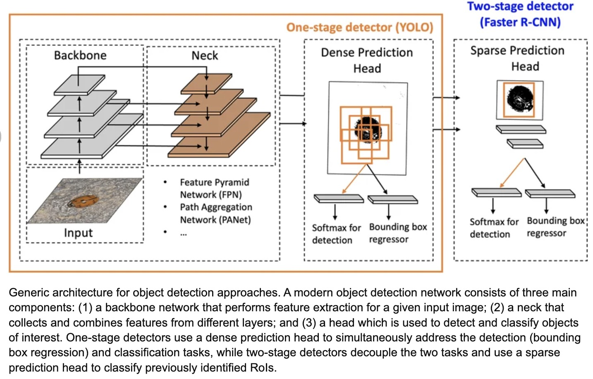
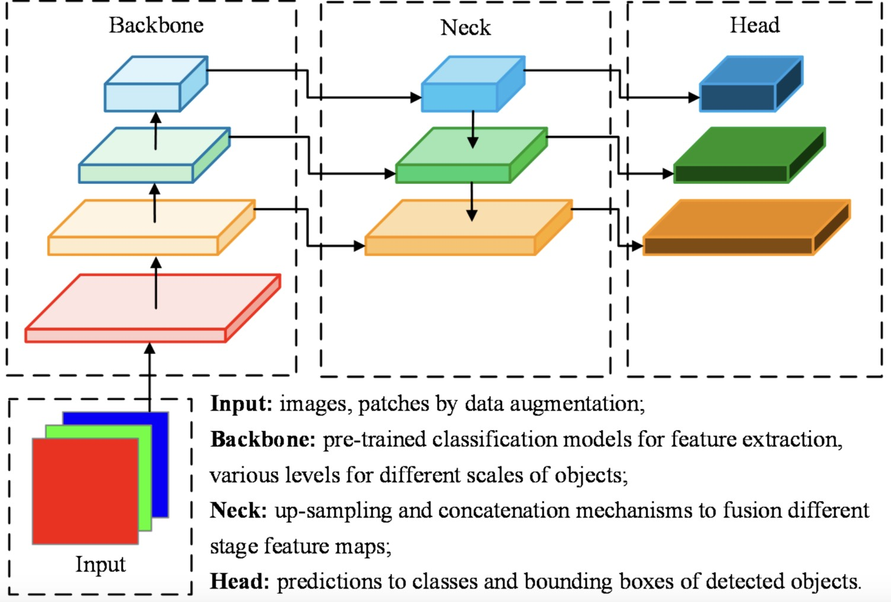
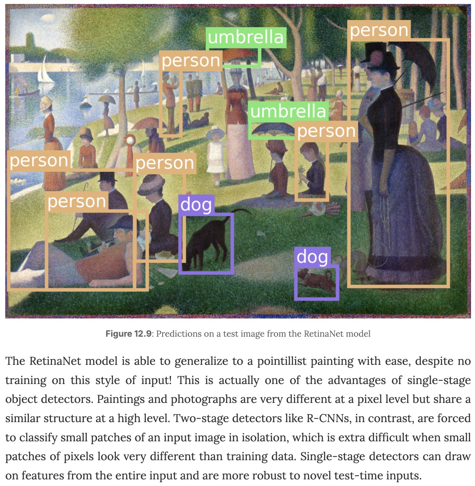
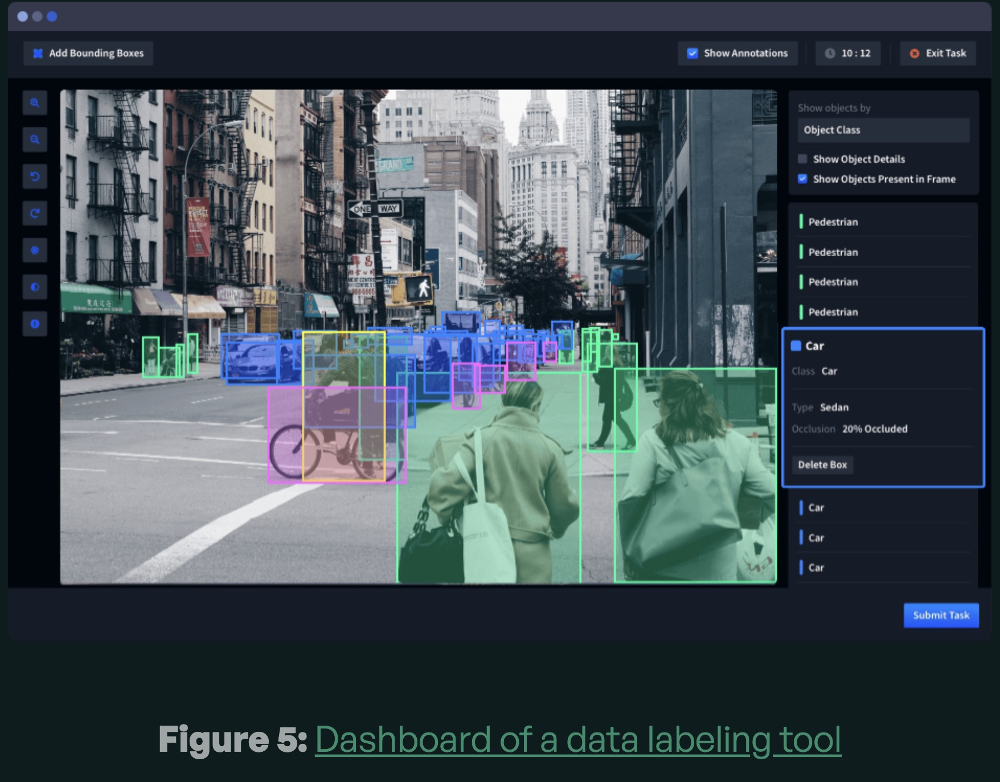
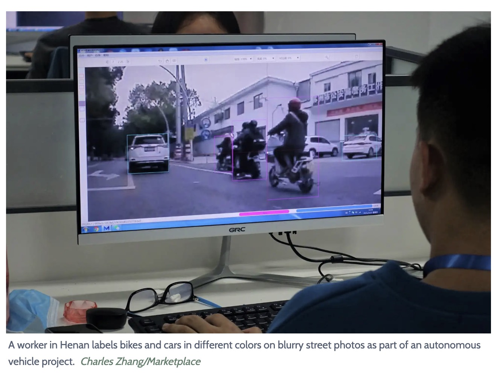
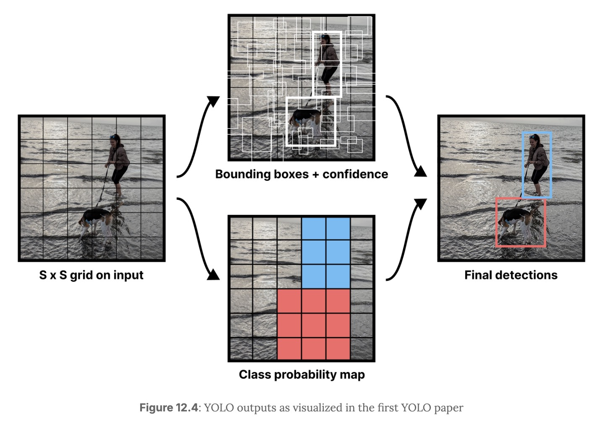
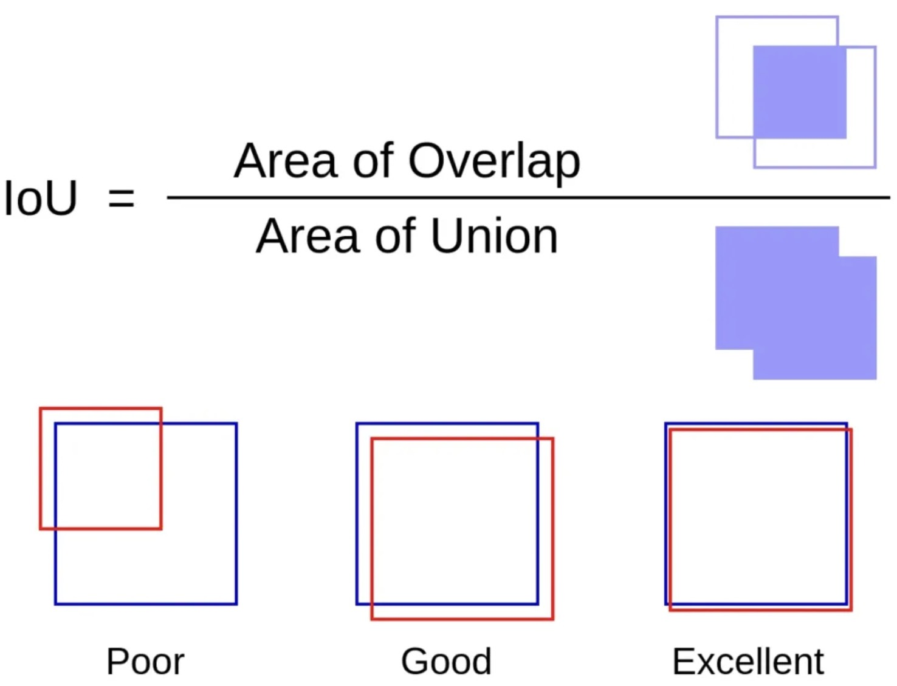

# Object Detection 2: Backbone, Neck, Head, Losses, and Metrics

This lecture explains the main components of a modern object detector and how they are trained and evaluated.



---

## 1. The Detector Pipeline

A modern detector is usually organized into four stages:

$$
\boxed{X \rightarrow \text{backbone} \rightarrow \text{neck} \rightarrow \text{head} \rightarrow \text{post-processing}}
$$

Each stage has a different job.

| Stage | Main Role |
| --- | --- |
| Backbone | Extract visual features from the image |
| Neck | Fuse features across scales |
| Head | Predict boxes, objectness, and classes |
| Post-processing | Remove duplicate or low-quality predictions |

This structure is used by many detector families, including YOLO-style one-stage detectors and Faster R-CNN-style two-stage detectors.

---

## 2. Backbone: Feature Extraction

The backbone converts an image into feature maps.

$$
X \in \mathbb{R}^{H \times W \times 3}
\rightarrow
F \in \mathbb{R}^{h \times w \times d}
$$

As depth increases:

* spatial resolution decreases;
* channel depth increases;
* semantic abstraction increases.

Early layers learn:

* edges;
* corners;
* textures;
* local patterns.

Later layers learn:

* object parts;
* category-level evidence;
* scene context.

ResNet is commonly used as a backbone because residual connections make deep feature extraction trainable.

---

## 3. Why Detection Needs Multi-Scale Features

Objects appear at different sizes.

* A traffic light may occupy only a few pixels.
* A bus may cover half the image.

If we only use deep low-resolution features, small objects may disappear. If we only use shallow high-resolution features, classification may be weak.

Detection needs both:

* high-resolution features for small objects;
* high-semantic features for large or ambiguous objects.

---

## 4. Neck: Multi-Scale Feature Aggregation




The neck combines feature maps from different backbone depths.

Conceptually:

$$
\mathcal{F}_{\text{multi}} = \left\{F_1, F_2, F_3, \ldots, F_L\right\}
$$

where each $F_l$ has a different spatial resolution and semantic level.

A Feature Pyramid Network creates pyramid features:

$$
P_l = \operatorname{Conv}\left(F_l\right) + \operatorname{Upsample}\left(P_{l+1}\right)
$$

This is a cross-scale skip connection:

* the deep path contributes semantics;
* the shallow path contributes spatial precision.

> [!INFO]
> The neck is where the skip-connection idea becomes a detection tool. It allows each prediction scale to use both "what" information and "where" information.

---

## 5. Head: Prediction at Each Location

The detection head converts features into predictions.

At each spatial location and candidate box, it predicts:

$$
\left(\hat{x}_c, \hat{y}_c, \hat{w}, \hat{h}, \hat{o}, \hat{p}_1, \ldots, \hat{p}_K\right)
$$

where:

* $\hat{x}_c$, $\hat{y}_c$, $\hat{w}$, and $\hat{h}$ describe the box.
* $\hat{o}$ is objectness.
* $\hat{p}_k$ is the probability of class $k$.

For a feature map of size $S \times S$ with $A$ candidates per location, the output tensor can be:

$$
\hat{Y} \in \mathbb{R}^{S \times S \times A \times \left(5 + K\right)}
$$

---

## 6. One-Stage and Two-Stage Detectors



### 6.1 One-Stage Detectors

One-stage detectors predict boxes and classes directly from dense feature maps.

Examples:

* YOLO;
* SSD;
* RetinaNet.

Strengths:

* fast inference;
* simple pipeline;
* good real-time performance.

Trade-off:

* many candidate locations are background, so class imbalance is severe.

### 6.2 Two-Stage Detectors

Two-stage detectors first generate region proposals, then classify and refine those regions.

Examples:

* R-CNN;
* Fast R-CNN;
* Faster R-CNN;
* Mask R-CNN.

Strengths:

* high-quality candidate regions;
* strong localization;
* natural extension to instance segmentation.

Trade-off:

* usually slower and more complex than one-stage detection.

---

## 7. Dataset Labels



A detection dataset stores a set of labeled boxes for each image:

$$
Y = \left\{\left(c_i, b_i\right)\right\}_{i=1}^{M}
$$

where:

* $M$ is the number of objects.
* $c_i$ is the class label.
* $b_i$ is the bounding box.

Example annotation:

```text
image_001.jpg
dog    0.50 0.50 0.30 0.40
person 0.20 0.60 0.20 0.50
```

The numbers may be normalized center-format boxes:

$$
b = \left(x_c, y_c, w, h\right)
$$

Annotation quality matters because detection is sensitive to spatial errors.



---

## 8. Annotation Cost

Detection labels are more expensive than classification labels.

| Task | Label Type | Annotation Cost |
| --- | --- | --- |
| Classification | One image-level class | Low |
| Detection | Box plus class for each object | High |
| Segmentation | Pixel-level mask for each object or class | Very high |

For each object, a human annotator must:

* draw the box;
* adjust its boundaries;
* assign the class;
* handle occlusion, truncation, and ambiguity.

Common datasets include:

* COCO;
* Pascal VOC;
* Open Images.

---

## 9. Training Objective



Object detection is a multi-task learning problem.

A common total loss is:

$$
\boxed{
\mathcal{L}
=
\mathcal{L}_{\text{cls}}
+
\lambda_{\text{loc}}\mathcal{L}_{\text{loc}}
+
\lambda_{\text{obj}}\mathcal{L}_{\text{obj}}
}
$$

where:

* $\mathcal{L}_{\text{cls}}$ trains class prediction.
* $\mathcal{L}_{\text{loc}}$ trains box localization.
* $\mathcal{L}_{\text{obj}}$ trains objectness.
* $\lambda_{\text{loc}}$ and $\lambda_{\text{obj}}$ balance the terms.

---

## 10. Classification Loss

For a one-hot target $y$ and predicted probabilities $\hat{y}$:

$$
\mathcal{L}_{\text{cls}}
=
-
\sum_{k=1}^{K}
y_k \log \hat{y}_k
$$

This is cross-entropy loss.

In many detectors, classification is computed only for positive candidates or is down-weighted for easy background examples.

---

## 11. Localization Loss

Localization loss measures how close the predicted box is to the ground-truth box.

A simple option is coordinate regression:

$$
\mathcal{L}_{\text{coord}}
=
\left\lVert
\hat{b} - b
\right\rVert_1
$$

where:

* $\hat{b}$ is the predicted box.
* $b$ is the target box.

Many modern detectors use IoU-based losses:

$$
\mathcal{L}_{\text{loc}} = 1 - \operatorname{IoU}\left(\hat{b}, b\right)
$$

IoU-based losses align better with evaluation because they directly reward overlap.

---

## 12. Objectness Loss

Objectness predicts whether a candidate contains an object.

For a binary target $o \in \left\{0, 1\right\}$ and predicted objectness $\hat{o}$:

$$
\mathcal{L}_{\text{obj}}
=
-
\left[
o \log \hat{o}
+
\left(1 - o\right)\log\left(1 - \hat{o}\right)
\right]
$$

The target is:

* $o = 1$ for positive candidates;
* $o = 0$ for background candidates.

> [!WARNING]
> Most candidate boxes are background. Without careful sampling, weighting, or focal loss, the model can learn to predict "no object" too often.

---

## 13. Intersection over Union



Intersection over Union measures box overlap:

$$
\boxed{
\operatorname{IoU}
=
\frac{
\operatorname{Area}\left(B_{\text{pred}} \cap B_{\text{gt}}\right)
}{
\operatorname{Area}\left(B_{\text{pred}} \cup B_{\text{gt}}\right)
}
}
$$

where:

* $B_{\text{pred}}$ is the predicted box.
* $B_{\text{gt}}$ is the ground-truth box.

Interpretation:

| IoU | Meaning |
| --- | --- |
| $0$ | No overlap |
| $1$ | Perfect overlap |
| $0.5$ | Often used as a loose detection threshold |
| $0.75$ | Stricter localization quality |

---

## 14. Precision, Recall, and mAP

A predicted box is usually counted as correct when:

* the predicted class is correct;
* the IoU with a ground-truth box is above a threshold;
* the ground-truth box has not already been matched by a higher-scoring prediction.

Precision measures how many predictions are correct:

$$
\operatorname{Precision}
=
\frac{\operatorname{TP}}{\operatorname{TP} + \operatorname{FP}}
$$

Recall measures how many ground-truth objects are found:

$$
\operatorname{Recall}
=
\frac{\operatorname{TP}}{\operatorname{TP} + \operatorname{FN}}
$$

Mean Average Precision summarizes precision-recall behavior across classes and confidence thresholds.

$$
\operatorname{mAP}
=
\frac{1}{K}
\sum_{k=1}^{K}
\operatorname{AP}_k
$$

Different benchmarks use different IoU thresholds. COCO-style evaluation reports mAP averaged over several thresholds, which rewards both recognition and localization quality.

---

## 15. Post-Processing with Non-Maximum Suppression

Dense detectors often predict many overlapping boxes for the same object.

Non-Maximum Suppression keeps high-confidence boxes and removes duplicates.

Basic NMS:

1. Sort predicted boxes by confidence.
2. Keep the highest-scoring box.
3. Remove lower-scoring boxes with IoU above a chosen threshold.
4. Repeat until no boxes remain.

The NMS threshold controls a trade-off:

* Low threshold removes duplicates aggressively but may suppress nearby objects.
* High threshold keeps more boxes but may leave duplicates.

---

## 16. Debugging a Detector

Good detection debugging is visual and numerical.

Check:

* Are ground-truth boxes drawn in the right location?
* Do predicted boxes use the same coordinate format as labels?
* Are objectness scores calibrated or always near zero?
* Are small objects disappearing after resizing?
* Are duplicate predictions surviving NMS?
* Is the model finding objects but assigning the wrong classes?
* Is localization poor even when classification is correct?

> [!INFO]
> Always visualize labels before training. A detector cannot recover from systematically wrong boxes.

---

## 17. Summary

Modern object detectors combine:

* a backbone for feature extraction;
* a neck for multi-scale feature fusion;
* a head for box, objectness, and class prediction;
* losses for classification, localization, and objectness;
* metrics such as IoU, precision, recall, and mAP;
* post-processing such as Non-Maximum Suppression.

The next lecture asks why the standard geometric representation is usually a rectangle.
