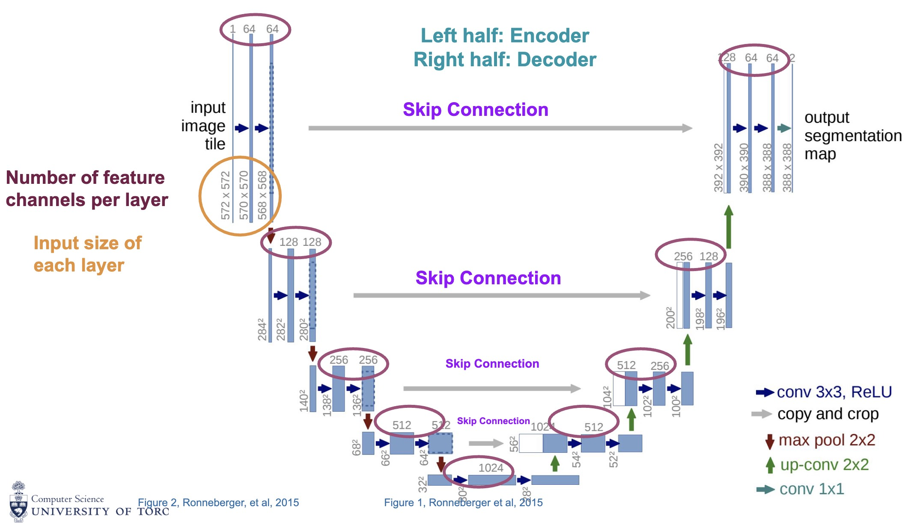
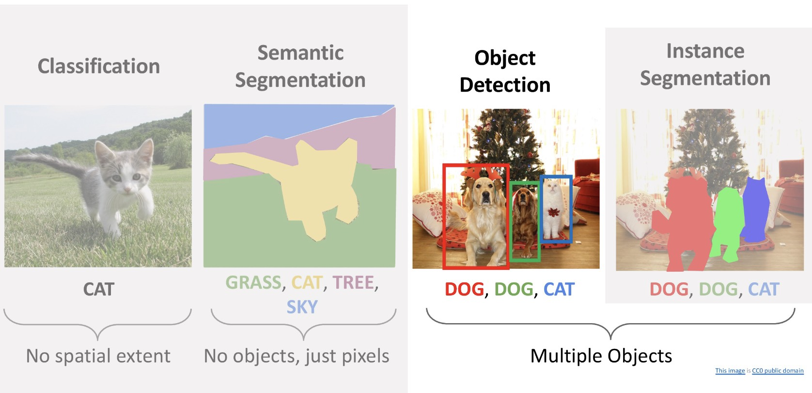
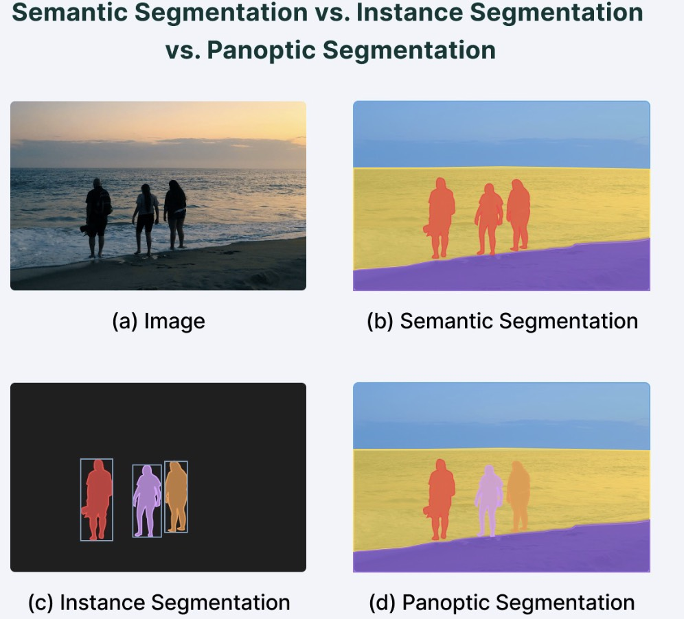
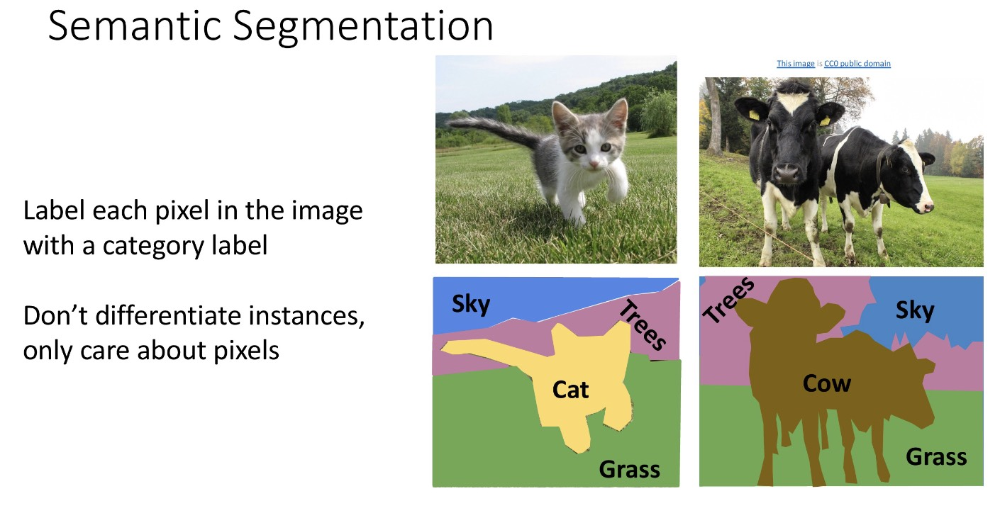
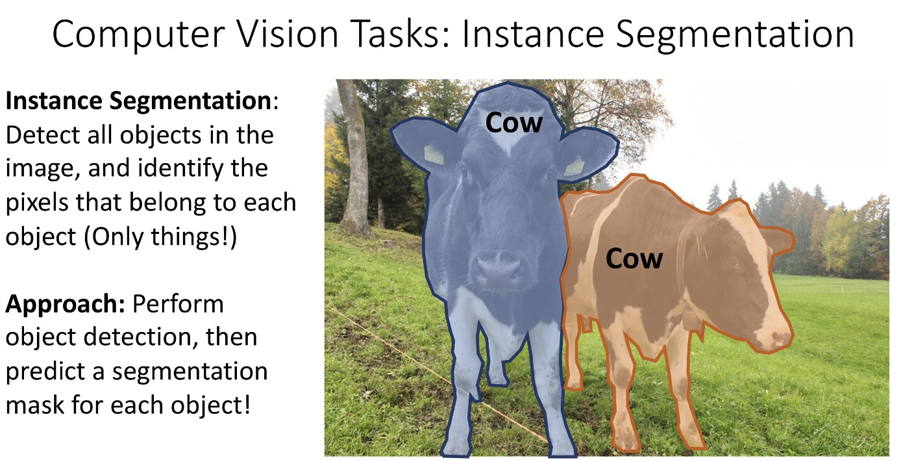
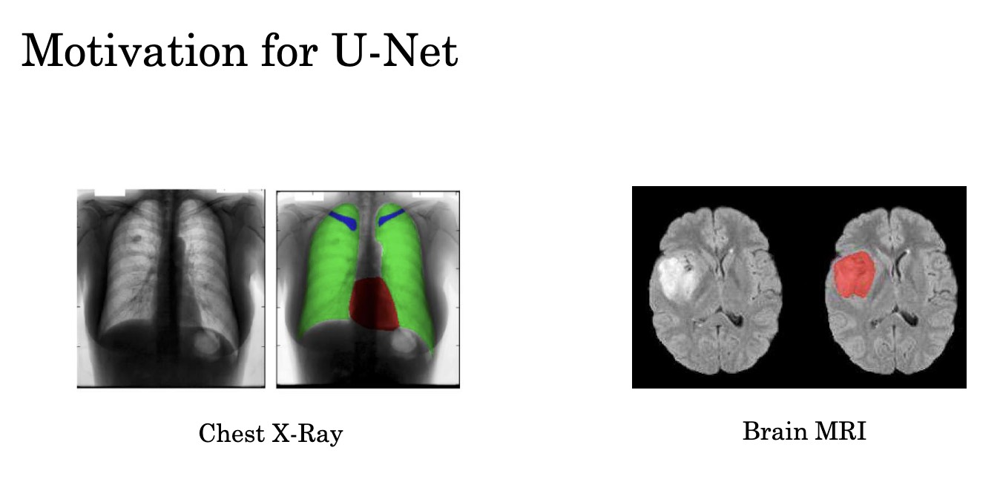
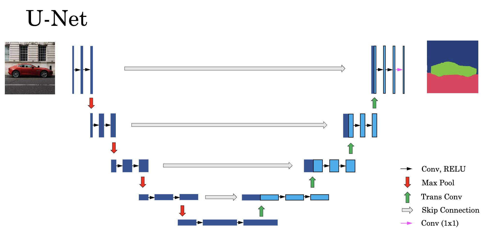
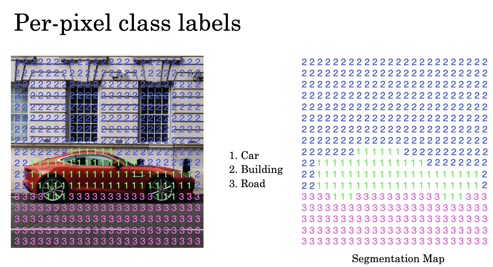
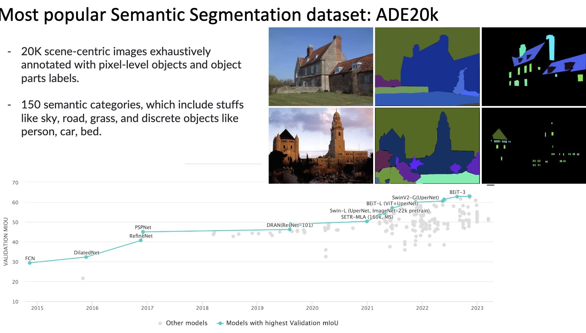
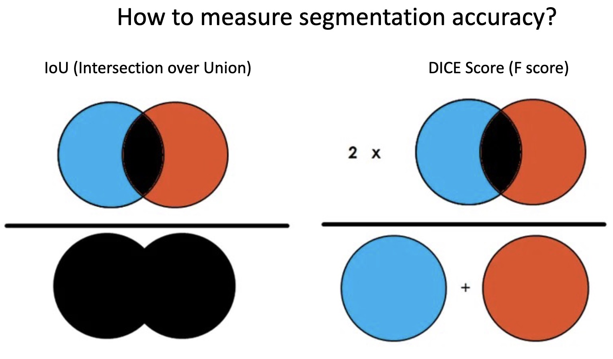

# Image Segmentation: Dense Prediction with Encoder-Decoder Networks

This lecture introduces image segmentation, the dense prediction task where a model assigns a class label to each pixel. We focus on why encoder-decoder networks and U-Net-style skip connections are so effective.



---

## 1. From Recognition to Dense Prediction

Classification predicts one label for an image.

Detection predicts a set of boxes and labels.

Segmentation predicts a label at every pixel.

$$
\boxed{\text{Segmentation} = \text{classification at every spatial location}}
$$

This makes segmentation a dense prediction problem.






---

## 2. Types of Segmentation

### 2.1 Semantic Segmentation

Semantic segmentation assigns each pixel a class label.

All pixels belonging to the same class share the same label.

Example:

* all road pixels are "road";
* all car pixels are "car";
* all sky pixels are "sky".

It does not distinguish between two different cars.

### 2.2 Instance Segmentation

Instance segmentation separates different object instances.

Two cars receive different masks:

$$
M_{\text{car 1}} \neq M_{\text{car 2}}
$$

Mask R-CNN is a common instance segmentation architecture.

### 2.3 Binary Segmentation

Binary segmentation predicts foreground versus background:

$$
Y_{i,j} \in \left\{0, 1\right\}
$$

This is common in medical imaging and industrial inspection.

---

## 3. Problem Formulation

Given an image:

$$
X \in \mathbb{R}^{H \times W \times C}
$$

semantic segmentation predicts:

$$
\hat{Y} \in \left\{0, 1, \ldots, K - 1\right\}^{H \times W}
$$

For each pixel location $\left(i, j\right)$:

$$
\hat{Y}_{i,j} = \arg\max_{k} P\left(Y_{i,j} = k \mid X\right)
$$

The model often produces logits:

$$
Z \in \mathbb{R}^{H \times W \times K}
$$

Then softmax converts logits into class probabilities:

$$
\hat{P}_{i,j,k}
=
\frac{\exp\left(Z_{i,j,k}\right)}
{\sum_{c=1}^{K}\exp\left(Z_{i,j,c}\right)}
$$

> [!WARNING]
> Logits and probabilities are not the same thing. Most training code expects raw logits and applies the numerically stable cross-entropy internally.

---

## 4. Pixel-Wise Loss

Segmentation is usually trained with pixel-wise cross-entropy.

For one image:

$$
\boxed{
\mathcal{L}_{\text{CE}}
=
-
\frac{1}{HW}
\sum_{i=1}^{H}
\sum_{j=1}^{W}
\sum_{k=1}^{K}
y_{i,j,k}\log \hat{p}_{i,j,k}
}
$$

where:

* $y_{i,j,k}$ is the one-hot target for pixel $\left(i, j\right)$.
* $\hat{p}_{i,j,k}$ is the predicted probability for class $k$.

Pixels are not truly independent. Neighboring pixels are correlated because real objects are spatially continuous. The loss is pixel-wise, but the model must learn structure.

---

## 5. Why Encoder-Decoder Networks

A segmentation model needs two abilities:

* understand the image globally;
* localize boundaries precisely.

The encoder provides global understanding by downsampling.

The decoder restores spatial resolution by upsampling.

```text
Input -> Encoder -> Bottleneck -> Decoder -> Pixel logits
```

The tension is:

* downsampling improves semantic abstraction;
* downsampling destroys spatial precision.

This is the core design problem in segmentation.

---

## 6. Resolution Flow

Suppose the input has spatial size $256 \times 256$.

An encoder may produce:

$$
256 \times 256
\rightarrow
128 \times 128
\rightarrow
64 \times 64
\rightarrow
32 \times 32
$$

A decoder reverses the resolution:

$$
32 \times 32
\rightarrow
64 \times 64
\rightarrow
128 \times 128
\rightarrow
256 \times 256
$$

However, upsampling alone cannot recover all details lost during downsampling. This is why U-Net adds skip connections.

---

## 7. U-Net



U-Net is a symmetric encoder-decoder architecture with skip connections between matching resolutions.

```text
Encoder path
    downsample
        bottleneck
    upsample
Decoder path
```



The encoder answers:

> What is in the image?

The decoder answers:

> Where should each class be placed?

The skip connections provide:

> What local details were present before downsampling?

---

## 8. Encoder Path

Each encoder stage typically applies convolutions and then downsamples:

```text
Conv -> ReLU -> Conv -> ReLU -> Downsample
```

Example feature progression:

$$
256 \times 256 \times 3
\rightarrow
128 \times 128 \times 64
\rightarrow
64 \times 64 \times 128
\rightarrow
32 \times 32 \times 256
$$

As resolution decreases, channels usually increase.

Interpretation:

* early layers preserve edges and textures;
* middle layers capture parts and shapes;
* deep layers capture object-level semantics.

---

## 9. Bottleneck

The bottleneck is the lowest-resolution representation.

Example:

$$
B \in \mathbb{R}^{32 \times 32 \times 512}
$$

It has strong semantic information but weak spatial precision.

The bottleneck should answer high-level questions:

* What objects or structures are present?
* What is the global context?
* Which regions are likely related?

---

## 10. Decoder Path

Each decoder stage increases resolution and refines spatial structure:

```text
Upsample -> Concatenate skip feature -> Conv -> Conv
```

Example:

$$
32 \times 32
\rightarrow
64 \times 64
\rightarrow
128 \times 128
\rightarrow
256 \times 256
$$

The decoder must turn semantic features into a full-resolution prediction.

---

## 11. U-Net Skip Connections


At matching resolutions, U-Net concatenates encoder and decoder features:

$$
D_l
=
\operatorname{Concat}\left(U_{l+1}, E_l\right)
$$

where:

* $E_l$ is the encoder feature at level $l$.
* $U_{l+1}$ is the upsampled decoder feature from the deeper level.
* $D_l$ is the fused decoder feature.

The concatenated tensor is then processed by convolutions.

If:

$$
U_{l+1} \in \mathbb{R}^{H_l \times W_l \times C_u}
$$

and:

$$
E_l \in \mathbb{R}^{H_l \times W_l \times C_e}
$$

then:

$$
D_l \in \mathbb{R}^{H_l \times W_l \times \left(C_u + C_e\right)}
$$

> [!INFO]
> U-Net uses concatenation instead of residual addition because encoder and decoder features often have different channel meanings. Concatenation preserves both, and later convolutions learn how to mix them.

---

## 12. Why Skip Connections Matter

Without skip connections:

* fine edges are lost during downsampling;
* small objects may disappear;
* output masks become blurry;
* boundaries are hard to reconstruct from the bottleneck alone.

With skip connections:

* high-resolution texture and edge information re-enters the decoder;
* gradients have shorter paths;
* the model can combine semantics and precise location;
* boundaries become sharper.

The central trade-off is:

$$
\boxed{\text{deep semantics} + \text{shallow detail} = \text{accurate dense prediction}}
$$

---

## 13. Output Layer

The final layer maps decoder features to class logits.

For $K$ classes, a common final operation is a $1 \times 1$ convolution:

$$
Z = \operatorname{Conv}_{1 \times 1}\left(D_0\right)
$$

where:

$$
Z \in \mathbb{R}^{H \times W \times K}
$$

Each pixel gets $K$ logits.

For inference:

$$
\hat{Y}_{i,j} = \arg\max_k Z_{i,j,k}
$$

For binary segmentation, the output may have one logit per pixel and use sigmoid:

$$
\hat{p}_{i,j} = \sigma\left(Z_{i,j}\right)
$$

---

## 14. Training Data




Each training sample contains:

* an image $X$;
* a pixel-level mask $Y$.

The mask must align with the image exactly. If the image is resized, cropped, flipped, or rotated, the mask must receive the same geometric transformation.

> [!WARNING]
> Never apply independent random crops or flips to the image and mask. Misalignment creates incorrect labels at every affected pixel.

A healthy train-test setup should satisfy:

$$
P_{\text{train}}\left(X, Y\right)
\approx
P_{\text{test}}\left(X, Y\right)
$$

If the test images come from a different domain, segmentation quality can drop sharply.

---

## 15. Evaluation Metrics



### 15.1 Pixel Accuracy

Pixel accuracy is:

$$
\operatorname{Accuracy}
=
\frac{\text{number of correct pixels}}
{\text{number of all pixels}}
$$

It is easy to understand but can be misleading when the background dominates.

### 15.2 Intersection over Union

For class $k$:

$$
\operatorname{IoU}_k
=
\frac{
\operatorname{TP}_k
}{
\operatorname{TP}_k + \operatorname{FP}_k + \operatorname{FN}_k
}
$$

Equivalently:

$$
\operatorname{IoU}
=
\frac{
\left|\text{prediction} \cap \text{ground truth}\right|
}{
\left|\text{prediction} \cup \text{ground truth}\right|
}
$$

IoU penalizes both false positives and false negatives.

### 15.3 Mean IoU

Mean IoU averages over classes:

$$
\operatorname{mIoU}
=
\frac{1}{K}
\sum_{k=1}^{K}
\operatorname{IoU}_k
$$

mIoU is one of the most common semantic segmentation metrics.

---

## 16. Practical Training Pipeline

```text
Image and mask
-> synchronized augmentation
-> model
-> pixel logits
-> loss
-> backpropagation
-> metric computation
```

During inference:

```text
Image -> model -> logits -> argmax or threshold -> predicted mask
```

For binary segmentation, choose a threshold:

$$
\hat{Y}_{i,j}
=
\mathbb{1}\left[\hat{p}_{i,j} \geq \tau\right]
$$

where $\tau$ is often $0.5$ but can be tuned for precision-recall trade-offs.

---

## 17. Debugging Segmentation Models

Useful checks:

* Visualize image-mask pairs before training.
* Confirm class IDs match the loss function.
* Check that ignored pixels use the correct ignore index.
* Verify output logits have shape $H \times W \times K$ or the framework equivalent.
* Inspect predictions early in training, not only final metrics.
* Watch for masks shifted by one crop, resize, or padding operation.
* Compare pixel accuracy with mIoU to detect background dominance.

---

## 18. Summary

Segmentation predicts a label for every pixel.

Key ideas:

* It is dense classification with strong spatial structure.
* Encoder-decoder networks balance global understanding and spatial reconstruction.
* U-Net skip connections recover high-resolution detail lost during downsampling.
* Pixel-wise cross-entropy is common, but metrics such as mIoU better capture overlap quality.
* Correct image-mask alignment is essential.

The next lecture studies upsampling, the operation that lets decoders recover spatial resolution.
