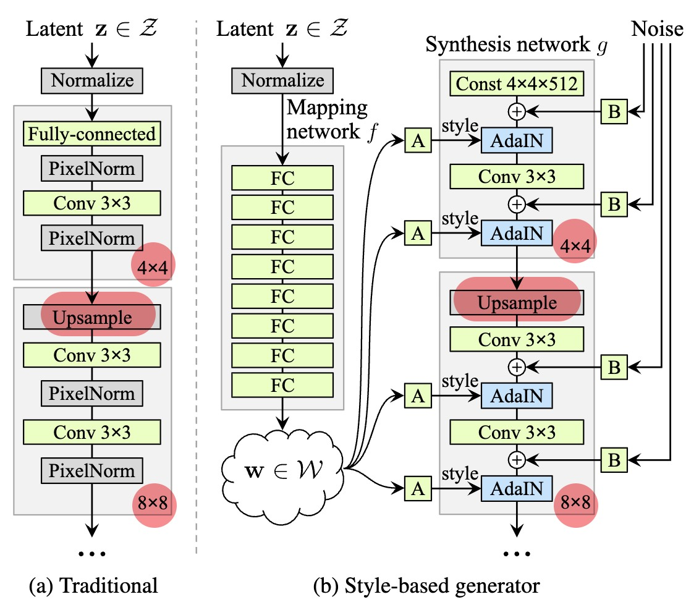
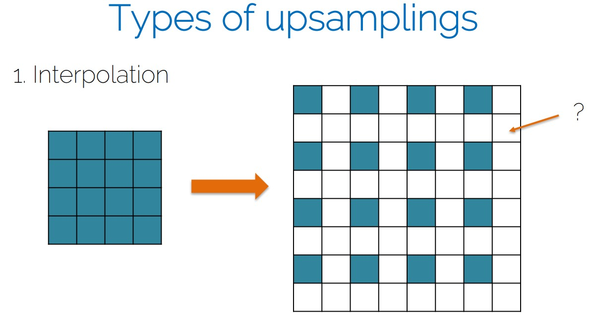
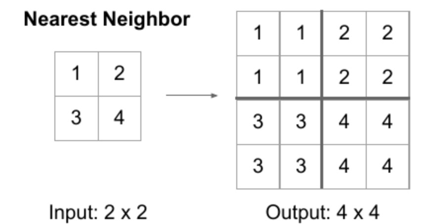
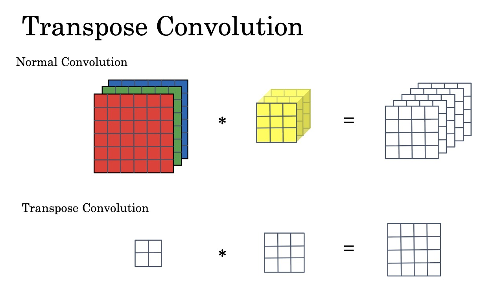
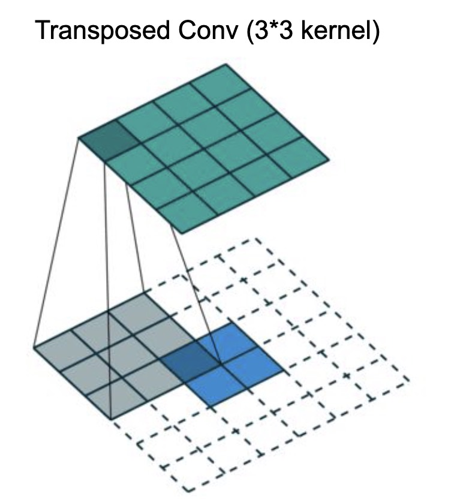
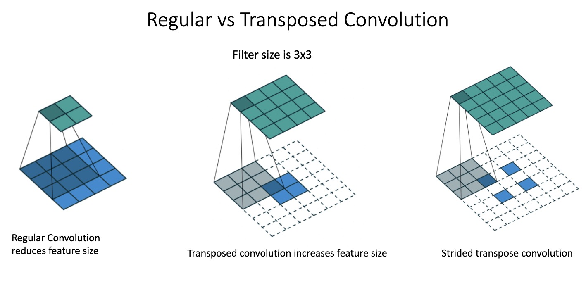
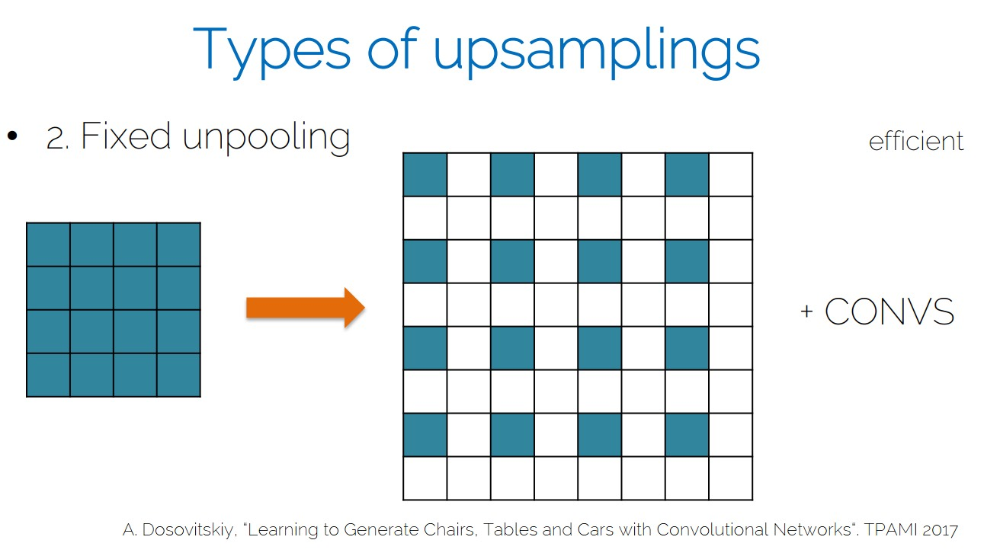

# Upsampling: From Low Resolution to High Fidelity

This lecture explains upsampling as the reconstruction step used in segmentation, detection necks, super-resolution, and generative models.



---

## 1. Motivation

Vision networks downsample feature maps because lower resolution is useful:

* computation becomes cheaper;
* receptive fields become larger;
* deep layers capture stronger semantic context.

But many tasks require spatially precise outputs:

* segmentation masks;
* object detection features at multiple scales;
* super-resolution images;
* diffusion or generative image outputs.

Upsampling increases spatial resolution, but it cannot simply undo downsampling. Information may already be lost.

$$
\boxed{\text{Upsampling is reconstruction, not perfect reversal.}}
$$

---

## 2. Problem Formulation

Let a low-resolution feature map be:

$$
X \in \mathbb{R}^{H \times W \times C}
$$

For scale factor $s$, upsampling produces:

$$
X' \in \mathbb{R}^{sH \times sW \times C'}
$$

The upsampling function is:

$$
X' = \mathcal{U}\left(X\right)
$$

The key question is:

> What values should be placed at the new spatial locations?

---

## 3. Pixel Space Versus Feature Space

Upsampling behaves differently depending on what is being upsampled.

### 3.1 Pixel Space

In pixel space, upsampling tries to create a higher-resolution image.

This is ill-posed:

$$
\text{many high-resolution images}
\rightarrow
\text{the same low-resolution image}
$$

The model must use priors about natural images:

* edges tend to be continuous;
* textures have local patterns;
* objects have coherent shapes;
* high-frequency detail must be plausible.

Applications:

* super-resolution;
* image generation;
* diffusion decoding.

### 3.2 Feature Space

In feature space, upsampling increases the resolution of learned representations.

The goal is usually not to generate photorealistic pixels directly. The goal is to align and refine semantic information across spatial scales.

Applications:

* U-Net decoders;
* FPN detection necks;
* segmentation refinement;
* feature fusion.

> [!INFO]
> Pixel-space upsampling asks "what should the image look like?" Feature-space upsampling asks "where should this semantic information be placed?"

---

## 4. Fixed Upsampling




Fixed upsampling uses deterministic rules with no trainable parameters.

Common methods:

* nearest-neighbor interpolation;
* bilinear interpolation;
* bicubic interpolation.

### 4.1 Nearest-Neighbor Interpolation

Nearest-neighbor upsampling copies the nearest existing value.

Strengths:

* simple;
* fast;
* preserves exact values.

Weaknesses:

* can look blocky;
* does not smooth transitions;
* cannot adapt to task-specific structure.

### 4.2 Bilinear Interpolation

Bilinear interpolation computes a weighted average of nearby values.

Strengths:

* smoother than nearest neighbor;
* stable and widely used;
* good for feature resizing.

Weaknesses:

* can blur edges;
* cannot invent missing detail;
* not learnable by itself.

Fixed methods decide where values go, but they do not learn what values would be best for the task.

---

## 5. Learnable Upsampling

Learnable upsampling uses trainable parameters:

$$
X' = \mathcal{U}_{\theta}\left(X\right)
$$

where $\theta$ are learned from data.

Instead of applying a fixed interpolation rule, the model learns how to reconstruct useful spatial structure.

Learned upsampling can capture:

* boundary sharpness;
* edge continuity;
* texture regularity;
* task-specific spatial alignment;
* interactions across channels.

The training signal may come from:

* segmentation loss;
* detection loss;
* reconstruction loss;
* adversarial or perceptual loss in generative systems.

---

## 6. Transposed Convolution





Transposed convolution is a learnable upsampling operation.

It maps low-resolution activations into a higher-resolution grid:

$$
X' = \operatorname{ConvTranspose}\left(X; W\right)
$$

where $W$ is a learned kernel.

### 6.1 Mechanism

Each input activation contributes to multiple output locations according to learned kernel weights.

Overlapping contributions are summed.

Conceptually:

* stride controls spacing in the output grid;
* kernel size controls the local spread;
* weights control the learned content.

### 6.2 Interpretation

Standard convolution extracts features:

$$
\text{image or feature} \rightarrow \text{compressed feature}
$$

Transposed convolution synthesizes higher-resolution features:

$$
\text{compressed feature} \rightarrow \text{expanded feature}
$$

It is useful when the model should learn how to distribute information spatially.

---

## 7. Checkerboard Artifacts

Transposed convolution can produce checkerboard artifacts when output locations receive uneven numbers of contributions.

This often happens when kernel size is not compatible with stride.

For example, if stride is $2$ and kernel size is $3$, some output positions may receive more overlapping kernel contributions than others.

> [!WARNING]
> Checkerboard artifacts are a common failure mode in learned upsampling. They can appear as grid-like patterns in generated images or segmentation outputs.

Common mitigations:

* use kernel sizes divisible by stride;
* use resize followed by convolution;
* inspect outputs visually;
* compare against bilinear upsampling baselines.

---

## 8. Resize Followed by Convolution

Another common approach separates geometry and learning:

```text
Fixed resize -> convolution
```

The resize step increases spatial resolution:

$$
\tilde{X} = \operatorname{Resize}\left(X\right)
$$

The convolution step refines content:

$$
X' = \operatorname{Conv}\left(\tilde{X}\right)
$$

This method is popular because it is stable and easy to reason about.

The resize operation decides the grid geometry. The convolution learns how to clean, sharpen, and mix features.

---

## 9. Unpooling Followed by Convolution



Some encoder-decoder networks use pooling indices.

During max pooling, the encoder records where the maximum value came from. During unpooling, the decoder places values back into those recorded positions.

This creates a sparse high-resolution feature map:

$$
\tilde{X} = \operatorname{Unpool}\left(X, \text{indices}\right)
$$

Then a convolution fills and refines the representation:

$$
X' = \operatorname{Conv}\left(\tilde{X}\right)
$$

Unpooling preserves some location information from the encoder, but it requires storing pooling indices.

---

## 10. Upsampling in U-Net

In U-Net, upsampling is combined with skip connections.

At decoder level $l$:

$$
U_l = \operatorname{Upsample}\left(D_{l+1}\right)
$$

Then:

$$
D_l = \operatorname{Conv}\left(
\operatorname{Concat}\left(U_l, E_l\right)
\right)
$$

where:

* $D_{l+1}$ is the deeper decoder feature.
* $U_l$ is the upsampled feature.
* $E_l$ is the matching encoder skip feature.
* $D_l$ is the refined decoder feature.

Upsampling restores resolution. The skip connection restores detail. The convolution learns how to combine both.

---

## 11. Upsampling in Feature Pyramid Networks

Object detection necks also use upsampling.

A simplified FPN update is:

$$
P_l
=
\operatorname{Conv}\left(C_l\right)
+
\operatorname{Upsample}\left(P_{l+1}\right)
$$

where:

* $C_l$ is the backbone feature at level $l$.
* $P_{l+1}$ is a deeper pyramid feature.
* $P_l$ is the fused feature at the current scale.

The upsampling operation brings deep semantic features to a higher-resolution grid so they can be combined with shallower features.

---

## 12. Progressive Upsampling

Upsampling is usually performed gradually, not in one huge jump.

| Resolution | Typical Role |
| --- | --- |
| $4 \times 4$ | Global layout |
| $16 \times 16$ | Coarse structure |
| $64 \times 64$ | Object geometry |
| $256 \times 256$ | Boundary refinement |
| $1024 \times 1024$ | Fine texture |

Progressive upsampling lets the model refine structure stage by stage.

This is common in:

* segmentation decoders;
* diffusion U-Nets;
* GAN generators;
* super-resolution networks.

---

## 13. Implementation Patterns

### 13.1 Bilinear Upsampling Plus Convolution

```python
import torch.nn as nn


class ResizeConvBlock(nn.Module):
    def __init__(self, in_channels, out_channels):
        super().__init__()
        self.block = nn.Sequential(
            nn.Upsample(scale_factor=2, mode="bilinear", align_corners=False),
            nn.Conv2d(in_channels, out_channels, kernel_size=3, padding=1),
            nn.ReLU(),
        )

    def forward(self, x):
        return self.block(x)
```

### 13.2 Transposed Convolution

```python
class TransposedConvBlock(nn.Module):
    def __init__(self, in_channels, out_channels):
        super().__init__()
        self.block = nn.Sequential(
            nn.ConvTranspose2d(
                in_channels,
                out_channels,
                kernel_size=4,
                stride=2,
                padding=1,
            ),
            nn.ReLU(),
        )

    def forward(self, x):
        return self.block(x)
```

The transposed convolution above doubles spatial resolution because the stride is $2$.

---

## 14. Debugging Upsampling

Check these issues:

* Does the output spatial size match the target?
* Are skip features and upsampled features aligned?
* Is `align_corners` consistent across training and inference?
* Do predictions show checkerboard artifacts?
* Are boundaries too blurry?
* Does a fixed interpolation baseline perform almost as well?
* Are channels being concatenated in the expected order?

Shape checks are especially important:

```python
assert upsampled.shape[-2:] == skip.shape[-2:]
```

---

## 15. Choosing an Upsampling Method

| Method | Strength | Risk |
| --- | --- | --- |
| Nearest neighbor | Fast and simple | Blocky output |
| Bilinear | Smooth and stable | Blurred boundaries |
| Transposed convolution | Learnable synthesis | Checkerboard artifacts |
| Resize plus convolution | Stable and learnable | Slightly more computation |
| Unpooling plus convolution | Uses pooling locations | Requires saved indices |

For many segmentation models, resize plus convolution is a strong default. For generative models, transposed convolution or learned decoder blocks may be useful when carefully designed.

---

## 16. Summary

Upsampling increases spatial resolution, but it also reconstructs missing information.

Key ideas:

* Downsampling improves semantics but loses precision.
* Fixed interpolation is simple but not task-adaptive.
* Learnable upsampling can reconstruct task-specific structure.
* Transposed convolution performs learned spatial spreading.
* Resize plus convolution separates geometric resizing from content refinement.
* U-Net and FPN combine upsampling with skip connections to recover both semantic meaning and spatial detail.

Across this mini-series, the same pattern appears repeatedly:

$$
\boxed{\text{preserve useful information, then refine it at the right scale}}
$$
