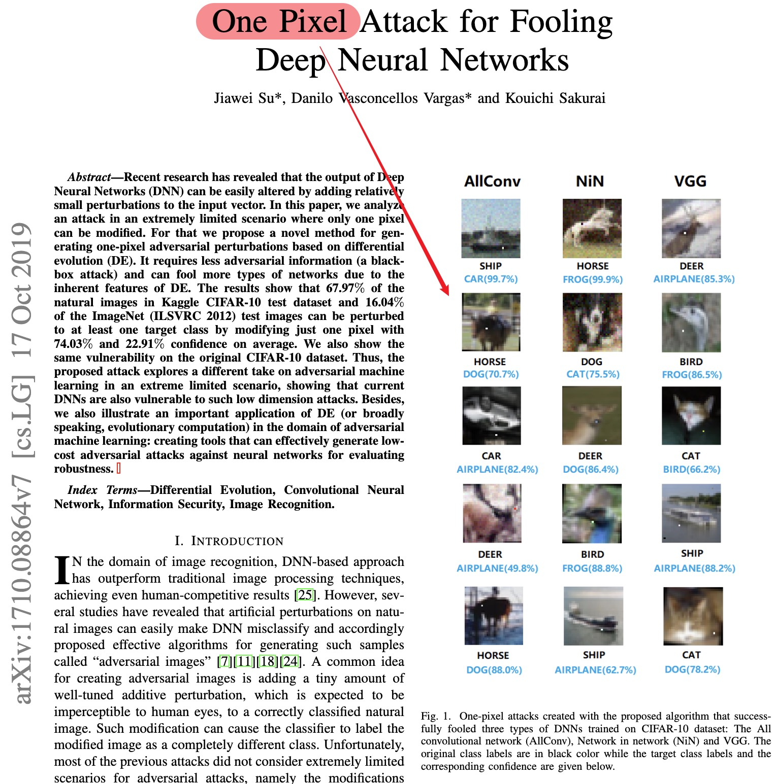
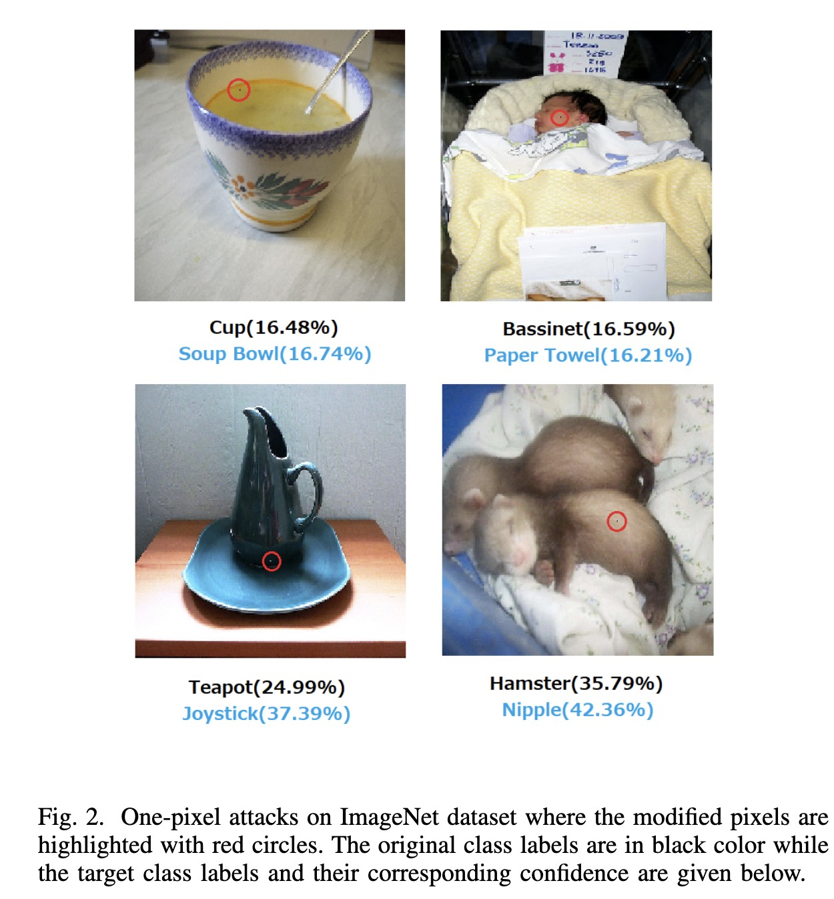
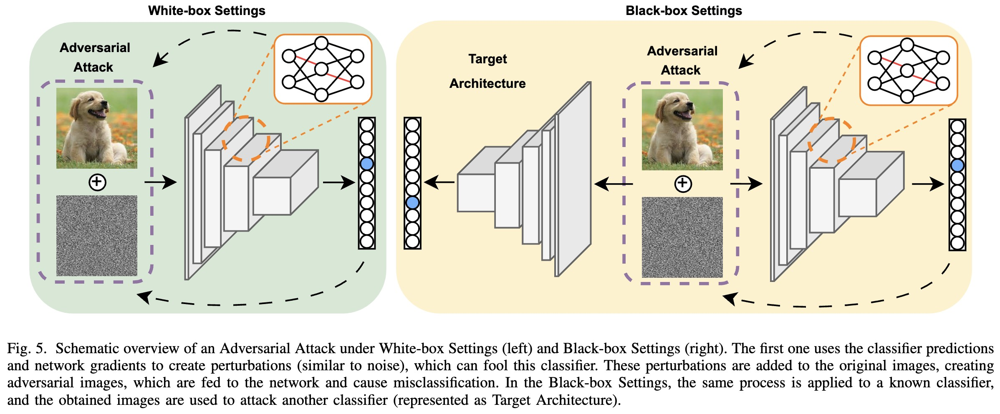
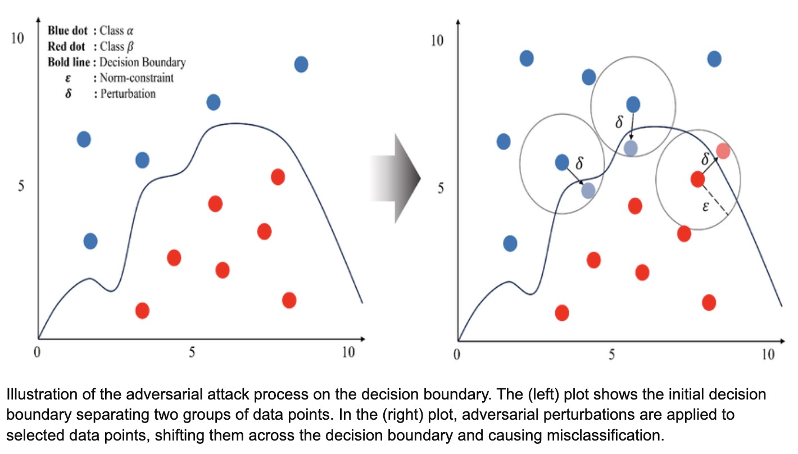
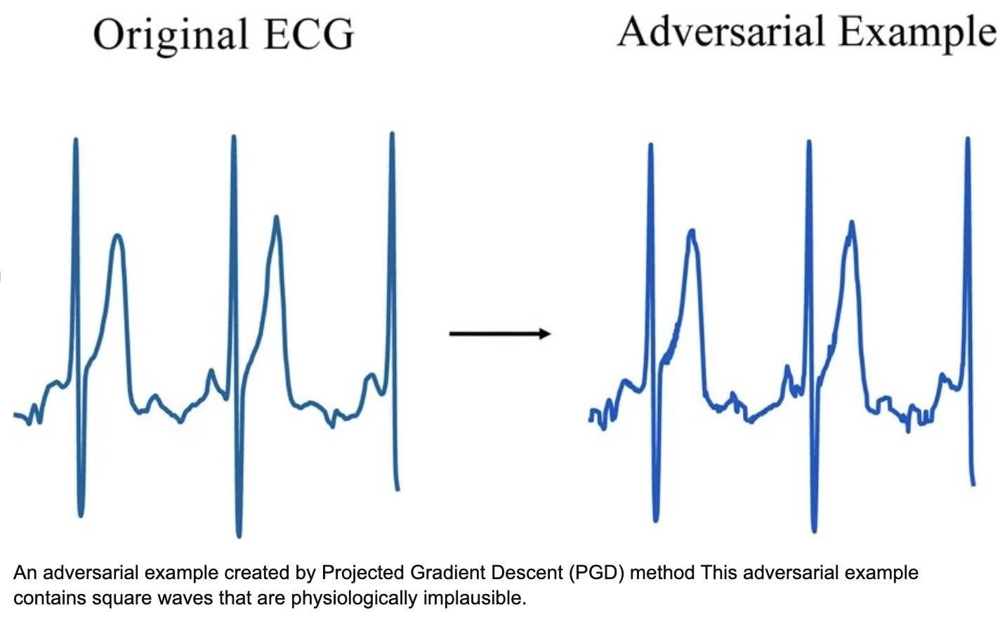

# Adversarial Robustness (Part 1): Adversarial Attacks




## 1. Motivation: When Neural Networks Fail

Deep neural networks often achieve **superhuman accuracy** on many tasks.

A neural network can be **fooled by tiny, carefully designed perturbations**.

These maliciously designed inputs are called **Adversarial Examples**.



---

# 2. What Is an Adversarial Attack?

An adversarial attack modifies an input \(x\) by adding a small perturbation:

$$
x_{adv} = x + \delta
$$

where:

* \(x\) = original input
* \(\delta\) = adversarial perturbation

The perturbation is constrained so that it is **small enough to be imperceptible**.

Example constraint:

$$
\|\delta\|_\infty < \epsilon
$$

Meaning:

Each pixel can only change slightly.

The goal of the attacker is:

$$
f(x+\delta) \ne f(x)
$$

or more strongly:

$$
f(x+\delta) = y_{target}
$$

---

# 3. Why Do Adversarial Examples Exist?

One important explanation is the **linearity hypothesis**.

Neural networks are often locally linear in high-dimensional spaces.

Consider a simple linear model:

$$
y = x \cdot w
$$

If we perturb the input:

$$
x_{adv} = x + \delta
$$

then

$$
x \cdot w + \delta \cdot w
$$

Even if \(\delta\) is small, in high dimensions:

$$
\delta \cdot w
$$

can become large.

This causes the prediction to change dramatically.

High-dimensional input spaces (like images with thousands of pixels) make networks **vulnerable to adversarial perturbations**.

---

# 4. Threat Models



Adversarial attacks are usually categorized based on the **attacker's knowledge**.

### White-box attacks

The attacker knows:

* model architecture
* model parameters
* gradients

This allows **precise gradient-based attacks**.

---

### Black-box attacks

The attacker only knows:

* input
* output predictions

The attacker might rely on:

* queries
* transfer attacks

---

### Targeted vs Untargeted Attacks

Untargeted attack:

$$
f(x_{adv}) \ne y
$$

Any incorrect class is acceptable.

Targeted attack:

$$
f(x_{adv}) = y_{target}
$$

The attacker forces the model to output a **specific class**.

---

# 5. Fast Gradient Sign Method (FGSM)




One of the most famous adversarial attacks is **Fast Gradient Sign Method (FGSM)**.

Proposed by **Ian Goodfellow (2014)**.

The idea is simple:

Use the **gradient of the loss with respect to the input**.

We compute:

$$
\nabla_x J(\theta, x, y)
$$

where

* $J$ = loss function
* $x$ = input
* $y$ = true label
* $\theta$ = model parameters

The adversarial example is:

$$
x_{adv} =
x + \epsilon \cdot sign(\nabla_x J(\theta, x, y))
$$

Explanation:

* move input in the direction that **increases the loss**
* use only the **sign** of the gradient


---

# 6. Intuition Behind FGSM

The gradient tells us:

```
which direction increases the loss fastest
```

By applying the sign of the gradient:

```
we push every pixel slightly toward higher loss
```

Even small perturbations can cause misclassification.

---

# 7. PyTorch Implementation of FGSM

### Step 1: Compute gradient w.r.t input

```python
import torch
import torch.nn.functional as F

def fgsm_attack(model, x, y, epsilon):

    x.requires_grad = True

    output = model(x)
    loss = F.cross_entropy(output, y)

    model.zero_grad()
    loss.backward()

    grad = x.grad.data

    x_adv = x + epsilon * grad.sign()

    x_adv = torch.clamp(x_adv, 0, 1)

    return x_adv
```


Key line:

```python
grad.sign()
```

This implements:

$$
sign(\nabla_x J)
$$


The line `torch.clamp(x_adv, 0, 1)` ensures that the perturbed image pixels remain within the valid range of $[0, 1]$ by forcing any values below 0 to 0, and, any values above 1 to 1.


---

# 8. Projected Gradient Descent (PGD)



FGSM is a **single-step attack**.

A stronger attack is **Projected Gradient Descent (PGD)**.

Instead of one step, PGD iteratively updates the adversarial example.

Update rule:

$$
x_{t+1} =
\Pi_{B_\epsilon(x)}
\left(
x_t + \alpha \cdot sign(\nabla_x J(\theta, x_t, y))
\right)
$$

where

* $B_\epsilon(x)$ = allowed perturbation region
* $\Pi$ = projection operator
* $\alpha$ = step size

PGD is considered **one of the strongest first-order attacks**.

---

### PGD PyTorch Implementation

```python
def pgd_attack(model, x, y, epsilon=0.03, alpha=0.01, steps=40):

    x_adv = x.clone()

    for _ in range(steps):

        x_adv.requires_grad = True

        output = model(x_adv)
        loss = F.cross_entropy(output, y)

        model.zero_grad()
        loss.backward()

        grad = x_adv.grad

        x_adv = x_adv + alpha * grad.sign()

        perturbation = torch.clamp(x_adv - x, -epsilon, epsilon)

        x_adv = torch.clamp(x + perturbation, 0, 1).detach()

    return x_adv
```

PGD repeatedly:

1. increases loss
2. projects result back into the allowed perturbation region

---


# 9. Summary

Adversarial attacks exploit weaknesses in neural networks.

Key ideas:

Adversarial example:

$$
x_{adv} = x + \delta
$$

Perturbation constraint:

$$
\|\delta\|_\infty < \epsilon
$$

FGSM attack:

$$
x_{adv} =
x + \epsilon \cdot sign(\nabla_x J(\theta, x, y))
$$

PGD attack:

$$\text{Iterative gradient-based perturbations}$$

These attacks reveal that **high accuracy does not imply robustness**.
