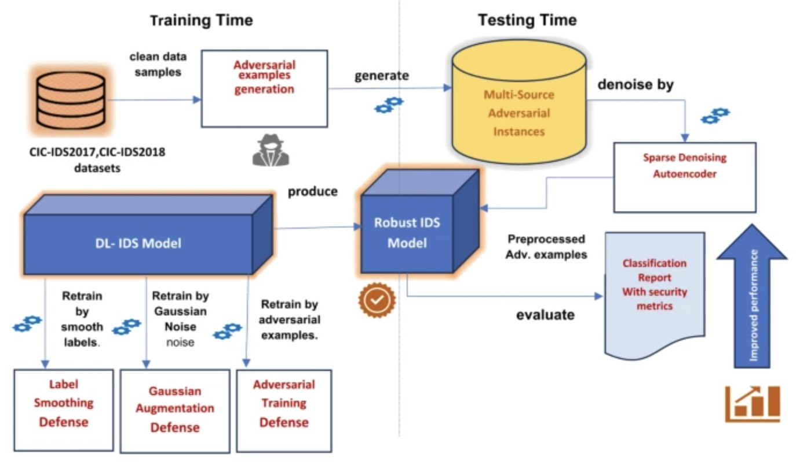
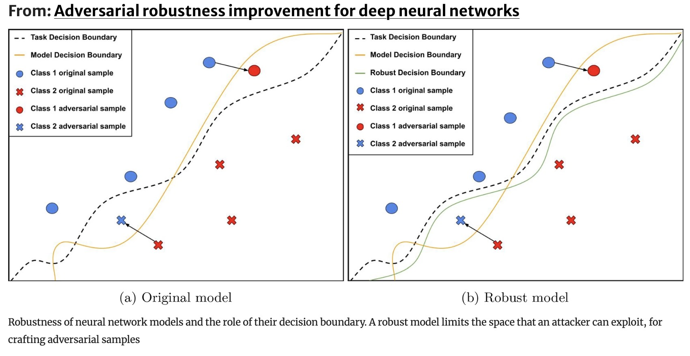
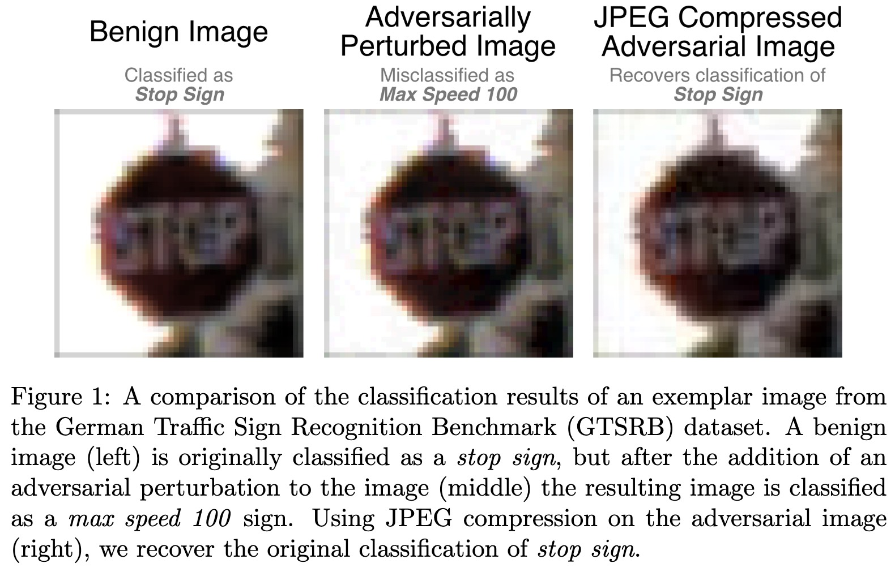
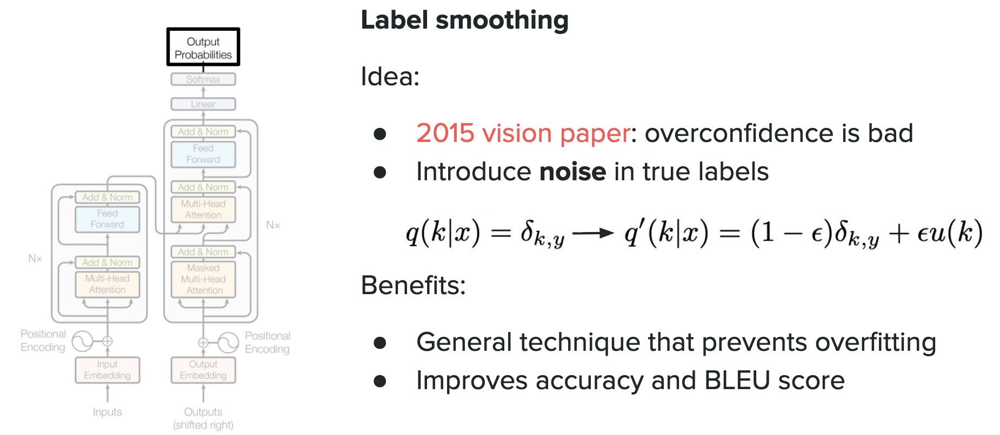

# Adversarial Robustness (Part 2): Defense

## 1. Motivation

In the previous lecture, we studied **adversarial attacks**.

We saw that a small perturbation can transform an input

$$
x
$$

into an adversarial example

$$
x_{adv} = x + \delta
$$

such that

$$
f(x_{adv}) \ne f(x)
$$

Even when

$$
\|\delta\|_\infty < \epsilon
$$

is extremely small.

This reveals a critical problem:

> High accuracy on clean data does not guarantee robustness.

Therefore, researchers developed **defense methods** to improve neural network robustness.

The goal of adversarial defense is:

$$
f(x_{adv}) = f(x)
$$

meaning that small perturbations should **not change the prediction**.

---

# 2. Categories of Adversarial Defenses



Adversarial defenses generally fall into several categories.

### 1. Adversarial Training

Train the model using adversarial examples.

---

### 2. Input Preprocessing

Modify the input to remove adversarial perturbations.

Examples:

* image denoising
* JPEG compression
* feature squeezing

---

### 3. Gradient Masking / Obfuscation

Hide or distort gradients to make attacks difficult.

---

### 4. Certified Robustness

Provide mathematical guarantees that predictions are stable.

---

# 3. Adversarial Training

Adversarial training was introduced by **Ian Goodfellow (2014)**.

The idea is simple:

Instead of training only on clean inputs:

$$
(x,y)
$$

we train on adversarial examples:

$$
(x_{adv},y)
$$

Training objective becomes:

$$
\min_{\theta}
\mathbb{E}_{(x,y)}
\left[
\max_{\|\delta\|_\infty < \epsilon}
J(\theta, x+\delta, y)
\right]
$$

This is a **min-max optimization problem**.

Interpretation:

* inner maximization → attacker finds worst perturbation
* outer minimization → model learns to resist it

---

# 4. Adversarial Training



Steps during training:

1. compute adversarial example
2. train model on it

Algorithm:

```
Clean input → Generate adversarial example → Train model
```

### PyTorch Example

```python
for x, y in train_loader:

    x_adv = fgsm_attack(model, x, y, epsilon=0.03) # or PGD Attack

    output = model(x_adv)

    loss = F.cross_entropy(output, y)

    optimizer.zero_grad()
    loss.backward()
    optimizer.step()
```

This teaches the model to **classify adversarial examples correctly**.

---

# 5. Input Preprocessing Defenses



Some defenses try to **remove adversarial noise before classification**.

Examples include:

### JPEG Compression

Adversarial noise often lies in **high-frequency components**.

JPEG compression can reduce such noise.

Pipeline:

```
Input → JPEG compression → Classifier
```

---

### Feature Squeezing

Reduce input precision.

Example:

```
8-bit image → 4-bit image
```

This removes small perturbations.

---

### Image Denoising

Apply filters such as:

* median filter
* Gaussian smoothing

These remove noise before classification.

---

# 6. Defensive Distillation

The idea originates from **knowledge distillation**.

Two models are trained:

### Step 1



Train teacher network using **soft labels**
- e.g. `[0.1, 0.8, 0.1] `
- instead of `[0, 1, 0]`

Softmax output:

$$
softmax(z/T)
$$

where

* $T$ = temperature parameter 
* Higher $T$ values (greater than 1) produce smoother probability distributions, reducing sharp decision boundaries

---

### Step 2

Train student network to match teacher outputs.

The goal is to produce **smoother decision boundaries**.

---

# 7. Randomized Defenses

### Randomized Smoothing

Add Gaussian noise to inputs:

$$
x' = x + \mathcal{N}(0,\sigma^2)
$$

Prediction becomes:

$$
f(x) = \arg\max_c P(f(x+\eta)=c)
$$

where

$$
\eta \sim \mathcal{N}(0,\sigma^2)
$$

Randomized smoothing can provide **certified robustness guarantees**.

Meaning:

Within a certain radius

$$
\|\delta\|_\infty < r
$$

the prediction **cannot change**.
