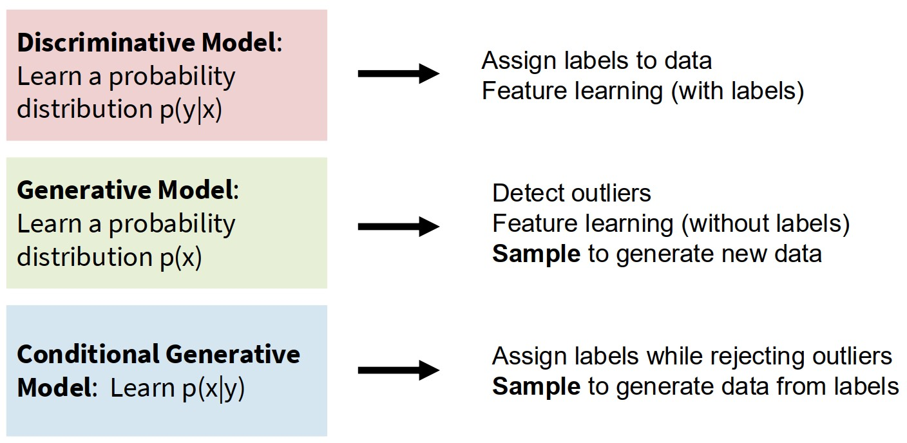
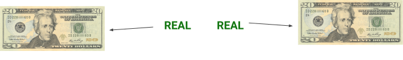
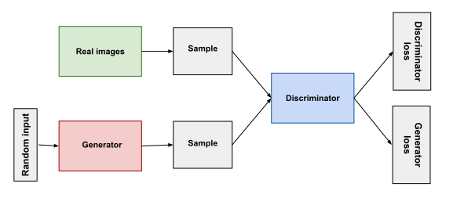
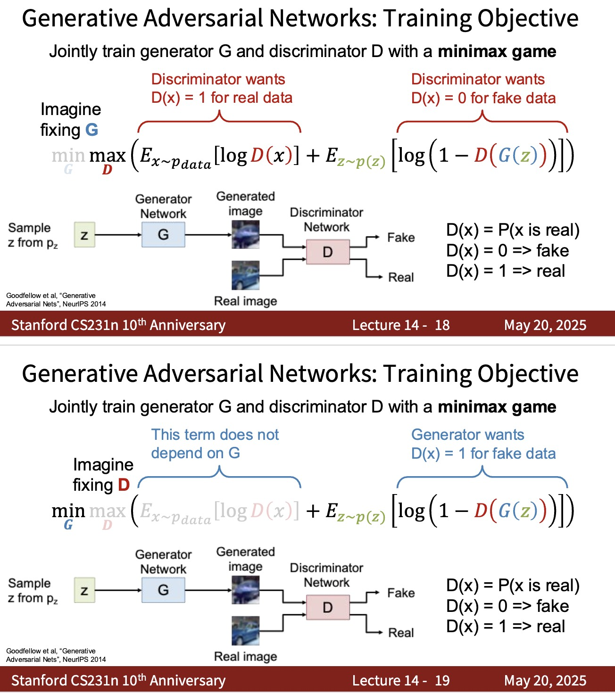

# Generative Adversarial Networks (GANs)

## 1. Motivation: Why Generative Models?

In machine learning, many models are **discriminative**. They learn to predict labels given data.

Example:

$$
P(y|x)
$$

These models answer the question:

> Given an input \(x\), what is the probability of label \(y\)?

However, sometimes we want to **generate new data**, not just classify existing data.

To do this, we want to learn the **data distribution**:

$$
P(x)
$$

or the **conditional distribution**:

$$
P(x|y)
$$

Models that learn these distributions are called **generative models**.

Examples include:

* Gaussian Mixture Models
* Variational Autoencoders (VAE)
* Diffusion Models
* **Generative Adversarial Networks (GANs)**

---

# 2. Core Idea of GANs

GANs were introduced by **Ian Goodfellow in 2014**.

The idea is inspired by a **game between two neural networks**.

The two networks are:

**Generator (G)**
Creates fake data.

**Discriminator (D)**
Distinguishes real data from fake data.

During training:
* Generator improves at producing fake data
* Discriminator improves at detecting fake data

Eventually, the generator produces **data indistinguishable from real data**.

---

# 3. Architecture of GAN

A GAN consists of two neural networks.

### Generator

The generator transforms **random noise** into synthetic data.

Input:

$$
z \sim P(z)
$$

where \(z\) is random noise.

Output:

$$
G(z)
$$

which is a generated sample.

---

### Discriminator

The discriminator is a **binary classifier**.

Input:

* Real data \(x\)
* Fake data \(G(z)\)

Output:

$$
D(x) \in [0,1]
$$

Interpretation:

* \(D(x) = 1\) → real
* \(D(x) = 0\) → fake

---

# 4. The Minimax Game

GAN training is formulated as a **minimax optimization problem**.

The objective function is:

$$
\min_G \max_D V(D,G)
$$

where

$$
V(D,G) =
\mathbb{E}_{x \sim P_{data}(x)}[\log D(x)] +
\mathbb{E}_{z \sim P(z)}[\log(1 - D(G(z)))]
$$

Explanation:

| Component | Goal | Mathematical Expression |
|-----------|------|------------------------|
| **Discriminator $D$** | Make $V$ as **large** as possible | $\max_D V(D,G)$ |
| **Generator $G$** | Make $V$ as **small** as possible | $\min_G V(D,G)$ |

First term:

$$
\mathbb{E}_{x \sim P_{data}}[\log D(x)]
$$

The discriminator wants to classify **real data correctly**.

Second term:

$$
\mathbb{E}_{z \sim P(z)}[\log(1 - D(G(z)))]
$$

The discriminator wants to classify **generated data as fake**.

The generator tries to **minimize this objective**, meaning:

Make the discriminator believe generated samples are real.

---

# 5. Training Procedure

Training alternates between two steps.

### Step 1: Train Discriminator

Goal:

Maximize

$$
\log D(x) + \log(1 - D(G(z)))
$$

Meaning:

* Real samples → label 1
* Generated samples → label 0

---

### Step 2: Train Generator

Goal:

Fool the discriminator.

Instead of minimizing

$$
\log(1 - D(G(z)))
$$

we often maximize

$$
\log D(G(z))
$$

because it produces **stronger gradients**.

---

# 6. GAN Implementation

See the jupyter notebooks in the folder [gan_in_pytorch](./gan_in_pytorch).

---

# 7. Equilibrium

At **equilibrium**:

The generator distribution matches the real distribution:

$$
P_g(x) = P_{data}(x)
$$

The discriminator cannot distinguish real from fake.

$$
D(x) = 0.5
$$

$$
\text{for both real and generated samples}
$$

---

# 8. Key Intuition

GAN training is similar to an **arms race**.

Generator improves → discriminator adapts.
Discriminator improves → generator adapts.

Over time, both networks **co-evolve**, leading to realistic generation.

---

# 9. Time to play!

- https://poloclub.github.io/ganlab/
