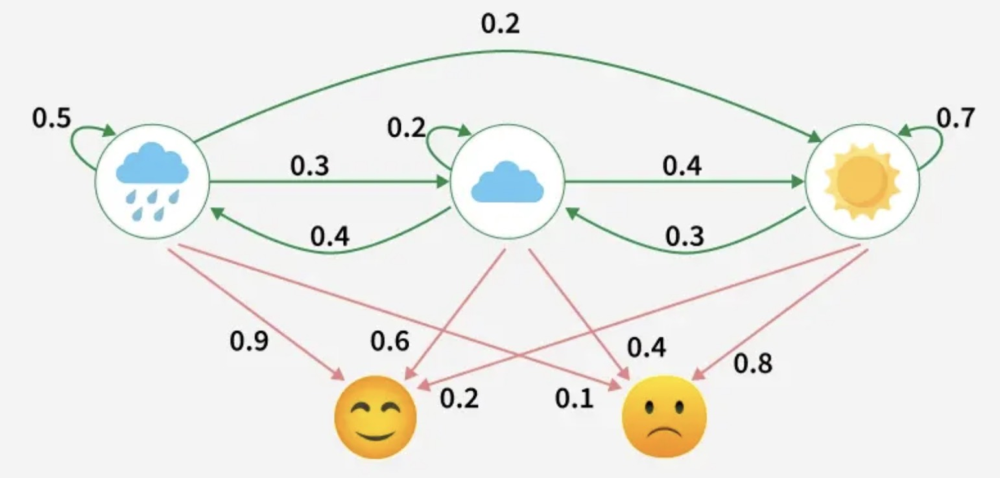
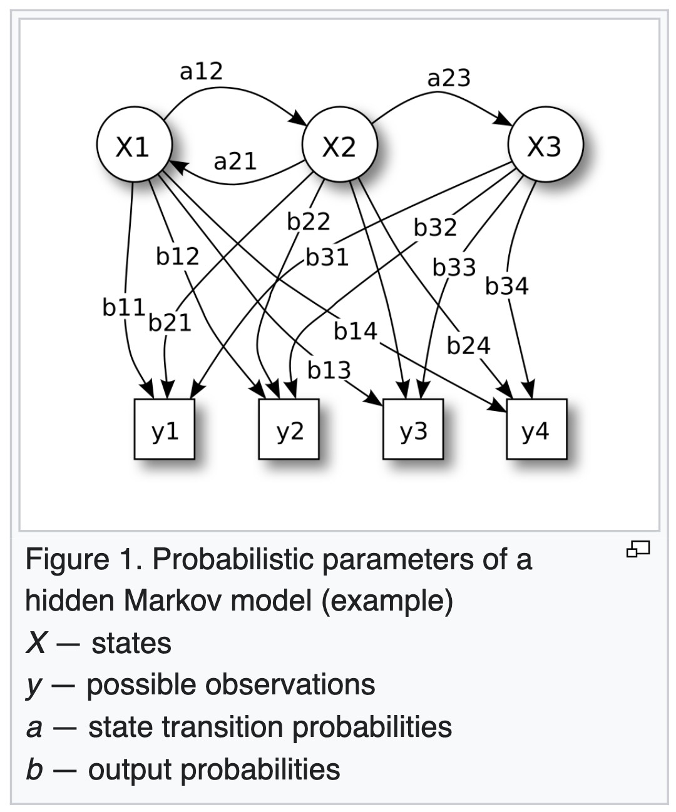
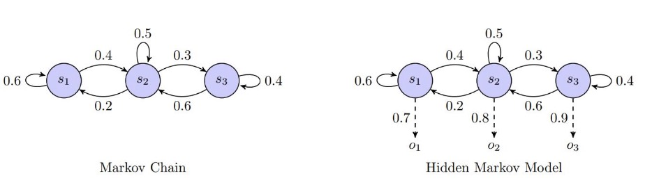
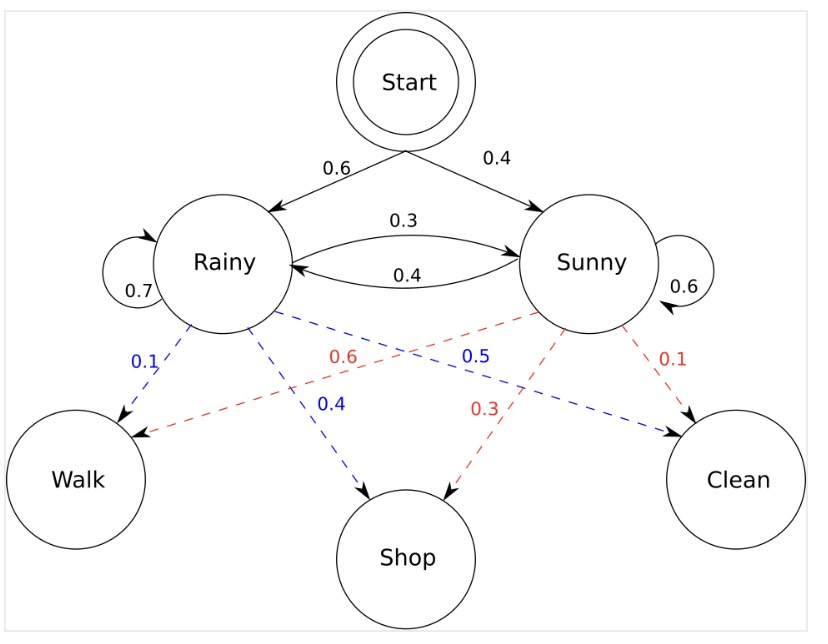

# Hidden Markov Models: The Probabilistic Starting Point

This lecture introduces Hidden Markov Models as the classical sequence model that motivates recurrent neural networks. The goal is not to become HMM specialists, but to understand the sequence-modeling problem that RNNs later solve with learned continuous states.



---

## 1. Why Sequence Models Need Hidden State

Many real processes unfold over time, but the state we care about is not directly visible.

Examples:

* In speech recognition, phonemes are hidden and audio frames are observed.
* In part-of-speech tagging, grammatical tags are hidden and words are observed.
* In robotics, the true location may be hidden and sensors provide noisy observations.
* In finance or medicine, the underlying condition may be hidden and measurements are observed.

A sequence model needs a memory of the past. HMMs solve this with a discrete hidden state.

> [!INFO]
> In this mini-series, time indices use $t$. An observed input sequence is $x_{1:T} = \left(x_1, \ldots, x_T\right)$. Classical HMM hidden states are $z_t$. Neural recurrent hidden states are $h_t$.

---

## 2. Markov Chains

A Markov chain is a sequence of states where the next state depends only on the current state.

$$
P\left(z_t \mid z_{1:t-1}\right)
=
P\left(z_t \mid z_{t-1}\right)
$$

This is the Markov property.

It says:

> The present state is a sufficient summary of the past for predicting the next state.

If the states are fully observed, a Markov chain is enough. But many tasks only show us noisy observations, not the true state.

---

## 3. Hidden Markov Models



A Hidden Markov Model introduces two sequences:

* hidden states $z_1, \ldots, z_T$;
* observations $x_1, \ldots, x_T$.

The model makes two assumptions.

### 3.1 State Transition Assumption

The hidden state follows a Markov chain:

$$
P\left(z_t \mid z_{1:t-1}\right)
=
P\left(z_t \mid z_{t-1}\right)
$$

### 3.2 Emission Assumption

Each observation depends only on the current hidden state:

$$
P\left(x_t \mid z_{1:t}, x_{1:t-1}\right)
=
P\left(x_t \mid z_t\right)
$$

Together, these assumptions make inference tractable.

---

## 4. Graphical Structure



The graphical model is a chain:

```text
z_1 -> z_2 -> z_3 -> ... -> z_T
 |      |      |             |
 v      v      v             v
x_1    x_2    x_3           x_T
```

The hidden state sequence evolves over time, and each state emits one observation.

This structure is important because RNNs keep the same temporal idea:

```text
previous state + current input -> next state
```

---

## 5. Model Parameters

An HMM is defined by three components.

### 5.1 Initial Distribution

The initial distribution gives the probability of the first hidden state:

$$
\pi_i = P\left(z_1 = i\right)
$$

### 5.2 Transition Matrix

The transition matrix gives the probability of moving from state $i$ to state $j$:

$$
A_{ij}
=
P\left(z_t = j \mid z_{t-1} = i\right)
$$

Each row is a probability distribution:

$$
\sum_j A_{ij} = 1
$$

### 5.3 Emission Model

The emission model gives the probability of observing $x_t$ from hidden state $j$:

$$
B_j\left(x_t\right)
=
P\left(x_t \mid z_t = j\right)
$$

For discrete observations, $B_j$ is a categorical distribution. For continuous observations, it may be Gaussian or a mixture model.

---

## 6. Joint Probability

The HMM factorizes the joint probability as:

$$
\boxed{
P\left(x_{1:T}, z_{1:T}\right)
=
P\left(z_1\right)
\prod_{t=2}^{T} P\left(z_t \mid z_{t-1}\right)
\prod_{t=1}^{T} P\left(x_t \mid z_t\right)
}
$$

This factorization is the reason efficient algorithms exist.

It says:

* state transitions connect hidden states over time;
* emissions connect hidden states to observations;
* the full sequence probability is built from local factors.

---

## 7. Fundamental HMM Problems

### 7.1 Evaluation

Given a model and observations, compute the likelihood:

$$
P\left(x_{1:T}\right)
$$

This is usually solved by the forward algorithm.

### 7.2 Decoding

Given observations, find the most likely hidden state sequence:

$$
z_{1:T}^{*}
=
\arg\max_{z_{1:T}}
P\left(z_{1:T} \mid x_{1:T}\right)
$$

This is usually solved by the Viterbi algorithm.

### 7.3 Learning

Given observations, estimate the HMM parameters:

$$
\pi,\quad A,\quad B
$$

This can be done with maximum likelihood when hidden states are observed, or with expectation-maximization when they are hidden.

---

## 8. Discrete Example



Suppose the hidden states are weather conditions:

* rainy;
* sunny.

The observations are activities:

* walk;
* shop;
* clean.

The HMM learns:

* transition probabilities between weather states;
* emission probabilities of activities from each weather state.

Given:

$$
x_{1:3} =
\left(\text{walk}, \text{shop}, \text{clean}\right)
$$

the model can infer:

$$
z_{1:3}^{*}
$$

the most likely hidden weather sequence.

---

## 9. Why HMMs Are Limited

HMMs are elegant, but their assumptions become restrictive for complex data.

### 9.1 Short Memory

The hidden state has first-order Markov structure:

$$
z_t \leftarrow z_{t-1}
$$

Long-range dependencies must be compressed into one discrete state.

### 9.2 Discrete State Design

The modeler often chooses a fixed number of hidden states. This can be too rigid for language, speech, and other high-dimensional sequences.

### 9.3 Simple Emissions

Traditional emissions are often simple distributions. They may not model complex observations such as word embeddings, images, or rich sensor data.

---

## 10. From HMMs to RNNs

RNNs keep the idea of a state that evolves over time, but replace discrete hidden states with learned continuous vectors.

HMM:

$$
z_t \sim P\left(z_t \mid z_{t-1}\right)
$$

RNN:

$$
h_t = f_{\theta}\left(x_t, h_{t-1}\right)
$$

The conceptual shift is:

| HMM | RNN |
| --- | --- |
| Hidden state $z_t$ is discrete | Hidden state $h_t$ is continuous |
| Transition is a probability table | Transition is a neural network |
| Emission model is manually specified | Output layer is learned |
| Inference uses probabilistic algorithms | Training uses backpropagation through time |

---

## 11. Summary

HMMs give us the first core idea of the series:

$$
\boxed{\text{A sequence model needs a state that carries information through time.}}
$$

RNNs keep this state-based view but make the state continuous, learned, and differentiable.
