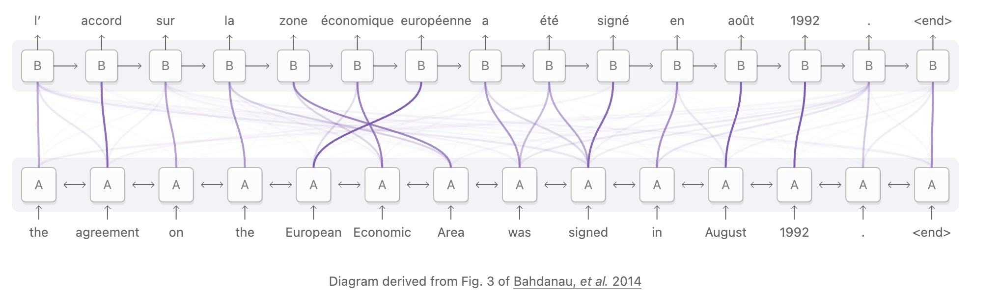
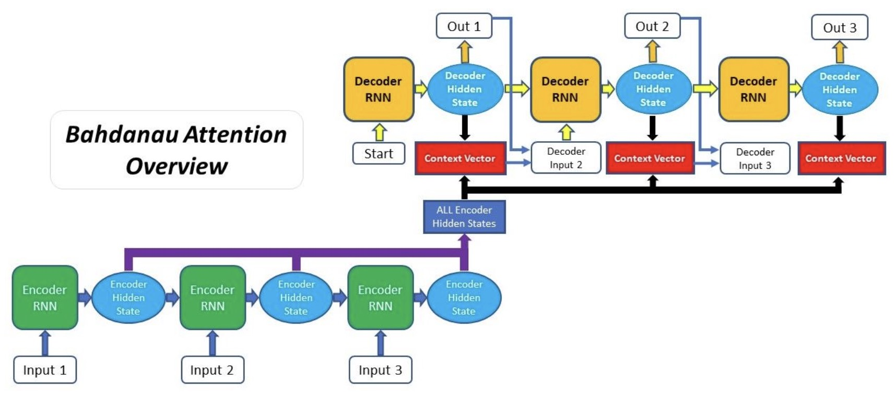
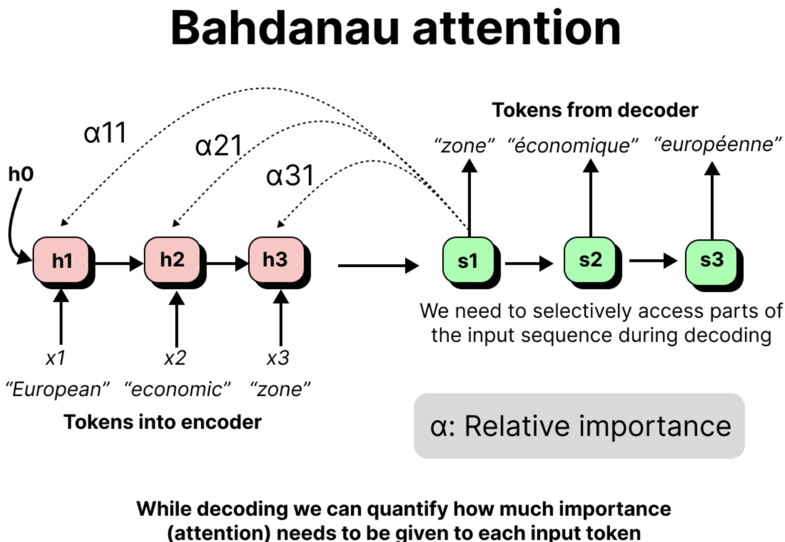
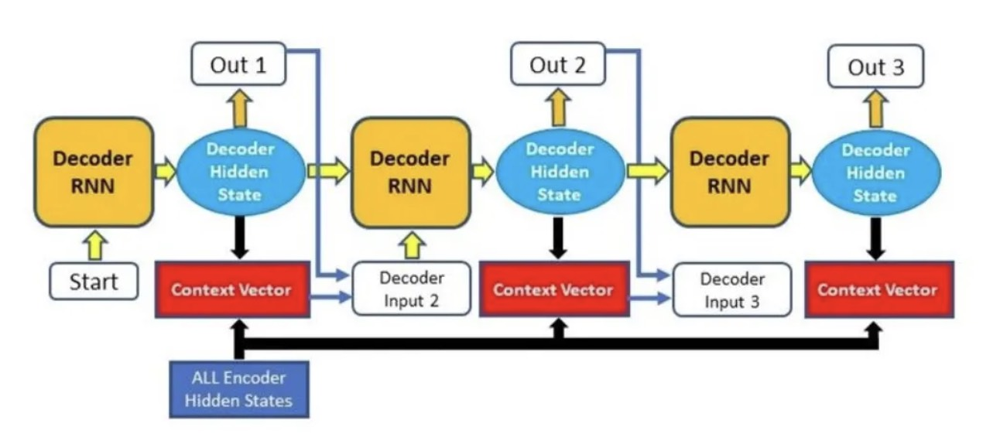
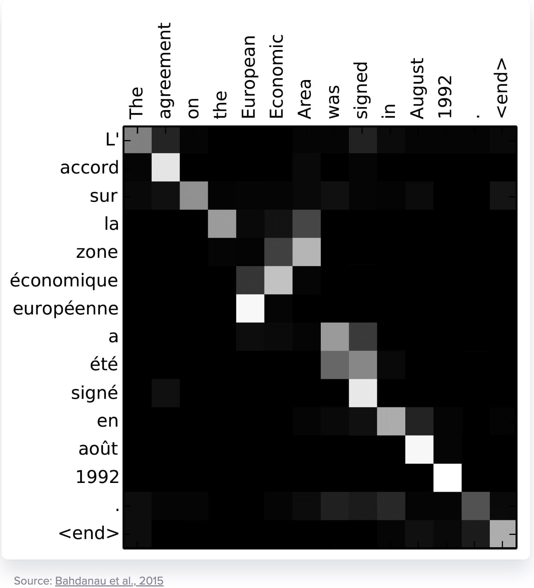
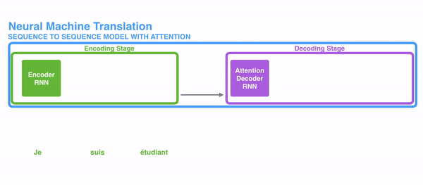
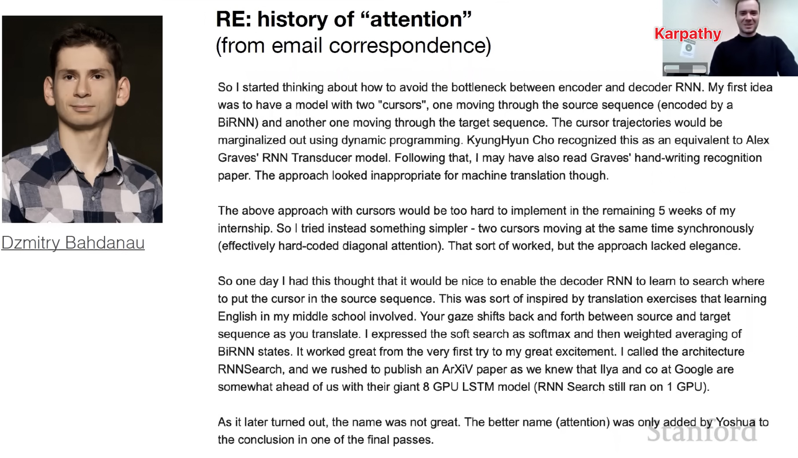

# Bahdanau Attention: Additive Alignment

This lecture introduces Bahdanau attention, the additive attention mechanism that lets an RNN decoder dynamically access encoder states.

---

## 1. From Alignment Problem to Learnable Alignment

The fixed-context seq2seq model compresses the input into:

$$
c = h_T
$$

Bahdanau attention keeps all encoder states:

$$
H =
\left[h_1, h_2, \ldots, h_T\right]
$$

At each decoder step $t$, it computes a different context vector:

$$
c_t =
\sum_{i=1}^{T}
\alpha_{t,i} h_i
$$

The weights $\alpha_{t,i}$ are learned alignment weights.

---

## 2. Notation

We use:

* $h_i \in \mathbb{R}^{1 \times d_h}$ for encoder state at source position $i$;
* $s_t \in \mathbb{R}^{1 \times d_s}$ for decoder state at target position $t$;
* $c_t \in \mathbb{R}^{1 \times d_h}$ for the attention context;
* $\alpha_{t,i}$ for attention from target position $t$ to source position $i$.

Bahdanau attention often computes alignment before updating the decoder state, so it commonly scores $s_{t-1}$ against $h_i$.

---

## 3. Key Idea

At decoder step $t$, ask:

> Which encoder states are relevant before producing the next decoder state?

The decoder state $s_{t-1}$ represents what has already been generated. Each encoder state $h_i$ represents one source position.

Bahdanau attention computes a score:

$$
e_{t,i}
=
\operatorname{score}\left(s_{t-1}, h_i\right)
$$

then normalizes scores over all encoder positions.

---

## 4. Additive Score Function

Bahdanau attention uses a small neural network:

$$
\boxed{
e_{t,i}
=
v_a^\top
\tanh\left(
W_s s_{t-1}^\top
+ W_h h_i^\top
+ b_a
\right)
}
$$

where:

* $W_s$ projects the decoder state;
* $W_h$ projects the encoder state;
* $b_a$ is a bias;
* $v_a$ projects the hidden comparison vector to a scalar score.

It is called additive attention because the projected decoder and encoder representations are added before the nonlinear scoring step.

> [!INFO]
> This formula uses column-vector multiplication inside the scoring network for clarity. The rest of the series keeps row-vector notation for sequence states. The important convention is that $e_{t,i}$ is a scalar score.

---

## 5. Softmax Over Source Positions

The raw scores become normalized attention weights:

$$
\alpha_{t,i}
=
\frac{
\exp\left(e_{t,i}\right)
}{
\sum_{j=1}^{T}
\exp\left(e_{t,j}\right)
}
$$

For each decoder step $t$:

$$
\sum_{i=1}^{T}
\alpha_{t,i}
=
1
$$

and:

$$
\alpha_{t,i} \geq 0
$$

The softmax is taken over source positions $i$.

---

## 6. Context Vector

The context vector is a weighted sum of encoder states:

$$
\boxed{
c_t =
\sum_{i=1}^{T}
\alpha_{t,i} h_i
}
$$

Interpretation:

* $c_t$ is a dynamic summary of the input;
* each decoder step gets its own $c_t$;
* attention replaces one fixed context with many step-specific contexts.

---

## 7. Decoder with Attention

The decoder update becomes:

$$
s_t =
f_{\text{dec}}\left(
e\left(y_{t-1}\right),
s_{t-1},
c_t
\right)
$$

Then the output logits are:

$$
o_t =
g\left(s_t, c_t\right)
$$

and:

$$
P_{\theta}\left(y_t \mid y_{<t}, x_{1:T}\right)
=
\operatorname{softmax}\left(o_t\right)
$$

During training, $y_{t-1}$ is usually the ground-truth previous token. During inference, it is the previous generated token.

---

## 8. Soft Alignment Interpretation

The attention matrix:

$$
A =
\left[\alpha_{t,i}\right]
$$

has:

* one row per target position $t$;
* one column per source position $i$.

Large $\alpha_{t,i}$ means target step $t$ attends strongly to source position $i$.

This gives a differentiable alignment map.

---

## 9. Why Additive Attention Works

Additive attention is flexible because it learns a nonlinear compatibility function:

$$
\operatorname{score}\left(s_{t-1}, h_i\right)
$$

The decoder state and encoder state do not need to already live in the same similarity space. The scoring network learns how to compare them.

This is useful when:

* encoder and decoder dimensions differ;
* the relationship between source and target states is nonlinear;
* data size is moderate and a learned scoring function helps.

---

## 10. Historical Role

Bahdanau attention was a turning point in neural machine translation because it replaced a fixed bottleneck with learned alignment.

The central change was:

$$
\hat{y}_t \leftarrow h_T
$$

became:

$$
\hat{y}_t
\leftarrow
\sum_{i=1}^{T}
\alpha_{t,i} h_i
$$

---

## 11. Summary

Bahdanau attention computes:

$$
e_{t,i}
=
\operatorname{score}\left(s_{t-1}, h_i\right)
$$

$$
\alpha_{t,i}
=
\operatorname{softmax}_i\left(e_{t,i}\right)
$$

$$
c_t =
\sum_{i=1}^{T}
\alpha_{t,i} h_i
$$

It makes seq2seq models better by giving the decoder dynamic access to encoder memory.
