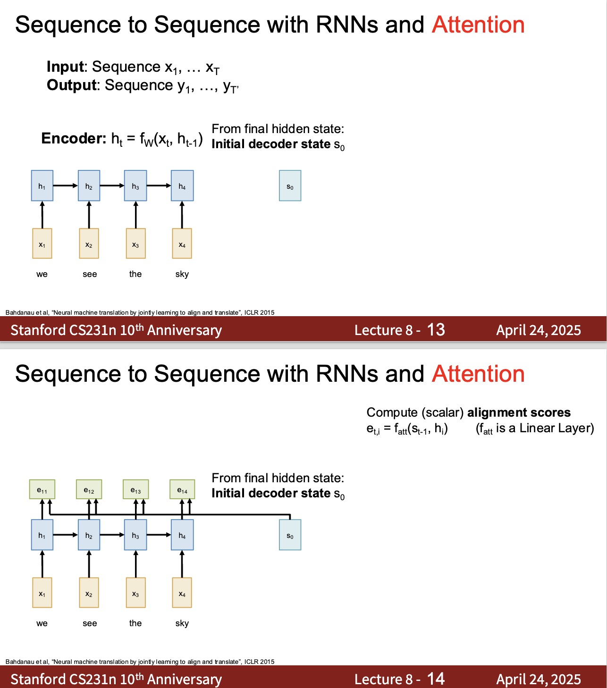
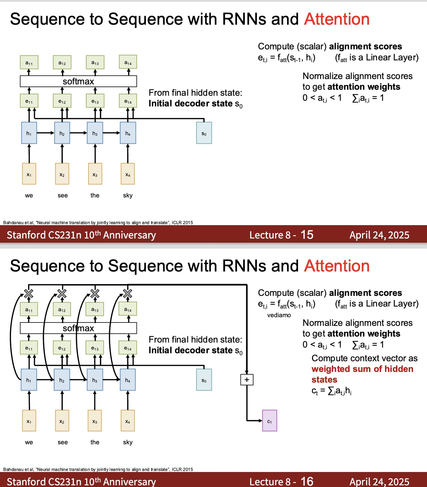
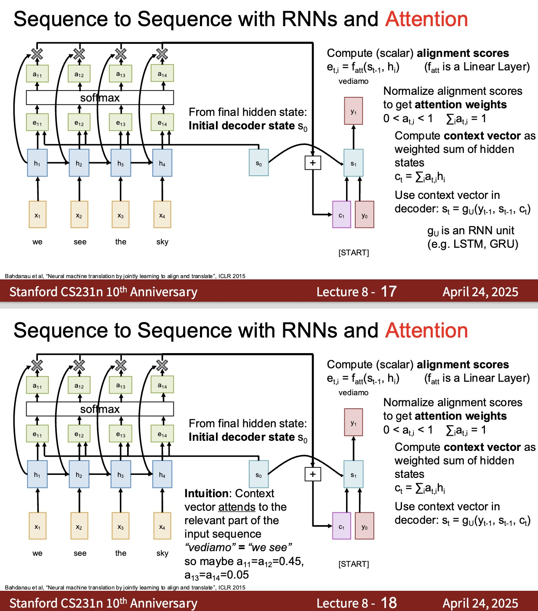
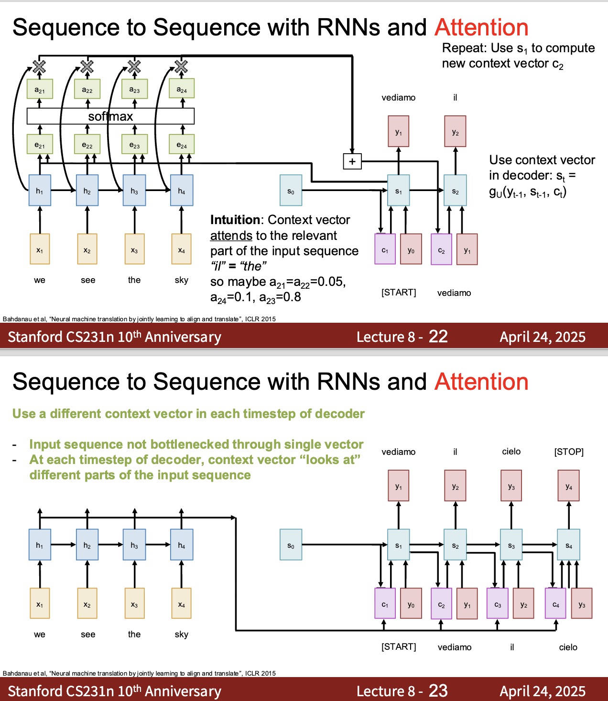
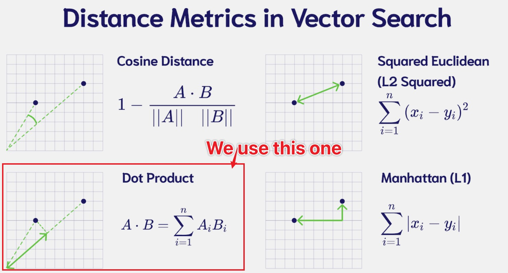

# Luong Attention: Multiplicative Alignment

This lecture introduces Luong attention, a multiplicative attention mechanism that replaces the additive scoring network with vector similarity.

---

## 1. Recap: Seq2Seq Attention

Attention computes a context vector at each decoder step:

$$
c_t =
\sum_{i=1}^{T}
\alpha_{t,i} h_i
$$

The attention weights come from scores:

$$
e_{t,i}
=
\operatorname{score}\left(\text{decoder state}, h_i\right)
$$

Bahdanau attention uses an additive neural scoring function. Luong attention uses multiplicative similarity.

---

## 2. Computation Order

Bahdanau attention often computes context before the decoder update:

$$
\operatorname{score}\left(s_{t-1}, h_i\right)
$$

Luong attention often computes the decoder state first:

$$
s_t =
f_{\text{dec}}\left(e\left(y_{t-1}\right), s_{t-1}\right)
$$

then scores:

$$
\operatorname{score}\left(s_t, h_i\right)
$$

> [!INFO]
> The difference between $s_{t-1}$ and $s_t$ is mainly a computation-order choice. The larger conceptual difference is additive scoring versus multiplicative scoring.

---

## 3. Dot-Product Attention

The simplest Luong score is dot product:

$$
e_{t,i}
=
s_t h_i^\top
$$

This assumes $s_t$ and $h_i$ live in the same vector space and have the same dimension.

The attention weights are:

$$
\alpha_{t,i}
=
\operatorname{softmax}_i\left(e_{t,i}\right)
$$

The context is:

$$
c_t =
\sum_{i=1}^{T}
\alpha_{t,i} h_i
$$

---

## 4. General Multiplicative Attention

If decoder and encoder states need a learned compatibility transform, Luong attention can use:

$$
e_{t,i}
=
s_t W_a h_i^\top
$$

where:

$$
W_a \in \mathbb{R}^{d_s \times d_h}
$$

This form is still multiplicative, but it learns how to compare decoder and encoder states.

---

## 5. Concat Variant

Luong-style attention also includes a concat scoring variant:

$$
e_{t,i}
=
v_a^\top
\tanh\left(
W_a
\operatorname{Concat}\left(s_t, h_i\right)^\top
\right)
$$

This is closer to additive attention and is less important for the Transformer path.

The most important historical bridge is dot-product attention.

---

## 6. Output with Context

Once $c_t$ is computed, the decoder combines context and state:

$$
\tilde{s}_t =
\tanh\left(
\operatorname{Concat}\left(s_t, c_t\right) W_c
+ b_c
\right)
$$

Then output logits are:

$$
o_t =
\tilde{s}_t W_o + b_o
$$

The distribution is:

$$
P_{\theta}\left(y_t \mid y_{<t}, x_{1:T}\right)
=
\operatorname{softmax}\left(o_t\right)
$$

---

## 7. Bahdanau Versus Luong

| Aspect | Bahdanau Attention | Luong Attention |
| --- | --- | --- |
| Score type | Additive neural score | Multiplicative similarity |
| Common query | $s_{t-1}$ | $s_t$ |
| Extra parameters | $W_s$, $W_h$, $v_a$ | none for dot product, $W_a$ for general |
| Speed | More expensive | Usually cheaper |
| Transformer bridge | Indirect | Direct through dot product |

Both compute:

$$
c_t =
\sum_i
\alpha_{t,i} h_i
$$

The difference is the score function.

---

## 8. Why Multiplicative Attention Matters

Dot-product attention is efficient because all scores can be computed with matrix multiplication.

For one decoder state $s_t$ and encoder matrix:

$$
H =
\begin{bmatrix}
h_1 \\
h_2 \\
\vdots \\
h_T
\end{bmatrix}
$$

the scores are:

$$
e_t = s_t H^\top
$$

This is the same computational pattern that later becomes:

$$
QK^\top
$$

in Transformers.

---

## 9. Practical Trade-Offs

Multiplicative attention works well when:

* states are already comparable in the same vector space;
* speed matters;
* batch matrix multiplication is important;
* large models can learn good projections.

Additive attention may be useful when:

* dimensions differ;
* the comparison needs a nonlinear scoring function;
* model size is small or moderate.

---

## 10. Summary

Luong attention keeps the same attention structure:

$$
\alpha_{t,i}
=
\operatorname{softmax}_i
\left(
\operatorname{score}\left(s_t, h_i\right)
\right)
$$

$$
c_t =
\sum_{i=1}^{T}
\alpha_{t,i} h_i
$$

but uses multiplicative scores such as:

$$
\boxed{
e_{t,i} = s_t h_i^\top
}
$$

This leads directly toward scaled dot-product attention.
