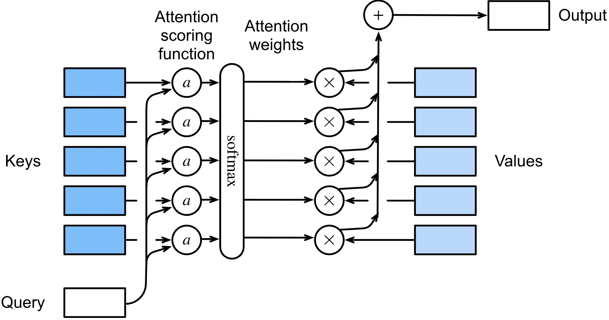
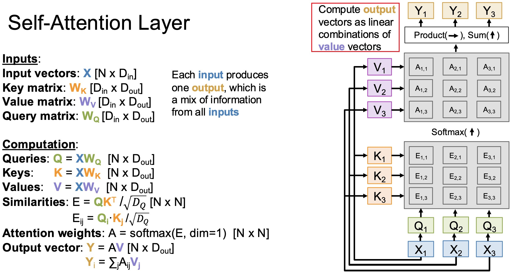
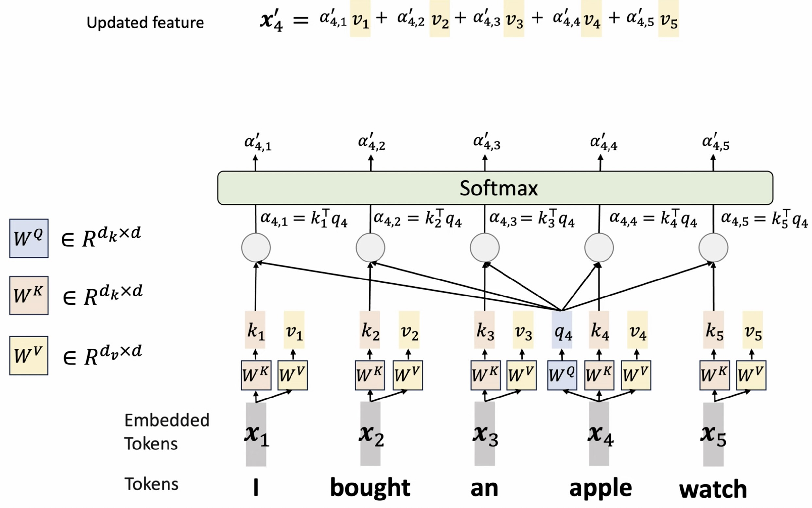
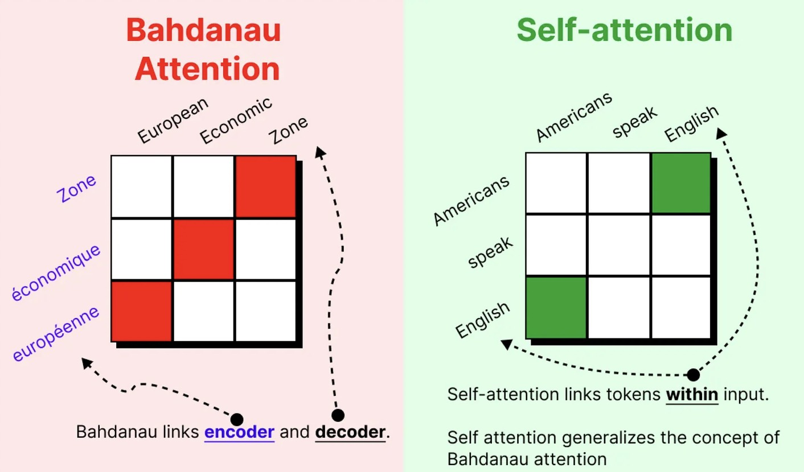
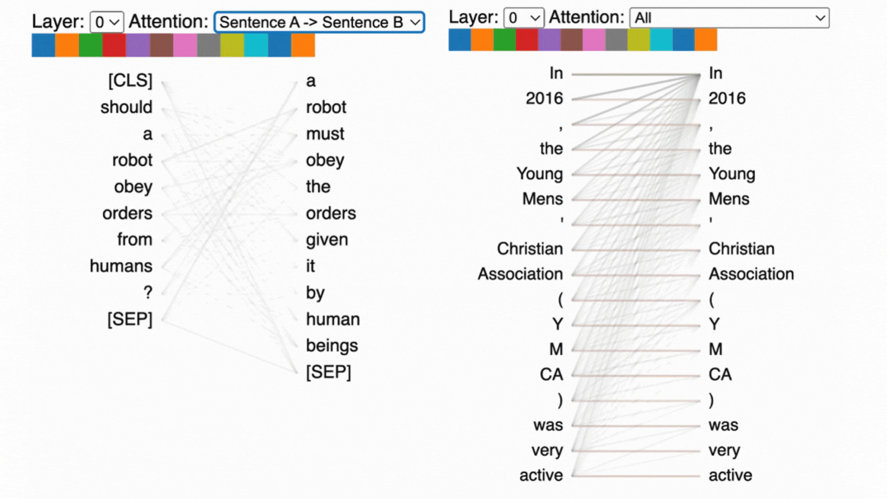
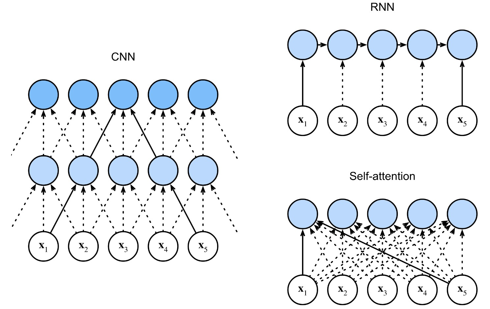

# From Attention to Self-Attention

This lecture explains how encoder-decoder attention becomes self-attention. The key shift is that a sequence can attend to itself, not only to a separate encoder memory.

---

## 1. Recap: Cross-Attention

Classical seq2seq attention uses:

* a decoder state as the query;
* encoder states as keys and values;
* a context vector as the weighted sum.

In compact form:

$$
c_t =
\sum_{i=1}^{T}
\alpha_{t,i} h_i
$$

where:

$$
\alpha_{t,i}
=
\operatorname{softmax}_i
\left(
\operatorname{score}\left(s_t, h_i\right)
\right)
$$

This is cross-attention because the query comes from one sequence and the memory comes from another sequence.

---

## 2. Removing the Encoder-Decoder Split

Attention is not limited to translation-style encoder-decoder models.

Given one sequence:

$$
x_{1:T}
=
\left(x_1, x_2, \ldots, x_T\right)
$$

we can let every position attend to every position in the same sequence.

This is self-attention.

The question changes from:

> Which source token should this target token read?

to:

> Which tokens in this same sequence should this token use as context?

---

## 3. Query, Key, and Value Roles

In self-attention, each token produces three vectors:

$$
q_i = x_i W_Q
$$

$$
k_i = x_i W_K
$$

$$
v_i = x_i W_V
$$

where:

* $q_i$ is the query for position $i$;
* $k_i$ is the key for position $i$;
* $v_i$ is the value for position $i$.

All three come from the same token representation $x_i$.

---

## 4. Self-Attention Computation

For each query position $i$, score every key position $j$:

$$
e_{i,j}
=
\frac{q_i k_j^\top}{\sqrt{d_k}}
$$

Normalize over all key positions:

$$
\alpha_{i,j}
=
\operatorname{softmax}_j\left(e_{i,j}\right)
$$

Aggregate values:

$$
\boxed{
z_i =
\sum_{j=1}^{T}
\alpha_{i,j} v_j
}
$$

The output $z_i$ is the contextualized representation of position $i$.

---

## 5. Matrix Form

Stack token representations into:

$$
X \in \mathbb{R}^{T \times d_{\text{model}}}
$$

Then:

$$
Q = X W_Q
$$

$$
K = X W_K
$$

$$
V = X W_V
$$

with:

$$
Q, K \in \mathbb{R}^{T \times d_k},
\quad
V \in \mathbb{R}^{T \times d_v}
$$

Self-attention is:

$$
\boxed{
Z =
\operatorname{softmax}\left(
\frac{QK^\top}{\sqrt{d_k}}
\right)V
}
$$

The softmax is applied row-wise, across keys.

---

## 6. Self-Attention Versus Cross-Attention

| Aspect | Cross-Attention | Self-Attention |
| --- | --- | --- |
| Query source | decoder states | same sequence |
| Key source | encoder states | same sequence |
| Value source | encoder states | same sequence |
| Main use | connect two sequences | contextualize one sequence |

Cross-attention:

$$
Q \leftarrow \text{decoder},
\quad
K,V \leftarrow \text{encoder}
$$

Self-attention:

$$
Q,K,V \leftarrow \text{same sequence}
$$

---

## 7. Why Self-Attention Is Powerful

Self-attention gives every token a direct path to every other token:

$$
x_i \leftrightarrow x_j
$$

This has three consequences.

### 7.1 Global Interaction

Each token can use information from the whole sequence in one layer.

### 7.2 Parallel Computation

All $q_i k_j^\top$ scores can be computed together with matrix multiplication.

### 7.3 Dynamic Context

The context for a token depends on token content, not fixed distance or fixed convolution windows.

---

## 8. RNNs Versus Self-Attention

RNNs process sequentially:

$$
h_t =
f_{\theta}\left(x_t, h_{t-1}\right)
$$

Information from $x_1$ reaches $x_T$ through many recurrent steps.

Self-attention computes pairwise interaction directly:

$$
z_i =
\operatorname{Attention}\left(q_i, K, V\right)
$$

This removes the recurrent chain.

> [!WARNING]
> Self-attention does not know token order by itself. Transformers need positional information so the model can distinguish positions.

---

## 9. Summary

Self-attention applies the attention idea inside one sequence.

The central formula is:

$$
\boxed{
Z =
\operatorname{softmax}\left(
\frac{QK^\top}{\sqrt{d_k}}
\right)V
}
$$

This formula is the bridge from RNN attention to Transformer architecture.
