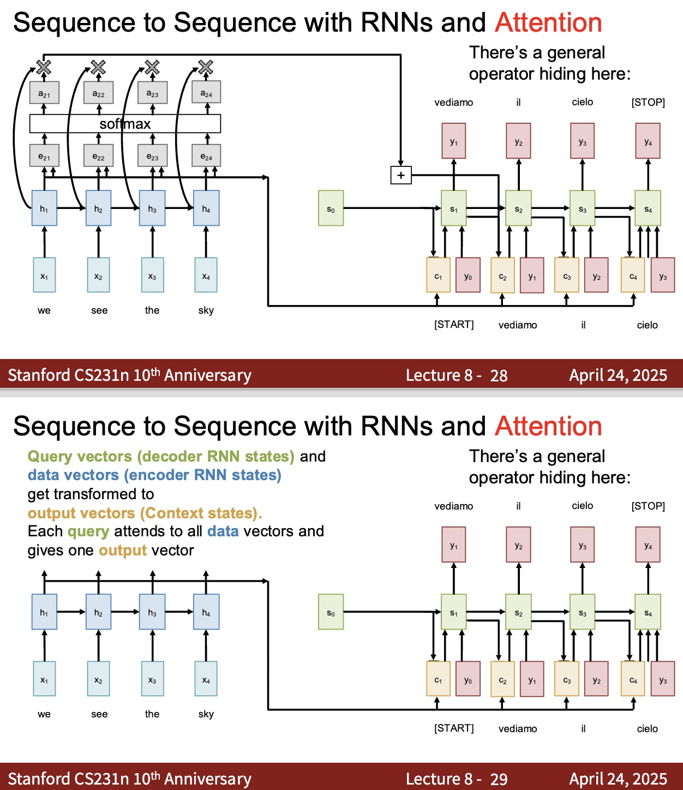
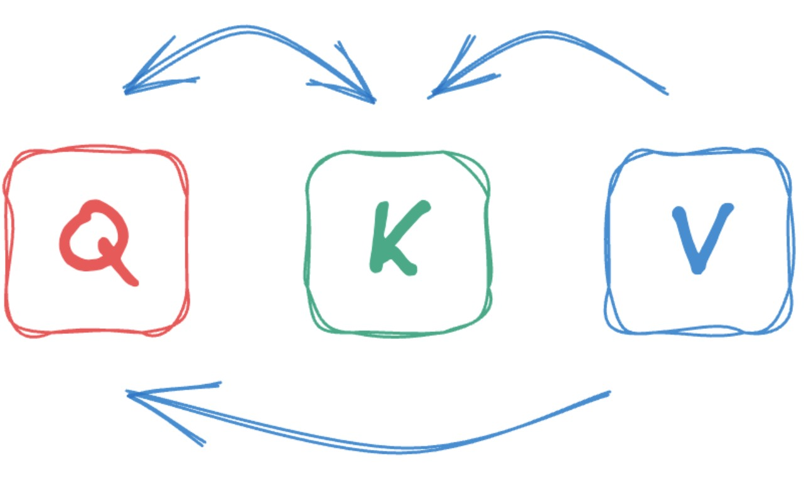

# Attention as a Unified Operator

This lecture abstracts Bahdanau attention, Luong attention, cross-attention, and self-attention into one operator: query-key-value attention.

---

## 1. Why We Need a Unified View

So far, attention has appeared in several forms:

* Bahdanau attention with additive scoring;
* Luong attention with dot-product or general scoring;
* self-attention inside one sequence.

These mechanisms look different, but they share the same structure:

$$
\boxed{\text{score} \rightarrow \text{softmax} \rightarrow \text{weighted sum}}
$$

The unified view makes the roles explicit:

* query: what is asking for information;
* key: what is being matched against;
* value: what content is retrieved.

---

## 2. Single-Query Attention

For one query $q$, keys $k_1, \ldots, k_T$, and values $v_1, \ldots, v_T$, attention computes:

$$
e_j =
\operatorname{score}\left(q, k_j\right)
$$

$$
\alpha_j =
\operatorname{softmax}_j\left(e_j\right)
$$

$$
\boxed{
\operatorname{Attention}\left(q, K, V\right)
=
\sum_{j=1}^{T}
\alpha_j v_j
}
$$

The output is a weighted aggregation of values. The weights are determined by query-key compatibility.

---

## 3. Query, Key, and Value Interpretation

The names are not decorative. They describe the computation.

### 3.1 Query

The query is the vector asking:

> What information do I need?

In seq2seq attention, the query is a decoder state such as $s_t$.

### 3.2 Key

Each key is used for matching:

> Is this memory position relevant to the query?

In seq2seq attention, keys are derived from encoder states $h_i$.

### 3.3 Value

Each value is the content retrieved if the key is relevant.

In many classical attention models:

$$
v_i = h_i
$$

Transformers often learn separate value projections.

---

## 4. Score Function Variants

Attention mechanisms differ mostly in the score function.

### 4.1 Bahdanau Additive Score

Bahdanau attention uses a learned nonlinear score:

$$
e_{t,i}
=
v_a^\top
\tanh\left(
W_s s_{t-1}^\top
+ W_h h_i^\top
+ b_a
\right)
$$

The query is the decoder state and the key is the encoder state.

### 4.2 Luong Dot-Product Score

Luong dot-product attention uses:

$$
e_{t,i}
=
s_t h_i^\top
$$

This is faster and leads directly to Transformer attention.

### 4.3 Luong General Score

Luong general attention uses a learned matrix:

$$
e_{t,i}
=
s_t W_a h_i^\top
$$

This lets the model learn a comparison space.

### 4.4 Transformer Scaled Dot Product

Transformer attention uses:

$$
e_{i,j}
=
\frac{q_i k_j^\top}{\sqrt{d_k}}
$$

The scaling factor stabilizes softmax when $d_k$ is large.

---

## 5. QKV Form for Classical Attention

### 5.1 Bahdanau Attention

For Bahdanau attention:

$$
q_t = s_{t-1}
$$

$$
k_i = h_i
$$

$$
v_i = h_i
$$

The score function is additive.

> [!WARNING]
> The vector $v_a$ in Bahdanau scoring is a learnable scoring parameter. It is not the same thing as a value vector $v_i$ in QKV attention.

### 5.2 Luong Attention

For Luong attention:

$$
q_t = s_t
$$

$$
k_i = h_i
$$

$$
v_i = h_i
$$

The score function is multiplicative.

### 5.3 Self-Attention

For self-attention:

$$
q_i = x_i W_Q
$$

$$
k_i = x_i W_K
$$

$$
v_i = x_i W_V
$$

All roles come from the same sequence.

---

## 6. Matrix Attention

Single-query attention is useful conceptually, but modern models process many queries at once.

Let:

$$
Q \in \mathbb{R}^{T_q \times d_k}
$$

$$
K \in \mathbb{R}^{T_k \times d_k}
$$

$$
V \in \mathbb{R}^{T_k \times d_v}
$$

The score matrix is:

$$
S =
\frac{QK^\top}{\sqrt{d_k}}
$$

where:

$$
S \in \mathbb{R}^{T_q \times T_k}
$$

The attention weights are:

$$
A =
\operatorname{softmax}_{\text{row}}\left(S\right)
$$

The output is:

$$
\boxed{
Z =
A V
=
\operatorname{softmax}_{\text{row}}\left(
\frac{QK^\top}{\sqrt{d_k}}
\right)V
}
$$

where:

$$
Z \in \mathbb{R}^{T_q \times d_v}
$$

---

## 7. Why the Matrix Form Matters

The matrix form makes attention:

* parallel over all query positions;
* efficient on GPUs;
* modular across self-attention and cross-attention;
* easy to extend to multiple heads.

It also exposes the main memory cost:

$$
A \in \mathbb{R}^{T_q \times T_k}
$$

For long sequences, this attention matrix can be large.

---

## 8. Attention as Differentiable Retrieval

Attention can be understood as differentiable memory retrieval.

The model:

1. compares a query to all keys;
2. produces a probability distribution over memory locations;
3. returns a weighted sum of values.

Because every step is differentiable, training can learn:

* query projections;
* key projections;
* value projections;
* score parameters;
* downstream output layers.

---

## 9. Summary

All attention mechanisms in this mini-series fit the same template:

$$
\boxed{
\operatorname{Attention}\left(Q, K, V\right)
=
\operatorname{softmax}_{\text{row}}\left(
\operatorname{score}\left(Q, K\right)
\right)V
}
$$

Transformers specialize this to scaled dot-product attention:

$$
\boxed{
\operatorname{Attention}\left(Q, K, V\right)
=
\operatorname{softmax}_{\text{row}}\left(
\frac{QK^\top}{\sqrt{d_k}}
\right)V
}
$$

The next lecture uses this operator to build Transformer layers.
