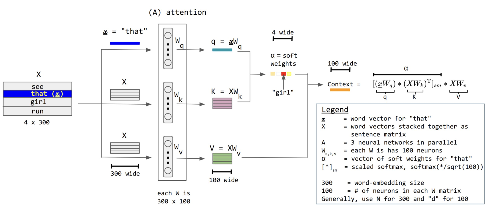
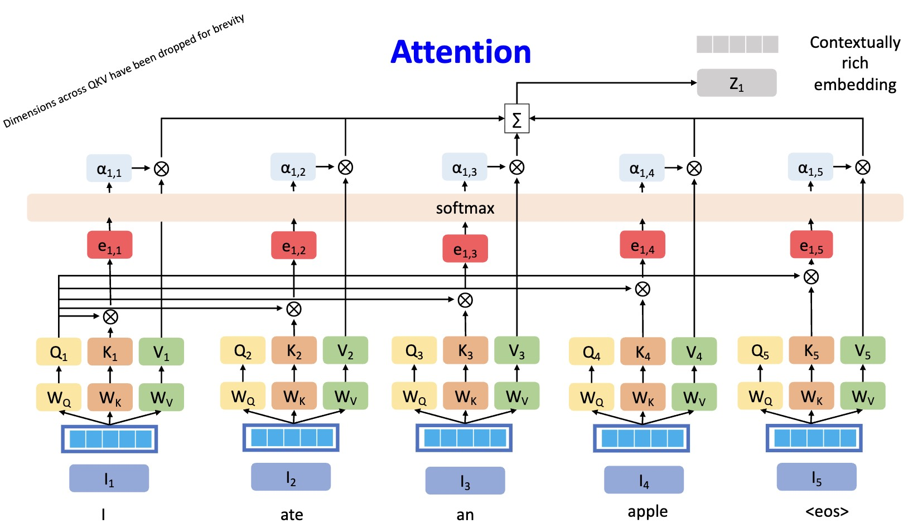
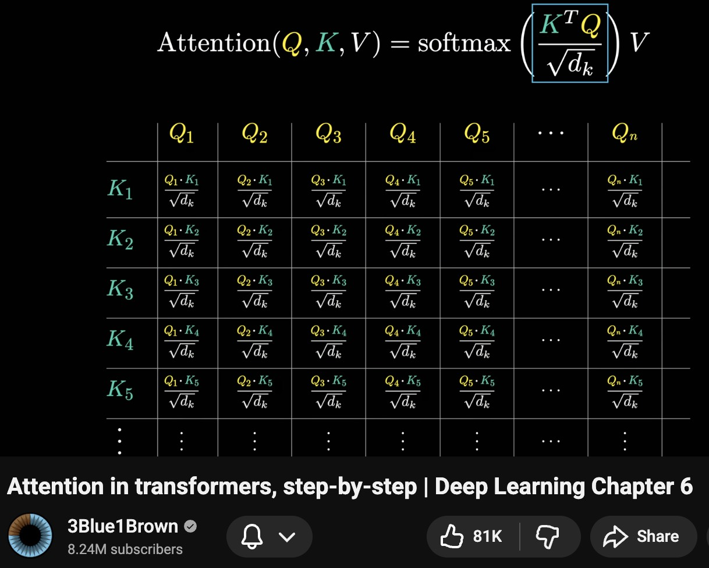
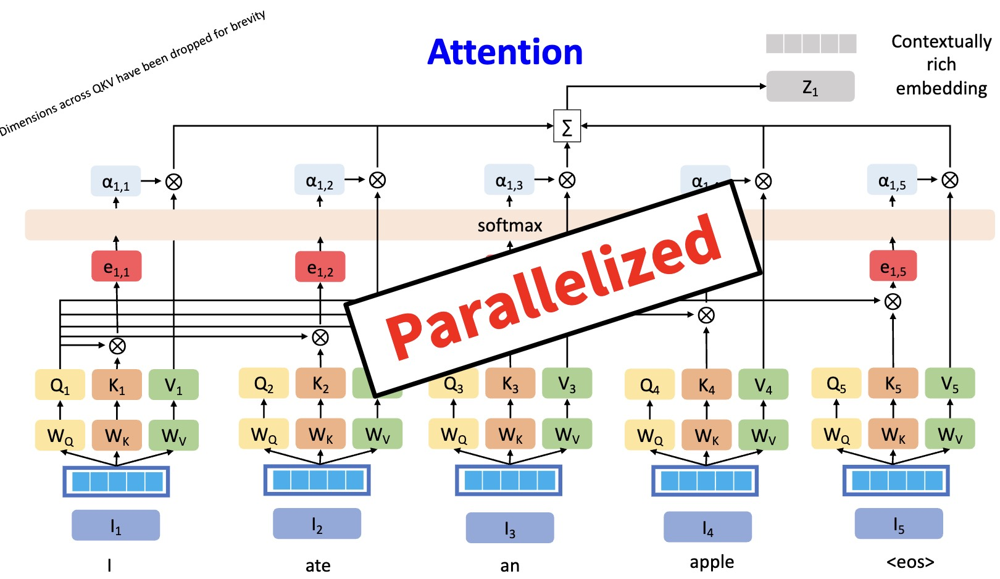

# Transformer Attention: From Operator to Architecture

This lecture shows how scaled dot-product self-attention becomes the core layer of the Transformer.

---

## 1. From Attention Operator to Transformer

The unified attention operator is:

$$
\operatorname{Attention}\left(Q, K, V\right)
=
\operatorname{softmax}_{\text{row}}\left(
\frac{QK^\top}{\sqrt{d_k}}
\right)V
$$

The Transformer asks:

> Can we build a sequence model primarily from attention, without recurrence?

The answer is yes. Transformer layers replace recurrent state transitions with self-attention and position-wise feed-forward networks.

---

## 2. Input Representation

Given token embeddings:

$$
X \in \mathbb{R}^{T \times d_{\text{model}}}
$$

self-attention constructs:

$$
Q = X W_Q
$$

$$
K = X W_K
$$

$$
V = X W_V
$$

where:

$$
W_Q, W_K \in \mathbb{R}^{d_{\text{model}} \times d_k}
$$

and:

$$
W_V \in \mathbb{R}^{d_{\text{model}} \times d_v}
$$

---

## 3. Scaled Dot-Product Self-Attention

The self-attention output is:

$$
\boxed{
Z =
\operatorname{softmax}_{\text{row}}\left(
\frac{QK^\top}{\sqrt{d_k}}
\right)V
}
$$

For position $i$:

$$
z_i =
\sum_{j=1}^{T}
\alpha_{i,j} v_j
$$

where:

$$
\alpha_{i,j}
=
\operatorname{softmax}_j
\left(
\frac{q_i k_j^\top}{\sqrt{d_k}}
\right)
$$

Each token representation becomes context-dependent.

---

## 4. Why Scaling Is Needed

If $q_i$ and $k_j$ have dimension $d_k$, their dot product can grow in magnitude as $d_k$ increases.

Large scores make softmax too sharp:

$$
\operatorname{softmax}\left(S\right)
\approx
\text{one-hot distribution}
$$

When this happens, gradients become less useful.

Scaling by:

$$
\frac{1}{\sqrt{d_k}}
$$

keeps scores in a more stable range.

---

## 5. Multi-Head Attention

A single attention head computes one kind of relation. Multi-head attention lets the model learn several relation types in parallel.

For head $m$:

$$
Q_m = X W_Q^{(m)}
$$

$$
K_m = X W_K^{(m)}
$$

$$
V_m = X W_V^{(m)}
$$

Then:

$$
Z_m =
\operatorname{Attention}\left(Q_m, K_m, V_m\right)
$$

Heads are concatenated and projected:

$$
\boxed{
\operatorname{MHA}\left(X\right)
=
\operatorname{Concat}\left(Z_1, \ldots, Z_M\right)W_O
}
$$

where $M$ is the number of heads.

---

## 6. Position-Wise Feed-Forward Network

After attention mixes information across positions, a feed-forward network transforms each position independently:

$$
\operatorname{FFN}\left(x\right)
=
\phi\left(x W_1 + b_1\right)W_2 + b_2
$$

The same FFN is applied to every position:

$$
u_i =
\operatorname{FFN}\left(z_i\right)
$$

Attention mixes tokens. The FFN transforms features.

---

## 7. Residual Connections and Normalization

A Transformer layer uses residual connections:

$$
\tilde{X}
=
X + \operatorname{MHA}\left(\operatorname{Norm}\left(X\right)\right)
$$

Then:

$$
Y =
\tilde{X}
+ \operatorname{FFN}\left(\operatorname{Norm}\left(\tilde{X}\right)\right)
$$

This is a pre-norm form.

Residual connections improve gradient flow, while normalization stabilizes activations.

> [!INFO]
> Different implementations use pre-norm or post-norm ordering. The core components remain attention, feed-forward layers, residual paths, and normalization.

---

## 8. Removing Recurrence

RNNs compute:

$$
h_t =
f_{\theta}\left(x_t, h_{t-1}\right)
$$

This is inherently sequential.

Transformers compute:

$$
Z =
\operatorname{Attention}\left(Q, K, V\right)
$$

for all positions in parallel.

This enables efficient training on GPUs and makes long-range interactions shorter.

---

## 9. Information Flow

In an RNN, information from token $i$ reaches token $j$ through a chain of hidden states.

In self-attention, token $i$ can directly attend to token $j$ in one layer:

$$
x_i \rightarrow \alpha_{i,j} v_j
$$

Stacked layers then build increasingly rich interactions.

---

## 10. Positional Information

Self-attention alone is permutation-equivariant. If we shuffle tokens and apply the same shuffle to outputs, the attention operation itself does not know the original order.

Therefore Transformers add positional information:

$$
X =
E_{\text{token}} + E_{\text{pos}}
$$

where:

* $E_{\text{token}}$ contains token embeddings;
* $E_{\text{pos}}$ contains positional embeddings or encodings.

> [!WARNING]
> Without positional information, a Transformer cannot distinguish "dog bites man" from "man bites dog" based on order alone.

---

## 11. Summary

A Transformer layer combines:

* multi-head self-attention for token mixing;
* feed-forward networks for feature transformation;
* residual connections for gradient flow;
* normalization for stability;
* positional information for order.

The central computation remains:

$$
\boxed{
\operatorname{Attention}\left(Q, K, V\right)
=
\operatorname{softmax}_{\text{row}}\left(
\frac{QK^\top}{\sqrt{d_k}}
\right)V
}
$$
