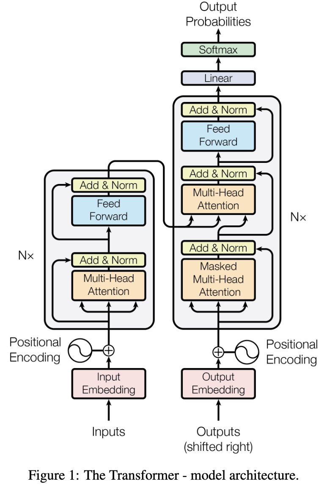

# Transformer Cross-Attention

This lecture explains how Transformers connect an input sequence and an output sequence using cross-attention.

---

## 1. Why Cross-Attention Exists

Self-attention contextualizes one sequence.

Seq2seq tasks require two sequences:

* a source sequence $x_{1:T}$;
* a target sequence $y_{1:T'}$.

The decoder must generate target tokens while reading source information. Cross-attention is the Transformer version of seq2seq attention.

---

## 2. Classical Attention Revisited

Classical RNN attention computed:

$$
c_t =
\sum_{i=1}^{T}
\alpha_{t,i} h_i
$$

where:

* the query came from decoder state $s_t$;
* the keys and values came from encoder states $h_i$.

Transformer cross-attention keeps this idea but vectorizes it.

---

## 3. Encoder and Decoder Representations

Let the encoder output be:

$$
X_{\text{enc}}
\in
\mathbb{R}^{T \times d_{\text{model}}}
$$

Let the decoder representation be:

$$
Y_{\text{dec}}
\in
\mathbb{R}^{T' \times d_{\text{model}}}
$$

Cross-attention constructs:

$$
Q = Y_{\text{dec}} W_Q
$$

$$
K = X_{\text{enc}} W_K
$$

$$
V = X_{\text{enc}} W_V
$$

Queries come from the decoder. Keys and values come from the encoder.

---

## 4. Cross-Attention Formula

The cross-attention output is:

$$
\boxed{
Z =
\operatorname{softmax}_{\text{row}}\left(
\frac{QK^\top}{\sqrt{d_k}}
\right)V
}
$$

The attention matrix has shape:

$$
A \in \mathbb{R}^{T' \times T}
$$

Each row corresponds to one decoder position. Each column corresponds to one encoder position.

---

## 5. Per-Token View

For target position $t$:

$$
z_t =
\sum_{i=1}^{T}
\alpha_{t,i} v_i
$$

where:

$$
\alpha_{t,i}
=
\operatorname{softmax}_i
\left(
\frac{q_t k_i^\top}{\sqrt{d_k}}
\right)
$$

Interpretation:

> target token $t$ retrieves a weighted summary of source-token information.

---

## 6. Transformer Decoder Layer

A Transformer decoder layer usually has three sub-blocks.

### 6.1 Masked Self-Attention

The decoder first models relationships among already available target positions:

$$
U =
\operatorname{MaskedSelfAttention}\left(Y_{\text{dec}}\right)
$$

The mask prevents future target tokens from being visible.

### 6.2 Cross-Attention

The decoder then reads from the encoder:

$$
Z =
\operatorname{CrossAttention}\left(U, X_{\text{enc}}\right)
$$

This is where source-target interaction happens.

### 6.3 Feed-Forward Network

Finally, each position is transformed:

$$
Y_{\text{out}}
=
\operatorname{FFN}\left(Z\right)
$$

In practice, each sub-block also has residual connections and normalization.

---

## 7. Comparison with Classical Attention

| Aspect | RNN Seq2Seq Attention | Transformer Cross-Attention |
| --- | --- | --- |
| Query | decoder state $s_t$ | decoder representation $q_t$ |
| Keys | encoder states $h_i$ | encoder projections $k_i$ |
| Values | encoder states $h_i$ | encoder projections $v_i$ |
| Computation | step by step | parallel during training |
| Score | additive or multiplicative | scaled dot product |

The conceptual role is the same: connect the output sequence to the input sequence.

---

## 8. Alignment Revisited

The cross-attention matrix:

$$
A =
\left[\alpha_{t,i}\right]
$$

can be interpreted as soft alignment between target and source positions.

For translation:

* row $t$ shows what source tokens the target token attends to;
* column $i$ shows how often source token $i$ is used by target positions.

> [!INFO]
> Attention weights can be informative, but they are not always a perfect human-interpretable explanation. They are model-internal routing weights.

---

## 9. Why Cross-Attention Is Necessary

A decoder-only self-attention block can model target history, but it has no direct source sequence to read.

An encoder-decoder Transformer needs cross-attention so:

$$
y_t
$$

can depend on:

$$
x_{1:T}
$$

at every generation step.

This gives the model dynamic conditioning on the input sequence.

---

## 10. Self-Attention and Cross-Attention in QKV Form

Self-attention:

$$
Q = X W_Q,
\quad
K = X W_K,
\quad
V = X W_V
$$

Cross-attention:

$$
Q = Y W_Q,
\quad
K = X W_K,
\quad
V = X W_V
$$

The same operator is used. Only the source of $Q$, $K$, and $V$ changes.

---

## 11. Summary

Transformer cross-attention is the vectorized successor of RNN seq2seq attention.

It computes:

$$
\boxed{
\operatorname{CrossAttention}\left(Y, X\right)
=
\operatorname{softmax}_{\text{row}}\left(
\frac{\left(YW_Q\right)\left(XW_K\right)^\top}{\sqrt{d_k}}
\right)
\left(XW_V\right)
}
$$

This lets each target position retrieve source information dynamically.
