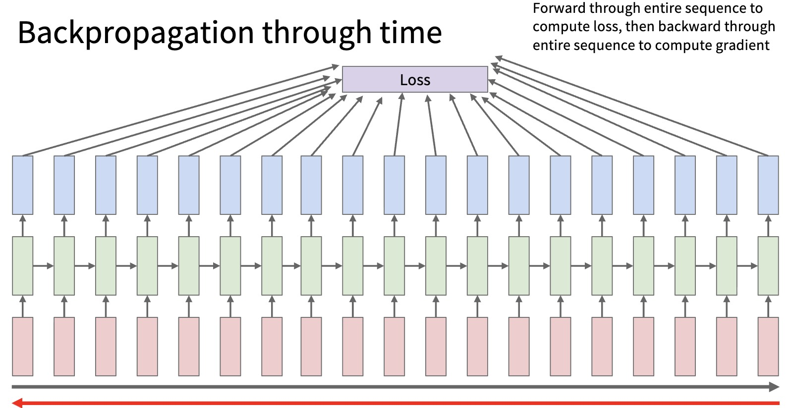
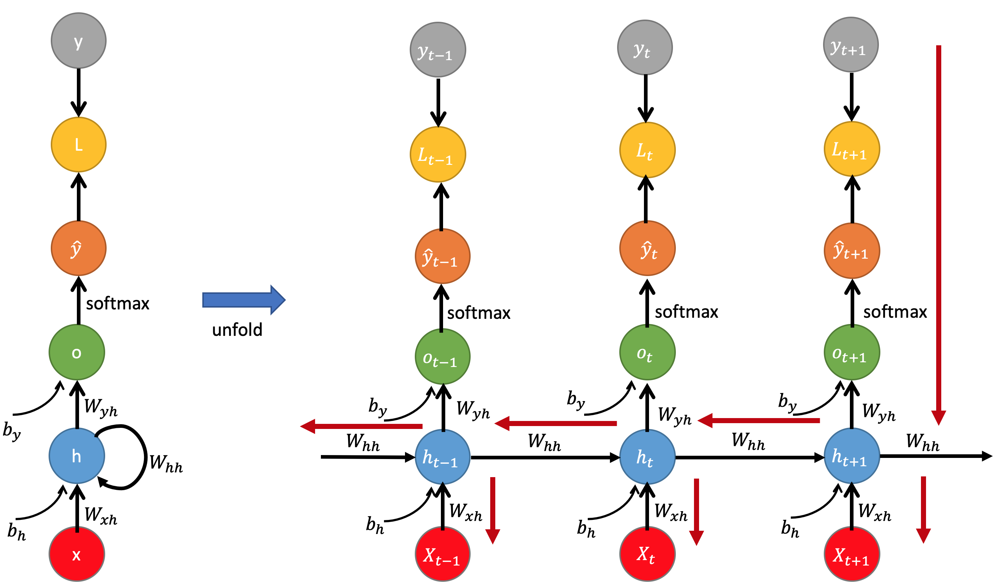

# RNN Training: Backpropagation Through Time

This lecture explains how recurrent networks are trained. The key idea is to unroll the recurrence over time and apply backpropagation through the unrolled graph.

---

## 1. Forward Computation

An RNN computes hidden states:

$$
h_t =
f_{\theta}\left(x_t, h_{t-1}\right)
$$

and optionally outputs:

$$
o_t =
g_{\phi}\left(h_t\right)
$$

The parameters $\theta$ and $\phi$ are shared across time.

Training asks:

> How should one set of recurrent parameters get credit or blame for many time steps?

---

## 2. Sequence Loss



For many-to-many prediction:

$$
\mathcal{L}
=
\sum_{t=1}^{T}
\ell\left(o_t, y_t\right)
$$

For many-to-one prediction:

$$
\mathcal{L}
=
\ell\left(o_T, y\right)
$$

Both cases require gradients through the recurrent chain.

---

## 3. Unrolling the Computation Graph

The recursive definition:

$$
h_t =
f_{\theta}\left(x_t, h_{t-1}\right)
$$

can be viewed as an unrolled network:

```text
x_1 -> h_1 -> h_2 -> ... -> h_T
       ^      ^            ^
       |      |            |
      x_1    x_2          x_T
```

This unrolled graph has depth $T$, but every copy shares the same parameters $\theta$.

---

## 4. Backpropagation Through Time



Backpropagation Through Time applies ordinary backpropagation to the unrolled graph.

Gradients flow backward:

$$
\frac{\partial \mathcal{L}}{\partial h_T}
\rightarrow
\frac{\partial \mathcal{L}}{\partial h_{T-1}}
\rightarrow
\cdots
\rightarrow
\frac{\partial \mathcal{L}}{\partial h_1}
$$

Each hidden state affects future states, so its gradient includes future loss contributions.

---

## 5. Parameter Sharing and Gradient Accumulation

For a recurrent parameter $W$, the total gradient sums contributions over time:

$$
\boxed{
\frac{\partial \mathcal{L}}{\partial W}
=
\sum_{t=1}^{T}
\frac{\partial \mathcal{L}}{\partial h_t}
\frac{\partial h_t}{\partial W}
}
$$

This reflects parameter sharing:

* the same $W$ is used at every time step;
* every time step contributes to the update of $W$.

---

## 6. Temporal Credit Assignment

The difficult question is:

> Which earlier inputs or states caused a later error?

If a loss at time $T$ depends on information at time $1$, the gradient must travel through:

$$
h_T \rightarrow h_{T-1} \rightarrow \cdots \rightarrow h_1
$$

This is temporal credit assignment.

Long paths make optimization difficult.

---

## 7. Gradient Products

For two hidden states $h_{t-k}$ and $h_t$:

$$
\frac{\partial h_t}{\partial h_{t-k}}
=
\prod_{i=t-k+1}^{t}
\frac{\partial h_i}{\partial h_{i-1}}
$$

This product of Jacobians is the mathematical source of vanishing and exploding gradients.

If the product repeatedly shrinks, gradients vanish. If it repeatedly amplifies, gradients explode.

---

## 8. Vanishing Gradients

If the Jacobian magnitudes are often less than $1$, then:

$$
\left\lVert
\prod_{i=t-k+1}^{t}
\frac{\partial h_i}{\partial h_{i-1}}
\right\rVert
\rightarrow
0
$$

Consequences:

* early time steps receive tiny gradients;
* long-term dependencies are not learned well;
* the model focuses on recent context.

---

## 9. Exploding Gradients

If the Jacobian magnitudes are often greater than $1$, then:

$$
\left\lVert
\prod_{i=t-k+1}^{t}
\frac{\partial h_i}{\partial h_{i-1}}
\right\rVert
\rightarrow
\infty
$$

Consequences:

* parameter updates become unstable;
* loss may become `NaN`;
* training may diverge.

Gradient clipping is a common mitigation:

$$
g \leftarrow
g \cdot
\min\left(
1,
\frac{\tau}{\left\lVert g \right\rVert}
\right)
$$

where $\tau$ is a clipping threshold.

---

## 10. Truncated BPTT

For very long sequences, full BPTT can be expensive.

Truncated BPTT backpropagates through only a fixed window of length $K$:

$$
h_{t-K} \rightarrow \cdots \rightarrow h_t
$$

This reduces memory and computation, but limits how far gradients travel directly.

> [!WARNING]
> Truncated BPTT does not prevent the hidden state from carrying information forward. It limits the gradient path used for learning from distant errors.

---

## 11. Why LSTM and GRU Help

LSTM and GRU add gated paths that can carry information more stably.

LSTM cell update:

$$
c_t =
f_t \odot c_{t-1}
+ i_t \odot \tilde{c}_t
$$

GRU hidden update:

$$
h_t =
\left(1 - z_t\right) \odot h_{t-1}
+ z_t \odot \tilde{h}_t
$$

Both introduce additive paths through time, which are easier for gradients than repeated nonlinear replacement.

---

## 12. Practical Training Checklist

Check:

* Are hidden states detached correctly between independent sequences?
* Are sequence lengths and padding masks handled correctly?
* Is gradient clipping enabled for unstable RNN training?
* Are losses averaged consistently across tokens or sequences?
* Are initial hidden states reset when examples are independent?
* Is truncated BPTT length long enough for the task?

---

## 13. Summary

BPTT trains recurrent networks by unrolling them over time and applying backpropagation.

The central difficulty is:

$$
\frac{\partial h_t}{\partial h_{t-k}}
=
\prod_{i=t-k+1}^{t}
\frac{\partial h_i}{\partial h_{i-1}}
$$

This product explains why vanilla RNNs struggle with long dependencies and why gated cells matter.
