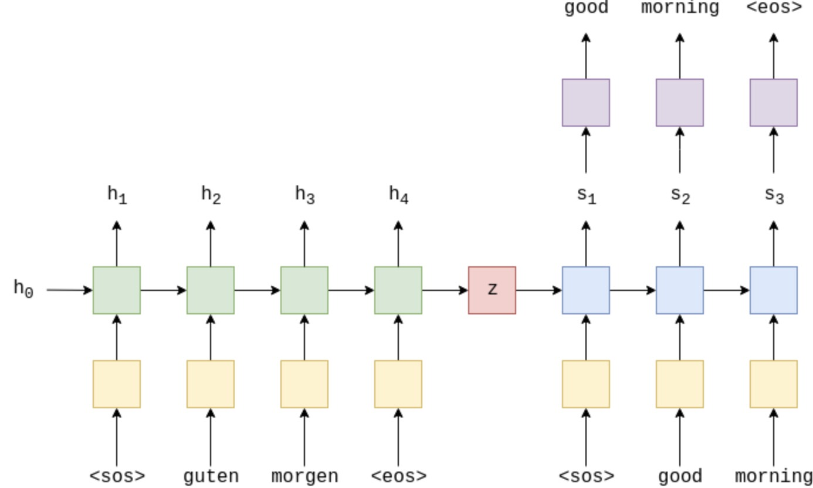
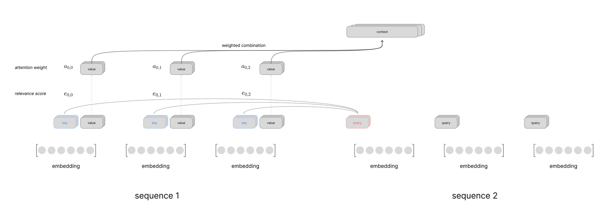

# Sequence-to-Sequence Training with Attention

This lecture explains how encoder-decoder models with attention are trained end to end.

---

## 1. Forward Computation

An attention-based seq2seq model has four main steps.

### 1.1 Encode the Source

For source sequence $x_{1:T}$:

$$
h_i =
f_{\text{enc}}\left(x_i, h_{i-1}\right)
$$

The encoder memory is:

$$
H =
\left[h_1, h_2, \ldots, h_T\right]
$$

### 1.2 Compute Attention

At target step $t$:

$$
e_{t,i}
=
\operatorname{score}\left(s_{t-1}, h_i\right)
$$

$$
\alpha_{t,i}
=
\operatorname{softmax}_i\left(e_{t,i}\right)
$$

$$
c_t =
\sum_{i=1}^{T}
\alpha_{t,i} h_i
$$

### 1.3 Update the Decoder

With teacher forcing:

$$
s_t =
f_{\text{dec}}\left(
e\left(y_{t-1}^{\text{gt}}\right),
s_{t-1},
c_t
\right)
$$

### 1.4 Predict the Target Token

The output logits are:

$$
o_t =
g\left(s_t, c_t\right)
$$

The predicted distribution is:

$$
P_{\theta}\left(y_t \mid y_{<t}^{\text{gt}}, x_{1:T}\right)
=
\operatorname{softmax}\left(o_t\right)
$$

---

## 2. Training Objective

The target sequence is:

$$
y_{1:T'}^{\text{gt}}
$$

The loss is:

$$
\boxed{
\mathcal{L}
=
-
\sum_{t=1}^{T'}
\log
P_{\theta}\left(
y_t^{\text{gt}}
\mid
y_{<t}^{\text{gt}},
x_{1:T}
\right)
}
$$

This is cross-entropy over the target vocabulary at each decoder step.

Padding positions should be masked:

$$
\mathcal{L}
=
-
\sum_{t=1}^{T'}
m_t
\log
P_{\theta}\left(
y_t^{\text{gt}}
\mid
y_{<t}^{\text{gt}},
x_{1:T}
\right)
$$

where $m_t = 1$ for real target tokens and $m_t = 0$ for padding.

---

## 3. Teacher Forcing

Teacher forcing feeds the correct previous token during training:

$$
y_{t-1}^{\text{input}}
=
y_{t-1}^{\text{gt}}
$$

At inference, the model uses:

$$
y_{t-1}^{\text{input}}
=
\hat{y}_{t-1}
$$

Teacher forcing makes training stable because each step receives a correct prefix.

The drawback is exposure bias: inference prefixes may contain model mistakes.

---

## 4. Learnable Components

The model is trained end to end.

### 4.1 Encoder

The encoder parameters include:

* input embeddings;
* recurrent weights;
* recurrent biases.

The encoder receives gradients from all decoder steps through attention.

### 4.2 Decoder

The decoder parameters include:

* target embeddings;
* recurrent weights;
* recurrent biases.

The decoder learns how to generate the target sequence while using context vectors.

### 4.3 Attention Scoring Function

For Bahdanau attention:

$$
e_{t,i}
=
v_a^\top
\tanh\left(
W_s s_{t-1}^\top
+ W_h h_i^\top
+ b_a
\right)
$$

Learnable parameters:

$$
W_s,\quad W_h,\quad b_a,\quad v_a
$$

For Luong general attention:

$$
e_{t,i}
=
s_t W_a h_i^\top
$$

Learnable parameter:

$$
W_a
$$

### 4.4 Output Layer

The output layer maps decoder state and context to vocabulary logits:

$$
o_t =
g\left(s_t, c_t\right)
$$

It is trained by the same token-level cross-entropy loss.

---

## 5. Gradient Flow With Attention

Without attention, the decoder receives source information through one vector:

$$
h_T
$$

With attention, every decoder step connects to every encoder state:

$$
c_t =
\sum_{i=1}^{T}
\alpha_{t,i} h_i
$$

So each encoder state receives gradients from many decoder steps:

$$
\frac{\partial \mathcal{L}}{\partial h_i}
=
\sum_{t=1}^{T'}
\frac{\partial \mathcal{L}}{\partial c_t}
\frac{\partial c_t}{\partial h_i}
+ \text{terms through attention scores}
$$

This is why attention reduces the fixed-vector bottleneck.

---

## 6. Learning Alignment

Attention weights are not supervised directly in the standard setup.

The model learns $\alpha_{t,i}$ because the loss rewards correct target tokens.

If attending to source position $i$ helps predict $y_t$, gradients increase the score:

$$
e_{t,i}
$$

relative to less useful positions.

The alignment matrix emerges from the training objective.

> [!INFO]
> Attention alignment is learned through downstream prediction loss. We do not need explicit labels saying which source word aligns to which target word.

---

## 7. Bahdanau Versus Luong Training

Both variants train with the same loss.

Bahdanau:

$$
e_{t,i}
=
v_a^\top
\tanh\left(
W_s s_{t-1}^\top
+ W_h h_i^\top
+ b_a
\right)
$$

Luong dot product:

$$
e_{t,i}
=
s_t h_i^\top
$$

Luong general:

$$
e_{t,i}
=
s_t W_a h_i^\top
$$

The difference is how compatibility scores are parameterized, not the overall training loop.

---

## 8. Inference

During inference, decoding is autoregressive:

$$
\hat{y}_t
\sim
P_{\theta}\left(y_t \mid \hat{y}_{<t}, x_{1:T}\right)
$$

Common decoding strategies:

* greedy decoding;
* sampling;
* beam search.

The decoder stops when it emits an end token or reaches a maximum length.

---

## 9. Debugging Attention Seq2Seq Training

Check:

* Are target inputs shifted by one token?
* Are source and target padding masks correct?
* Is attention softmax applied over source positions?
* Are attention weights near-uniform forever?
* Does the model over-attend to padding?
* Does inference use generated tokens rather than ground-truth tokens?
* Does beam search apply length normalization when needed?

> [!WARNING]
> If attention can see source padding tokens, the model may learn to route probability mass into meaningless memory positions.

---

## 10. Summary

Attention-based seq2seq training optimizes:

$$
\mathcal{L}
=
-
\sum_{t=1}^{T'}
\log
P_{\theta}\left(
y_t^{\text{gt}}
\mid
y_{<t}^{\text{gt}},
x_{1:T}
\right)
$$

Attention changes learning by connecting each decoder step to all encoder states:

$$
c_t =
\sum_{i=1}^{T}
\alpha_{t,i} h_i
$$

This gives the model dynamic memory access and better gradient routes.
