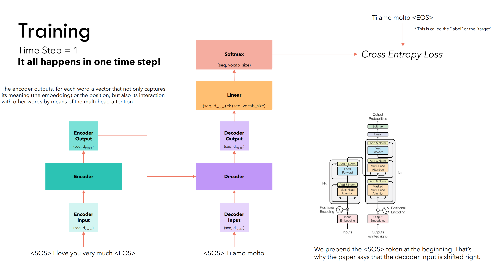
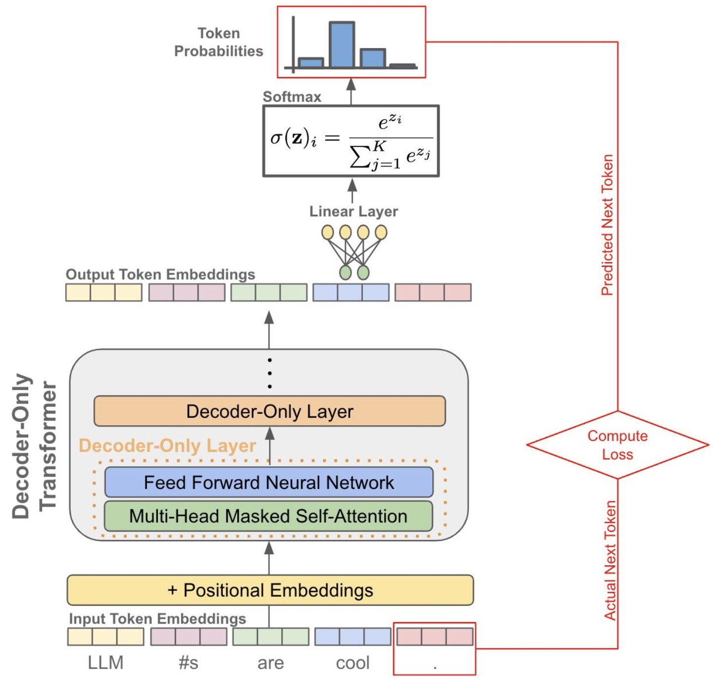
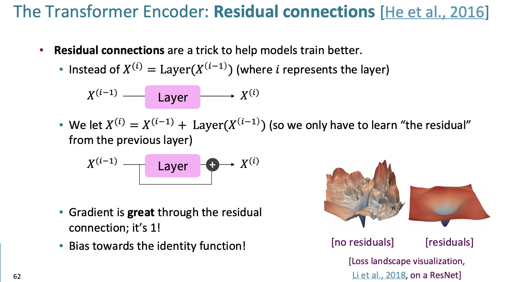
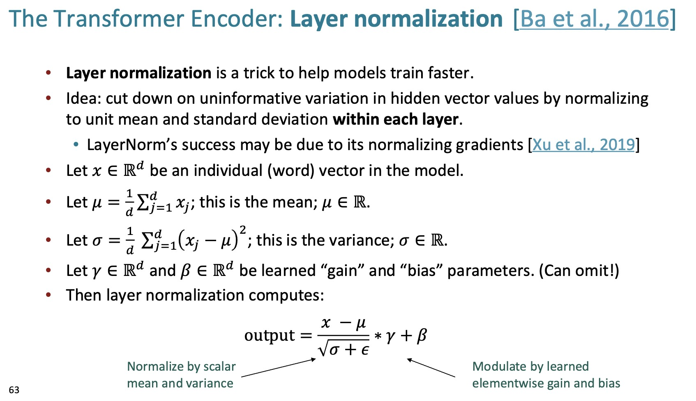

# Transformer Training

This lecture explains how Transformers are trained, with emphasis on shifted targets, causal masking, learnable components, and why training is more parallel than RNN training.

---

## 1. Forward Computation

A Transformer layer uses:

$$
\operatorname{Attention}\left(Q, K, V\right)
=
\operatorname{softmax}_{\text{row}}\left(
\frac{QK^\top}{\sqrt{d_k}}
\right)V
$$

For self-attention:

$$
Q = XW_Q,
\quad
K = XW_K,
\quad
V = XW_V
$$

The full model maps token prefixes to next-token distributions.

---

## 2. Next-Token Prediction Objective

For a token sequence:

$$
y_{1:T}
=
\left(y_1, y_2, \ldots, y_T\right)
$$

an autoregressive Transformer models:

$$
P_{\theta}\left(y_{1:T}\right)
=
\prod_{t=1}^{T}
P_{\theta}\left(y_t \mid y_{<t}\right)
$$

The loss is:

$$
\boxed{
\mathcal{L}
=
-
\sum_{t=1}^{T}
\log
P_{\theta}\left(y_t^{\text{gt}} \mid y_{<t}^{\text{gt}}\right)
}
$$

This is teacher forcing in parallel form.

---

## 3. Shifted Inputs and Targets

During training, the model input is shifted relative to the target.

Input:

$$
\left[\text{BOS}, y_1, y_2, \ldots, y_{T-1}\right]
$$

Target:

$$
\left[y_1, y_2, \ldots, y_T\right]
$$

At position $t$, the model sees previous ground-truth tokens and predicts the next token.

> [!WARNING]
> If inputs and targets are not shifted correctly, the model may learn to copy the current token instead of predicting the next token.

---

## 4. Causal Masking

Self-attention allows every position to attend to every other position. For autoregressive training, position $i$ must not see future positions $j > i$.

We add a causal mask:

$$
M_{i,j}
=
\begin{cases}
0, & j \leq i \\
-\infty, & j > i
\end{cases}
$$

The masked attention is:

$$
\operatorname{Attention}_{\text{causal}}\left(Q, K, V\right)
=
\operatorname{softmax}_{\text{row}}\left(
\frac{QK^\top}{\sqrt{d_k}} + M
\right)V
$$

This enforces:

$$
P_{\theta}\left(y_t \mid y_{<t}\right)
$$

not:

$$
P_{\theta}\left(y_t \mid y_{1:T}\right)
$$

---

## 5. Parallel Training Versus Sequential Inference

During training, all positions are computed at once:

$$
O =
\operatorname{Transformer}\left(
\left[\text{BOS}, y_1, \ldots, y_{T-1}\right]
\right)
$$

The loss is computed for all positions in parallel.

During inference, generation is sequential:

$$
\hat{y}_t
\sim
P_{\theta}\left(y_t \mid \hat{y}_{<t}\right)
$$

This distinction matters:

* training is parallel because ground-truth prefixes are known;
* inference is sequential because future tokens have not been generated yet.

---

## 6. Learnable Components

Transformer parameters include several modules.

### 6.1 Token Embeddings

Each token is mapped to a vector:

$$
e_t =
E\left[y_t\right]
$$

The embedding matrix $E$ is learned.

### 6.2 Positional Embeddings

The model adds position information:

$$
x_t =
e_t + p_t
$$

where $p_t$ may be learned or fixed.

### 6.3 Attention Projections

Each layer learns:

$$
W_Q,\quad W_K,\quad W_V,\quad W_O
$$

These determine how tokens query, match, retrieve, and recombine information.

### 6.4 Feed-Forward Networks

Each layer learns:

$$
\operatorname{FFN}\left(x\right)
=
\phi\left(xW_1 + b_1\right)W_2 + b_2
$$

### 6.5 Output Projection

The final hidden state maps to vocabulary logits:

$$
o_t =
h_t W_{\text{vocab}} + b_{\text{vocab}}
$$

Then:

$$
P_{\theta}\left(y_t \mid y_{<t}\right)
=
\operatorname{softmax}\left(o_t\right)
$$

---

## 7. Residual Connections and Layer Normalization

Deep Transformers are stabilized by residual paths and normalization.

One pre-norm block can be written:

$$
\tilde{X}
=
X
+ \operatorname{MHA}\left(\operatorname{Norm}\left(X\right)\right)
$$

$$
Y
=
\tilde{X}
+ \operatorname{FFN}\left(\operatorname{Norm}\left(\tilde{X}\right)\right)
$$

Residual connections create direct gradient paths. Layer normalization keeps activations in a trainable range.

---

## 8. Encoder-Decoder Transformer Training

For translation-style models, the encoder reads source tokens:

$$
x_{1:T}
$$

The decoder predicts target tokens:

$$
y_{1:T'}
$$

The objective is:

$$
\mathcal{L}
=
-
\sum_{t=1}^{T'}
\log
P_{\theta}\left(
y_t^{\text{gt}}
\mid
y_{<t}^{\text{gt}},
x_{1:T}
\right)
$$

The decoder uses:

* masked self-attention over target prefixes;
* cross-attention over encoder outputs;
* feed-forward transformations.

---

## 9. Gradient Flow Compared with RNNs

RNNs propagate information through time:

$$
h_t \leftarrow h_{t-1}
$$

Transformers propagate information through attention and layers:

$$
z_i =
\sum_j
\alpha_{i,j} v_j
$$

This shortens the path between distant tokens.

However, Transformers still face optimization challenges:

* deep layer stacks;
* large parameter counts;
* attention memory cost;
* sensitivity to learning-rate schedules.

---

## 10. Practical Training Details

Important details include:

* masking padding tokens in attention and loss;
* applying causal masks for decoder self-attention;
* using stable learning-rate schedules;
* using gradient clipping when needed;
* checking that logits, not probabilities, are passed to cross-entropy;
* monitoring validation loss and generation quality separately.

> [!WARNING]
> Padding masks and causal masks solve different problems. Padding masks hide fake tokens. Causal masks hide future tokens.

---

## 11. Summary

Transformer training uses the same maximum-likelihood idea as autoregressive RNNs:

$$
\mathcal{L}
=
-
\sum_t
\log
P_{\theta}\left(y_t^{\text{gt}} \mid y_{<t}^{\text{gt}}\right)
$$

The difference is computational structure:

* shifted inputs provide teacher forcing;
* causal masks prevent future leakage;
* all training positions are computed in parallel;
* self-attention creates direct token-token paths;
* residual connections and normalization enable deep stacks.

This completes the path from HMM state models to RNNs, seq2seq, attention, and Transformers.
