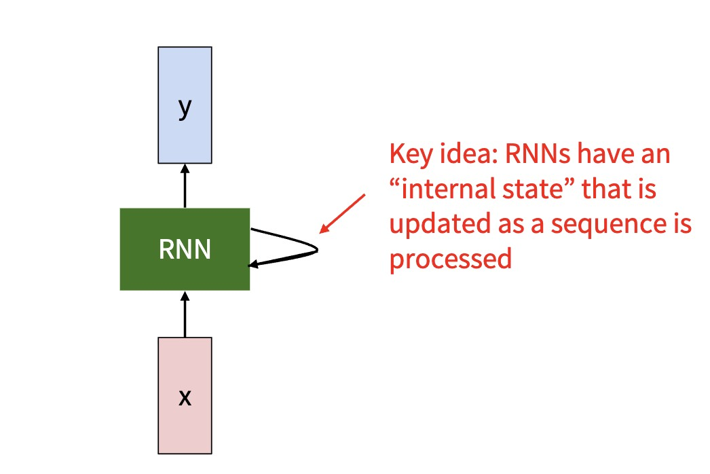
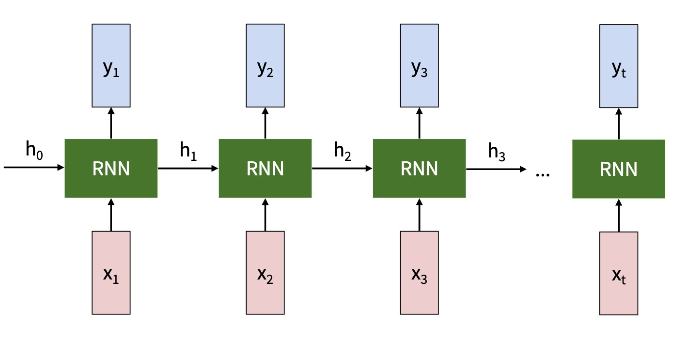

# Vanilla Recurrent Neural Networks

This lecture introduces the basic recurrent neural network. We will use it as the foundation for LSTM, GRU, sequence classification, sequence generation, seq2seq, and attention.



---

## 1. Motivation

Feedforward networks assume a fixed-size input and do not have built-in memory.

For sequence data, this is a problem. The meaning of the current item often depends on earlier items.

Examples:

* In text, the next word depends on previous words.
* In speech, the current sound depends on surrounding sounds.
* In time series, the next value depends on previous values.
* In control, the next action depends on past observations and actions.

An RNN solves this by maintaining a hidden state.

$$
\boxed{\text{new state} = \text{function}\left(\text{current input}, \text{previous state}\right)}
$$

---

## 2. Notation and Shapes

We use row-vector notation.

For one sequence:

* $x_t \in \mathbb{R}^{1 \times d_x}$ is the input at time $t$.
* $h_t \in \mathbb{R}^{1 \times d_h}$ is the hidden state at time $t$.
* $\hat{y}_t \in \mathbb{R}^{1 \times d_y}$ is the prediction at time $t$.

The sequence length is $T$:

$$
x_{1:T} = \left(x_1, x_2, \ldots, x_T\right)
$$

The initial hidden state is often:

$$
h_0 = 0
$$

> [!INFO]
> Later lectures use $s_t$ for decoder hidden states in seq2seq models. For a single RNN, $h_t$ is enough.

---

## 3. The Recurrent Update

At each time step, the RNN combines the current input and previous hidden state:

$$
\boxed{
h_t =
\tanh\left(
x_t W_{xh}
+ h_{t-1} W_{hh}
+ b_h
\right)
}
$$

where:

* $W_{xh} \in \mathbb{R}^{d_x \times d_h}$ maps input to hidden state;
* $W_{hh} \in \mathbb{R}^{d_h \times d_h}$ maps previous hidden state to next hidden state;
* $b_h \in \mathbb{R}^{1 \times d_h}$ is the hidden bias.

The same parameters are reused at every time step.

---

## 4. Output Layer

The RNN may produce an output at each time step:

$$
o_t = h_t W_{hy} + b_y
$$

where:

* $o_t$ is the logit vector;
* $W_{hy} \in \mathbb{R}^{d_h \times d_y}$;
* $b_y \in \mathbb{R}^{1 \times d_y}$.

For classification:

$$
\hat{y}_t = \operatorname{softmax}\left(o_t\right)
$$

For regression, the output may be used directly.

> [!WARNING]
> Logits $o_t$ and probabilities $\hat{y}_t$ are not the same. In most deep-learning libraries, cross-entropy expects logits and applies softmax internally.

---

## 5. Unrolling Through Time



The recurrence:

$$
h_t = f_{\theta}\left(x_t, h_{t-1}\right)
$$

can be unrolled:

```text
x_1 -> h_1 -> h_2 -> ... -> h_T
       ^      ^            ^
       |      |            |
      x_1    x_2          x_T
```

Each hidden state summarizes the prefix:

$$
h_t \approx \text{representation of } x_{1:t}
$$

This is the RNN's memory.

---

## 6. Why Parameter Sharing Matters

The same matrices $W_{xh}$ and $W_{hh}$ are applied at every time step.

This gives the model two important properties:

* It can process sequences of variable length.
* It learns a time-reusable transition rule.

Without parameter sharing, a model trained on length $T$ would not naturally generalize to a different length.

---

## 7. PyTorch-Style Implementation

The following code shows the recurrent idea without using `nn.RNN`.

```python
import torch
import torch.nn as nn


class SimpleRNN(nn.Module):
    def __init__(self, input_size, hidden_size, output_size):
        super().__init__()
        self.hidden_size = hidden_size
        self.x_to_h = nn.Linear(input_size, hidden_size)
        self.h_to_h = nn.Linear(hidden_size, hidden_size, bias=False)
        self.h_to_y = nn.Linear(hidden_size, output_size)

    def forward(self, x_seq):
        h = torch.zeros(self.hidden_size, device=x_seq.device)
        logits = []

        for x_t in x_seq:
            h = torch.tanh(self.x_to_h(x_t) + self.h_to_h(h))
            o_t = self.h_to_y(h)
            logits.append(o_t)

        return torch.stack(logits), h
```

The loop is the key:

```python
h = torch.tanh(self.x_to_h(x_t) + self.h_to_h(h))
```

It updates memory one token at a time.

---

## 8. Training Objective

For a many-to-many task with a target at every time step:

$$
\mathcal{L}
=
\sum_{t=1}^{T}
\ell\left(o_t, y_t\right)
$$

For a many-to-one task with only a final output:

$$
\mathcal{L}
=
\ell\left(o_T, y\right)
$$

Both objectives train the same recurrent parameters through time.

---

## 9. Backpropagation Through Time


Training an RNN means backpropagating through the unrolled computation graph.

Gradients flow backward:

$$
h_T \rightarrow h_{T-1} \rightarrow \cdots \rightarrow h_1
$$

This is called Backpropagation Through Time.

The same parameter matrix receives gradient contributions from every time step:

$$
\frac{\partial \mathcal{L}}{\partial W_{hh}}
=
\sum_{t=1}^{T}
\frac{\partial \mathcal{L}}{\partial h_t}
\frac{\partial h_t}{\partial W_{hh}}
$$

---

## 10. Main Weaknesses

Vanilla RNNs are simple, but they struggle with long sequences.

### 10.1 Vanishing Gradients

Information from early time steps may receive tiny gradients after many recurrent transitions.

### 10.2 Exploding Gradients

Gradients may grow too large, causing unstable updates.

### 10.3 Limited Memory Control

The vanilla RNN has no explicit mechanism to decide what to remember, forget, or expose.

These weaknesses motivate LSTM and GRU.

---

## 11. Summary

A vanilla RNN is the simplest neural sequence model:

$$
\boxed{
h_t =
\tanh\left(
x_t W_{xh}
+ h_{t-1} W_{hh}
+ b_h
\right)
}
$$

It turns a sequence into a chain of hidden states. The rest of the mini-series builds on this idea.
