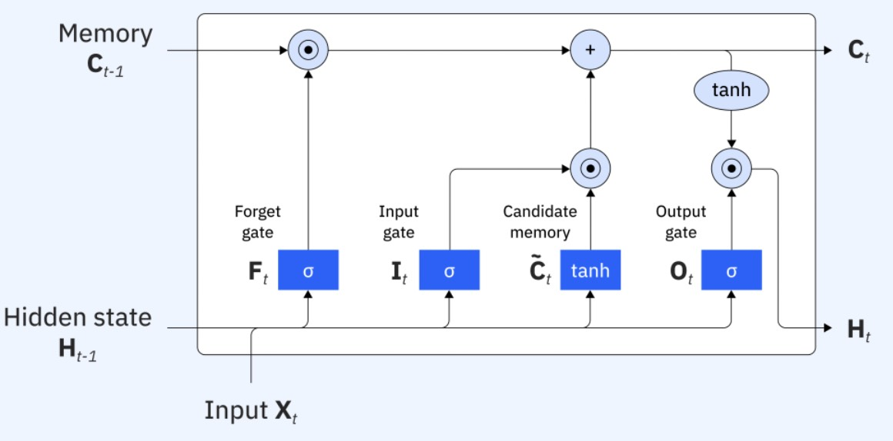
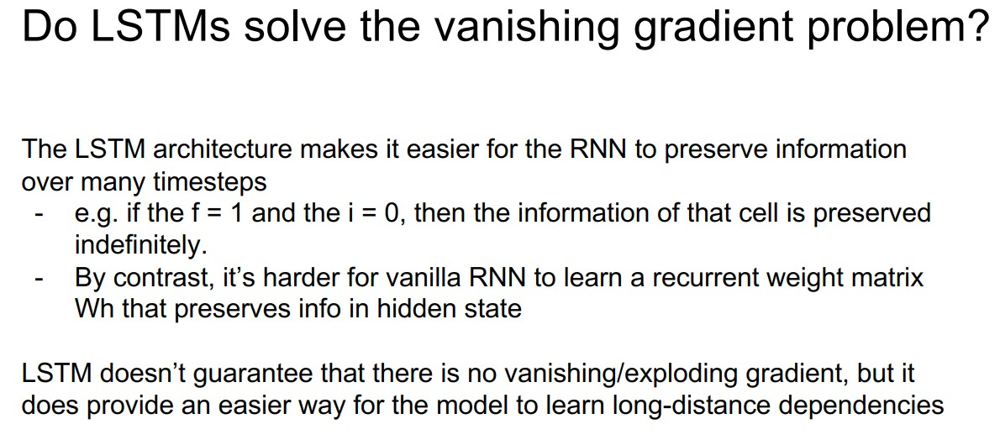

# Long Short-Term Memory Networks

This lecture introduces the LSTM cell as an engineered replacement for the vanilla RNN cell. Its purpose is to make memory and gradient flow easier to control.



---

## 1. Motivation

Vanilla RNNs update memory with one equation:

$$
h_t = \tanh\left(x_t W_{xh} + h_{t-1} W_{hh} + b_h\right)
$$

This gives the model no explicit control over:

* what old information to keep;
* what old information to erase;
* what new information to write;
* what part of memory to reveal as output.

LSTM introduces gates to control these operations.

> [!INFO]
> It is useful to view LSTM as an engineering invention: a drop-in recurrent cell designed to replace the vanilla RNN update when longer memory is needed.

---

## 2. LSTM State Variables

An LSTM has two state vectors.

### 2.1 Cell State

The cell state is:

$$
c_t \in \mathbb{R}^{1 \times d_h}
$$

It is the long-term memory path.

### 2.2 Hidden State

The hidden state is:

$$
h_t \in \mathbb{R}^{1 \times d_h}
$$

It is the exposed output of the cell and is passed to the next layer or output head.

The LSTM update consumes:

$$
x_t,\quad h_{t-1},\quad c_{t-1}
$$

and produces:

$$
h_t,\quad c_t
$$

---

## 3. LSTM Gates

Each gate is a vector with values between $0$ and $1$.

For compact notation, define the affine input:

$$
a_g = x_t W_g + h_{t-1} U_g + b_g
$$

where $g$ indicates the gate or candidate.

### 3.1 Forget Gate

The forget gate decides how much old cell memory to keep:

$$
f_t =
\sigma\left(
x_t W_f + h_{t-1} U_f + b_f
\right)
$$

If a coordinate of $f_t$ is close to $1$, that memory is kept. If it is close to $0$, that memory is erased.

### 3.2 Input Gate

The input gate decides how much new information to write:

$$
i_t =
\sigma\left(
x_t W_i + h_{t-1} U_i + b_i
\right)
$$

### 3.3 Candidate Memory

The candidate memory proposes new content:

$$
\tilde{c}_t =
\tanh\left(
x_t W_c + h_{t-1} U_c + b_c
\right)
$$

### 3.4 Output Gate

The output gate decides how much cell memory to expose:

$$
o_t =
\sigma\left(
x_t W_o + h_{t-1} U_o + b_o
\right)
$$

---

## 4. LSTM Update Equations

The cell state update is:

$$
\boxed{
c_t =
f_t \odot c_{t-1}
+ i_t \odot \tilde{c}_t
}
$$

The hidden state update is:

$$
\boxed{
h_t =
o_t \odot \tanh\left(c_t\right)
}
$$

where $\odot$ means element-wise multiplication.

The update can be read as:

```text
new memory = kept old memory + selected new memory
visible state = selected part of transformed memory
```

---

## 5. Understanding the Gates



### 5.1 Forget Gate Question

The forget gate asks:

> Which parts of $c_{t-1}$ should survive?

### 5.2 Input Gate Question

The input gate asks:

> Which parts of $\tilde{c}_t$ should be written?

### 5.3 Output Gate Question

The output gate asks:

> Which parts of $c_t$ should be visible as $h_t$?

This separation is the main design improvement over vanilla RNNs.

---

## 6. Why LSTM Helps Gradient Flow

The cell state has an additive update:

$$
c_t =
f_t \odot c_{t-1}
+ i_t \odot \tilde{c}_t
$$

The direct path from $c_{t-1}$ to $c_t$ gives gradients a more stable route through time:

$$
\frac{\partial c_t}{\partial c_{t-1}}
\approx
f_t
$$

If the model learns $f_t$ near $1$ for important information, gradients can travel through many steps more easily.

> [!WARNING]
> LSTM reduces the vanishing-gradient problem; it does not magically remove all long-context difficulty. Very long sequences can still be hard to optimize.

---

## 7. PyTorch-Style Cell

```python
import torch
import torch.nn as nn


class LSTMCellFromScratch(nn.Module):
    def __init__(self, input_size, hidden_size):
        super().__init__()
        self.x_to_gates = nn.Linear(input_size, 4 * hidden_size)
        self.h_to_gates = nn.Linear(hidden_size, 4 * hidden_size, bias=False)

    def forward(self, x_t, state):
        h_prev, c_prev = state
        gates = self.x_to_gates(x_t) + self.h_to_gates(h_prev)
        f_t, i_t, g_t, o_t = gates.chunk(4, dim=-1)

        f_t = torch.sigmoid(f_t)
        i_t = torch.sigmoid(i_t)
        g_t = torch.tanh(g_t)
        o_t = torch.sigmoid(o_t)

        c_t = f_t * c_prev + i_t * g_t
        h_t = o_t * torch.tanh(c_t)
        return h_t, c_t
```

The four gates are often computed in one matrix multiplication for efficiency.

---

## 8. When to Use LSTM

LSTM is useful when:

* sequence order matters;
* dependencies may span many time steps;
* training a vanilla RNN is unstable;
* the dataset is not large enough to require a Transformer;
* online or streaming inference is useful.

Trade-offs:

* more parameters than vanilla RNN;
* slower per step;
* still sequential over time;
* often superseded by Transformers for large-scale language tasks.

---

## 9. Summary

LSTM improves recurrent modeling by separating memory storage from visible hidden state.

The central update is:

$$
\boxed{
c_t =
f_t \odot c_{t-1}
+ i_t \odot \tilde{c}_t
}
$$

This gives the network learned control over remembering, forgetting, writing, and exposing information.
