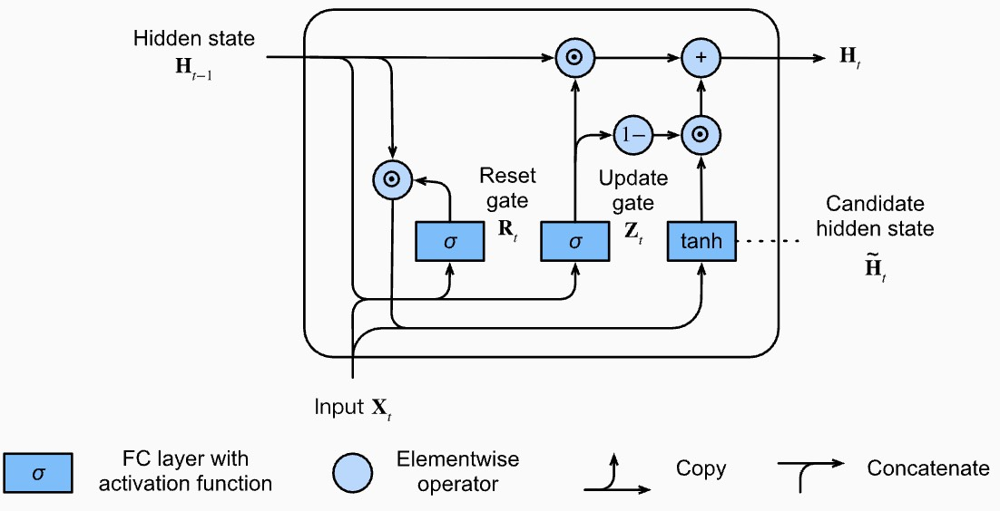
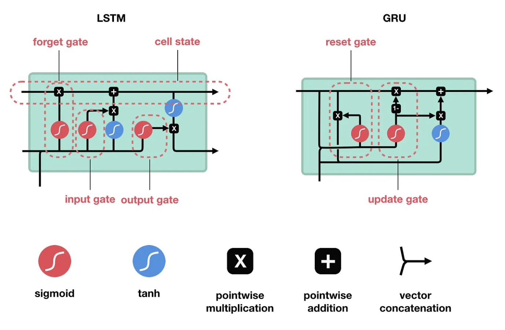

# Gated Recurrent Unit Networks

This lecture introduces the GRU cell as a simpler gated alternative to LSTM. GRU keeps the main idea of controlled memory but removes the separate cell state.



---

## 1. Motivation

LSTM improves vanilla RNNs by adding gates and a cell state. GRU asks whether we can keep most of the benefit with fewer moving parts.

GRU uses:

* one hidden state $h_t$;
* an update gate $z_t$;
* a reset gate $r_t$;
* a candidate hidden state $\tilde{h}_t$.

> [!INFO]
> GRU is another engineered recurrent cell. In practice, we often try GRU and LSTM as interchangeable recurrent backbones and choose based on validation behavior.

---

## 2. State and Shapes

Using row-vector notation:

* $x_t \in \mathbb{R}^{1 \times d_x}$;
* $h_t \in \mathbb{R}^{1 \times d_h}$;
* $z_t, r_t, \tilde{h}_t \in \mathbb{R}^{1 \times d_h}$.

Unlike LSTM, there is no separate $c_t$.

All memory is carried in:

$$
h_t
$$

---

## 3. GRU Equations

### 3.1 Update Gate

The update gate controls how much old state to keep versus how much new candidate state to use:

$$
z_t =
\sigma\left(
x_t W_z + h_{t-1} U_z + b_z
\right)
$$

### 3.2 Reset Gate

The reset gate controls how much previous state is used when computing the candidate:

$$
r_t =
\sigma\left(
x_t W_r + h_{t-1} U_r + b_r
\right)
$$

### 3.3 Candidate Hidden State

The candidate state is:

$$
\tilde{h}_t =
\tanh\left(
x_t W_h
+ \left(r_t \odot h_{t-1}\right) U_h
+ b_h
\right)
$$

When $r_t$ is small, the model ignores more of the previous hidden state while forming the candidate.

### 3.4 Hidden State Update

The final hidden state is a learned interpolation:

$$
\boxed{
h_t =
\left(1 - z_t\right) \odot h_{t-1}
+ z_t \odot \tilde{h}_t
}
$$

where $\odot$ is element-wise multiplication.

---

## 4. Gate Interpretation



The update equation:

$$
h_t =
\left(1 - z_t\right) \odot h_{t-1}
+ z_t \odot \tilde{h}_t
$$

has a simple interpretation.

If $z_t$ is close to $0$:

$$
h_t \approx h_{t-1}
$$

The model mostly keeps old memory.

If $z_t$ is close to $1$:

$$
h_t \approx \tilde{h}_t
$$

The model mostly writes new memory.

The reset gate controls the candidate:

* high $r_t$ uses past state;
* low $r_t$ lets the candidate ignore past state.

---

## 5. GRU Versus LSTM

| Aspect | LSTM | GRU |
| --- | --- | --- |
| Main memory | Cell state $c_t$ and hidden state $h_t$ | Hidden state $h_t$ only |
| Gates | Forget, input, output | Update, reset |
| Parameters | More | Fewer |
| Control | More explicit | Simpler |
| Speed | Often slower | Often faster |

There is no universal winner. LSTM can be more expressive; GRU can be easier and faster to train.

---

## 6. Why GRU Helps Gradient Flow

The update equation contains a direct path:

$$
h_t =
\left(1 - z_t\right) \odot h_{t-1}
+ z_t \odot \tilde{h}_t
$$

If the model keeps $z_t$ small for some coordinates, the hidden state can pass forward almost unchanged.

This gives gradients a more stable route:

$$
h_t \leftarrow h_{t-1}
$$

That is the same broad idea as LSTM: use gates to control information flow.

---

## 7. PyTorch-Style Cell

```python
import torch
import torch.nn as nn


class GRUCellFromScratch(nn.Module):
    def __init__(self, input_size, hidden_size):
        super().__init__()
        self.x_to_zr = nn.Linear(input_size, 2 * hidden_size)
        self.h_to_zr = nn.Linear(hidden_size, 2 * hidden_size, bias=False)
        self.x_to_candidate = nn.Linear(input_size, hidden_size)
        self.h_to_candidate = nn.Linear(hidden_size, hidden_size, bias=False)

    def forward(self, x_t, h_prev):
        zr = self.x_to_zr(x_t) + self.h_to_zr(h_prev)
        z_t, r_t = zr.chunk(2, dim=-1)
        z_t = torch.sigmoid(z_t)
        r_t = torch.sigmoid(r_t)

        h_candidate = torch.tanh(
            self.x_to_candidate(x_t)
            + self.h_to_candidate(r_t * h_prev)
        )
        h_t = (1.0 - z_t) * h_prev + z_t * h_candidate
        return h_t
```

---

## 8. When to Use GRU

GRU is a practical choice when:

* we want gated memory but fewer parameters than LSTM;
* the dataset is moderate in size;
* inference speed matters;
* the task is sequential but not dominated by extremely long contexts.

---

## 9. Summary

GRU simplifies LSTM while preserving the central idea of gated state updates.

The key formula is:

$$
\boxed{
h_t =
\left(1 - z_t\right) \odot h_{t-1}
+ z_t \odot \tilde{h}_t
}
$$

GRU is often the first gated recurrent model to try when vanilla RNNs are too weak.
