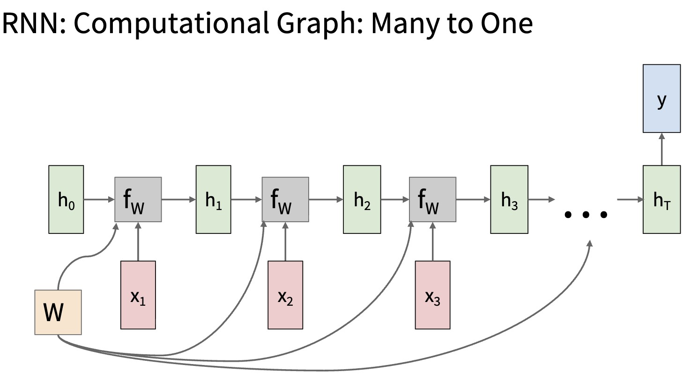
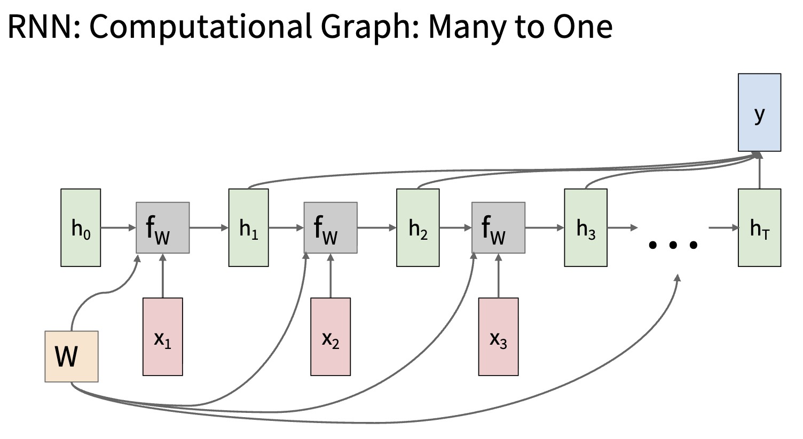

# RNN Many-to-One: Sequence Classification

This lecture studies the many-to-one pattern: a sequence is mapped to a single output. This is common in sentiment analysis, activity recognition, document classification, and sequence-level regression.

---

## 1. The Many-to-One Setting

The model receives a sequence:

$$
x_{1:T} =
\left(x_1, x_2, \ldots, x_T\right)
$$

and produces one prediction:

$$
\hat{y}
$$

The mapping is:

$$
x_{1:T} \rightarrow \hat{y}
$$

Examples:

* text sequence to sentiment label;
* audio frames to speaker identity;
* sensor readings to activity class;
* patient measurements to risk score.

---

## 2. Shared Recurrent Backbone

The recurrent backbone can be a vanilla RNN, LSTM, or GRU:

$$
h_t = f_{\theta}\left(x_t, h_{t-1}\right)
$$

After processing the full sequence, we have hidden states:

$$
H = \left[h_1, h_2, \ldots, h_T\right]
$$

The design question is:

> How should we turn $H$ into one prediction?

There are two common strategies.

---

## 3. Strategy A: Final-State Readout

The simplest method uses only the final hidden state:

$$
\boxed{
\hat{y} = g\left(h_T\right)
}
$$

For classification:

$$
o = h_T W_y + b_y
$$

$$
\hat{y} = \operatorname{softmax}\left(o\right)
$$

The final state is treated as a summary:

$$
h_T \approx \text{representation of } x_{1:T}
$$

---

## 4. Final-State Training

For a classification target $y$, the loss is:

$$
\mathcal{L}
=
\ell\left(o, y\right)
$$

The gradient flows backward from:

$$
o \rightarrow h_T \rightarrow h_{T-1} \rightarrow \cdots \rightarrow h_1
$$

This is simple and efficient, but all task-relevant information must survive until $h_T$.

---

## 5. Final-State Bottleneck

The final-state approach compresses the whole sequence into:

$$
h_T \in \mathbb{R}^{1 \times d_h}
$$

This can fail when:

* important evidence appears early;
* the sequence is long;
* the final tokens are not the most important;
* gradients to early steps become weak.

> [!WARNING]
> A high final-state validation error does not always mean the recurrent cell is bad. The readout strategy may be throwing away useful intermediate states.

---

## 6. Strategy B: All-States Aggregation

Instead of using only $h_T$, we aggregate all hidden states:

$$
h_{\text{agg}}
=
\operatorname{Aggregate}\left(h_1, h_2, \ldots, h_T\right)
$$

Then:

$$
\boxed{
\hat{y} = g\left(h_{\text{agg}}\right)
}
$$

This reduces the need for early evidence to survive unchanged until the final step.

---

## 7. Common Aggregation Methods

### 7.1 Mean Pooling

Mean pooling averages hidden states:

$$
h_{\text{agg}}
=
\frac{1}{T}
\sum_{t=1}^{T}
h_t
$$

It is simple and stable.

### 7.2 Max Pooling

Max pooling takes the strongest activation per feature:

$$
\left(h_{\text{agg}}\right)_j
=
\max_{1 \leq t \leq T}
\left(h_t\right)_j
$$

It can capture whether a feature appeared anywhere.

### 7.3 Attention Pooling

Attention pooling learns which time steps matter:

$$
e_t = h_t w_a^\top
$$

$$
\alpha_t =
\frac{\exp\left(e_t\right)}
{\sum_{i=1}^{T}\exp\left(e_i\right)}
$$

$$
h_{\text{agg}}
=
\sum_{t=1}^{T}
\alpha_t h_t
$$

This is a first step toward the attention mechanisms used later in seq2seq.

---

## 8. Comparing Readout Strategies

| Aspect | Final State | All-States Aggregation |
| --- | --- | --- |
| Representation | $h_T$ only | $h_1, \ldots, h_T$ |
| Complexity | Lower | Higher |
| Long sequences | More brittle | Often stronger |
| Interpretability | Limited | Attention weights can help |
| Gradient path | Mostly through $h_T$ | More direct to many $h_t$ |

Final-state readout is a good baseline. Aggregation is often better when important evidence can occur anywhere.

---

## 9. Practical Debugging

Check:

* Are padded time steps excluded from pooling?
* Is the final state taken from the true last token, not from padding?
* Are sequence lengths handled correctly in batches?
* Does attention pooling put high weight on meaningful positions?
* Does mean pooling dilute rare but important evidence?

> [!WARNING]
> Padding bugs are common in many-to-one models. If $h_T$ corresponds to a pad token, the classifier is reading the wrong state.

---

## 10. Summary

Many-to-one RNNs map a sequence to one prediction.

The two main readout designs are:

$$
\hat{y} = g\left(h_T\right)
$$

and:

$$
\hat{y} = g\left(\operatorname{Aggregate}\left(h_1, \ldots, h_T\right)\right)
$$

The second design anticipates attention: instead of trusting one final state, the model can use evidence from many positions.
