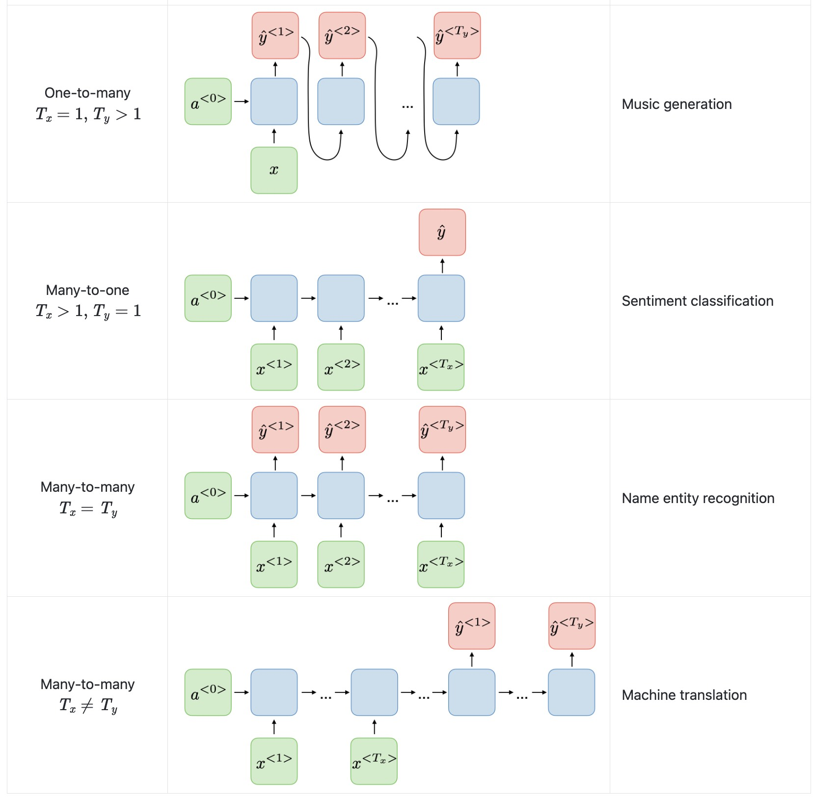
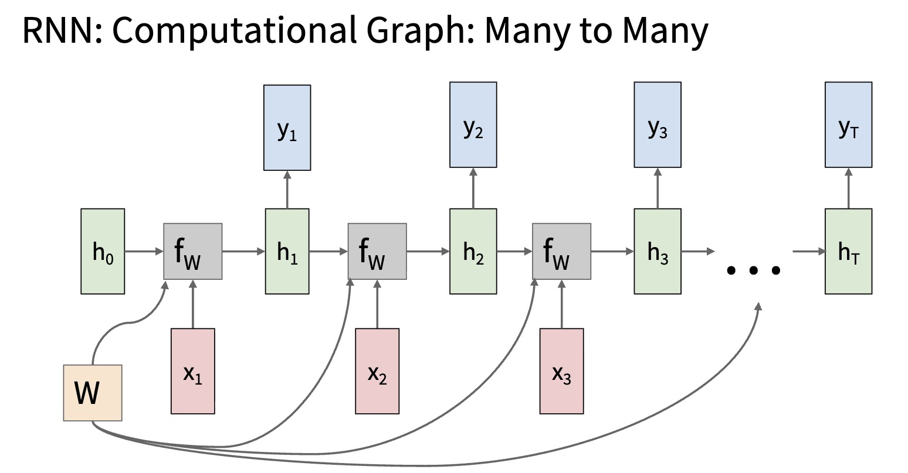
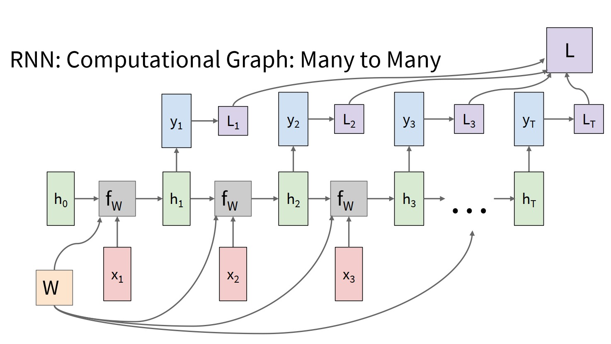
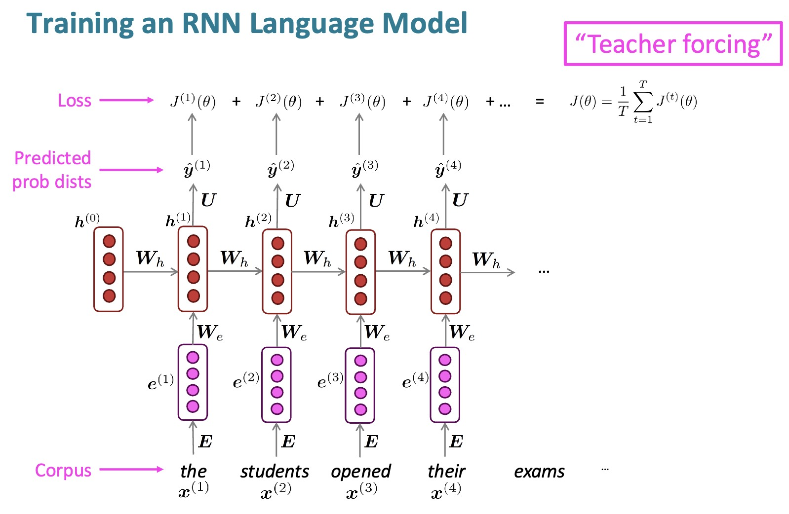

# RNN Many-to-Many: Sequence Labeling and Sequence Modeling

This lecture studies the many-to-many pattern: a sequence maps to another sequence. We first handle the synchronous case where input and output lengths match, then explain why variable-length mapping requires seq2seq.



---

## 1. The Many-to-Many Setting

The model receives:

$$
x_{1:T} =
\left(x_1, x_2, \ldots, x_T\right)
$$

and predicts:

$$
\hat{y}_{1:T'}
=
\left(\hat{y}_1, \hat{y}_2, \ldots, \hat{y}_{T'}\right)
$$

The general mapping is:

$$
x_{1:T} \rightarrow \hat{y}_{1:T'}
$$

There are two cases:

* synchronous many-to-many, where $T = T'$;
* asynchronous many-to-many, where $T$ and $T'$ may differ.

---

## 2. Shared Recurrent Backbone

The recurrent backbone computes:

$$
h_t =
f_{\theta}\left(x_t, h_{t-1}\right)
$$

The output layer can produce a prediction at each step:

$$
o_t = h_t W_y + b_y
$$

$$
\hat{y}_t =
\operatorname{softmax}\left(o_t\right)
$$

The same idea works with vanilla RNN, LSTM, or GRU cells.

---

## 3. Synchronous Many-to-Many



In synchronous many-to-many modeling, each input position has a corresponding output position:

$$
x_t \leftrightarrow y_t
$$

The mapping is:

$$
x_{1:T} \rightarrow \hat{y}_{1:T}
$$

This is the natural structure for sequence labeling tasks.

---

## 4. Forward Computation

At each time step:

$$
h_t =
f_{\theta}\left(x_t, h_{t-1}\right)
$$

$$
o_t =
g_{\phi}\left(h_t\right)
$$

$$
\hat{y}_t =
\operatorname{softmax}\left(o_t\right)
$$

The local interpretation is:

```text
current input + past context -> current label
```

The hidden state $h_t$ contains information about the prefix $x_{1:t}$.

---

## 5. Training Objective



For a target label at every time step, the total loss is:

$$
\boxed{
\mathcal{L}
=
\sum_{t=1}^{T}
\ell\left(o_t, y_t\right)
}
$$

Each time step contributes a supervised signal.

If the batch contains padded tokens, the loss should ignore padding positions:

$$
\mathcal{L}
=
\sum_{t=1}^{T}
m_t \ell\left(o_t, y_t\right)
$$

where $m_t = 1$ for real tokens and $m_t = 0$ for padding.

> [!WARNING]
> Padding positions must be masked in the loss. Otherwise the model learns to predict artificial pad labels.

---

## 6. Example: Part-of-Speech Tagging

Part-of-speech tagging assigns a grammatical tag to each word.

| Input | The | cat | sits | on | the | mat |
| --- | --- | --- | --- | --- | --- | --- |
| Output | DET | NOUN | VERB | PREP | DET | NOUN |

This is synchronous because each input token has one output tag.

---

## 7. Example: Named Entity Recognition

Named Entity Recognition identifies entities in text.

| Input | Barack | Obama | was | born | in | Hawaii |
| --- | --- | --- | --- | --- | --- | --- |
| Output | B-PER | I-PER | O | O | O | B-LOC |

The BIO scheme uses:

* `B` for beginning;
* `I` for inside;
* `O` for outside.

The RNN produces a label distribution at each token position.

---

## 8. Example: Video Frame Labeling

For video, each frame can receive an action label.

| Frame | $1$ | $2$ | $3$ | $4$ | $5$ |
| --- | --- | --- | --- | --- | --- |
| Action | walking | walking | running | running | jumping |

The hidden state carries temporal context across frames.

---

## 9. Loss Variants



### 9.1 Per-Step Loss

The standard objective sums per-step losses:

$$
\mathcal{L}
=
\sum_{t=1}^{T}
\ell_t
$$

where:

$$
\ell_t = \ell\left(o_t, y_t\right)
$$

### 9.2 Weighted Loss

Some positions may matter more:

$$
\mathcal{L}
=
\sum_{t=1}^{T}
w_t \ell_t
$$

Examples:

* emphasize rare events;
* down-weight uncertain labels;
* ignore padded positions.

### 9.3 Sequence-Level Loss

Some tasks evaluate the whole sequence:

$$
\mathcal{L}
=
\ell\left(\hat{y}_{1:T}, y_{1:T}\right)
$$

This appears in structured prediction and sequence-level training.

---

## 10. Bidirectional RNNs

For sequence labeling, future context is often available.

A bidirectional RNN computes:

$$
\overrightarrow{h}_t =
f_{\text{fwd}}\left(x_t, \overrightarrow{h}_{t-1}\right)
$$

$$
\overleftarrow{h}_t =
f_{\text{bwd}}\left(x_t, \overleftarrow{h}_{t+1}\right)
$$

Then:

$$
h_t =
\operatorname{Concat}\left(
\overrightarrow{h}_t,
\overleftarrow{h}_t
\right)
$$

This lets each prediction use both left and right context.

> [!WARNING]
> Bidirectional RNNs are not valid for causal generation, because they look into the future.

---

## 11. Limitation of Synchronous Modeling

Synchronous many-to-many assumes:

$$
x_t \leftrightarrow y_t
$$

But many tasks do not have one output per input:

* translation;
* summarization;
* dialogue;
* question answering;
* speech recognition with different frame and token lengths.

In those tasks:

$$
T \neq T'
$$

and alignment is unknown.

This motivates sequence-to-sequence models.

---

## 12. Summary

Synchronous many-to-many RNNs are useful when input and output positions align.

The central computation is:

$$
h_t = f_{\theta}\left(x_t, h_{t-1}\right),
\quad
\hat{y}_t = g_{\phi}\left(h_t\right)
$$

When input and output lengths differ, we need an encoder-decoder structure.
