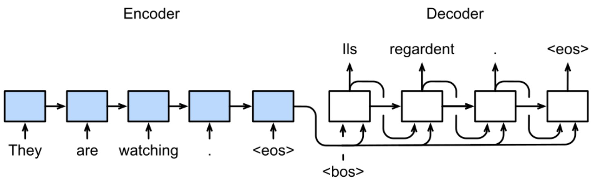
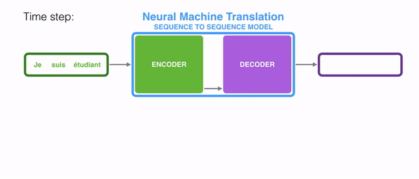
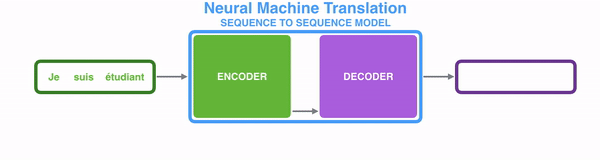
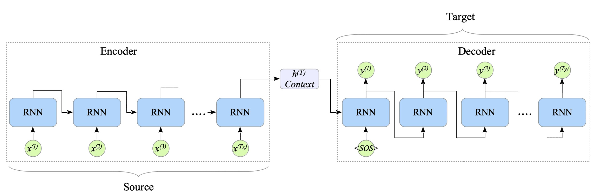

# Sequence-to-Sequence Learning: Encoder Before Decoder

This lecture introduces sequence-to-sequence learning. Seq2seq models solve variable-length sequence mapping by separating input encoding from output decoding.

---

## 1. The Sequence Mapping Problem

We want to model:

$$
x_{1:T} \rightarrow \hat{y}_{1:T'}
$$

where:

* $T$ is the input length;
* $T'$ is the output length;
* $T$ and $T'$ do not need to be equal.

Examples:

* English sentence to Chinese sentence;
* article to summary;
* speech frames to text tokens;
* question to answer.

The output cannot be produced one-for-one while reading the input. The model must first understand the input sequence, then generate the output sequence.

---

## 2. Encoder-Decoder Architecture

Seq2seq uses two modules:

* an encoder that reads the input sequence;
* a decoder that generates the output sequence.

The high-level structure is:

$$
\boxed{
x_{1:T}
\rightarrow
\text{encoder}
\rightarrow
\text{context}
\rightarrow
\text{decoder}
\rightarrow
\hat{y}_{1:T'}
}
$$

---

## 3. Encoder

The encoder processes input tokens one by one:

$$
h_i =
f_{\text{enc}}\left(x_i, h_{i-1}\right)
$$

for:

$$
i = 1, \ldots, T
$$

The encoder produces hidden states:

$$
H =
\left[h_1, h_2, \ldots, h_T\right]
$$

In the original basic seq2seq model, only the final state is passed to the decoder:

$$
c = h_T
$$

This $c$ is called the context vector.

---

## 4. Decoder

The decoder has its own recurrent state:

$$
s_t
$$

The initial decoder state is often set from the encoder context:

$$
s_0 = \psi\left(c\right)
$$

where $\psi$ may be identity or a learned projection.

At each decoding step:

$$
s_t =
f_{\text{dec}}\left(e\left(y_{t-1}\right), s_{t-1}\right)
$$

where $e\left(y_{t-1}\right)$ is the embedding of the previous target token.

The output logits are:

$$
o_t = g\left(s_t\right)
$$

and the token distribution is:

$$
P_{\theta}\left(y_t \mid y_{<t}, x_{1:T}\right)
=
\operatorname{softmax}\left(o_t\right)
$$

---

## 5. Teacher Forcing

During training, the decoder usually receives the ground-truth previous token:

$$
s_t =
f_{\text{dec}}\left(
e\left(y_{t-1}^{\text{gt}}\right),
s_{t-1}
\right)
$$

This is teacher forcing.

During inference, the decoder receives its own previous output:

$$
s_t =
f_{\text{dec}}\left(
e\left(\hat{y}_{t-1}\right),
s_{t-1}
\right)
$$

Teacher forcing makes optimization easier, but creates a gap between training and inference.

---

## 6. Training Objective

For target sequence $y_{1:T'}$, the conditional probability factorizes as:

$$
P_{\theta}\left(y_{1:T'} \mid x_{1:T}\right)
=
\prod_{t=1}^{T'}
P_{\theta}\left(y_t \mid y_{<t}, x_{1:T}\right)
$$

The training loss is negative log-likelihood:

$$
\boxed{
\mathcal{L}
=
-
\sum_{t=1}^{T'}
\log
P_{\theta}\left(y_t^{\text{gt}} \mid y_{<t}^{\text{gt}}, x_{1:T}\right)
}
$$

This is usually implemented as cross-entropy over the target vocabulary at each output position.

---

## 7. What Seq2Seq Achieves

Seq2seq solves the fixed-alignment limitation of synchronous RNNs.

It supports:

* variable-length input;
* variable-length output;
* generation after reading the whole input;
* separate encoder and decoder dynamics.

The architecture is flexible enough for translation, summarization, and dialogue.

---

## 8. The Fixed-Context Bottleneck

The basic seq2seq model compresses all encoder information into:

$$
c = h_T
$$

Then every decoder step depends on the same context:

$$
\hat{y}_t \leftarrow c
$$

This creates a bottleneck:

* early input details may be forgotten;
* long inputs are hard to compress into one vector;
* the decoder cannot directly inspect individual encoder states;
* different output positions cannot choose different input positions.

---

## 9. Debugging Seq2Seq Models

Common checks:

* Are start and end tokens handled correctly?
* Are target inputs shifted correctly during teacher forcing?
* Are padding positions ignored in the loss?
* Does inference stop at the end token?
* Does the decoder receive ground-truth tokens during training and predicted tokens during inference?

> [!WARNING]
> A common bug is training the decoder to predict the same token it receives as input. The target input should be shifted by one position.

---

## 10. Transition to Attention

Seq2seq separates understanding and generation, but the basic form relies on a single context vector.

The next question is:

> How can the decoder access different encoder states at different output steps?

This is the alignment problem.
