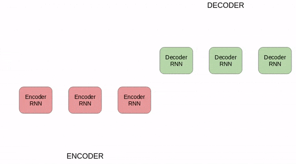
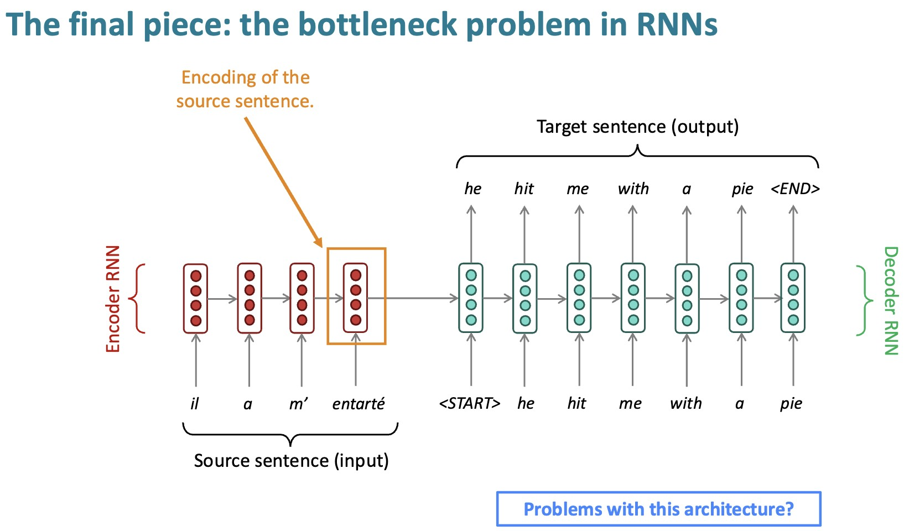
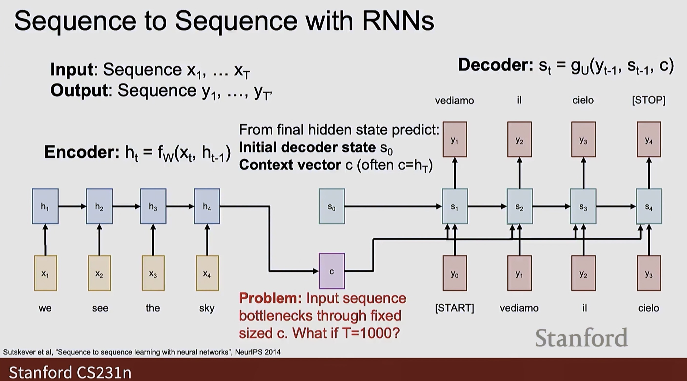
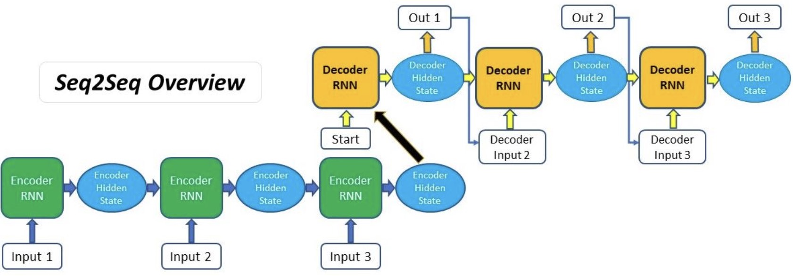
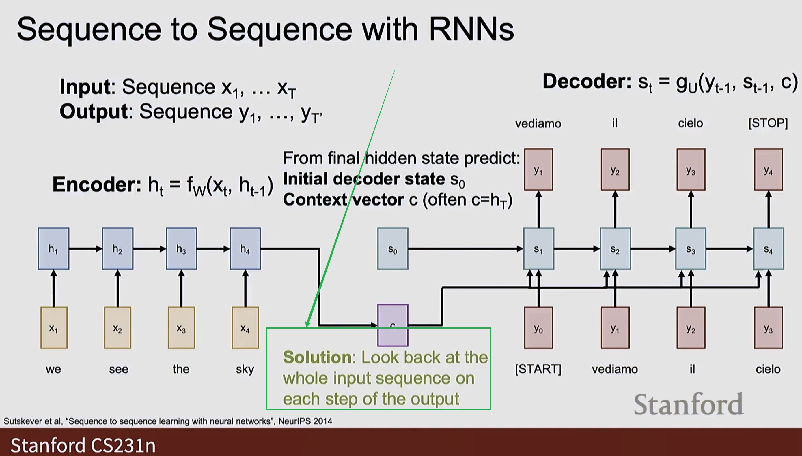
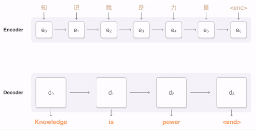

# The Alignment Problem in Sequence-to-Sequence Models

This lecture explains why fixed-context seq2seq models struggle and motivates attention as learned, differentiable alignment.



---

## 1. From Compression to Access



The basic encoder-decoder model computes:

$$
h_i =
f_{\text{enc}}\left(x_i, h_{i-1}\right)
$$

for:

$$
i = 1, \ldots, T
$$

It then compresses the encoder states into one vector:

$$
c = h_T
$$

The decoder generates:

$$
s_t =
f_{\text{dec}}\left(e\left(y_{t-1}\right), s_{t-1}\right)
$$

$$
\hat{y}_t =
g\left(s_t, c\right)
$$

The problem is not that $h_T$ contains no information. The problem is that the decoder has no direct way to access different parts of $H = \left[h_1, \ldots, h_T\right]$.

---

## 2. What Alignment Means

In many sequence tasks, each output position depends more on some input positions than others.

For translation:

* an early target word may align to an early source word;
* a later target phrase may align to a different source phrase;
* word order may change across languages.

Alignment means estimating which input positions matter for each output position.

We want weights:

$$
\alpha_{t,i}
$$

where:

* $t$ indexes the decoder step;
* $i$ indexes the encoder position;
* $\alpha_{t,i}$ measures how much decoder step $t$ uses encoder state $h_i$.

---

## 3. The Fixed-Context Failure



In the fixed-context model:

$$
\hat{y}_t \leftarrow h_T
$$

for every $t$.

This implies:

* every output step uses the same compressed vector;
* there is no explicit input-position selection;
* long inputs become hard to represent;
* fine-grained correspondences are hidden inside $s_t$.

Even if the encoder stores useful information at $h_i$, the decoder cannot directly retrieve it.

---

## 4. Decoder Perspective



At decoding step $t$, the decoder state contains information about previous outputs:

$$
s_t \approx \text{representation of } y_{<t}
$$

What the decoder needs is a way to ask:

> Given my current state $s_t$, which encoder states $h_i$ are relevant now?

This is the core query-retrieval view of attention.

---

## 5. Desired Behavior



Instead of:

$$
\hat{y}_t \leftarrow h_T
$$

we want:

$$
\hat{y}_t
\leftarrow
\sum_{i=1}^{T}
\alpha_{t,i} h_i
$$

where:

$$
\sum_{i=1}^{T}\alpha_{t,i}=1,
\quad
\alpha_{t,i} \geq 0
$$

Different decoder steps can then use different parts of the input.

---

## 6. Soft Alignment

Hard alignment would choose exactly one source position:

$$
i_t^{*}
=
\arg\max_i
\alpha_{t,i}
$$

Soft alignment instead uses all encoder states with different weights:

$$
c_t =
\sum_{i=1}^{T}
\alpha_{t,i} h_i
$$

Soft alignment is differentiable, which means it can be learned with gradient descent.

> [!INFO]
> Attention does not require a hand-labeled alignment dataset. The weights $\alpha_{t,i}$ are learned indirectly from the translation or generation loss.

---

## 7. Attention as Dynamic Memory Access



The encoder states form a memory:

$$
H =
\left[h_1, h_2, \ldots, h_T\right]
$$

At every decoder step, attention computes:

$$
c_t =
\operatorname{Read}\left(s_t, H\right)
$$

where $s_t$ acts like a query and $H$ acts like memory.

This changes seq2seq from:

```text
compress once, decode from one vector
```

to:

```text
encode all states, dynamically read what is needed
```

---

## 8. Summary

The alignment problem is the missing mechanism in fixed-context seq2seq.

We need the decoder to compute:

$$
c_t =
\sum_{i=1}^{T}
\alpha_{t,i} h_i
$$

with weights that depend on the current decoding step.

Bahdanau attention provides the first major neural solution to this problem.
