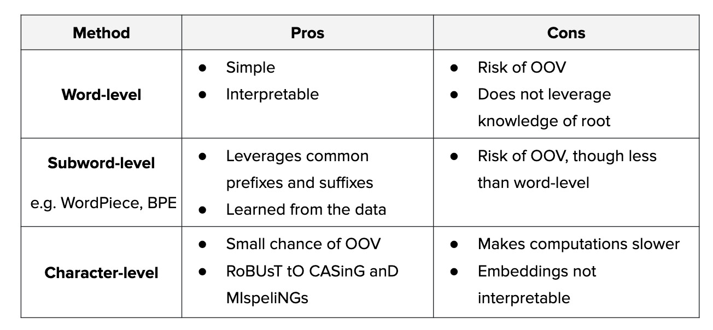

# From Language to Tokens

Tokenization is the interface that turns raw text into the discrete IDs a language model can process.

Online tokenizer visualization:

- https://tiktokenizer.vercel.app/?model=gpt2



---

## 1. The Fundamental Constraint

Neural networks operate on numbers, not strings.

A transformer does not directly receive a sentence. It receives a sequence of integer token IDs:

$$
x_1, x_2, \ldots, x_T
$$

where:

- $T$ is the token sequence length;
- $V$ is the vocabulary size;
- each token ID satisfies $x_t \in \{0,1,\ldots,V-1\}$.

The required pipeline is:

$$
\boxed{
\text{text}
\rightarrow
\text{tokens}
\rightarrow
\text{token IDs}
\rightarrow
\text{embeddings}
\rightarrow
\text{model}
}
$$

Tokenization is not optional. It is the entry point of language modeling.

---

## 2. Tokenization as an Interface

A tokenizer has two related jobs.

First, it segments text into tokens:

$$
\operatorname{Tok}(s)
=
(t_1,t_2,\ldots,t_T)
$$

where $s$ is a text string and $t_i$ is the $i$-th token.

Second, it maps tokens to integer IDs:

$$
\operatorname{ID}(t_i) = x_i
$$

The vocabulary is the lookup table that makes this mapping possible.

> [!INFO]
> In this mini-series, $T$ means sequence length and $V$ means vocabulary size. This convention will stay fixed across the lectures.

---

## 3. From IDs to Embeddings

Token IDs are still discrete symbols. A neural network needs vectors.

Let the embedding matrix be:

$$
E \in \mathbb{R}^{V \times d}
$$

where $d$ is the embedding dimension.

For token ID $x_t$, the embedding layer selects row $x_t$:

$$
e_t = E[x_t] \in \mathbb{R}^{1 \times d}
$$

The full token sequence becomes an embedding matrix:

$$
H^{(0)}
=
\begin{bmatrix}
e_1 \\
e_2 \\
\vdots \\
e_T
\end{bmatrix}
\in
\mathbb{R}^{T \times d}
$$

This is the first vector representation the transformer receives.

---

## 4. What Counts as a Token

A token is not necessarily a word.

Tokens can be:

- characters;
- bytes;
- whole words;
- subwords;
- punctuation;
- whitespace markers;
- special formatting markers.

For example, the word `unbelievable` might be tokenized as:

```text
un believable
```

or:

```text
un believ able
```

or even as individual characters. The choice changes the sequence length, vocabulary, and model behavior.

A place name can show the same issue. For example, `ShanghaiTech` might become:

```text
Shanghai Tech
```

or:

```text
Shang hai Tech
```

depending on the tokenizer vocabulary.

---

## 5. Tokenization and Compute

Self-attention has quadratic cost in sequence length:

$$
O(T^2)
$$

This means tokenization affects compute directly. If a tokenizer produces more tokens for the same text, the transformer has more positions to attend over.

| Strategy | Vocabulary Size | Sequence Length | Main Risk |
| --- | --- | --- | --- |
| Character-level | Small | Long | Expensive attention |
| Word-level | Large | Short | Unknown words |
| Subword-level | Medium | Medium | More complex training and decoding |

Tokenization is therefore a trade-off between representation flexibility and computational efficiency.

---

## 6. The Out-of-Vocabulary Problem

A word-level tokenizer can only represent words in its vocabulary.

If a word is missing, the system may map it to an unknown token:

```text
rare_new_name -> <unk>
```

This destroys information. Many different words collapse into the same ID.

Subword tokenization reduces this problem by representing rare words as smaller known pieces:

```text
rare_new_name -> rare _ new _ name
```

The exact split depends on the tokenizer, but the important point is coverage: the model can still receive a usable sequence instead of a single unknown symbol.

> [!WARNING]
> Unknown-token collapse is not a small nuisance. It can erase names, code, technical terms, typos, and multilingual content.

---

## 7. Special Tokens

Tokenizers often reserve IDs for structural tokens.

| Token | Common Role |
| --- | --- |
| `<bos>` | Beginning of sequence |
| `<eos>` | End of sequence |
| `<pad>` | Padding for batching |
| `<unk>` | Unknown token |
| `<mask>` | Masked prediction |
| `[CLS]` | Classification marker |
| `[SEP]` | Segment separator |

Instruction-tuned and chat models may also use role or boundary tokens, such as system, user, and assistant markers.

These tokens are part of the model's input language. They help define task format, sequence boundaries, and conversation structure.

---

## 8. Vocabulary Size and Parameters

The embedding table contains:

$$
\boxed{
Vd
}
$$

parameters.

For example, if $V = 50{,}000$ and $d = 768$, then the token embedding matrix has:

$$
50{,}000 \times 768 = 38{,}400{,}000
$$

parameters.

A larger vocabulary can shorten sequences, but it increases embedding parameters. A smaller vocabulary reduces embedding parameters, but it can make sequences longer.

---

## 9. Tokenization Is Model Design

Two models with the same transformer architecture can behave differently if their tokenizers differ.

Tokenization determines:

- which strings become single units;
- how long inputs become;
- how names, numbers, code, and punctuation are represented;
- which IDs are sent to the embedding table;
- which input patterns the model sees during training.

> [!WARNING]
> A trained model and its tokenizer are a coupled system. Swapping tokenizers usually breaks the meaning of token IDs and the embedding lookup.

---

## 10. Summary

Tokenization converts raw text into the discrete interface required by language models.

The central idea is:

$$
\boxed{
\text{text becomes token IDs, and token IDs select embedding vectors}
}
$$

The next lecture studies the key design choice: how fine or coarse the tokens should be.
