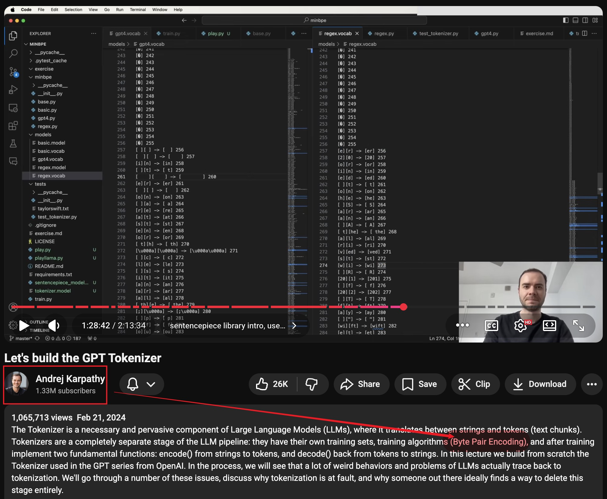
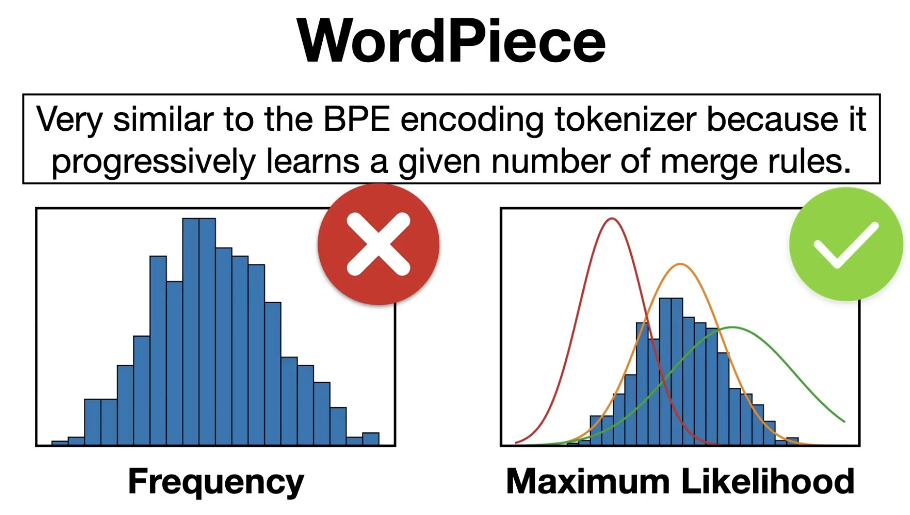

# BPE vs WordPiece


### Subword Tokenization as Learned Vocabulary Construction





---

## 1. The Core Idea

Modern language models do not operate on words directly.
Instead, they operate on **subword units**.

The goal of a tokenizer is to construct a vocabulary that satisfies:

* any input string can be represented
* sequences are not too long
* vocabulary size remains manageable

A useful abstraction is:

$$
\text{Tokenization} = \text{mapping text into reusable subword units}
$$

Both **BPE** and **WordPiece** solve this by **learning a vocabulary through merging**.

---

## 2. A Unified View: Merge-Based Learning

We start from very small units (characters or bytes), and iteratively build larger ones.

General procedure:

1. Initialize a base vocabulary $\mathcal{V}_0$
2. Scan a corpus $\mathcal{D}$
3. Repeatedly merge pairs of tokens
4. Stop when target vocabulary size is reached

This can be viewed as learning a dictionary:

$$
\mathcal{V} = \mathcal{V}_0 \cup \text{merged units}
$$

The key difference between methods lies in **how the merge is chosen**.

---

## 3. Byte-Pair Encoding (BPE)

### 3.1 Merge Rule

BPE is **frequency-driven**.

At each step, we select the most frequent adjacent pair:

$$
(a^*, b^*) = \arg\max_{(a,b)} \text{count}(a,b)
$$

and merge it into a new token.

---

### 3.2 Example

Corpus:

```
low lower lowest
new newer newest
```

Initial tokens (characters):

```
l o w
l o w e r
l o w e s t
n e w
n e w e r
n e w e s t
```

**Step 1: count pairs**

Frequent pairs include:

* $(l, o)$
* $(o, w)$
* $(w, e)$

Merge $(l, o) \rightarrow lo$

**Step 2: recompute**

Now $(lo, w)$ becomes frequent → merge into $low$

Over time, the vocabulary evolves:

$$
\{l, o, w, \dots\} \rightarrow \{lo, low, \dots\}
$$

---

### 3.3 Interpretation

BPE builds tokens that reflect:

* frequent substrings
* common morphemes
* entire words (if frequent enough)

It is:

* simple
* deterministic
* purely data-driven

---

## 4. WordPiece

### 4.1 Objective

WordPiece uses a **likelihood-based perspective**.

Instead of raw frequency, it prefers merges that improve how well the corpus is explained:

$$
\max \sum_{w \in \mathcal{D}} \log P(w \mid \text{subword decomposition})
$$

In practice, this is approximated, but conceptually:

* BPE asks: *what appears most often?*
* WordPiece asks: *what best explains the data?*





---

### 4.2 Token Structure

WordPiece introduces **continuation markers**.

Example:

```
playing → play ##ing
```

```
unhappiness → un ##hap ##pi ##ness
```

This enforces a structure:

* first token = start of word
* subsequent tokens = continuation

---

### 4.3 Interpretation

WordPiece emphasizes:

* probabilistic consistency
* structured decomposition
* cleaner reconstruction of words

---

## 5. Key Differences

| Aspect           | BPE                    | WordPiece                   |
| ---------------- | ---------------------- | --------------------------- |
| Merge criterion  | frequency              | likelihood (approximate)    |
| View of training | compression-like       | language modeling-like      |
| Token structure  | unconstrained          | uses continuation markers   |
| Typical behavior | builds frequent chunks | builds useful subword units |

---

## 6. A Deeper Perspective

Both methods can be understood as solving:

$$
\text{Find } \mathcal{V} \text{ such that text can be efficiently encoded}
$$

But they optimize different proxies:

* **BPE** minimizes redundancy via frequency
* **WordPiece** maximizes likelihood under a model

Despite this difference, their outputs are often similar in practice.

---

## 7. Tokenization as a System Constraint

A trained model is tightly coupled to its tokenizer:

$$
\text{Model} + \text{Tokenizer} = \text{One System}
$$

Changing the tokenizer changes:

* token IDs
* embedding lookup
* input distribution

Thus:

* tokenizers are not interchangeable
* even small changes can break model behavior

---

## 8. Final Takeaways


1. Both BPE and WordPiece are **merge-based subword methods**
2. BPE is **frequency-driven**; WordPiece is **likelihood-driven**
3. Both construct a vocabulary of reusable text fragments
4. The tokenizer defines the **interface between raw text and the model**
