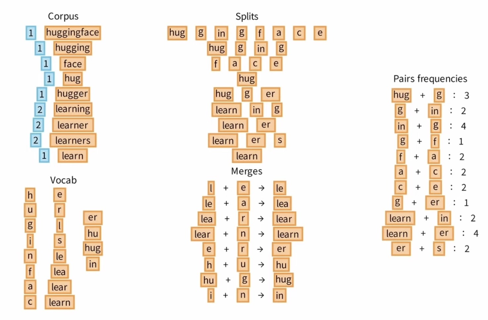
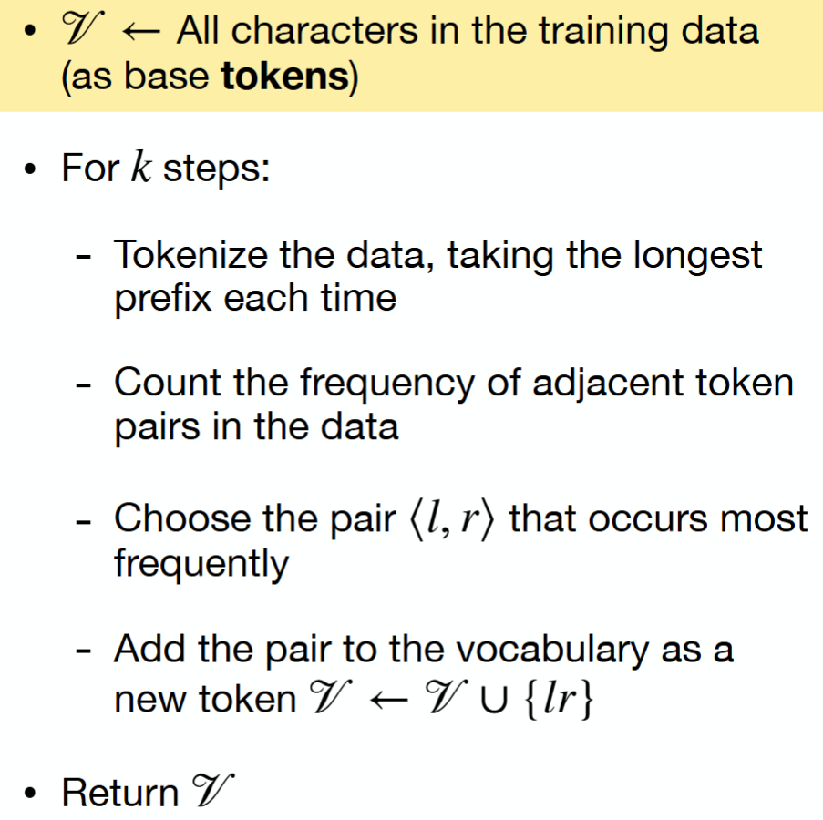

# BPE and WordPiece

BPE and WordPiece are subword tokenization algorithms. Both learn reusable text pieces from a corpus, but they choose pieces using different criteria.


---

## 1. Subword Vocabulary Learning

Modern language models need a vocabulary that is:

- expressive enough to represent any input;
- compact enough to keep embeddings manageable;
- efficient enough to keep sequences short;
- stable enough to use during training and inference.

A useful abstraction is:

$$
\boxed{
\text{tokenization learns a reusable dictionary of text fragments}
}
$$

Subword algorithms start with small units and build larger units from corpus statistics.

---

## 2. Shared Notation

Let:

- $\mathcal{D}$ be the training corpus;
- $\mathcal{V}_0$ be the initial vocabulary;
- $\mathcal{V}$ be the final vocabulary;
- $M$ be the number of merge steps;
- $V = |\mathcal{V}|$ be the final vocabulary size.

The general pattern is:

$$
\mathcal{V}
=
\mathcal{V}_0
\cup
\{\text{learned merged tokens}\}
$$

The initial vocabulary may be characters or bytes. Byte-level initialization gives especially strong coverage.

---

## 3. Byte-Pair Encoding

Byte-pair encoding, or BPE, is frequency-driven.

At each training step, BPE finds the most frequent adjacent pair of current tokens:

$$
(a^*,b^*)
=
\arg\max_{(a,b)}
\operatorname{count}(a,b)
$$

Then it merges that pair into a new token:

$$
a^* b^*
\rightarrow
a^*b^*
$$

The process repeats until the target vocabulary size is reached.

---

## 4. BPE Example

Suppose the corpus contains:

```text
low lower lowest
new newer newest
```

Start from characters:

```text
l o w
l o w e r
l o w e s t
n e w
n e w e r
n e w e s t
```

If the pair `l o` is frequent, BPE can merge it:

```text
l o -> lo
```

After recomputing pair counts, `lo w` may become frequent:

```text
lo w -> low
```

Over many steps, frequent fragments become vocabulary entries.



---

## 5. BPE Training Algorithm

```text
Input: corpus, initial vocabulary, target vocabulary size

while vocabulary is smaller than target size:
    tokenize corpus using the current units
    count adjacent token pairs
    choose the most frequent pair
    add the merged pair to the vocabulary
    replace that pair in the corpus representation

Output: final vocabulary and ordered merge rules
```

The ordered merge rules matter. Encoding new text applies learned merges in the learned order.



---

## 6. BPE Strengths and Weaknesses

BPE is strong because it is:

- simple;
- deterministic after training;
- efficient to implement;
- good at compressing frequent strings;
- robust when initialized from bytes.

Its weaknesses include:

- merges are based mostly on frequency, not meaning;
- rare morphology can be split awkwardly;
- token boundaries may not match linguistic boundaries;
- different training corpora can produce very different vocabularies.

---

## 7. WordPiece

WordPiece is also a subword vocabulary method, but it is usually explained through a likelihood perspective.

Instead of only asking which pair appears most often, WordPiece asks which vocabulary addition best improves the model's ability to explain the corpus.

Conceptually, it prefers a vocabulary that gives high probability to the corpus:

$$
\max_{\mathcal{V}}
\sum_{w \in \mathcal{D}}
\log P(w \mid \mathcal{V})
$$

In practical descriptions, WordPiece merge scoring is often approximated using statistics that reward pairs which are strongly associated, not merely frequent.


---

## 8. Continuation Markers

WordPiece often marks whether a subword can begin a word or must continue a word.

Example:

```text
playing -> play ##ing
```

The token `play` can appear at the start of a word. The token `##ing` indicates a continuation.

This helps preserve word-boundary information.

---

## 9. BPE Versus WordPiece

| Aspect | BPE | WordPiece |
| --- | --- | --- |
| Main criterion | Frequent adjacent pairs | Approximate likelihood or association |
| Training view | Compression-like | Language-model-like |
| Boundary markers | Optional | Commonly uses continuation markers |
| Typical behavior | Builds frequent chunks | Builds useful subword pieces |
| Used in | GPT-style tokenizers, many others | BERT-style tokenizers |

The outputs can look similar, but the training logic is not identical.

---

## 10. Encoding New Text

After training, the tokenizer must encode text that was not in the training corpus.

For BPE, encoding uses the learned merge list:

```text
start from base units
apply learned merges in order when possible
return the final token sequence
```

For WordPiece, encoding often uses a greedy longest-match strategy:

```text
at each word position, choose the longest vocabulary piece that fits
continue until the word is consumed
```

If no piece is available, the tokenizer may use `<unk>`, unless the tokenizer has byte-level or character-level fallback.

---

## 11. System Coupling

A trained model is tightly coupled to its tokenizer.

The tokenizer defines token IDs:

$$
\operatorname{ID}(t) = x
$$

The embedding table learns a vector for each ID:

$$
E[x] \in \mathbb{R}^{1 \times d}
$$

Changing the tokenizer changes the IDs, which changes the meaning of embedding lookup.

> [!WARNING]
> Tokenizers are not interchangeable after model training. A different tokenizer sends different IDs into the same embedding table, so the model receives a different language.

---

## 12. Summary


BPE and WordPiece both learn subword vocabularies, but their merge criteria differ.

The central comparison is:

$$
\boxed{
\text{BPE: frequent pairs}
\qquad
\text{WordPiece: useful likelihood-oriented pieces}
}
$$

Both methods solve the same practical problem: represent open-ended text with a fixed, manageable vocabulary.
