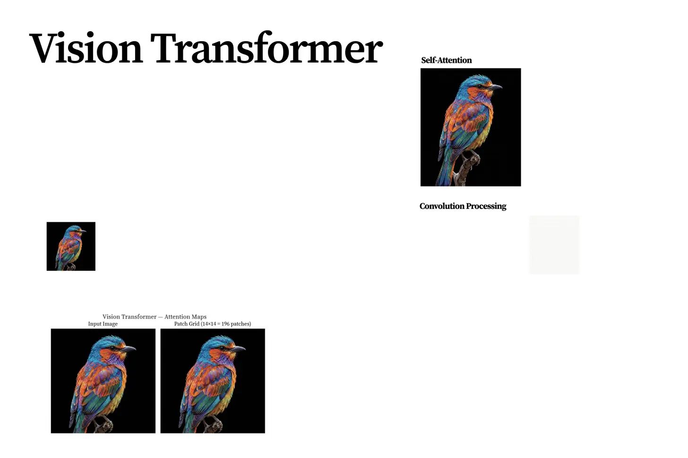
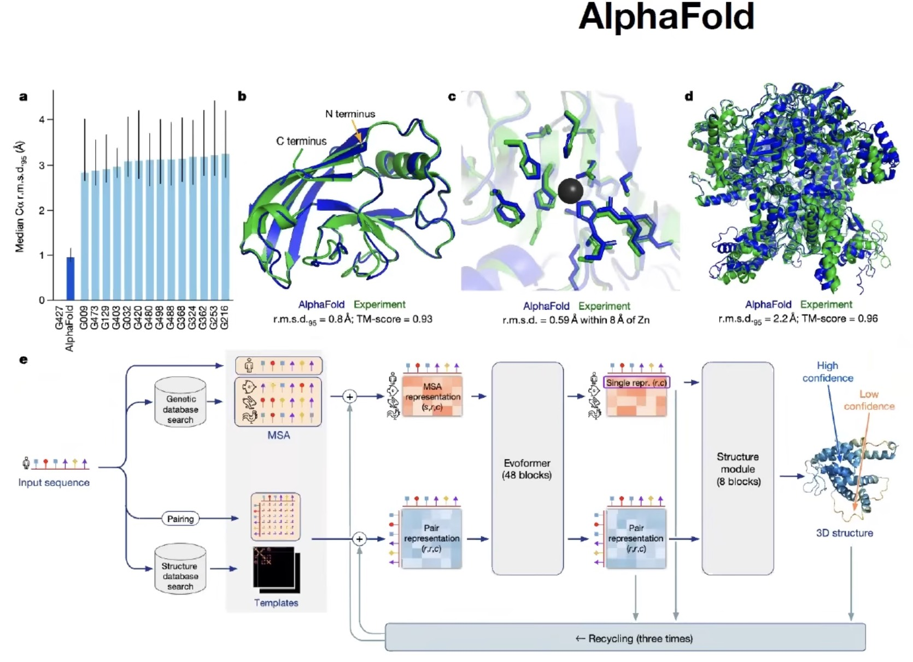

# Tokenization Beyond Text

Tokenization is a broader idea than text preprocessing. It means converting raw data into a sequence of units that a model can process.

---

## 1. The Unified Sequence View

Transformers operate on sequences.

The general recipe is:

$$
\boxed{
\text{raw modality}
\rightarrow
\text{sequence of tokens}
\rightarrow
\text{embeddings}
\rightarrow
\text{transformer}
}
$$

For text, tokens are usually discrete IDs. For images or audio, a token may instead be a patch, frame, tile, or learned codebook entry.

> [!INFO]
> In multimodal modeling, the word "token" can mean either a discrete symbol ID or a sequence element represented by a continuous vector. The shared idea is sequence structure.

---

## 2. Image Tokenization

Vision transformers split an image into patches.

For an image:

$$
I \in \mathbb{R}^{H \times W \times C}
$$

with patch size $P \times P$, the number of image patches is:

$$
N =
\frac{H}{P}
\cdot
\frac{W}{P}
$$

Each patch is flattened and projected into a vector:

$$
h_i
=
\operatorname{flat}(P_i)E
$$

where:

$$
E \in \mathbb{R}^{P^2C \times d}
$$

The image becomes a sequence:

$$
H =
\begin{bmatrix}
h_1 \\
\vdots \\
h_N
\end{bmatrix}
\in
\mathbb{R}^{N \times d}
$$

Spatial position information is added because attention alone does not know where each patch came from.

---

## 3. Video Tokenization

Video adds time to image tokenization.

A video can be represented as:

$$
V_{\mathrm{video}}
\in
\mathbb{R}^{T_{\mathrm{frame}} \times H \times W \times C}
$$

A tokenizer may split it into space-time cubes. If the temporal patch size is $P_t$ and the spatial patch size is $P \times P$, the number of tokens is roughly:

$$
N =
\frac{T_{\mathrm{frame}}}{P_t}
\cdot
\frac{H}{P}
\cdot
\frac{W}{P}
$$

The design must balance temporal detail against sequence length.

---

## 4. Audio Tokenization

Audio can be tokenized in several ways.

One common route is:

$$
\text{waveform}
\rightarrow
\text{spectrogram}
\rightarrow
\text{time-frequency tiles}
\rightarrow
\text{embeddings}
$$

The spectrogram turns sound into a two-dimensional representation over time and frequency. Tiles or frames then become sequence elements.

Another route uses learned discrete audio codes, where chunks of audio are mapped to codebook IDs.

---

## 5. Discrete Latent Tokens

Some generative systems convert images, audio, or video into discrete codebook entries.

Let the codebook be:

$$
C = \{c_1,c_2,\ldots,c_K\}
$$

An encoder maps a patch or region to the nearest code:

$$
z_i
=
\arg\min_{k}
\left\|h_i - c_k\right\|_2^2
$$

Now the non-text input becomes a sequence of discrete IDs:

$$
z_1,z_2,\ldots,z_N
$$

This makes image or audio generation look more like language modeling.

---

## 6. Protein and Genomic Tokenization

Proteins are naturally sequential. A protein can be represented as a sequence of amino-acid tokens.

DNA can be tokenized at different granularities:

- single bases;
- $k$-mers;
- codons;
- learned subword-like biological patterns.

The same trade-off appears again:

- smaller units improve coverage;
- larger units shorten sequences and may capture useful motifs;
- the tokenizer shapes what dependencies the model can easily represent.

---

## 7. Comparative View

| Modality | Common Token Unit | Representation | Main Bias |
| --- | --- | --- | --- |
| Text | Subwords or bytes | Discrete IDs | Morphology and formatting |
| Images | Patches | Continuous vectors or code IDs | Local spatial structure |
| Video | Space-time patches | Continuous vectors or code IDs | Motion and temporal continuity |
| Audio | Frames, tiles, or codes | Continuous vectors or code IDs | Time-frequency structure |
| Proteins | Amino acids or motifs | Discrete IDs | Sequential biological function |
| DNA | Bases, codons, or $k$-mers | Discrete IDs | Local sequence motifs |

---

## 8. Design Questions

For any modality, tokenization requires decisions:

- What is the basic unit?
- Is the token discrete or continuous?
- How long will the sequence become?
- What information is lost during tokenization?
- What position or structure must be added back?
- Does the tokenizer match the downstream task?

> [!WARNING]
> Tokenization is an inductive bias. A poor tokenization scheme can hide important structure before the model ever sees the data.

---

## 9. Summary

Tokenization is the art of turning data into model-readable sequences.

The central idea is:

$$
\boxed{
\text{if data can become a useful sequence, a transformer can process it}
}
$$

This is why tokenization matters not only for text, but also for vision, audio, biology, and multimodal systems.
