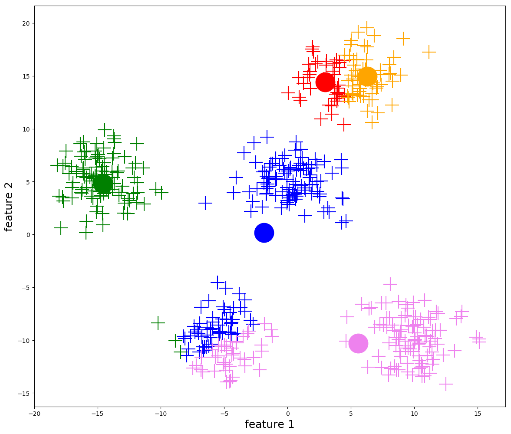
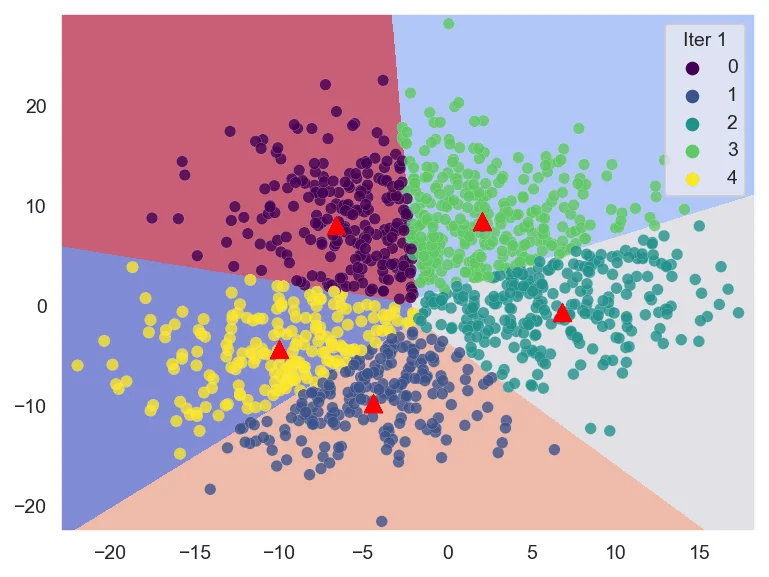

# K-Means Clustering

K-means is the first baseline for clustering: if labels are unavailable, choose $K$ centers and assign each point to the nearest center.



---

## 1. Clustering Versus Classification

Classification and clustering answer different questions.

| Setting | Data Available | Goal | Output |
| --- | --- | --- | --- |
| Classification | Inputs and labels | Predict a known label | A class prediction |
| Clustering | Inputs only | Discover group structure | A cluster assignment |

In this mini-series, we use the following notation:

- $n$: number of data points.
- $d$: feature or embedding dimension.
- $K$: number of clusters.
- $X \in \mathbb{R}^{n \times d}$: data matrix.
- $x^{(i)} \in \mathbb{R}^{1 \times d}$: the $i$-th data point.
- $\mu_k \in \mathbb{R}^{1 \times d}$: centroid of cluster $k$.
- $c_i \in \{1,\ldots,K\}$: cluster assigned to $x^{(i)}$.

> [!INFO]
> K-means is unsupervised, but it is not assumption-free. It assumes that Euclidean distance in the chosen feature space is meaningful.

---

## 2. The Core Idea

K-means tries to represent a dataset using $K$ prototype points. Each prototype is a centroid, and every data point belongs to the centroid nearest to it.

The algorithm alternates between two simple operations:

1. Assign each point to the nearest centroid.
2. Move each centroid to the mean of the points assigned to it.

This is why the method is called K-means: it learns $K$ means.



---

## 3. Objective Function

K-means minimizes the within-cluster sum of squared distances, also called inertia:

$$
\boxed{
J = \sum_{i=1}^{n} \left\|x^{(i)} - \mu_{c_i}\right\|_2^2
}
$$

Equivalently, if $C_k$ is the set of points assigned to cluster $k$,

$$
J = \sum_{k=1}^{K} \sum_{x^{(i)} \in C_k} \left\|x^{(i)} - \mu_k\right\|_2^2
$$

The objective becomes smaller when points are close to their assigned centroids.

---

## 4. Algorithm

```text
Input: data matrix X, number of clusters K
Initialize K centroids

repeat
    Assignment step:
        assign each point to its nearest centroid

    Update step:
        set each centroid to the mean of its assigned points

until assignments stop changing or the objective changes very little

Output: cluster assignments and centroids
```

The assignment step is:

$$
c_i = \arg\min_{k \in \{1,\ldots,K\}} \left\|x^{(i)} - \mu_k\right\|_2^2
$$

The update step is:

$$
\mu_k = \frac{1}{|C_k|}\sum_{x^{(i)} \in C_k} x^{(i)}
$$

Each iteration decreases or preserves the objective $J$, but it may converge to a local minimum.

---

## 5. What K-Means Assumes

K-means works best when:

- clusters are roughly spherical;
- clusters have similar size;
- clusters have similar density;
- Euclidean distance reflects the similarity we care about;
- $K$ is chosen reasonably.

K-means struggles when:

- clusters are curved or non-convex;
- clusters overlap strongly;
- clusters have very different densities;
- outliers pull centroids away from the main structure;
- raw features do not encode semantic similarity.

> [!WARNING]
> K-means can produce clean-looking clusters even when the clusters are not meaningful. Always inspect the representation space, not just the final assignments.

---

## 6. Practical Inspection

When using K-means, inspect at least four things:

1. The inertia curve as $K$ changes.
2. The number of points assigned to each cluster.
3. Representative samples nearest to each centroid.
4. Failure examples far from their assigned centroid.

For embeddings, the centroid often behaves like a rough semantic prototype. For raw pixels or sparse text vectors, it may be much less meaningful.

---

## 7. Summary

K-means is a strong first clustering baseline because it is simple, fast, and interpretable.

The central mechanism is:

$$
\boxed{
\text{assign points to nearest centroids, then move centroids to assigned means}
}
$$

The central limitation is equally important: K-means clusters geometry, not meaning. If the representation is poor, the clusters will be poor.
