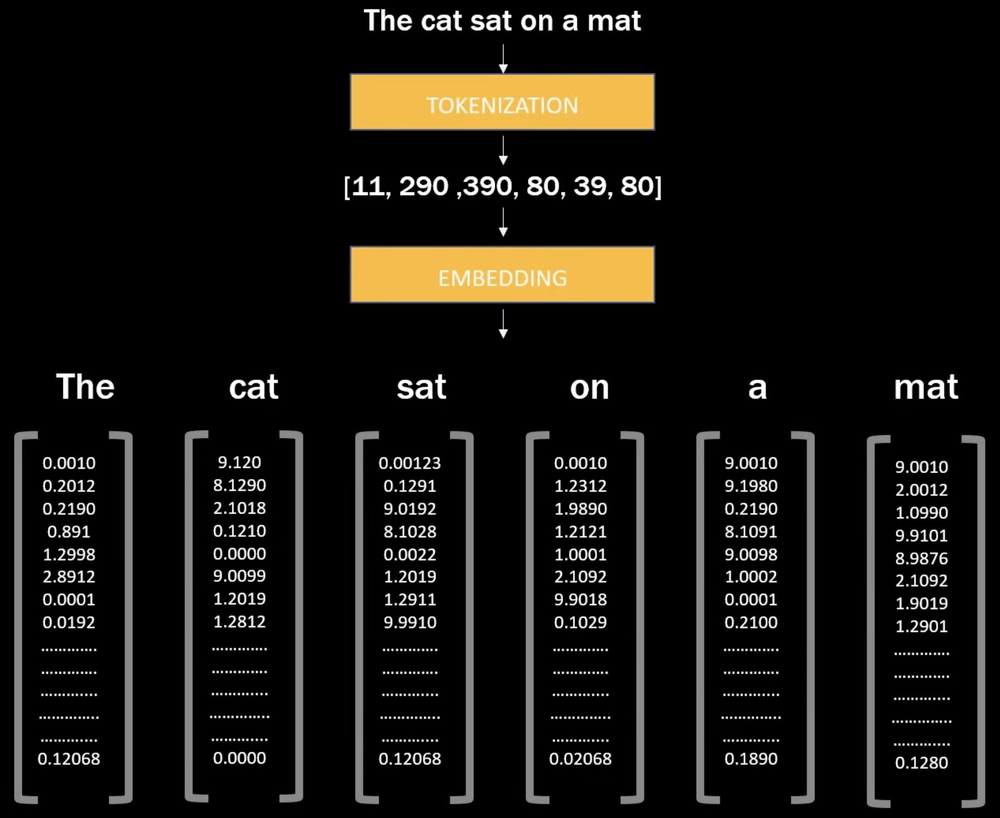

# From Discrete to Continuous: The Gap



Online visualization:
- https://projector.tensorflow.org/
- https://www.cs.cmu.edu/~dst/WordEmbeddingDemo/tutorial.html

---

## 1. The Problem: Computers Don't Understand Symbols

Human language is made of discrete symbols: "cat", "dog", "love".

Computers work with numbers: $0.5$, $-1.2$, $3.14159$.

The fundamental question of NLP:

> How do we bridge the gap between discrete tokens and continuous vectors?

This is not just a technical detail. It shapes everything that follows in deep learning for language.

---

## 2. The One-Hot Encoding Trap

### 2.1 First Attempt: One-Hot Vectors

The naive approach: assign each word a unique index, then encode it as a binary vector.

```python
import numpy as np

vocab = ["the", "cat", "sat", "on", "mat"]
vocab_size = len(vocab)

# One-hot encoding: each word is a vector of size vocab_size
# "cat" is at index 1
cat_onehot = np.zeros(vocab_size)
cat_onehot[1] = 1
# Result: [0, 1, 0, 0, 0]
```

### 2.2 The Math

For a vocabulary of size $V$, each word becomes a vector:

$$
\mathbf{e}_i \in \mathbb{R}^{V}
$$

where only position $i$ is 1, all others are 0.

### 2.3 The Disaster: Dimensionality

Consider a modern vocabulary:

| Vocabulary Size | One-Hot Dimension |
|-----------------|-------------------|
| Small (10K)     | 10,000            |
| GPT-2 (50K)     | 50,000            |
| GPT-3 (100K)    | 100,000           |
| Multilingual (200K+) | 200,000+     |

Each token becomes a vector with 100,000+ dimensions, but only **one** non-zero entry.

This is:
- Memory inefficient
- Computationally wasteful
- **Semantically empty**

---

## 3. The Semantic Void

### 3.1 What's Missing?

One-hot vectors encode **identity**, not **meaning**.

Consider:

$$
\begin{array}{l}
\text{``cat''} = [0, \; 1, \; 0, \; 0, \; 0, \; \dots] \\
\text{``dog''} = [0, \; 0, \; 0, \; 1, \; 0, \; \dots]
\end{array}
$$

The dot product:

$$
\text{cat} \cdot \text{dog} = 0
$$

Every pair of distinct words has zero similarity.

But we know:
- "cat" and "dog" are similar (both animals, both pets)
- "cat" and "automobile" are different
- "king" and "queen" relate in a specific way

One-hot encoding discards all this structure.

---

## 4. The Intuition: What We Need

Imagine a map where:
- Similar words are close together
- Related concepts cluster
- Directions encode relationships

This is the geometric view of meaning.

> Words with similar contexts should have similar vectors.

This idea, called the **distributional hypothesis**, will guide us in the next lecture.

---

## 5. Dimensionality Reduction: The Path Forward

If we could compress 100,000 dimensions into, say, 512 dimensions—while preserving semantic relationships—we would solve two problems at once:

1. **Efficiency**: Smaller vectors are faster to compute
2. **Generalization**: Dense vectors capture patterns and similarities

This is what word embeddings do.

---

## 6. The Gateway to Neural Computation

From one-hot:

$$
\mathbf{x} \in \mathbb{R}^{V}, \quad \|\mathbf{x}\|_0 = 1
$$

To dense embedding:

$$
\mathbf{e} \in \mathbb{R}^{d}, \quad d \ll V
$$

The transformation from discrete to continuous is the first step in any neural language model.

In nanochat, this happens in a single line:

```python
# From nanochat/gpt.py
x = self.transformer.wte(idx)  # (batch, seq_len) -> (batch, seq_len, n_embd)
```

The `wte` ("word token embedding") layer converts token indices into dense vectors.

**Typical dimensions**:
- Vocabulary size $V$: 32,000–100,000
- Embedding dimension $d$: 512–4,096
- Compression ratio: $\frac{V}{d} \approx 40\times$

