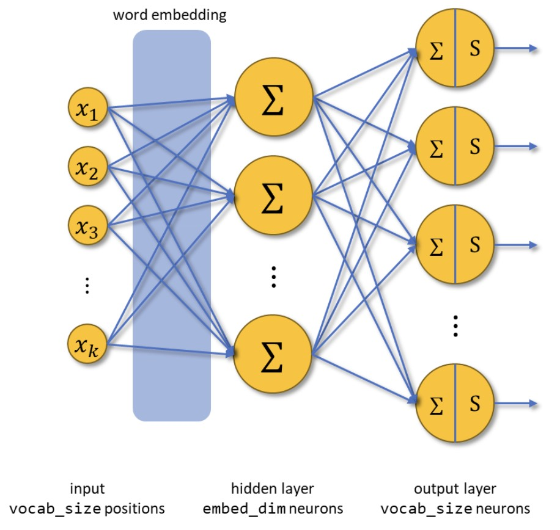
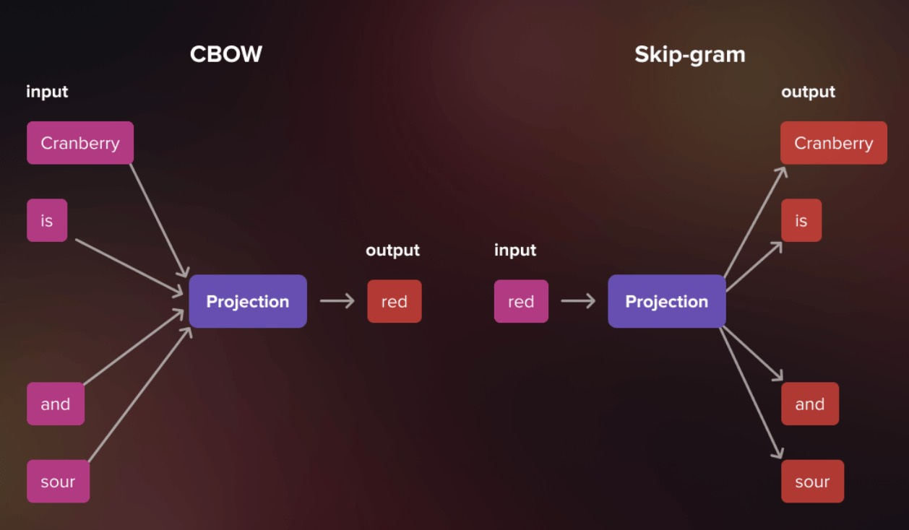
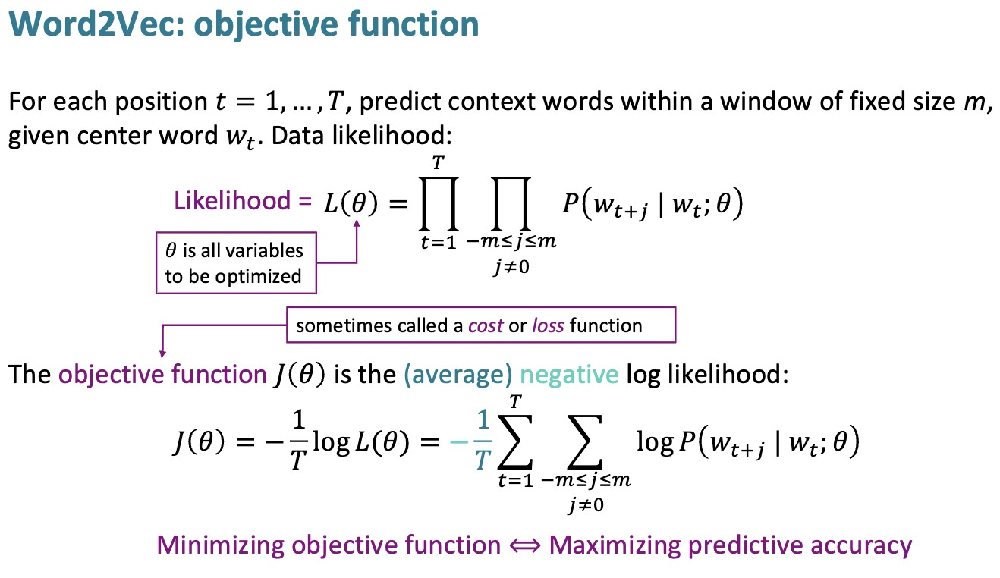
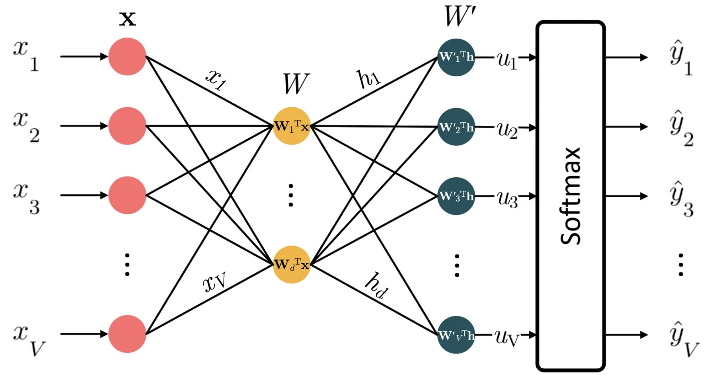
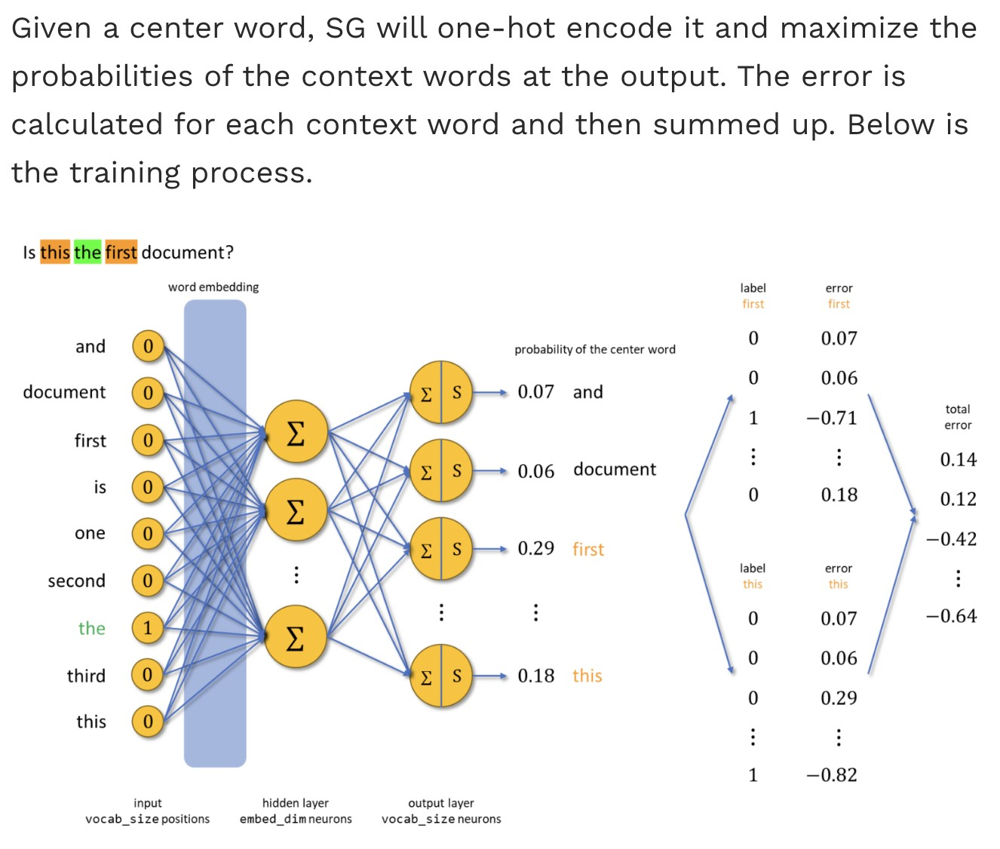
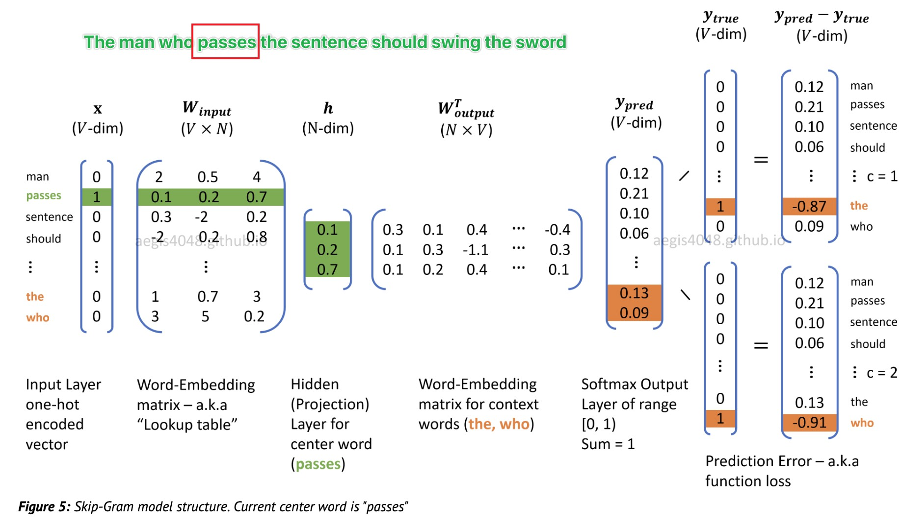
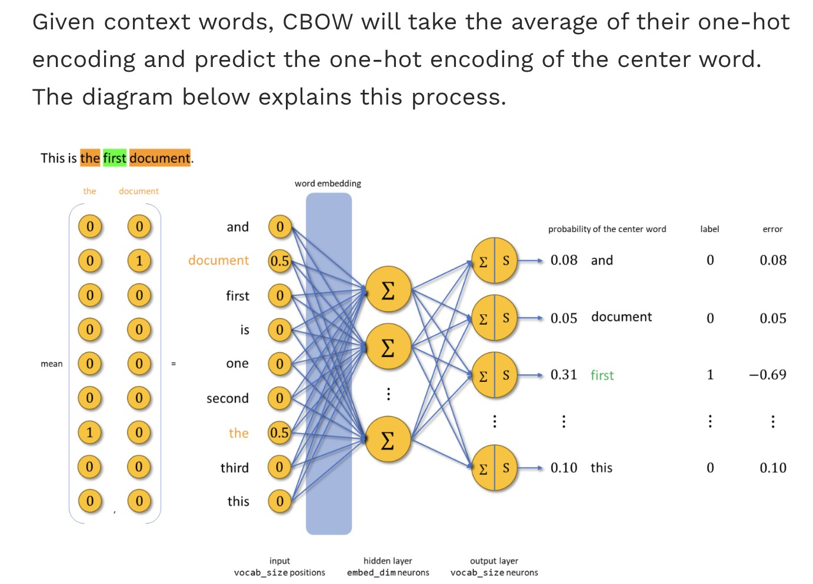

# Word2Vec 



- Paper: https://arxiv.org/pdf/1301.3781

---

## 1. Motivation: Why Do We Need Better Representations?

In earlier lectures, we saw that clustering performance depends heavily on the quality of representations. For text data, a natural starting point is the Bag of Words model.

### Bag of Words

Each document is represented as a row vector of word counts:

$$
x \in \mathbb{R}^{|V|}
$$

where $|V|$ is the vocabulary size.

This representation is:

* High-dimensional
* Sparse
* Semantically naive

For example:

* "cat" and "dog" are orthogonal
* No notion of similarity is encoded

---

## 2. A New Principle: Learning from Context

To overcome this, we adopt the **distributional hypothesis**:

> Words that appear in similar contexts have similar meanings.

Instead of manually defining features, we define a learning task:

> Predict context relationships, and let the model learn representations.

---


## 3. Constructing the Learning Problem




We define a context window of size $c$ around each word $w_t$:

$$
(w_{t-c}, \dots, w_{t-1}, w_t, w_{t+1}, \dots, w_{t+c})
$$

From this, we generate training signals in two ways.


### 3.1 Skip-gram: Word to Context



Given a center word, predict its surrounding words:

$$
w_t \rightarrow {w_{t-c}, \dots, w_{t-1}, w_{t+1}, \dots, w_{t+c}}
$$

This produces multiple training pairs:

$$
(w_t, w_{t+j}), \quad j \neq 0
$$


### 3.2 CBOW: Context to Word

Given surrounding words, predict the center word:

$$
{w_{t-c}, \dots, w_{t-1}, w_{t+1}, \dots, w_{t+c}} \rightarrow w_t
$$

### Key Observation

Both formulations aim to learn:

> representations that make context prediction accurate.

---

## 4. Neural Network Formulation



Word2Vec implements these objectives using a simple neural network.

### 4.1 Architecture

A single hidden layer. No activation. Just linear transformation.


$$
\begin{gathered}
\boxed{\text{Input: One-hot vector (size } V\text{)}} \\
\downarrow \\
\boxed{\text{Hidden: Embedding matrix } W \text{ (size } V \times d\text{)}} \\
\downarrow \\
\boxed{\text{Output: Softmax over vocabulary (size } V\text{)}}
\end{gathered}
$$


### 4.2 Input Representation

Each word is encoded as a one-hot vector:

$$
x \in \mathbb{R}^{|V|}
$$


### 4.3 Embedding Layer

The first layer is a linear transformation:

$$
h = x W
$$

where:

* $W \in \mathbb{R}^{|V| \times d}$ (embedding matrix, each row is a word embedding)
* $h \in \mathbb{R}^{d}$ (embedded vector)

Because $x$ is one-hot:

> $h$ directly selects a row of $W$

This row is the embedding of the input word.

### 4.4 Output Layer

The hidden vector is mapped back to vocabulary space:

$$
z = h W'
$$

where:

* $W' \in \mathbb{R}^{d \times |V|}$ (unembedding matrix)
* $z \in \mathbb{R}^{|V|}$ (logits over vocabulary)


### 4.5 Softmax Prediction

$$
P(w_o \mid w_i) = \frac{\exp(z_o)}{\sum_{w \in V} \exp(z_w)}
$$

---

## 5. Skip-gram Objective



The Skip-gram model maximizes the likelihood of observing context words:

$$
J = \frac{1}{T} \sum_{t=1}^{T} \sum_{-c \leq j \leq c, j \neq 0} \log P(w_{t+j} \mid w_t)
$$

Each word contributes multiple training signals, making the model sensitive to detailed context patterns.





---

## 6. CBOW Objective



The CBOW model aggregates context embeddings:

$$
h = \frac{1}{2c} \sum_{j \neq 0} v_{t+j}
$$

and predicts the center word:

$$
J = \frac{1}{T} \sum_{t=1}^{T} \log P(w_t \mid \text{context})
$$

This leads to:

* Fewer training examples
* Faster computation
* Smoother representations

---

## 7. What the Network Learns

The parameters of the model are:

* $W$: input embeddings
* $W'$: output embeddings

After training:

* Each row of $W$ is a word vector
* These vectors encode semantic relationships

---

## 8. Skip-gram vs CBOW in Practice

### Skip-gram

* More training signals per word
* Better for rare words
* Higher computational cost

### CBOW

* Faster training
* More stable
* Less sensitive to rare words

### Practical Guideline

* Large-scale corpus and semantic precision → Skip-gram
* Smaller datasets or efficiency requirements → CBOW

---

## 9. From Representations to Structure

Word2Vec completes an important transition:

### From

* Sparse, high-dimensional vectors (Bag of Words)

### To

* Dense, learned embeddings

### Implication

Once words are embedded in $\mathbb{R}^d$:

* Distance reflects similarity
* Structure emerges in the space

---

## 10. Connection to Clustering

This directly connects back to the clustering pipeline:

$$
\text{text} \rightarrow \text{embedding} \rightarrow \text{clustering}
$$

With Word2Vec:

* Input space becomes continuous
* Clustering methods become meaningful

---

## 11. From Word2Vec to Transformers

### In nanochat

Token embeddings are initialized with random values and learned end-to-end:

```python
# From nanochat/gpt.py init_weights()
torch.nn.init.normal_(self.transformer.wte.weight, mean=0.0, std=0.8)
```

Unlike Word2Vec (which trains embeddings separately), transformers learn embeddings jointly with all other parameters through next-token prediction—essentially a massive, contextual Skip-gram where context means "everything before this token."

