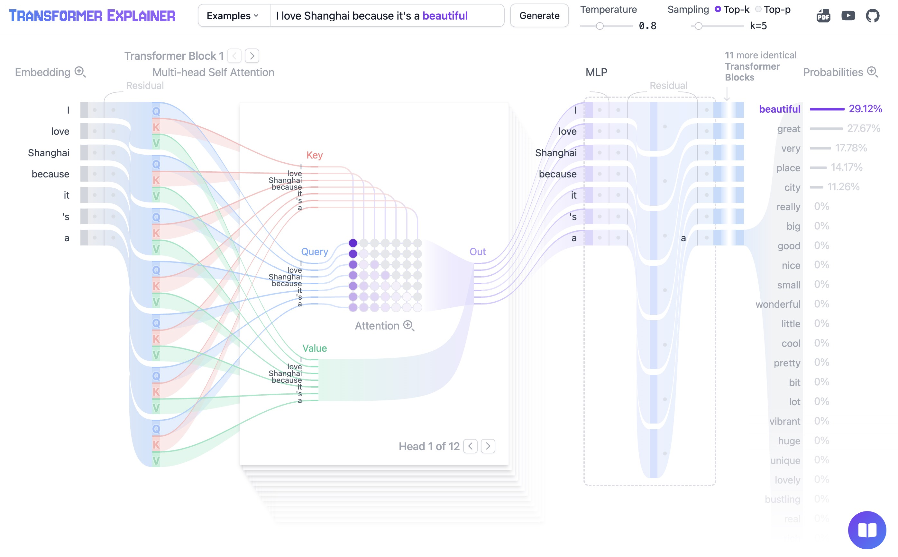

# Embedding Layer and Unembedding Layer in Transformers 

---

## 1. From Word2Vec to Transformers

In Word2Vec:

* Each word has a single static embedding
* Embeddings are learned independently from downstream tasks

Transformers learn embeddings as part of a global end-to-end optimization pipeline.

Everything is trained jointly to minimize the final loss (e.g., next-token prediction), including:

* Embedding layer
* Transformer layers
* Output projection (unembedding layer)

---

## 2. Tokenization and Discrete Inputs

Text is first converted into token IDs using a tokenizer:

$$
x = (x_1, x_2, \dots, x_n)
$$

Each token belongs to a finite vocabulary:

$$
x_i \in \{1, 2, \dots, V\}
$$

where $V$ is the vocabulary size.

At this stage:

* Tokens are purely discrete symbols
* No semantic structure exists yet
* The model only sees integers

---

## 3. Embedding Layer: Learnable Input Interface

The embedding layer is a learnable lookup table:

$$
E \in \mathbb{R}^{V \times d}
$$

where each row is the embedding of a token.

Each token is mapped into a continuous vector:

$$
h_i^{(0)} = E[x_i] \in \mathbb{R}^{d}
$$

The full sequence becomes:

$$
H^{(0)} = (h_1^{(0)}, h_2^{(0)}, \dots, h_n^{(0)})
$$

Key point:

The embedding matrix is not pretrained separately. It is learned jointly with the entire Transformer in an end-to-end fashion.

This is critical:

* Gradients from the final loss flow directly into $E$
* Embeddings are optimized for the downstream task objective
* No separation between representation learning and task learning

---

## 4. Positional Encoding

Since the embedding layer alone is permutation-invariant, positional information is injected:

$$
\tilde{h}_i^{(0)} = h_i^{(0)} + p_i
$$

where $p_i$ encodes token position.

This ensures that:

* Word order is preserved
* Sequence structure is representable

Importantly, positional encodings are also trained (in learned variants) or integrated into the end-to-end system.

---

## 5. End-to-End Representation Learning in Transformers

After embedding, the sequence passes through Transformer layers:

$$
H^{(0)} \rightarrow H^{(1)} \rightarrow \dots \rightarrow H^{(L)}
$$

Each layer performs self-attention and nonlinear transformations.

All parameters are optimized jointly under a single objective:

* Embedding matrix $E$
* Attention weights
* Feed-forward networks
* Normalization layers
* Output projection matrix

Everything is differentiable and trained end-to-end via backpropagation.

No component is trained independently.

---

## 6. Unembedding Layer: Mapping Back to Vocabulary

The final hidden states are:

$$
H^{(L)} = (h_1^{(L)}, h_2^{(L)}, \dots, h_n^{(L)})
$$

where each $h_i^{(L)} \in \mathbb{R}^{d}$ is a vector.

To generate predictions over the vocabulary, we apply a linear projection:

$$
U \in \mathbb{R}^{d \times V}
$$

Logits are computed as:

$$
\text{logits}_i = h_i^{(L)} U \in \mathbb{R}^{V}
$$

Then probabilities are obtained via softmax:

$$
P(x_{i+1} \mid x_{\le i}) = \text{softmax}(\text{logits}_i)
$$

Again, this layer is not separate from training:

* It is learned jointly with all other parameters
* Gradients flow from prediction error back into $U$

---

## 7. Weight Tying: Shared Input–Output Geometry

A possible design choice is weight tying:

$$
U = E
$$

This means:

* The same matrix is used for embedding and unembedding

Interpretation:

* Input side: maps tokens → vectors
* Output side: measures similarity between vectors and token embeddings

---

## 8. Geometric View of Prediction

Logits can be rewritten as dot products:

$$
\text{logits}_i[j] = h_i^{(L)} u_j
$$

where $u_j \in \mathbb{R}^{d \times 1}$ is the column vector for token $j$ (the j-th column of U).

Thus prediction becomes:

The model selects the token whose embedding is most aligned with the current hidden state.

This ties Transformer decoding directly to geometric similarity in embedding space.

---

## 9. End-to-End Learning as the Core Principle

An important characteristic of Transformers is end-to-end optimization:

A single loss function drives learning of:

* Embedding layer
* Attention layers
* Feed-forward networks
* Unembedding layer

Formally (with teacher forcing and causal masking):

$$
\mathcal{L} = -\sum_{i=1}^{n} \log P(x_{i+1} \mid x_{\le i})
$$

Every parameter participates in minimizing this objective.

Key consequence:

* Embeddings are not “precomputed features”
* They are task-specific, adaptive, and continuously refined during training

This is fundamentally different from Word2Vec or traditional feature engineering pipelines.
