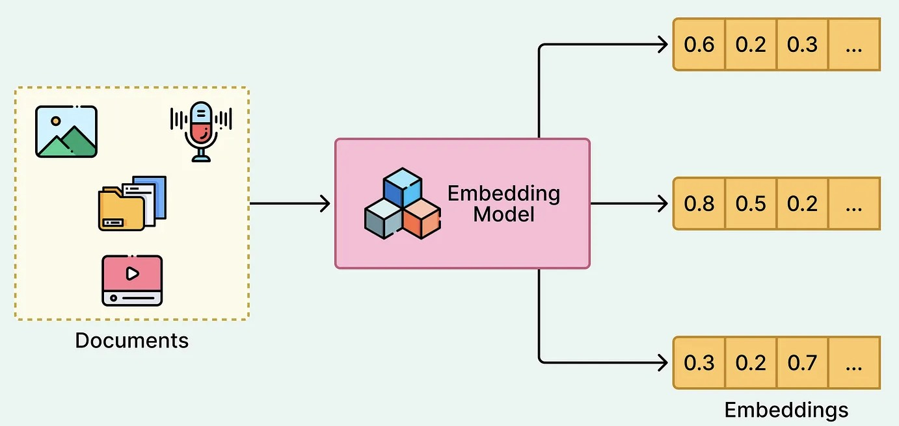
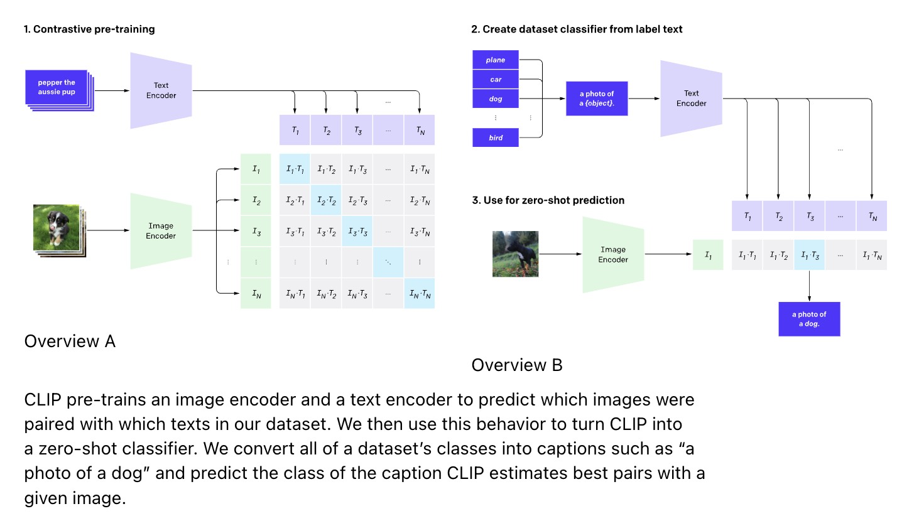
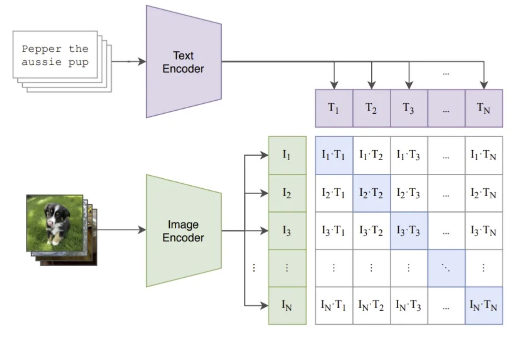
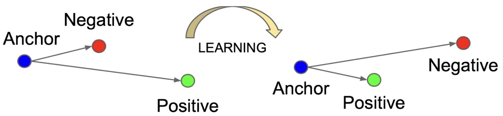

# Multimodal Alignment

Multimodal alignment learns a shared embedding space where different data types, such as images and text, can be compared directly.

Paper:

- https://arxiv.org/abs/2103.00020

---

## 1. The Problem

Earlier lectures described text embeddings and image embeddings separately.

Text encoder:

$$
g_{\phi}(\text{text}) = z_{\mathrm{text}}
$$

Image encoder:

$$
f_{\theta}(\text{image}) = z_{\mathrm{image}}
$$

If these vectors live in unrelated spaces, we cannot directly compare an image with a caption.

Multimodal alignment asks:

$$
\boxed{
\text{Can different modalities share one semantic geometry?}
}
$$

---

## 2. The Core Idea

Suppose an image $I_i$ matches a text caption $T_i$.

We want:

$$
\operatorname{sim}
\left(
f_{\theta}(I_i),
g_{\phi}(T_i)
\right)
\text{ high}
$$

For a mismatched caption $T_j$ where $j \ne i$, we want:

$$
\operatorname{sim}
\left(
f_{\theta}(I_i),
g_{\phi}(T_j)
\right)
\text{ low}
$$

The model learns by pulling matched pairs together and pushing mismatched pairs apart.

---

## 3. CLIP

CLIP, or contrastive language-image pre-training, is a major example of multimodal alignment.

It uses:

- an image encoder $f_{\theta}$;
- a text encoder $g_{\phi}$;
- many image-caption pairs;
- a contrastive objective.

The encoders produce normalized embeddings:

$$
z_i^{\mathrm{image}}
=
\frac{f_{\theta}(I_i)}
{\left\|f_{\theta}(I_i)\right\|_2}
$$

$$
z_i^{\mathrm{text}}
=
\frac{g_{\phi}(T_i)}
{\left\|g_{\phi}(T_i)\right\|_2}
$$

Similarity is usually a dot product:

$$
s_{ij}
=
z_i^{\mathrm{image}}
{z_j^{\mathrm{text}}}^{\top}
$$

---

## 4. Contrastive Matching Objective

For a batch of $B$ image-text pairs, the image-to-text loss for image $i$ is:

$$
\mathcal{L}_i^{\mathrm{image}\rightarrow\mathrm{text}}
=
-
\log
\frac{
\exp(s_{ii}/\tau)
}{
\sum_{j=1}^{B}
\exp(s_{ij}/\tau)
}
$$

There is usually a symmetric text-to-image loss:

$$
\mathcal{L}_i^{\mathrm{text}\rightarrow\mathrm{image}}
=
-
\log
\frac{
\exp(s_{ii}/\tau)
}{
\sum_{j=1}^{B}
\exp(s_{ji}/\tau)
}
$$

The final objective averages both directions.

This makes each image choose its correct text among the batch, and each text choose its correct image.

---

## 5. What the Shared Space Enables

After alignment, images and text can be compared with the same similarity function.

This enables:

- text-to-image retrieval;
- image-to-text retrieval;
- zero-shot classification;
- image search with natural language;
- clustering guided by text descriptions.

---

## 6. Zero-Shot Classification

For zero-shot image classification, we turn class names into text prompts.

Example prompts:

- "a photo of a cat";
- "a photo of a dog";
- "a photo of a car".

Compute text embeddings:

$$
z_k^{\mathrm{text}}
=
g_{\phi}(T_k)
$$

For an image $I$, compute:

$$
z^{\mathrm{image}}
=
f_{\theta}(I)
$$

Predict the class with highest similarity:

$$
\hat{k}
=
\arg\max_k
\operatorname{sim}
\left(
z^{\mathrm{image}},
z_k^{\mathrm{text}}
\right)
$$

No task-specific classifier is required.

---

## 7. Cross-Modal Clustering

Multimodal alignment also changes how clustering can work.

Traditional clustering:

$$
\text{images}
\rightarrow
\text{image embeddings}
\rightarrow
\text{clusters}
$$

Language-guided clustering:

$$
\text{text labels}
\rightarrow
\text{text embeddings as anchors}
$$

Then each image can be assigned to the nearest text anchor:

$$
\hat{k}
=
\arg\max_k
\operatorname{sim}
\left(
z_i^{\mathrm{image}},
z_k^{\mathrm{text}}
\right)
$$

This is not pure unsupervised clustering anymore. It is clustering guided by language.

---

## 8. Failure Modes

> [!WARNING]
> A shared embedding space is not automatically fair, complete, or reliable. It inherits biases, gaps, and ambiguities from the training data and the contrastive objective.

Common issues include:

- ambiguous captions;
- missing concepts in training data;
- cultural or demographic bias;
- prompt sensitivity;
- confusing visual shortcuts;
- weak performance on fine-grained distinctions.

Inspection should include both retrieval examples and failure cases.

---

## 9. Summary

Multimodal alignment places different data types into one comparison space.

The central mechanism is:

$$
\boxed{
\text{matched cross-modal pairs close, mismatched pairs far}
}
$$

This turns embeddings from within-modality tools into a bridge between modalities.
