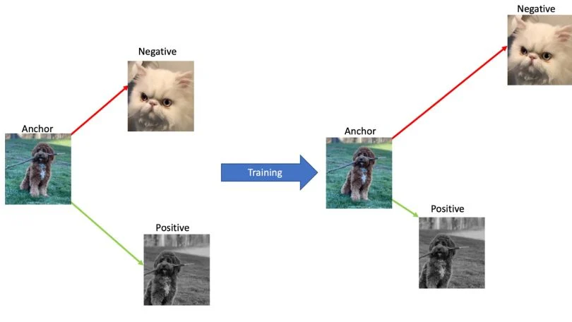
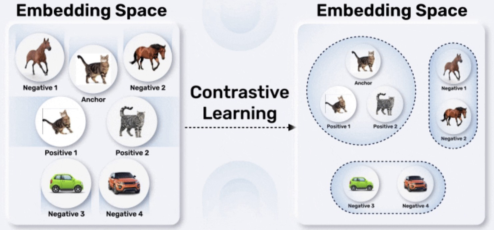

# Contrastive Learning

---

## 1. Motivation: Learning without labels

Traditional clustering tries to group data points directly in the input space. However, in high-dimensional data such as images and text, this often fails.

A more powerful idea is:

First learn a good representation, then clustering becomes easy.

Contrastive learning is a core method for learning such representations without labels. It implicitly creates clusters by pulling similar samples together and pushing dissimilar ones apart.

---

## 2. Core idea: Similar vs dissimilar pairs

Contrastive learning does not require explicit class labels. Instead, it relies on:

* Positive pairs: two views of the same underlying data point
* Negative pairs: views from different data points

Example:

* Image: two augmented versions of the same image
* Text: different contexts or augmentations of the same sentence

The goal is:

* maximize similarity between positive pairs
* minimize similarity between negative pairs

---

## 3. Representation space

Let an encoder $f_\theta(x)$ map input $x$ to a vector representation:

$$
z = f_\theta(x)
$$

Often followed by normalization:

$$
|z| = 1
$$

Similarity is typically measured using cosine similarity:

$$
\text{sim}(z_i, z_j) = z_i^\top z_j
$$

---

## 4. Contrastive loss (InfoNCE)

The most common objective is the InfoNCE (**Information Noise-Contrastive Estimation**) loss.

Given:

* an anchor $z_i$
* a positive example $z_j$
* a set of negatives $\{z_k\}$

The loss is:

$$
\mathcal{L}_i = - \log \frac{\exp(\text{sim}(z_i, z_j) / \tau)}{\sum_{k=1}^{N} \exp(\text{sim}(z_i, z_k) / \tau)}
$$

where:

* $\tau$ is a temperature parameter controlling sharpness
* denominator includes both positive and negative samples

Interpretation:

* encourages $z_i$ to be close to $z_j$
* pushes $z_i$ away from all other samples

---

## 5. Connection to clustering

Contrastive learning can be viewed as a form of soft clustering:

* Each data point defines its own cluster (instance discrimination)
* Positive pairs collapse into the same region
* Negative samples define separation boundaries

Over time:

* semantically similar samples become close
* clusters emerge naturally in embedding space

This explains why downstream clustering (e.g., K-means) works well on learned embeddings.

---

## 6. Data augmentation

A key design choice is **how to construct positive pairs**.

For images:

* random cropping
* color jitter
* flipping

For text:

* token masking
* **dropout**

The augmentation defines what “invariance” the model should learn.

---

## 7. Temperature and geometry

The temperature $\tau$ controls the concentration of the distribution:

* small $\tau$: sharp distinctions, stronger separation
* large $\tau$: smoother similarity distribution

Geometrically:

* embeddings lie on a hypersphere
* contrastive loss distributes points to maximize uniformity while preserving similarity

---

## 8. Summary

Contrastive learning transforms unsupervised learning into a similarity-based objective:

* learn representations where similar samples are close
* dissimilar samples are far apart

Key insight:
> Clustering is no longer performed explicitly. It emerges naturally from the geometry of the learned embedding space.
