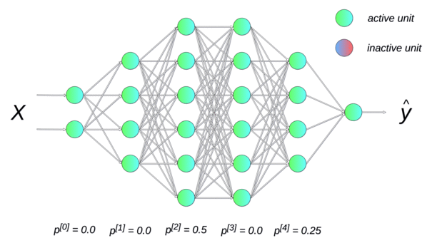
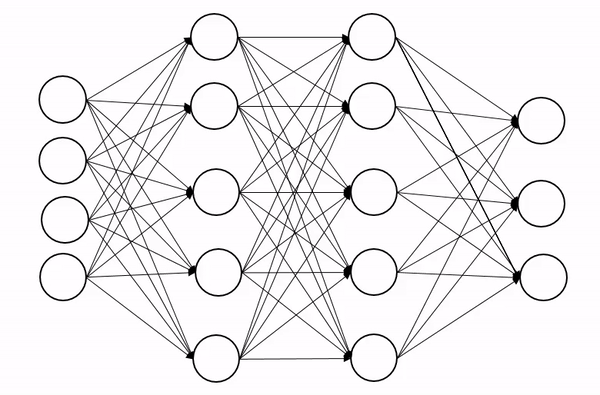
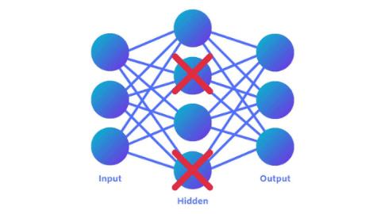

# Dropout for Data Augmentation

Dropout can act as an internal source of augmentation by making the same input pass through different stochastic subnetworks.

---

## 1. The Positive-Pair Problem

Contrastive learning needs positive pairs.

The difficult question is:

$$
\boxed{
\text{How do we create two different views of the same underlying example?}
}
$$

For images, we can crop or perturb pixels. For text, aggressive input changes can easily damage meaning. Dropout provides another option: perturb the model computation instead of the input.

---

## 2. Dropout as Internal Randomness

Let $h \in \mathbb{R}^{1 \times d}$ be a hidden representation.

Dropout samples a mask:

$$
m_j \sim \operatorname{Bernoulli}(q)
$$

where $q$ is the probability of keeping a feature.

The dropped representation is:

$$
\tilde{h}
=
\frac{m \odot h}{q}
$$

The factor $\frac{1}{q}$ is the usual inverted-dropout scaling, which keeps the expected activation size stable during training.

---

## 3. Two Views from One Input

For the same input $x$, run the encoder twice with different dropout masks:

$$
z_1 = f_{\theta}(x; m_1)
$$

$$
z_2 = f_{\theta}(x; m_2)
$$

The pair $(z_1,z_2)$ can be treated as a positive pair because both representations came from the same input.

The model is encouraged to make the representation stable under internal stochasticity.

---

## 4. Why This Can Work

Dropout creates useful pressure in three ways.

### Distributed Representations

Because features are randomly removed, the model cannot rely too heavily on one hidden dimension.

It must spread useful information across the representation.

### Implicit Ensemble Behavior

Different dropout masks correspond to different subnetworks.

Training with dropout exposes the model to many slightly different computation paths.

### Stability Under Noise

If two embeddings remain close despite different masks, they likely capture stable information rather than fragile internal coincidences.

---

## 5. Contrastive Use

Dropout-based positive pairs can be used with a contrastive loss:

$$
\mathcal{L}_i
=
-
\log
\frac{
\exp(\operatorname{sim}(z_{i,1},z_{i,2})/\tau)
}{
\sum_{k=1}^{B}
\exp(\operatorname{sim}(z_{i,1},z_{k,2})/\tau)
}
$$

Here $z_{i,1}$ and $z_{i,2}$ are two dropout views of the same example, while $z_{k,2}$ for $k \ne i$ are treated as negatives.

---

## 6. Relation to Data Augmentation

Dropout is not input augmentation in the usual sense. It is model-side augmentation.

| Augmentation Source | What Changes | Example |
| --- | --- | --- |
| Input | The observed data | Crop an image |
| Feature | Intermediate representation | Drop hidden units |
| Objective | Comparison target | Pair matched image and text |

The shared idea is invariance:

$$
\boxed{
\text{useful representations should stay stable under chosen perturbations}
}
$$

---

## 7. Warnings

> [!WARNING]
> Dropout views are only useful if the stochastic perturbation preserves the information needed for the task. Too much dropout can destroy signal and make positive pairs noisy.

Other cautions:

- dropout strength must be tuned;
- dropout may be insufficient as the only augmentation;
- false negatives can still hurt contrastive learning;
- training behavior and inference behavior differ;
- stability under dropout is not the same as semantic understanding.

---

## 8. Summary

Dropout can generate positive pairs by creating two stochastic views of the same input inside the model.

The core mechanism is:

$$
\boxed{
x
\rightarrow
f_{\theta}(x;m_1),\ f_{\theta}(x;m_2)
\rightarrow
\text{positive pair}
}
$$

This completes the series arc: clustering needs meaningful geometry, embeddings create that geometry, and contrastive objectives with augmentations help learn it.
