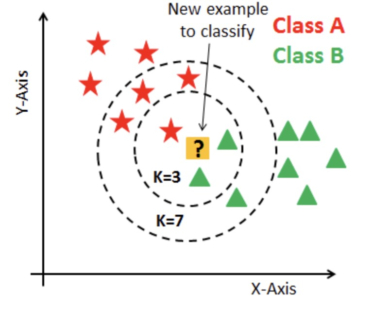
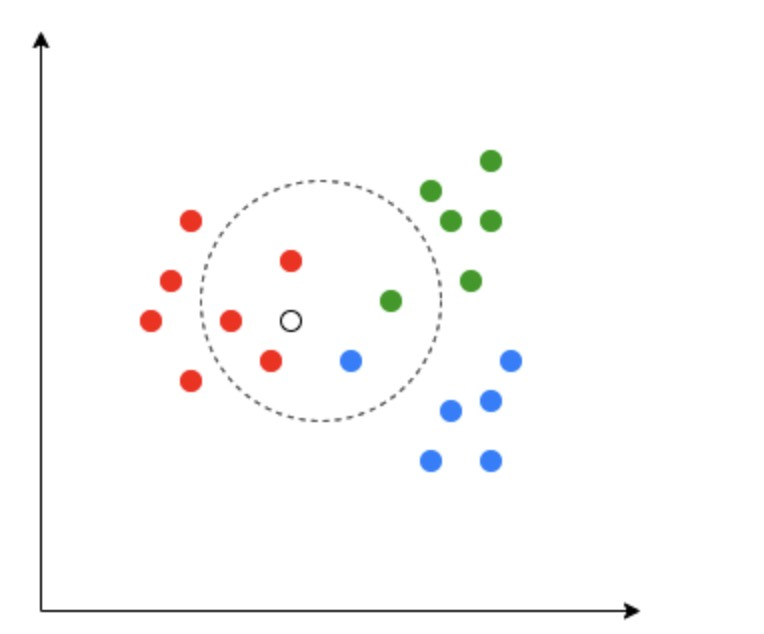
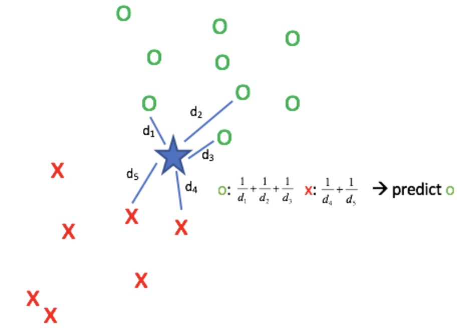
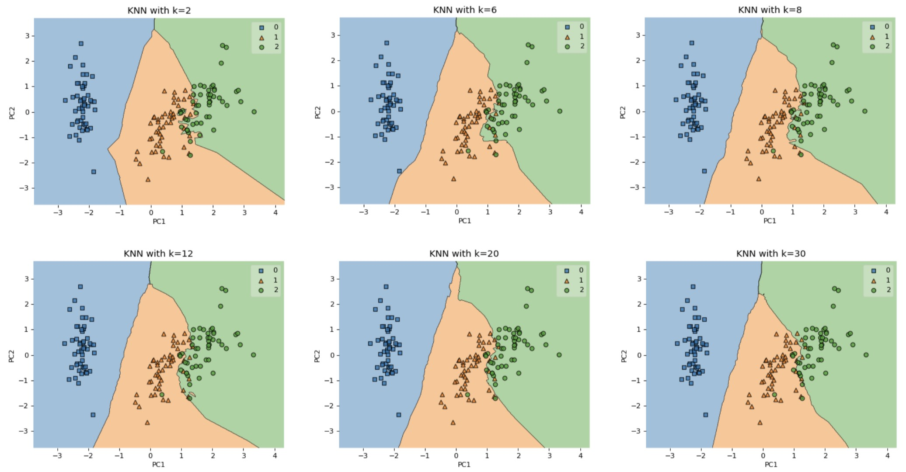

# K-Nearest Neighbors

K-nearest neighbors, or KNN, is not a clustering algorithm. We include it here because it teaches the same geometric question that clustering depends on: what does it mean for one point to be near another?

---

## 1. Why KNN Appears in a Clustering Mini-Series

K-means and KNN both use the letter $K$, but they solve different problems.

| Method | Learning Setting | Uses Labels | Main Question |
| --- | --- | --- | --- |
| K-means | Unsupervised | No | Which cluster should this point join? |
| KNN | Supervised | Yes | What label or value do nearby examples suggest? |

KNN is useful here because it makes the dependency on distance painfully clear. If the distance metric is bad, KNN fails. The same is true for clustering.

> [!WARNING]
> KNN is not K-means. KNN predicts labels or values from labeled neighbors; K-means discovers clusters without labels.

---

## 2. Core Idea

Given a new point $x \in \mathbb{R}^{1 \times d}$, KNN searches the training set for the $K$ closest points.

Let $\mathcal{N}_K(x)$ be the index set of those $K$ nearest neighbors. The prediction is made by aggregating their targets.

The method has no separate training phase. It stores the training data and performs most of the work at prediction time.

---

## 3. Distance Metrics

The word "nearest" only makes sense after choosing a distance or similarity function.

Euclidean distance is common for ordinary numeric features:

$$
d(x, x^{(i)}) =
\sqrt{
\sum_{j=1}^{d}
\left(x_j - x_j^{(i)}\right)^2
}
$$

Cosine similarity is common for embeddings:

$$
\operatorname{sim}(x, x^{(i)}) =
\frac{x {x^{(i)}}^\top}
{\|x\|_2 \left\|x^{(i)}\right\|_2}
$$

For normalized embeddings, cosine similarity becomes a dot product.

> [!INFO]
> In embedding systems, "nearest neighbor search" usually means retrieving items with high cosine similarity or high dot product, not necessarily using Euclidean distance.

---

## 4. KNN for Classification

For classification, each neighbor has a class label $y_i$. The predicted class is the majority vote:

$$
\boxed{
\hat{y}
= \arg\max_{c}
\sum_{i \in \mathcal{N}_K(x)}
\mathbf{1}(y_i = c)
}
$$

A distance-weighted version gives closer neighbors more influence:

$$
\hat{y}
= \arg\max_c
\sum_{i \in \mathcal{N}_K(x)}
w_i \mathbf{1}(y_i = c)
$$

where $w_i$ can be chosen as

$$
w_i = \frac{1}{d(x,x^{(i)}) + \epsilon}
$$

The small constant $\epsilon > 0$ prevents division by zero.

---

## 5. KNN for Regression

For regression, the targets are continuous values. The simplest prediction is the average neighbor target:

$$
\boxed{
\hat{y}
= \frac{1}{K}
\sum_{i \in \mathcal{N}_K(x)}
y_i
}
$$

A distance-weighted prediction is:

$$
\hat{y}
=
\frac{
\sum_{i \in \mathcal{N}_K(x)} w_i y_i
}{
\sum_{i \in \mathcal{N}_K(x)} w_i
}
$$

---

## 6. Choosing K

The hyperparameter $K$ controls the bias-variance trade-off.

| Choice | Behavior | Risk |
| --- | --- | --- |
| Small $K$ | Local, flexible predictions | Sensitive to noise |
| Large $K$ | Smoother predictions | Can wash out local structure |

The best $K$ is usually selected using validation data.

---

## 7. Connection to Embeddings

KNN becomes especially important after we learn embeddings.

Many modern systems use the same pattern:

$$
\text{raw input}
\rightarrow
\text{embedding}
\rightarrow
\text{nearest neighbor search}
\rightarrow
\text{retrieval or prediction}
$$

Examples include:

- image search;
- semantic text search;
- recommendation;
- retrieval-augmented generation;
- duplicate detection.

KNN reminds us that representation quality controls neighbor quality.

---

## 8. Summary

KNN is a supervised nearest-neighbor method, not a clustering method.

Its value in this mini-series is conceptual: it shows that distance is a modeling choice. If "near" does not mean "similar," both KNN and clustering will produce misleading results.
