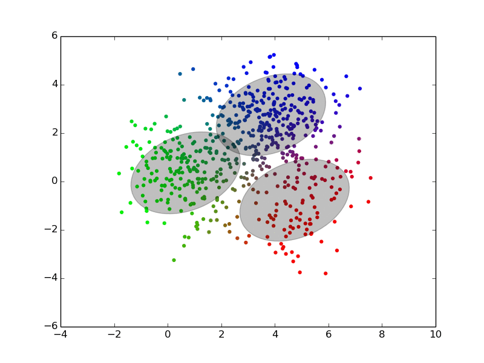
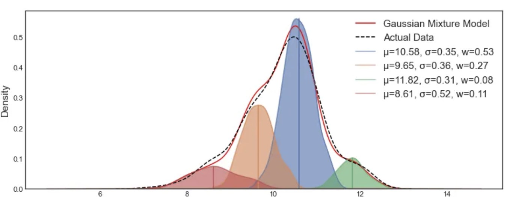
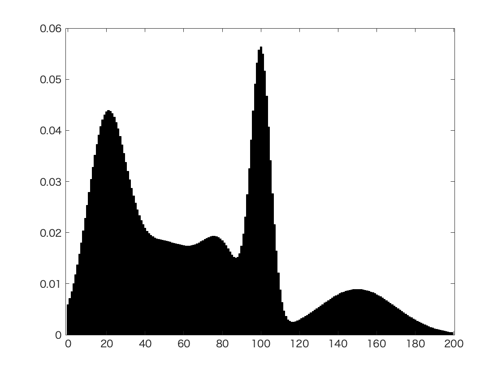
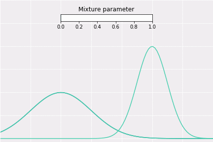
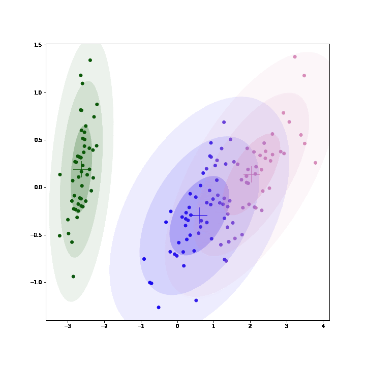
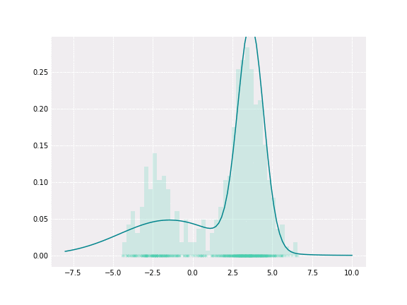

# Gaussian Mixture Models

Gaussian mixture models, or GMMs, extend K-means by replacing hard centroid assignments with probabilistic cluster membership.

---

## 1. Motivation: Beyond K-Means

K-means makes a hard decision:

$$
c_i \in \{1,\ldots,K\}
$$

Each point belongs to exactly one cluster. This is often too rigid.

Real data can have:

- overlapping groups;
- elliptical shapes;
- unequal spread;
- uncertainty near cluster boundaries.

A GMM models this uncertainty directly.

---

## 2. The Core Idea

Instead of saying "this point belongs to cluster $k$," a GMM says:

$$
P(z_i = k \mid x^{(i)})
$$

This value is the probability that component $k$ generated point $x^{(i)}$.

The cluster assignment is soft, not hard.

---

## 3. Model Definition

Let $x^{(i)} \in \mathbb{R}^{1 \times d}$. A Gaussian mixture model assumes the density

$$
\boxed{
p(x) =
\sum_{k=1}^{K}
\pi_k \mathcal{N}(x \mid \mu_k, \Sigma_k)
}
$$

where:

- $K$ is the number of mixture components;
- $\pi_k \ge 0$ is the mixture weight for component $k$;
- $\sum_{k=1}^{K} \pi_k = 1$;
- $\mu_k \in \mathbb{R}^{1 \times d}$ is the mean of component $k$;
- $\Sigma_k \in \mathbb{R}^{d \times d}$ is the covariance matrix of component $k$.

The generative story is:

1. Choose a hidden component $z_i$ according to the mixture weights.
2. Sample $x^{(i)}$ from the Gaussian for that component.

---

## 4. Responsibilities

The hidden variable $z_i$ is not observed. During fitting, we estimate the responsibility

$$
\gamma_{ik}
=
P(z_i = k \mid x^{(i)})
$$

Using Bayes' rule,

$$
\boxed{
\gamma_{ik}
=
\frac{
\pi_k \mathcal{N}(x^{(i)} \mid \mu_k, \Sigma_k)
}{
\sum_{j=1}^{K}
\pi_j \mathcal{N}(x^{(i)} \mid \mu_j, \Sigma_j)
}
}
$$

The value $\gamma_{ik}$ answers: how much does component $k$ explain point $x^{(i)}$?

---

## 5. Fitting with EM

GMMs are usually fit with expectation-maximization, or EM.

### E-Step

Compute responsibilities using the current parameters:

$$
\gamma_{ik}
=
P(z_i = k \mid x^{(i)})
$$

### M-Step

Update the parameters using the responsibilities as soft counts:

$$
N_k = \sum_{i=1}^{n} \gamma_{ik}
$$

$$
\pi_k = \frac{N_k}{n}
$$

$$
\mu_k =
\frac{1}{N_k}
\sum_{i=1}^{n}
\gamma_{ik} x^{(i)}
$$

The covariance update is:

$$
\Sigma_k =
\frac{1}{N_k}
\sum_{i=1}^{n}
\gamma_{ik}
\left(x^{(i)}-\mu_k\right)^\top
\left(x^{(i)}-\mu_k\right)
$$

Under a row-vector convention, the outer product above gives a $d \times d$ covariance matrix.

---

## 6. Objective

The model maximizes the log likelihood:

$$
\boxed{
\mathcal{L}
=
\sum_{i=1}^{n}
\log
\left(
\sum_{k=1}^{K}
\pi_k \mathcal{N}(x^{(i)} \mid \mu_k, \Sigma_k)
\right)
}
$$

EM alternates between estimating hidden assignments and improving parameters. Each iteration does not decrease the log likelihood.

---

## 7. Comparison with K-Means

| Feature | K-means | GMM |
| --- | --- | --- |
| Assignment | Hard | Soft |
| Cluster shape | Spherical around centroids | Elliptical through covariance |
| Output | Centroids and labels | Density model and probabilities |
| Uncertainty | Not modeled | Modeled with responsibilities |
| Fitting | Assignment and mean update | EM |

K-means can be viewed as a limiting case of a GMM with equal spherical covariance and hard assignments.

---

## 8. Practical Warnings

> [!WARNING]
> Full covariance GMMs can overfit when $d$ is large and $n$ is small. Diagonal covariance, regularization, or dimensionality reduction may be needed.

GMMs are useful for:

- clustering with uncertainty;
- density estimation;
- anomaly detection;
- soft segmentation;
- classic speech and signal-processing pipelines.

They are less reliable when clusters are highly non-Gaussian or when the representation space is poor.

---

## 9. Summary

A GMM is K-means with probability and covariance geometry.

The key upgrade is:

$$
\boxed{
\text{hard assignment}
\rightarrow
\text{soft responsibility}
}
$$

This makes GMMs more expressive than K-means, but also more sensitive to initialization, covariance choices, and model complexity.
