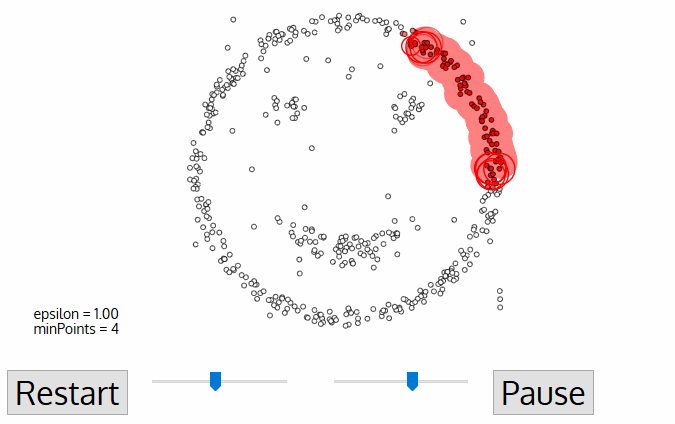
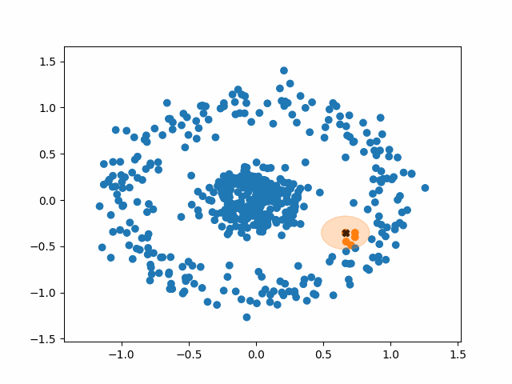

#  DBSCAN: Density-Based Clustering

## 1. Motivation: When K-Means Fails

Recall K-Means assumes clusters are **round** and tries to assign points based on **distance to a centroid**.

**Problem:**

* What if clusters are **curved**, like moons or spirals?
* What if there are **outliers/noisy points**?

K-Means will slice through clusters incorrectly.

**Solution:** Use **DBSCAN (Density-Based Spatial Clustering of Applications with Noise)**, which groups points based on **density, not distance to a center**.

---

## 2. Intuition: Finding Crowds in a Park




Imagine standing in a park:

1. A person with many neighbors nearby is part of a **crowd** (core point).
2. People connected to the crowd via neighbors also belong to the same cluster.
3. People standing alone, far from everyone else, are **noise/outliers**.

DBSCAN works by **growing clusters from dense regions**, naturally handling arbitrary shapes and outliers.

---

## 3. Key Concepts of DBSCAN

| Concept               | Description                                                                       |
| --------------------- | --------------------------------------------------------------------------------- |
| **Core Point**        | A point with at least `min_samples` neighbors within radius `eps`.                |
| **Border Point**      | A point within `eps` of a core point but with fewer than `min_samples` neighbors. |
| **Noise Point**       | A point that is neither core nor border.                                          |
| **Cluster Formation** | Connect core points and their reachable neighbors recursively.                    |

**Parameters:**

* `eps`: Radius to search for neighbors (defines "density")
* `min_samples`: Minimum points to form a dense region

> Choosing `eps` and `min_samples` carefully is essential for meaningful clusters.

---

## 4. Pseudocode for DBSCAN




```text
Input: data points X, eps, min_samples
Initialize all points as unvisited

for each unvisited point P in X:
    mark P as visited
    neighbors = points within eps of P
    
    if len(neighbors) >= min_samples:
        start a new cluster
        add P to cluster
        expand cluster recursively:
            for each neighbor N:
                if N not visited:
                    mark N as visited
                    neighbors_N = points within eps of N
                    if len(neighbors_N) >= min_samples:
                        add neighbors_N to neighbors list
                if N not yet in any cluster:
                    add N to cluster
    else:
        mark P as noise

Output: clusters, noise points
```

