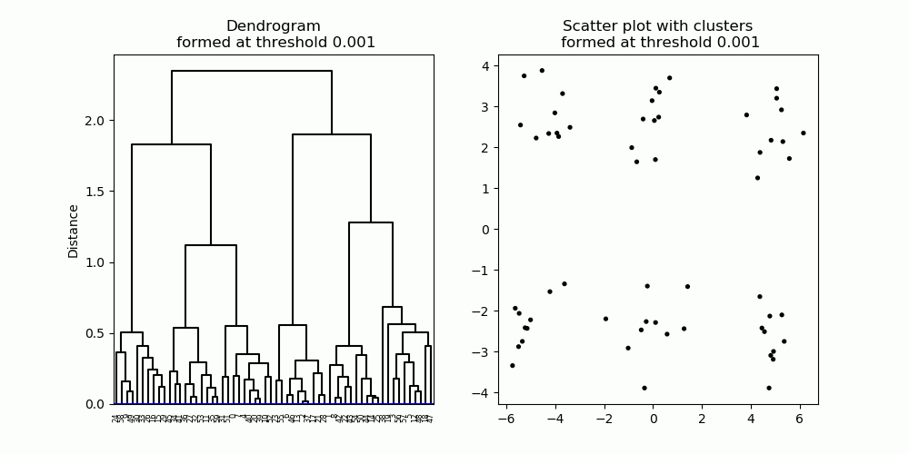
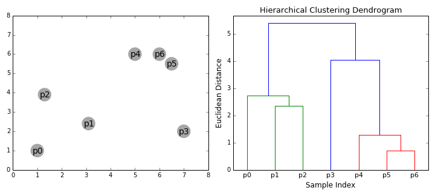
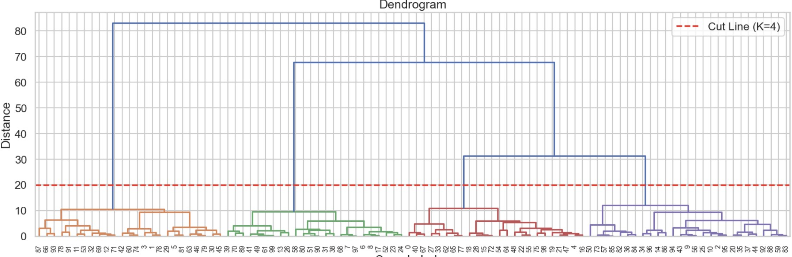

# Hierarchical Clustering



---

## 1. Motivation: Beyond Flat Clustering

So far, we have seen:

* **K-Means** → produces one partition
* **DBSCAN** → produces one partition

But in many real-world scenarios, a single clustering is not enough.

We often care about:

* How small groups combine into larger ones
* Whether clusters exist at multiple scales
* The relationships between clusters

> Instead of asking *“What is the clustering?”*, we ask:
> **“What is the structure of the data?”**

---

## 2. Core Idea: Represent Clustering as a Tree




Hierarchical clustering does not return a single grouping.

Instead, it builds a **tree structure**, called a **dendrogram**.

---

### How to Interpret the Tree

* **Leaves** → individual data points
* **Internal nodes** → merged clusters
* **Root** → all data combined into one cluster

---

### Key Insight

> A clustering is obtained by **cutting the tree at a chosen level**

* Cut near the bottom → many small clusters
* Cut near the top → few large clusters

This gives a **multi-resolution view** of the data.

---

## 3. Two Approaches to Building the Tree


### 3.1 Agglomerative Clustering (Bottom-Up)

This is the most commonly used method.

Start with:

> Each data point is its own cluster

Then repeatedly:

1. Find the two closest clusters
2. Merge them
3. Continue until only one cluster remains


### 3.2 Divisive Clustering (Top-Down)

Start with:

> All data points in one cluster

Then recursively split clusters into smaller ones.


*In practice, agglomerative methods are far more widely used.*

---

## 4.  What Is the Distance Between Clusters?

Unlike K-Means, hierarchical clustering must define:

> **Distance between clusters, not just points**

This is determined by the **linkage criterion**.

---

### 4.1 Single Linkage (Nearest Neighbor)

$$
d(A, B) = \min_{x \in A, y \in B} \|x - y\|
$$

**Behavior:**

* Clusters merge if any pair of points is close
* Tends to create long, chain-like structures

> This is known as the **chaining effect**

---

### 4.2 Complete Linkage (Farthest Neighbor)

$$
d(A, B) = \max_{x \in A, y \in B} \|x - y\|
$$

**Behavior:**

* Requires all points to be close before merging
* Produces compact, well-separated clusters

---

### 4.3 Average Linkage

$$
d(A, B) = \text{average distance between all pairs of points}
$$

**Behavior:**

* Balances between single and complete linkage
* More stable in practice

---

### 4.4 Ward Linkage (Variance-Based)

Ward’s method merges clusters by minimizing:

> **Increase in within-cluster variance**

---

### Important Insight

> Different linkage rules produce fundamentally different cluster structures

This is a key conceptual difference from K-Means.

---

## 5. Pseudo Algorithm (Agglomerative)

```
Input: dataset X

Initialize: each data point is its own cluster

repeat
    compute distances between all clusters
    merge the two closest clusters (based on linkage)
    update cluster distances

until only one cluster remains

Output: dendrogram (hierarchical tree)
```

---

## 6. From Tree to Clusters



Once the dendrogram is built, we can extract clusters in two main ways:


### Method 1: Cut by Distance Threshold

* Choose a height in the tree
* Cut horizontally
* Each connected component becomes a cluster


### Method 2: Specify Number of Clusters K

* Cut the tree so that exactly K clusters remain

