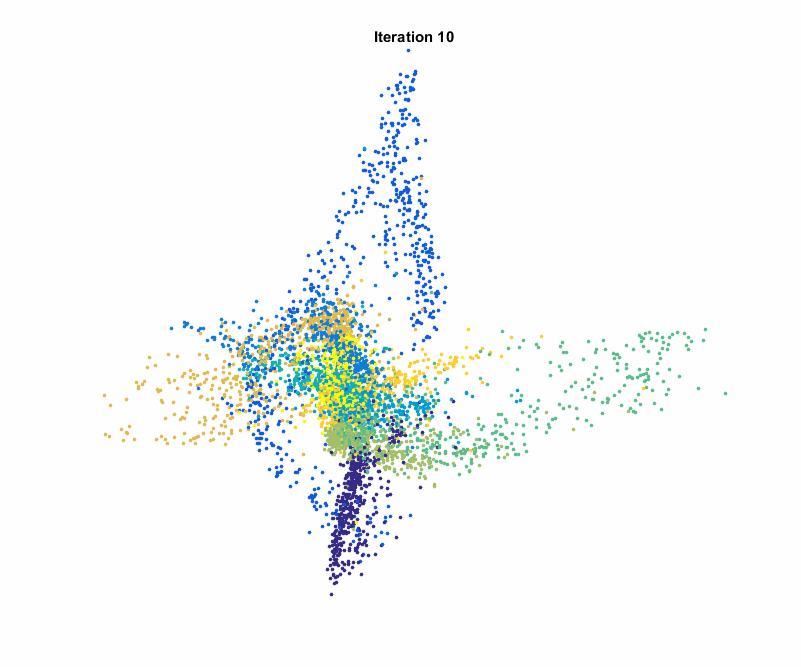
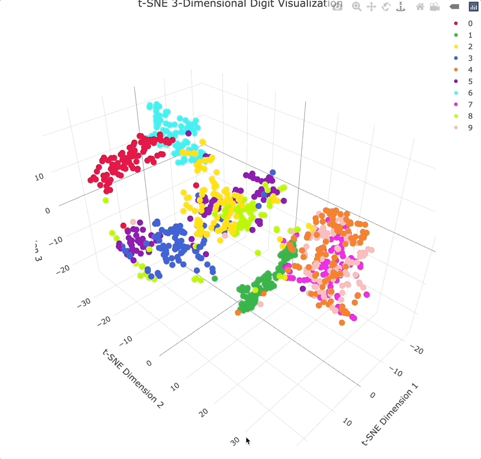

# t-SNE and UMAP: Visualizing High-Dimensional Data

---

## 1. The Core Problem: Humans Cannot See High Dimensions

Many modern datasets live in high-dimensional spaces:

* word embeddings
* image embeddings
* neural network hidden states

We cannot directly visualize them, so we need dimensionality reduction:

$$
\mathbb{R}^{d} \rightarrow \mathbb{R}^{2} \ \text{or} \ \mathbb{R}^{3}
$$

The goal is not perfect reconstruction, but structure preservation for visualization.

---

## 2. t-SNE: Local Neighborhood Preservation

t-SNE (t-Distributed Stochastic Neighbor Embedding) focuses on preserving local structure.

Main idea:

* points that are close in high-dimensional space stay close in 2D
* far-away relationships are not reliable

So t-SNE is mainly a **local similarity visualization method**.

Key properties:

* strong cluster separation visually
* good for inspecting embeddings
* global distances are not meaningful

**Important:**

t-SNE is a visualization tool, not a measurement tool

So you should not interpret:

* distance between clusters
* cluster sizes
* global geometry

---

## 3. UMAP: Manifold-Based Structure Preservation

UMAP (Uniform Manifold Approximation and Projection) is another dimensionality reduction method.

Intuition:

* assumes data lies on a manifold
* tries to preserve both local connectivity and global layout

Key advantages:

* better scalability to large datasets
* more consistent embeddings across runs
* more meaningful global structure than t-SNE (but still approximate)

---

## 4. When to Use Them

Use t-SNE or UMAP when:

* visualizing word embeddings
* inspecting image embeddings
* debugging representation learning
* exploring latent spaces in neural networks

Do NOT use them for:

* quantitative evaluation
* measuring true distances
* making claims about global geometry
