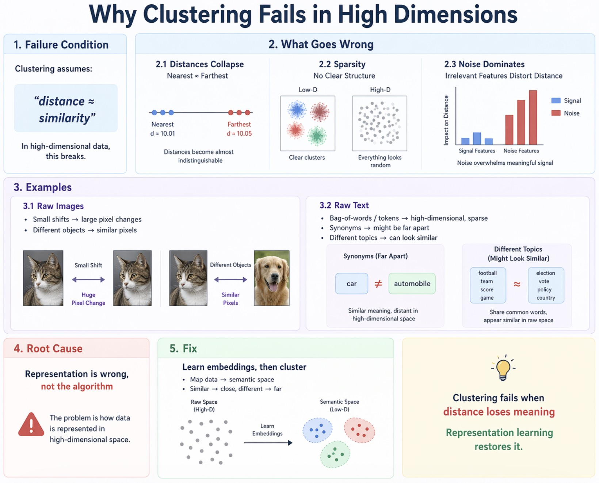

# Why Clustering Fails in High Dimensions

---

## 1. Failure Condition

Clustering assumes:

> **distance ≈ similarity**

In high-dimensional data, this breaks.

---

## 2. What Goes Wrong

* **Distances collapse** → nearest ≈ farthest
* **Sparsity** → no clear structure
* **Noise dominates** → irrelevant features distort distance

---

## 3. Examples

### Raw Images

* Small shifts → large pixel changes
* Different objects → similar pixels

### Raw Text

* Bag-of-words / tokens → high-dimensional, sparse
* Synonyms → might be far apart
* Different topics → can look similar

> Raw features ≠ semantic similarity

---

## 4. Root Cause

> **Representation is wrong, not the algorithm**

---

## 5. Fix

> **Learn embeddings, then cluster**

* Map data → semantic space
* Similar → close, different → far

---

## Takeaway

> Clustering fails when **distance loses meaning**
> Representation learning restores it.
