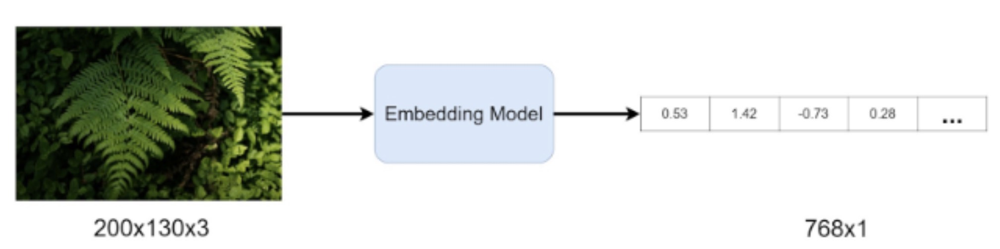
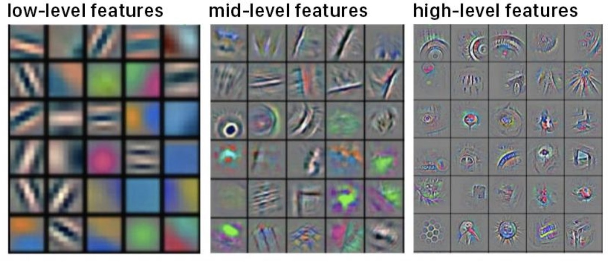
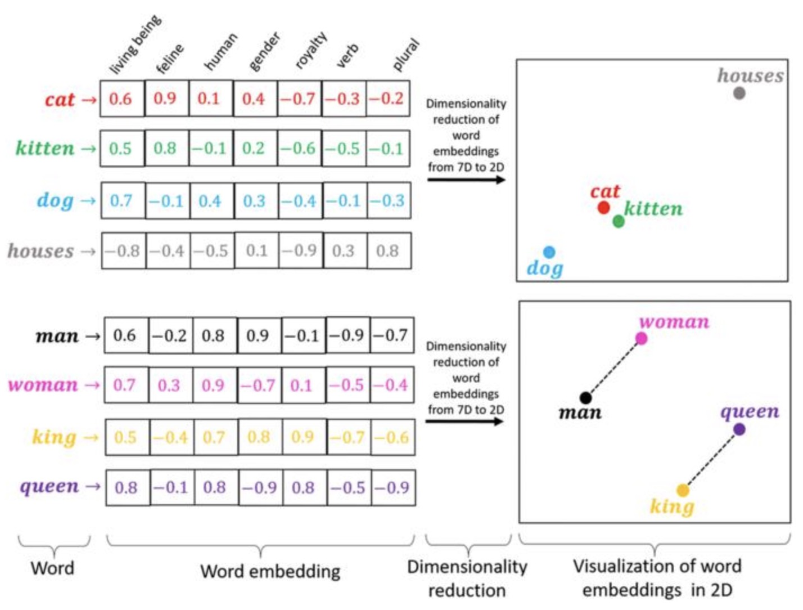
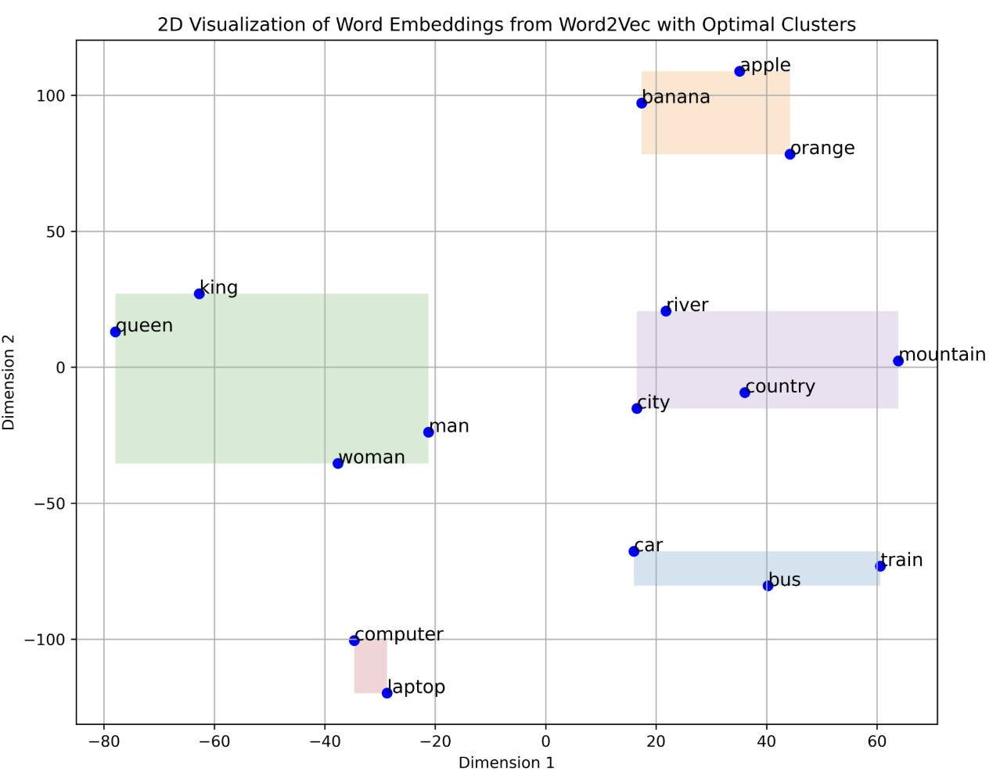
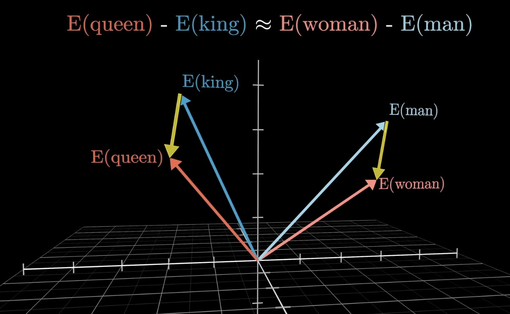
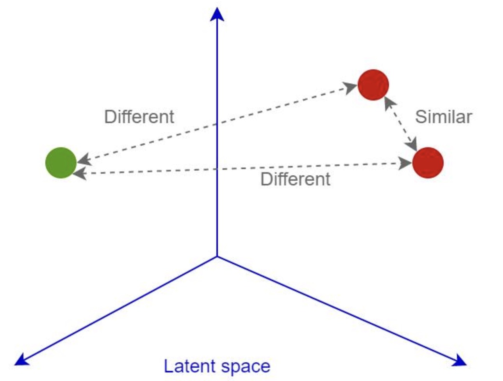

# Embeddings for Images and Text

Embeddings turn raw objects into vectors so that useful similarity becomes geometric similarity.

Online visualizations:

- https://projector.tensorflow.org/
- https://www.cs.cmu.edu/~dst/WordEmbeddingDemo/tutorial.html

---

## 1. Why Embeddings Enter the Story

The clustering lectures all depended on a distance or similarity function.

For a dataset $X \in \mathbb{R}^{n \times d}$, algorithms such as K-means, DBSCAN, and hierarchical clustering assume that nearby points should be meaningfully related.

But raw data often violates this assumption:

- raw pixels are sensitive to shifts and lighting;
- one-hot text vectors treat every distinct token as equally different;
- sparse high-dimensional features make neighborhoods unstable.

Embeddings are a response to this problem.

$$
\boxed{
\text{raw object}
\rightarrow
\text{encoder}
\rightarrow
\text{embedding vector}
}
$$

---

## 2. Embedding Functions

An embedding model is a function:

$$
f_{\theta}: \mathcal{X} \rightarrow \mathbb{R}^{d}
$$

where:

- $\mathcal{X}$ is the input space, such as images, words, sentences, or documents;
- $d$ is the embedding dimension;
- $\theta$ represents learned parameters;
- $z = f_{\theta}(x)$ is the embedding of input $x$.

The goal is not just compression. The goal is useful geometry.

For two inputs $x_a$ and $x_b$, we want:

$$
\operatorname{sim}(z_a,z_b)
\text{ high when the inputs are meaningfully similar}
$$

---

## 3. Image Embeddings

An image embedding maps an image into a vector:

$$
f_{\theta}: \mathbb{R}^{H \times W \times C} \rightarrow \mathbb{R}^{d}
$$

where $H$ is height, $W$ is width, and $C$ is the number of channels.

In a useful image embedding space:

- images of similar objects are near each other;
- different visual concepts are separated;
- nearest neighbors can support search, clustering, and classification.

The embedding should represent content more than raw pixel coincidence.

---

## 4. Text Embeddings

A text embedding maps a word, sentence, or document into a vector.

For a token or text span $t$:

$$
e_t = f_{\theta}(t) \in \mathbb{R}^{d}
$$

In a useful text embedding space:

- related words are close;
- similar sentences are close;
- documents with similar topics cluster together;
- semantic directions may encode relationships.

A famous word-vector pattern is:

$$
\operatorname{vec}(\text{king})
-
\operatorname{vec}(\text{man})
+
\operatorname{vec}(\text{woman})
\approx
\operatorname{vec}(\text{queen})
$$

This kind of relationship is not guaranteed in every embedding model, but it shows the intended geometric idea.

---

## 5. Similarity in Embedding Space

Many embedding systems compare vectors with cosine similarity:

$$
\operatorname{sim}(z_a,z_b)
=
\frac{z_a z_b^\top}
{\|z_a\|_2\|z_b\|_2}
$$

If embeddings are normalized so that $\|z_a\|_2 = \|z_b\|_2 = 1$, then:

$$
\operatorname{sim}(z_a,z_b)
=
z_a z_b^\top
$$

This is why normalized embeddings are convenient for nearest-neighbor search.

> [!INFO]
> The metric is part of the model design. Euclidean distance, dot product, and cosine similarity can produce different neighbors unless the embeddings are normalized and trained for the chosen comparison.

---

## 6. A Unified View

Images and text look different at the input level, but embeddings let us describe both with the same pattern.

| Modality | Raw Input | Encoder Output |
| --- | --- | --- |
| Image | Pixels | Image vector $z_{\mathrm{image}}$ |
| Text | Tokens | Text vector $z_{\mathrm{text}}$ |

The shared goal is:

$$
\boxed{
\text{geometry reflects the relationships we care about}
}
$$

---

## 7. Why Embeddings Help Clustering

Before embeddings:

- raw distance can be unreliable;
- clusters may reflect noise or formatting;
- nearest neighbors may be semantically strange.

After embeddings:

- semantically similar examples can move closer;
- irrelevant variation can be reduced;
- clustering algorithms operate on a more useful geometry.

The practical workflow becomes:

$$
\boxed{
\text{data}
\rightarrow
\text{embedding}
\rightarrow
\text{clustering or retrieval}
}
$$

---

## 8. Summary

Embeddings are learned vector representations. They matter because clustering and nearest-neighbor methods are only as good as the geometry they receive.

The key lesson is:

$$
\boxed{
\text{representation learning makes similarity usable}
}
$$
